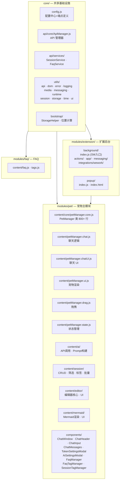
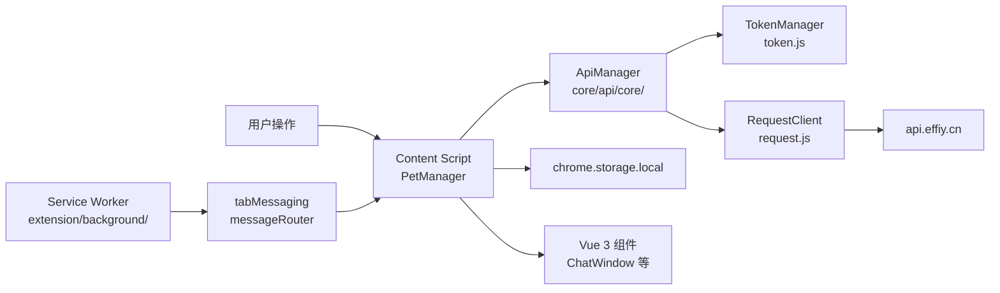
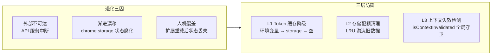

# CLAUDE.md

> YiPet — Chrome 浏览器扩展，在网页中注入温柔陪伴伴侣。支持 AI 聊天、会话管理、FAQ 管理、Mermaid 图表渲染。

[项目画像](#项目画像) · [项目约束](#项目约束) · [退化对策](#退化对策) · [自约束](#自约束) · [引导](#引导)

## 项目画像

| 维度 | 值 |
|------|-----|
| 项目名 | YiPet |
| 版本 | 1.1.1 |
| 类型 | **frontend** — Chrome Extension Manifest V3 |
| 架构 | content-script 注入 + service-worker 后台 + popup 控制面板 |
| 生态 | 纯 JavaScript (IIFE 模块)，无构建工具，Vue 3 CDN 运行时 |
| 测试 | vitest (已配置，未使用) |

## 技术栈

| 层 | 技术 |
|----|------|
| 运行时 | Chrome Extension Manifest V3 |
| UI 框架 | Vue 3 (CDN `vue.global.js`) |
| 样式 | Tailwind CSS + 组件 CSS (7 文件) |
| Markdown | marked.js + turndown.js |
| 图表 | Mermaid (CDN 懒加载) |
| 存储 | chrome.storage.local |
| 加密 | md5.js |
| API | fetch + Token 认证 → `api.effiy.cn` |

## 模块地图

## 数据流

## 安全面

| 面 | 现状 |
|----|------|
| 认证 | Token 存储于 chrome.storage.local + 环境变量 `API_X_TOKEN` |
| 传输 | fetch CORS + Token 注入请求头 |
| 输入 | 用户消息直接发送 API，无 XSS 过滤 |
| 存储 | chrome.storage.local，配额超限时有清理机制 |
| 权限 | `<all_urls>` 全站注入 + storage/tabs/scripting/webRequest |

<!-- rui:project-start -->
## 项目约束

### 项目不可妥协底线

- **Token 不可明文落盘** — Token 仅存储在 chrome.storage.local 或环境变量 `API_X_TOKEN`
- **扩展上下文失效必处理** — `Extension context invalidated` 错误必须优雅降级，不可导致页面崩溃
- **全站注入安全** — `<all_urls>` content-script 注入必须跳过系统页面（chrome://、chrome-extension:// 等）
- **存储配额保护** — chrome.storage.local 配额超限必须有清理降级机制

### 退化对策

| 退化因 | 对策 | 具体战术 |
|--------|------|---------|
| API 服务中断 | Token 三级降级：环境变量 → chrome.storage → 空 token 提示用户设置 | TokenManager.getToken() 逐级回退 |
| 存储状态腐化 | 配额超限时自动清理 `petOssFiles` 等可重建数据 | StorageHelper.cleanupOldData() |
| 扩展重载状态丢失 | isContextInvalidated() 全局守卫 + isChromeStorageAvailable() 预检 | 所有 chrome API 调用前预检 |

### 自约束

- 所有 chrome API 调用前必须通过 `isChromeStorageAvailable()` / `isContextInvalidated()` 预检
- 新增 content-script 模块必须走 manifest.json `content_scripts` 注入声明
- UI 组件遵循 Vue 3 Options API（与现有 ChatWindow 组件一致）
- API 端点统一在 `core/config.js` 的 `ENDPOINTS` 中定义
<!-- rui:project-end -->

## 引导

| 想了解 | 去 |
|--------|-----|
| 配置与端点定义 | [core/config.js](./core/config.js) |
| PetManager 核心类 | [modules/pet/content/core/petManager.core.js](./modules/pet/content/core/petManager.core.js) |
| API 请求客户端 | [core/utils/api/request.js](./core/utils/api/request.js) |
| Token 管理 | [core/utils/api/token.js](./core/utils/api/token.js) |
| Service Worker 入口 | [modules/extension/background/index.js](./modules/extension/background/index.js) |
| Chat 组件 | [modules/pet/components/chat/](./modules/pet/components/chat/) |
| 样式文件 | [assets/styles/](./assets/styles/) |