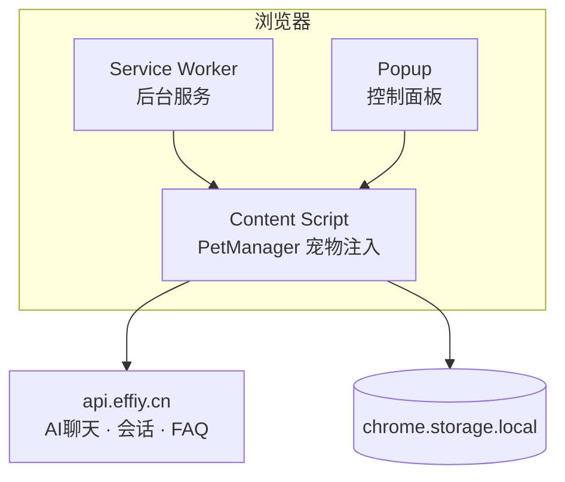
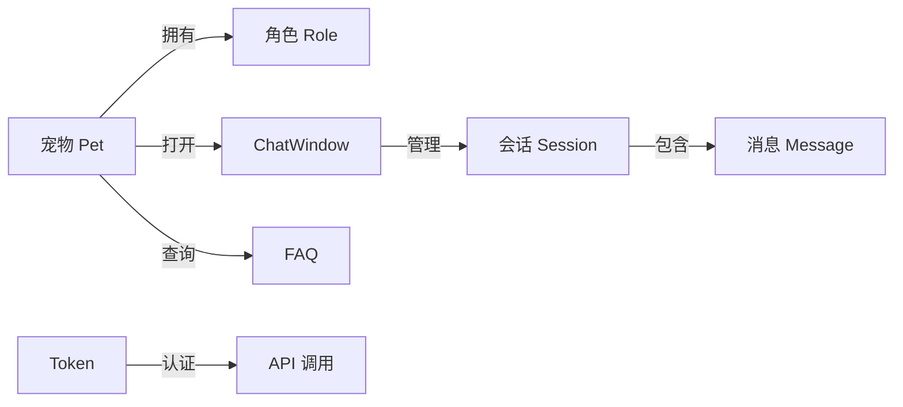

# YiPet

> Chrome 浏览器扩展 — 温柔陪伴助手。在网页中注入一位温柔体贴的伴侣，支持 AI 聊天、会话管理、FAQ 管理、Mermaid 图表渲染。

[](https://github.com/ruiyi/YiPet/actions/workflows/ci.yml)
[](https://github.com/ruiyi/YiPet/actions/workflows/codeql.yml)
[](./LICENSE)
[](./manifest.json)

## 系统全景



## 命令流

| 命令                           | 触发 | 说明              |
| ------------------------------ | ---- | ----------------- |
| `Ctrl+Shift+P` / `Cmd+Shift+P` | 键盘 | 切换宠物显示/隐藏 |
| `Ctrl+Shift+X` / `Cmd+Shift+X` | 键盘 | 打开聊天窗口      |
| 点击宠物                       | 鼠标 | 打开聊天窗口      |
| 工具栏图标                     | 鼠标 | 打开控制面板      |

## 快速开始

1. 克隆仓库后在 Chrome 中加载：`chrome://extensions/` → "加载已解压的扩展程序" → 选择项目目录
2. 点击工具栏图标打开控制面板，设置 API Token
3. 浏览任意网页，宠物自动出现在右下角

## 项目结构

```
YiPet/
├── manifest.json              # Chrome Extension Manifest V3
├── core/                      # 共享基础设施
│   ├── config.js              # 配置中心 + 端点定义
│   ├── api/core/ApiManager.js # API 管理器
│   ├── api/services/          # SessionService · FaqService
│   ├── bootstrap/             # StorageHelper · 位置计算
│   ├── constants/endpoints.js # 端点常量
│   └── utils/                 # api · dom · error · logging · media · messaging · runtime · session · storage · time · ui
├── modules/
│   ├── pet/                   # 宠物主模块
│   │   ├── content/           # PetManager 核心 + 聊天 · 会话 · AI · 编辑器 · Mermaid
│   │   └── components/        # Vue 3 组件 (ChatWindow · ChatHeader · ChatInput · ChatMessages · Modals · Managers)
│   ├── extension/             # 扩展后台 + 弹窗
│   │   ├── background/        # Service Worker · actions · messaging · integrations/wework
│   │   └── popup/             # 控制面板
│   └── faq/                   # FAQ content script
├── libs/                      # 第三方库 (Vue 3 · marked · turndown · mermaid · md5)
├── cdn/markdown/              # CDN 托管的 Mermaid 渲染页面
├── assets/
│   ├── icons/                 # 扩展图标 (16/32/48/128)
│   ├── images/                # 宠物角色图片 (教师/医生/甜品师/警察)
│   └── styles/                # Tailwind + 组件 CSS (7 文件)
└── scripts/                   # 工具脚本
```

## 技术栈

| 层       | 技术                                     |
| -------- | ---------------------------------------- |
| 平台     | Chrome Extension Manifest V3             |
| UI       | Vue 3 (CDN `vue.global.js`)              |
| 样式     | Tailwind CSS + 组件 CSS                  |
| Markdown | marked.js (渲染) + turndown.js (HTML→MD) |
| 图表     | Mermaid (CDN 懒加载)                     |
| 存储     | chrome.storage.local                     |
| API      | fetch + Token 认证                       |

## 领域语言

> 约定项目中核心概念的命名、含义与关系，避免歧义。

### 术语定义

| #   | 术语           | 英文           | 定义                                                      | 使用场景                 | Avoid                        |
| --- | -------------- | -------------- | --------------------------------------------------------- | ------------------------ | ---------------------------- |
| 1   | 宠物           | Pet            | 浏览器中渲染的陪伴角色，可拖拽移动、切换颜色/角色         | UI 渲染、用户交互        | 不要叫"助手"、"插件小精灵"   |
| 2   | 会话           | Session        | 与 AI 的一次完整对话上下文，支持创建/切换/删除/标签       | 聊天历史、侧边栏列表     | 不要叫"对话"、"聊天记录"     |
| 3   | 角色           | Role           | 宠物的身份设定（教师/医生/甜品师/警察），影响 AI 回复风格 | token 设置面板、图片切换 | 不要叫"皮肤"、"头像"         |
| 4   | FAQ            | FAQ            | 预设的问答对集合，支持 CRUD 与标签管理                    | FAQ 管理面板             | 不要叫"预设回复"、"快捷短语" |
| 5   | ChatWindow     | ChatWindow     | 聊天窗口 Vue 组件，含 Header/Input/Messages 子组件        | 聊天交互                 | 不要叫"对话框"、"聊天框"     |
| 6   | Token          | API Token      | 用户配置的 API 认证令牌，存储于 chrome.storage.local      | API 调用认证             | 不要叫"密钥"、"密码"         |
| 7   | Content Script | Content Script | 注入到网页中的脚本，负责创建和管理宠物                    | 技术文档                 | 不要叫"注入脚本"             |
| 8   | Service Worker | Service Worker | 扩展后台服务，处理消息路由和企业微信集成                  | 技术文档                 | 不要叫"后台脚本"             |

### 关系



### 示例对话

> "点击宠物打开 ChatWindow，切换到教师角色后发送消息" → 理解：用户点击 Pet → ChatWindow 弹出 → 选择 Role=教师 → 输入消息 → AI 回复

### 歧义标记

- **"会话"** — 在代码中为 `Session`，不要与浏览器"标签页会话"混淆
- **"角色"** — 在代码中为 `Role`，不要与权限系统中的"用户角色"混淆

## 开发

- [Contributing](./CONTRIBUTING.md) — 开发指南
- [Code of Conduct](./CODE_OF_CONDUCT.md)
- [Security Policy](./SECURITY.md)

<!-- rui:story-list-start -->

- [系统架构](./docs/故事任务面板/yipet-arch/故事任务.md) — 系统架构知识固化
- [自主测试](./docs/故事任务面板/yipet-self-test/故事任务.md) — 项目自主测试方案
<!-- rui:story-list-end -->
