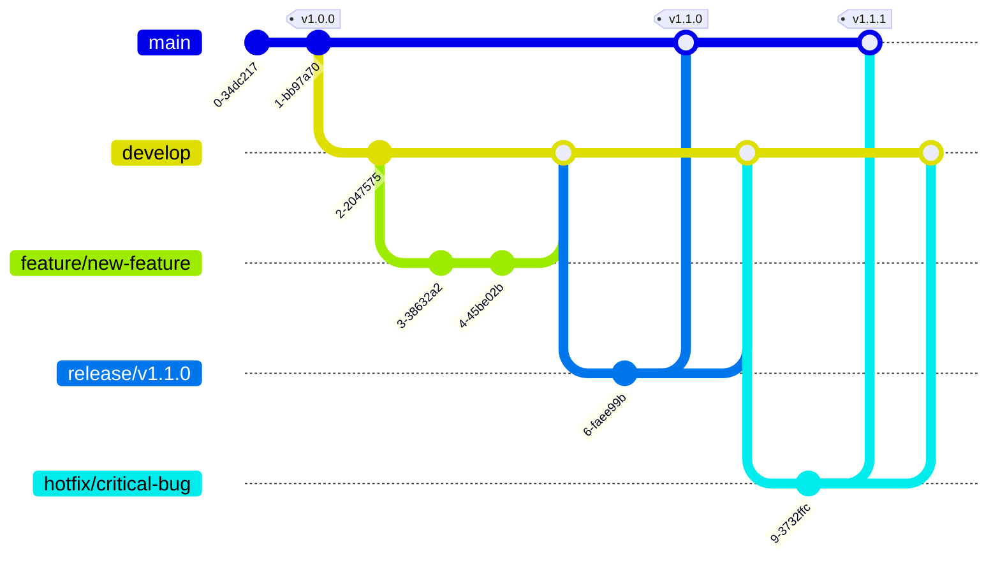

# 分支管理规范

> 温柔陪伴助手 - 分支策略和代码合并流程

---

## 概述

本规范定义了温柔陪伴助手项目的 Git 分支管理策略和代码合并流程，确保代码管理规范、开发流程清晰、发布风险可控。

---

## 分支类型

### 1. 长期分支

#### main 分支
- **用途**：生产环境代码
- **状态**：始终可发布
- **保护**：禁止直接提交，仅通过 PR 合并
- **合并来源**：develop 分支（发布时）

#### develop 分支
- **用途**：开发集成分支
- **状态**：包含最新的开发功能
- **合并来源**：feature 分支、hotfix 分支

### 2. 短期分支

#### feature/* 分支
- **用途**：新功能开发
- **创建自**：develop
- **合并到**：develop
- **命名**：`feature/feature-name`
- **生命周期**：短期，功能完成后删除

#### hotfix/* 分支
- **用途**：紧急 bug 修复
- **创建自**：main
- **合并到**：main 和 develop
- **命名**：`hotfix/bug-description`
- **生命周期**：短期，修复完成后删除

#### release/* 分支
- **用途**：发布准备
- **创建自**：develop
- **合并到**：main 和 develop
- **命名**：`release/v1.1.0`
- **生命周期**：短期，发布完成后删除

---

## 分支策略图示



---

## 开发流程

### 1. 新功能开发流程

```
1. 创建 feature 分支
   git checkout develop
   git pull origin develop
   git checkout -b feature/feature-name

2. 开发并提交
   git add .
   git commit -m "feat: add feature description"

3. 推送到远程
   git push origin feature/feature-name

4. 创建 Pull Request
   - 目标分支：develop
   - 填写 PR 描述
   - 关联相关 Issue

5. 代码审查
   - 至少一人审查通过
   - 解决审查意见

6. 合并到 develop
   - Squash 合并（推荐）
   - 删除 feature 分支
```

### 2. 紧急修复流程

```
1. 创建 hotfix 分支
   git checkout main
   git pull origin main
   git checkout -b hotfix/bug-description

2. 修复并提交
   git add .
   git commit -m "fix: bug description"

3. 推送到远程
   git push origin hotfix/bug-description

4. 创建 Pull Request
   - 目标分支：main
   - 填写 PR 描述

5. 代码审查
   - 快速审查
   - 确认修复有效

6. 合并到 main
   git checkout main
   git merge hotfix/bug-description
   git tag -a v1.1.1 -m "Hotfix version 1.1.1"

7. 合并到 develop
   git checkout develop
   git merge hotfix/bug-description

8. 删除 hotfix 分支
   git branch -d hotfix/bug-description
   git push origin --delete hotfix/bug-description
```

### 3. 发布流程

```
1. 创建 release 分支
   git checkout develop
   git pull origin develop
   git checkout -b release/v1.1.0

2. 准备发布
   - 更新版本号
   - 更新 CHANGELOG
   - 修复发现的小问题

3. 提交发布准备
   git add .
   git commit -m "chore: prepare release v1.1.0"
   git push origin release/v1.1.0

4. 测试验证
   - 运行所有测试
   - 进行集成测试
   - 验证功能正常

5. 合并到 main
   git checkout main
   git merge release/v1.1.0
   git tag -a v1.1.0 -m "Release version 1.1.0"
   git push origin main --tags

6. 合并到 develop
   git checkout develop
   git merge release/v1.1.0
   git push origin develop

7. 删除 release 分支
   git branch -d release/v1.1.0
   git push origin --delete release/v1.1.0
```

---

## Pull Request 规范

### PR 标题格式

```
[类型] 简短描述

类型：
- feat: 新功能
- fix: 修复 bug
- docs: 文档更新
- style: 代码格式调整
- refactor: 重构
- test: 测试相关
- chore: 构建/工具相关
```

### PR 描述模板

```markdown
## 变更类型

- [ ] 新功能 (feat)
- [ ] Bug 修复 (fix)
- [ ] 文档更新 (docs)
- [ ] 代码格式 (style)
- [ ] 重构 (refactor)
- [ ] 测试 (test)
- [ ] 构建/工具 (chore)

## 变更描述

简要描述本次变更的内容。

## 相关 Issue

Closes #123

## 变更检查

- [ ] 代码遵循项目规范
- [ ] 已添加必要的测试
- [ ] 所有测试通过
- [ ] 文档已更新
- [ ] 不影响现有功能

## 测试说明

如何验证这些变更？

## 截图（如适用）

```

---

## 最佳实践

1. **小步快跑**：保持分支生命周期短，频繁合并
2. **经常同步**：定期从 develop 分支拉取最新代码
3. **提交规范**：遵循统一的提交信息格式
4. **代码审查**：所有合并必须经过代码审查
5. **及时清理**：分支使用完后及时删除

---

## 相关文档

- **[GIT提交规范](./GIT提交规范.md)** - Git 提交信息规范
- **[代码审查](./代码审查.md)** - 代码审查流程
- **[版本控制](./版本控制.md)** - 版本号管理规范
- **[README](./README.md)** - 开发规范总览

---

*最后更新：2026-03-18*
