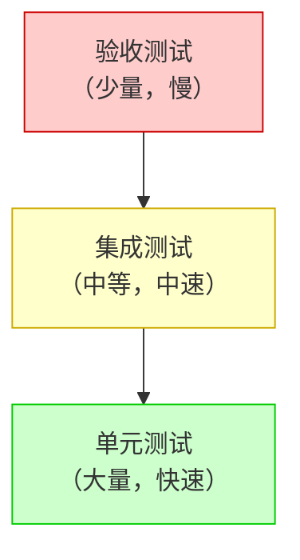

# 测试策略规范

> 温柔陪伴助手 - 测试方法论和最佳实践

---

## 概述

本规范定义了温柔陪伴助手项目的测试策略和方法论，确保项目质量稳定、功能正常、符合预期。

---

## 测试分类

### 1. 单元测试

#### 目的
- 验证单个函数、方法或组件的正确性
- 确保核心功能的稳定性
- 便于代码重构和维护

#### 范围
- 核心业务逻辑
- 工具函数
- 数据处理方法
- 状态管理

#### 示例
```javascript
// utils/storage.test.js
import { ChromeStorage } from '../src/utils/storage';

describe('ChromeStorage', () => {
    describe('set', () => {
        it('should set and get values correctly', async () => {
            const storage = new ChromeStorage('test');
            await storage.set('key', 'value');
            const result = await storage.get('key');
            expect(result).toEqual('value');
        });
    });
});
```

### 2. 集成测试

#### 目的
- 验证模块之间的协作是否正常
- 确保功能模块的集成正确性
- 测试接口和依赖关系

#### 范围
- 模块间的协作
- API 接口调用
- DOM 操作
- 事件处理

#### 示例
```javascript
// modules/pet/content/chat/chatService.test.js
import { ChatService } from '../chatService';

describe('ChatService', () => {
    describe('sendMessage', () => {
        it('should send message to API', async () => {
            const chatService = new ChatService();
            const response = await chatService.sendMessage('Hello');

            expect(response).toHaveProperty('id');
            expect(response).toHaveProperty('content');
        });
    });
});
```

### 3. 端到端测试

#### 目的
- 验证完整的用户流程
- 测试实际使用场景
- 确保应用程序能够正常运行

#### 范围
- 主要功能流程
- 用户交互场景
- 跨页面功能
- 浏览器兼容性

#### 示例
```javascript
// e2e/pet-display.spec.js
describe('Pet Display', () => {
    it('should display pet on web page', () => {
        cy.visit('https://example.com');
        cy.get('.pet-manager').should('be.visible');
    });

    it('should allow pet dragging', () => {
        cy.visit('https://example.com');
        cy.get('.pet-manager').trigger('mousedown', { which: 1 });
        cy.get('.pet-manager').trigger('mousemove', { clientX: 100, clientY: 100 });
        cy.get('.pet-manager').trigger('mouseup', { force: true });

        cy.get('.pet-manager').should('not.have.css', 'left', '0px');
    });
});
```

### 4. 验收测试

#### 目的
- 验证功能是否满足需求
- 确保产品质量符合预期
- 确认所有功能正常工作

#### 范围
- 功能完整性验证
- 用户体验测试
- 边界条件测试
- 错误情况处理

---

## 测试策略

### 测试金字塔



### 测试覆盖策略

1. **核心功能覆盖**
   - 确保所有核心功能都有测试
   - 重点测试：聊天、截图、宠物展示等

2. **边界条件覆盖**
   - 空输入
   - 异常值
   - 错误状态
   - 性能边界

3. **测试数据策略**
   - 使用真实数据样本
   - 创建边界数据
   - 使用测试数据生成工具

---

## 测试执行流程

### 1. 开发过程

```
开发 -> 单元测试 -> 代码审查 -> 集成测试 -> 验收测试
```

### 2. 自动化测试

#### 持续集成 (CI)
```yaml
# .github/workflows/test.yml
name: Tests
on: [push, pull_request]

jobs:
  build:
    runs-on: ubuntu-latest
    steps:
    - uses: actions/checkout@v2
    - name: Install dependencies
      run: npm ci
    - name: Run tests
      run: npm test
```

#### 代码覆盖检查
```javascript
// package.json
{
  "scripts": {
    "test": "jest --coverage"
  }
}
```

---

## 测试环境

### 1. 测试环境配置

#### Chrome 扩展测试环境
```bash
# 创建临时测试配置
mkdir -p temp/test-profile
cp -r default-profile temp/test-profile
```

#### API 测试环境
```javascript
// config.test.js
export const Config = {
    environment: 'test',
    apiEndpoint: 'https://test.api.effiy.cn',
    timeout: 5000
};
```

### 2. 自动化测试工具

#### E2E 测试
- **Cypress** - 浏览器端自动化测试
- **Playwright** - 多浏览器自动化测试

#### 单元测试
- **Jest** - JavaScript 单元测试框架
- **Vue Test Utils** - Vue 组件测试工具

---

## 最佳实践

1. **测试优先**：在实现功能前先写测试
2. **保持简单**：测试代码要简洁易懂
3. **命名规范**：使用清晰的测试名称
4. **独立测试**：测试之间相互独立
5. **快速反馈**：确保测试快速运行
6. **持续集成**：每次提交都要运行测试

---

## 相关文档

- **[测试规范](./测试规范.md)** - 测试执行规范
- **[GIT提交规范](./GIT提交规范.md)** - 提交信息规范
- **[编码规范](./编码规范.md)** - JavaScript 代码规范

---

*最后更新：2026-03-18*
