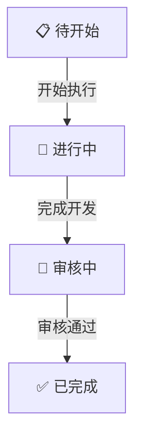
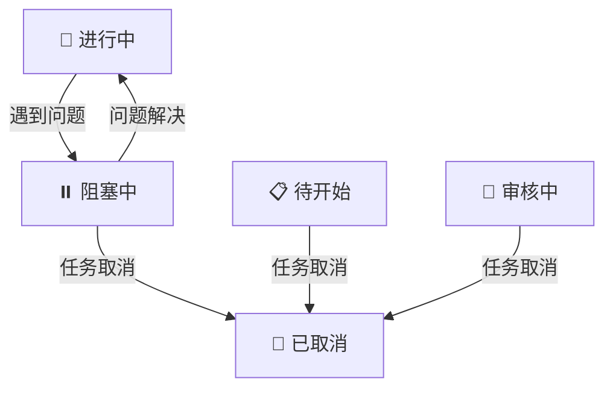
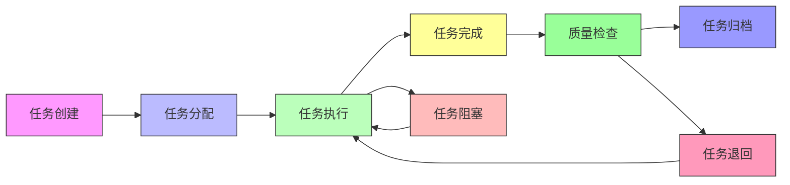
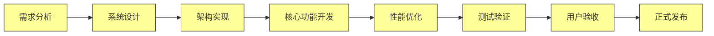
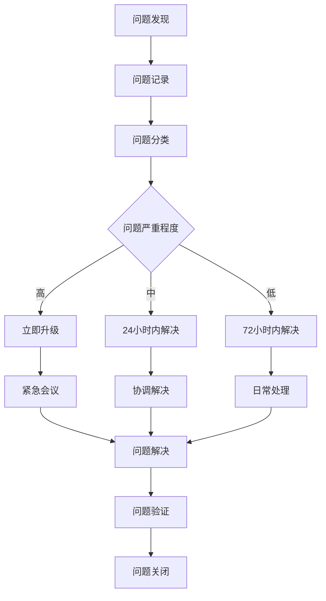
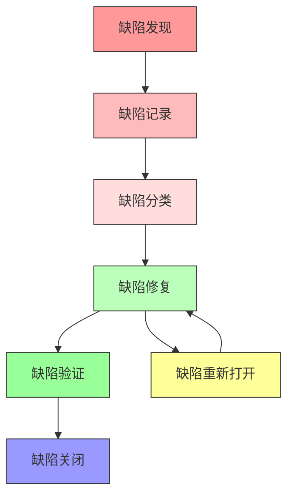

# 任务状态与进度监控

## 📋 概述

本文档详细定义温柔陪伴助手（YiPet）项目的任务状态管理体系和进度监控机制，包括任务状态定义、转换规则、流程管理方法，以及进度监控体系、报告机制和问题处理流程，确保项目任务的清晰可见和高效管理。

## 🎯 任务状态定义

### 1. 核心状态

| 状态 | 图标 | 颜色 | 说明 | 负责人 |
|------|------|------|------|--------|
| 📋 待开始 | 待开始 | 灰色 | 任务已定义，等待执行 | 项目经理 Agent |
| 🔄 进行中 | 进行中 | 蓝色 | 正在开发或执行中 | 开发工程师 Agents |
| 👀 审核中 | 审核中 | 黄色 | 开发完成，等待审核 | 质量保证 Agent |
| ✅ 已完成 | 已完成 | 绿色 | 审核通过，任务完成 | 项目经理 Agent |
| ⏸️ 阻塞中 | 阻塞中 | 红色 | 任务受阻，等待解决 | AI Agents 团队成员 |

### 2. 子状态

#### 待开始子状态
```markdown
## 📋 待开始 - 子状态

### 需求分析中
**说明**：任务正在进行需求分析
**负责人**：产品经理 Agent

### 设计阶段
**说明**：任务正在进行技术设计
**负责人**：架构师 Agent

### 等待资源
**说明**：任务准备完毕，等待资源分配
**负责人**：项目经理 Agent Agent
```

#### 进行中子状态
```markdown
## 🔄 进行中 - 子状态

### 开发阶段
**说明**：正在进行代码开发
**负责人**：开发工程师 Agent Agent

### 测试阶段
**说明**：正在进行功能测试
**负责人**：测试工程师 Agent

### 优化阶段
**说明**：正在进行性能优化
**负责人**：开发工程师 Agent Agent
```

#### 审核中子状态
```markdown
## 👀 审核中 - 子状态

### 代码审查
**说明**：正在进行代码审查
**负责人**：开发 Agents 团队

### 功能验证
**说明**：正在进行功能验证
**负责人**：产品经理 Agent

### 质量检查
**说明**：正在进行质量检查
**负责人**：质量保证 Agent
```

## 🔄 状态转换规则

### 1. 标准流程



### 2. 特殊转换



### 3. 状态转换矩阵

| 源状态 \ 目标状态 | 📋 待开始 | 🔄 进行中 | 👀 审核中 | ✅ 已完成 | ⏸️ 阻塞中 | 📝 已取消 |
|-------------------|-----------|-----------|-----------|-----------|-----------|-----------|
| 📋 待开始 | ❌ | ✅ | ❌ | ❌ | ❌ | ✅ |
| 🔄 进行中 | ❌ | ✅ | ✅ | ❌ | ✅ | ✅ |
| 👀 审核中 | ❌ | ❌ | ✅ | ✅ | ✅ | ✅ |
| ✅ 已完成 | ❌ | ❌ | ❌ | ✅ | ❌ | ❌ |
| ⏸️ 阻塞中 | ❌ | ✅ | ❌ | ❌ | ✅ | ✅ |
| 📝 已取消 | ❌ | ❌ | ❌ | ❌ | ❌ | ✅ |

## 📋 状态管理流程

### 1. 状态转换操作

#### 待开始 → 进行中
```markdown
## 状态转换：📋 → 🔄

**操作步骤**：
1. 确认资源可用性
2. 更新任务进度记录
3. 移动到进行中列
4. 通知相关人员

**验证条件**：
- 任务描述完整
- 负责人已分配
- 时间估算准确

**负责人**：项目经理 Agent
```

#### 进行中 → 审核中
```markdown
## 状态转换：🔄 → 👀

**操作步骤**：
1. 开发完成
2. 更新代码和文档
3. 提交审核请求
4. 移动到审核中列

**验证条件**：
- 功能实现完整
- 代码符合规范
- 文档更新完成

**负责人**：开发工程师 Agent
```

#### 审核中 → 已完成
```markdown
## 状态转换：👀 → ✅

**操作步骤**：
1. 审核通过
2. 功能验证完成
3. 任务归档
4. 通知相关人员

**验证条件**：
- 符合验收标准
- 质量检查通过
- 文档完整

**负责人**：质量保证 Agent
```

### 2. 阻塞管理

```markdown
## 阻塞状态管理

### 阻塞识别
**操作**：
- 识别阻塞原因
- 评估影响范围
- 标记为"阻塞中"

**负责人**：开发工程师 Agent

### 阻塞解决
**操作**：
- 分析问题根因
- 制定解决方案
- 实施解决措施

**负责人**：AI Agents 团队成员

### 阻塞解除
**操作**：
- 验证解决方案
- 更新任务状态
- 恢复开发流程

**负责人**：项目经理 Agent
```

## 📊 监控体系

### 1. 任务状态监控

#### 实时状态监控



#### 每日任务状态报告

| 状态 | 任务数量 | 完成率 | 说明 |
|------|---------|--------|------|
| 📋 待开始 | 8 | 0% | 任务已创建，未开始执行 |
| 🔄 进行中 | 4 | - | 任务正在执行中 |
| 👀 审核中 | 3 | - | 任务开发完成，待审核 |
| ✅ 已完成 | 2 | 10% | 任务已完成，通过审核 |
| ⏸️ 阻塞中 | 1 | - | 任务阻塞，无法继续 |
| **总计** | **18** | **10%** | **整体进度** |

---

### 2. 进度偏差监控

#### 进度偏差计算

```markdown
# 进度偏差计算方法

## 进度偏差（SV）
**计算公式**：SV = 已完成工作预算成本 - 计划工作预算成本

## 成本偏差（CV）
**计算公式**：CV = 已完成工作预算成本 - 已完成工作实际成本

## 进度绩效指数（SPI）
**计算公式**：SPI = 已完成工作预算成本 / 计划工作预算成本

## 成本绩效指数（CPI）
**计算公式**：CPI = 已完成工作预算成本 / 已完成工作实际成本
```

#### 项目进度趋势

```mermaid
graph TD
    A[项目启动] --> B[第一阶段]
    B --> C[第二阶段]
    C --> D[第三阶段]
    D --> E[第四阶段]

    A1[0%] --> B1[10%]
    B1 --> C1[30%]
    C1 --> D1[60%]
    D1 --> E1[100%]

    style A1 fill:#99f,stroke:#333
    style B1 fill:#55f,stroke:#333
    style C1 fill:#00f,stroke:#333
    style D1 fill:#009,stroke:#333
    style E1 fill:#003,stroke:#333
```



---

### 3. 关键路径监控

#### 关键路径识别



#### 关键路径任务状态

| 任务 | 开始时间 | 结束时间 | 状态 | 负责人 | 说明 |
|------|----------|----------|------|--------|------|
| 需求分析 | 2026-03-21 | 2026-03-22 | ✅ 已完成 | 产品经理 | 完成 |
| 系统设计 | 2026-03-23 | 2026-03-26 | ✅ 已完成 | 架构师 | 完成 |
| 架构实现 | 2026-03-27 | 2026-04-02 | ✅ 已完成 | 架构师 | 完成 |
| 核心功能开发 | 2026-04-03 | 2026-04-21 | 🔄 进行中 | 开发团队 | 预计完成 |
| 性能优化 | 2026-04-22 | 2026-04-30 | 📋 待开始 | 开发团队 | 待开始 |
| 测试验证 | 2026-05-01 | 2026-05-10 | 📋 待开始 | 测试团队 | 待开始 |
| 用户验收 | 2026-05-11 | 2026-05-15 | 📋 待开始 | 产品+用户 | 待开始 |
| 正式发布 | 2026-05-16 | 2026-05-20 | 📋 待开始 | DevOps | 待开始 |

---

## 📋 报告机制

### 1. 每日进度报告

#### 每日报告模板

```markdown
# YiPet 项目每日进度报告

## 报告日期：2026-03-30

### 今日任务完成情况
- ✅ PM-01：宠物动画优化（张三）
- ✅ PF-04：代码分割（赵六）

### 今日任务进行中
- 🔄 PM-03：拖拽性能优化（王五） - 50%完成
- 🔄 CH-02：聊天记录搜索（李四） - 30%完成
- 🔄 CH-03：响应式布局（王五） - 20%完成
- 🔄 PF-02：内存使用优化（李四） - 60%完成

### 今日任务审核中
- 👀 PM-04：宠物设置界面（赵六） - 等待审核
- 👀 FQ-04：FAQ使用统计（赵六） - 等待审核
- 👀 SM-02：会话批量操作（李四） - 等待审核

### 任务阻塞情况
- ⏸️ SM-03：会话信息编辑器优化（王五） - 设计资源未到

### 明日计划任务
- 📋 PM-01：宠物动画优化（张三）
- 📋 FQ-03：FAQ搜索优化（王五）
- 📋 TD-01：单元测试编写（张三）

### 问题与风险
- 设计资源不足，影响会话管理模块开发
- 后端API开发进度滞后，影响聊天功能模块
```

---

### 2. 每周进度报告

#### 每周报告模板

```markdown
# YiPet 项目每周进度报告

## 报告期间：2026-03-21 至 2026-03-27

### 本周任务完成情况
- ✅ PM-04：宠物设置界面（赵六）
- ✅ PF-04：代码分割（赵六）

### 本周任务进度
| 模块 | 计划任务 | 完成任务 | 完成率 |
|------|---------|---------|--------|
| 宠物管理模块 | 4 | 1 | 25% |
| 聊天功能模块 | 4 | 1 | 25% |
| FAQ系统模块 | 4 | 0 | 0% |
| 会话管理模块 | 4 | 0 | 0% |
| 性能优化模块 | 4 | 1 | 25% |
| 测试与文档模块 | 4 | 0 | 0% |
| **总计** | **24** | **3** | **12.5%** |

### 进度偏差分析
| 指标 | 计划值 | 实际值 | 偏差 | 说明 |
|------|--------|--------|------|------|
| 任务完成率 | 15% | 12.5% | -2.5% | 进度略有滞后 |
| 资源利用率 | 85% | 80% | -5% | 资源使用略有不足 |
| 缺陷密度 | 0.5 | 0.3 | -0.2 | 代码质量良好 |

### 下周重点工作
- 宠物管理模块：PM-01、PM-02
- 聊天功能模块：CH-01、CH-02
- 性能优化模块：PF-01、PF-02

### 风险评估
| 风险 | 影响程度 | 发生概率 | 应对措施 |
|------|---------|---------|----------|
| 需求变更 | 高 | 低 | 建立变更控制流程 |
| 人员变动 | 高 | 低 | 备份人员安排 |
| 技术债务 | 中 | 中 | 预留20%时间处理 |
```

---

### 3. 月度进度报告

#### 月度报告模板

```markdown
# YiPet 项目月度进度报告

## 报告期间：2026年3月

### 本月任务完成情况
- 宠物管理模块：1个任务完成
- 聊天功能模块：1个任务完成
- 性能优化模块：1个任务完成
- **总计：3个任务完成**

### 项目阶段进度
| 阶段 | 计划任务 | 完成任务 | 完成率 |
|------|---------|---------|--------|
| 第一阶段：项目启动 | 4 | 4 | 100% |
| 第二阶段：核心功能开发 | 12 | 2 | 16.7% |
| 第三阶段：优化与完善 | 4 | 0 | 0% |
| 第四阶段：发布上线 | 4 | 0 | 0% |
| **总计** | **24** | **6** | **25%** |

### 资源使用情况
| 资源类型 | 计划投入 | 实际投入 | 使用率 |
|----------|---------|---------|--------|
| 人力资源 | 24人周 | 22人周 | 91.7% |
| 财务资源 | 50,000元 | 45,000元 | 90% |
| 设备资源 | 6套 | 6套 | 100% |

### 风险与问题
| 风险类型 | 数量 | 影响程度 | 处理状态 |
|---------|------|---------|----------|
| 技术风险 | 3 | 中 | 正在处理 |
| 进度风险 | 2 | 中 | 正在处理 |
| 质量风险 | 0 | - | - |
| 资源风险 | 1 | 低 | 已处理 |

### 下月计划重点
- 完成宠物管理模块剩余任务
- 完成聊天功能模块核心任务
- 启动FAQ系统模块开发
- 继续性能优化工作
```

---

## 🚨 问题处理机制

### 1. 问题识别与分类

#### 问题识别流程



#### 问题分类标准

| 问题类型 | 影响程度 | 响应时间 | 解决时间 | 升级条件 |
|---------|---------|---------|---------|---------|
| 功能问题 | 高 | 1小时 | 24小时 | 超过8小时 |
| 部署问题 | 高 | 30分钟 | 8小时 | 超过2小时 |
| 性能问题 | 中 | 2小时 | 48小时 | 超过12小时 |
| 安全问题 | 高 | 30分钟 | 24小时 | 超过4小时 |
| 文档问题 | 低 | 24小时 | 72小时 | 超过3天 |

---

### 2. 问题处理流程

#### 问题处理模板

```markdown
# 问题处理记录

## 问题基本信息
- **问题编号**：Q-20260321-001
- **问题类型**：功能问题
- **问题标题**：宠物拖拽定位不准确
- **发现时间**：2026-03-21
- **发现人**：张三
- **影响程度**：高
- **发生概率**：100%

## 问题描述
宠物在网页上拖拽时，定位不准确，与鼠标位置有偏移

## 问题分析
- 拖拽事件处理逻辑有问题
- 坐标计算方式不正确
- 浏览器兼容性问题

## 解决措施
1. 修复拖拽事件处理逻辑
2. 优化坐标计算方式
3. 测试浏览器兼容性

## 负责人信息
- **负责人**：张三
- **开始时间**：2026-03-21
- **预计完成时间**：2026-03-22
- **实际完成时间**：-

## 进度跟踪
| 时间 | 更新人 | 进度 | 说明 |
|------|--------|------|------|
| 2026-03-21 | 张三 | 开始分析 | 问题确认，开始分析 |
| 2026-03-21 | 张三 | 找到原因 | 定位到拖拽事件处理逻辑问题 |
| 2026-03-21 | 张三 | 开始修复 | 开始代码修复 |

## 相关文档
- [问题截图]()
- [代码修改记录]()
- [测试报告]()

## 问题验证
- **验证人**：李四
- **验证时间**：2026-03-22
- **验证结果**：-

## 问题关闭
- **关闭时间**：-
- **关闭原因**：-
- **关闭人**：-
```

---

## 📈 质量监控

### 1. 缺陷管理

#### 缺陷统计报告

| 严重程度 | 数量 | 修复率 | 说明 |
|---------|------|--------|------|
| 🔴 严重缺陷 | 0 | 0% | 无严重缺陷 |
| 🟡 一般缺陷 | 3 | 0% | 3个一般缺陷待修复 |
| 🟢 轻微缺陷 | 5 | 0% | 5个轻微缺陷待修复 |
| **总计** | **8** | **0%** | **8个缺陷待修复** |

#### 缺陷趋势分析



---

### 2. 代码质量监控

#### 代码质量指标

| 指标 | 基准值 | 实际值 | 说明 |
|------|--------|--------|------|
| 代码复杂度 | <15 | 12 | 代码复杂度良好 |
| 代码重复率 | <5% | 3.5% | 代码重复率较低 |
| 测试覆盖率 | >80% | 0% | 待测试 |
| 代码注释率 | >20% | 25% | 代码注释率良好 |
| 代码规范 | 符合规范 | 符合规范 | 代码规范检查通过 |

---

## 📊 工具支持

### 1. 项目管理工具

| 工具名称 | 功能 | 负责人 | 用途 |
|---------|------|--------|------|
| GitHub Projects | 任务看板 | 项目经理 | 任务管理与追踪 |
| Slack | 实时沟通 | 全体成员 | 团队沟通协作 |
| Zoom | 视频会议 | 全体成员 | 远程会议 |

### 2. 开发管理工具

| 工具名称 | 功能 | 负责人 | 用途 |
|---------|------|--------|------|
| GitHub | 代码托管 | 开发团队 | 版本控制与代码管理 |
| GitHub Actions | CI/CD | DevOps | 自动化构建与部署 |
| Cypress | 自动化测试 | 测试团队 | 自动化测试与验证 |
| Sentry | 错误监控 | 开发团队 | 错误跟踪与监控 |

### 3. 数据分析工具

| 工具名称 | 功能 | 负责人 | 用途 |
|---------|------|--------|------|
| Excel/Google Sheets | 数据分析 | 项目经理 | 进度跟踪与报告 |
| Tableau/Power BI | 数据可视化 | 项目经理 | 项目数据可视化 |
| 自定义脚本 | 自动化统计 | DevOps | 数据自动收集与分析 |

---

**文档版本**：v1.0
**创建时间**：2026年3月21日
**最后更新**：2026年3月21日
