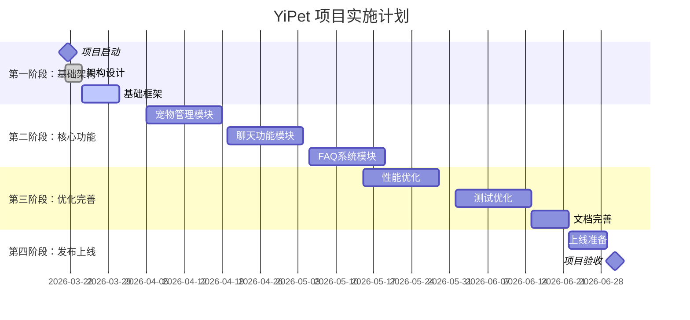
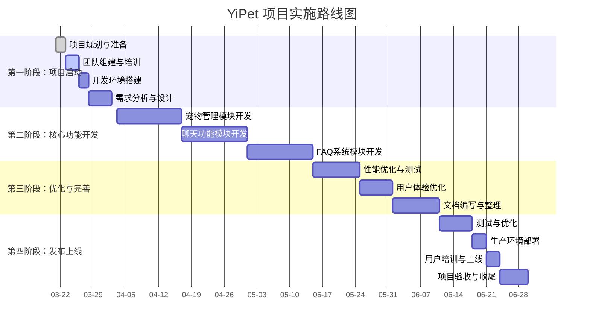

# 项目里程碑与实施路线图

## 📋 概述

本文档详细定义温柔陪伴助手（YiPet）项目的关键里程碑和实施路线图，包括阶段划分、交付目标、时间安排和资源配置，为项目管理提供清晰的时间框架和实施路径。

## 📅 项目阶段划分



## 🎯 详细里程碑规划

### 第一阶段：基础架构阶段（2026-03-21 至 2026-04-01）

#### 里程碑1.1：项目启动
| 项目 | 内容 |
|------|------|
| **里程碑名称** | 项目团队组建 |
| **目标** | 建立完整项目团队，明确角色职责 |
| **交付物** | 团队组织结构图、角色职责表 |
| **时间** | 2026-03-21 |
| **负责人** | 项目经理 Agent |

**验收标准**：
- [ ] 核心团队成员全部到位
- [ ] 角色职责明确分配
- [ ] 团队沟通渠道建立

---

#### 里程碑1.2：架构设计
| 项目 | 内容 |
|------|------|
| **里程碑名称** | 系统架构设计 |
| **目标** | 完成系统整体架构设计 |
| **交付物** | 架构设计文档、系统设计图 |
| **时间** | 2026-03-24 |
| **负责人** | 架构师 Agent |

**验收标准**：
- [ ] 架构设计文档通过评审
- [ ] 系统设计图完整清晰
- [ ] 技术选型符合要求

---

#### 里程碑1.3：基础框架搭建
| 项目 | 内容 |
|------|------|
| **里程碑名称** | 项目基础框架 |
| **目标** | 建立项目基础框架和开发环境 |
| **交付物** | 基础代码框架、开发环境配置 |
| **时间** | 2026-04-01 |
| **负责人** | 架构师 Agent、开发工程师 Agents |

**验收标准**：
- [ ] 基础框架代码完成
- [ ] 开发环境配置成功
- [ ] 基础功能正常运行

---

### 第二阶段：核心功能阶段（2026-04-05 至 2026-05-22）

#### 里程碑2.1：宠物管理模块
| 项目 | 内容 |
|------|------|
| **里程碑名称** | 宠物管理模块完成 |
| **目标** | 实现完整的宠物管理功能 |
| **交付物** | 宠物管理功能代码、测试报告 |
| **时间** | 2026-04-15 |
| **负责人** | 开发工程师 Agents |

**验收标准**：
- [ ] 宠物动画效果流畅
- [ ] 角色系统功能完整
- [ ] 拖拽定位精确
- [ ] 设置界面功能正常

---

#### 里程碑2.2：聊天功能模块
| 项目 | 内容 |
|------|------|
| **里程碑名称** | 聊天功能模块完成 |
| **目标** | 实现完整的AI聊天功能 |
| **交付物** | 聊天功能代码、测试报告 |
| **时间** | 2026-05-01 |
| **负责人** | 开发工程师 Agents |

**验收标准**：
- [ ] 流式响应延迟<100ms
- [ ] 聊天搜索功能正常
- [ ] 响应式布局适配
- [ ] 消息导出功能完成

---

#### 里程碑2.3：FAQ系统模块
| 项目 | 内容 |
|------|------|
| **里程碑名称** | FAQ系统模块完成 |
| **目标** | 实现完整的FAQ管理功能 |
| **交付物** | FAQ系统代码、测试报告 |
| **时间** | 2026-05-22 |
| **负责人** | 开发工程师 Agents |

**验收标准**：
- [ ] FAQ导入导出功能正常
- [ ] 标签系统功能完整
- [ ] 搜索功能响应快速
- [ ] 使用统计功能完成

---

### 第三阶段：优化完善阶段（2026-05-15 至 2026-06-30）

#### 里程碑3.1：性能优化
| 项目 | 内容 |
|------|------|
| **里程碑名称** | 系统性能优化 |
| **目标** | 提升系统整体性能和用户体验 |
| **交付物** | 性能报告、优化代码 |
| **时间** | 2026-06-01 |
| **负责人** | 架构师 Agent、开发工程师 Agents |

**验收标准**：
- [ ] 页面加载时间<2秒
- [ ] 内存使用<50MB
- [ ] CPU占用率<25%
- [ ] 响应时间<500ms

---

#### 里程碑3.2：测试优化
| 项目 | 内容 |
|------|------|
| **里程碑名称** | 测试覆盖和优化 |
| **目标** | 完善测试用例，提升软件质量 |
| **交付物** | 测试报告、优化后的软件 |
| **时间** | 2026-06-15 |
| **负责人** | 测试工程师 Agent |

**验收标准**：
- [ ] 功能测试覆盖>90%
- [ ] 性能测试达标
- [ ] 兼容性测试通过
- [ ] 安全测试合格

---

#### 里程碑3.3：文档完善
| 项目 | 内容 |
|------|------|
| **里程碑名称** | 项目文档完善 |
| **目标** | 完成项目所有文档的编写和完善 |
| **交付物** | 完整文档体系、用户手册 |
| **时间** | 2026-06-22 |
| **负责人** | 技术作家 Agent |

**验收标准**：
- [ ] 开发文档完整
- [ ] 用户文档清晰
- [ ] API文档准确
- [ ] 部署文档详细

---

### 第四阶段：发布上线阶段（2026-06-22 至 2026-06-30）

#### 里程碑4.1：上线准备
| 项目 | 内容 |
|------|------|
| **里程碑名称** | 上线准备完成 |
| **目标** | 完成上线前的所有准备工作 |
| **交付物** | 上线检查报告、部署脚本 |
| **时间** | 2026-06-28 |
| **负责人** | 项目经理 Agent、DevOps Agent |

**验收标准**：
- [ ] 生产环境配置完成
- [ ] 部署流程测试成功
- [ ] 监控系统配置完成
- [ ] 应急方案准备就绪

---

#### 里程碑4.2：项目验收
| 项目 | 内容 |
|------|------|
| **里程碑名称** | 项目正式验收 |
| **目标** | 项目完成所有目标，通过验收 |
| **交付物** | 验收报告、项目总结 |
| **时间** | 2026-06-30 |
| **负责人** | 项目经理 Agent、客户代表 |

**验收标准**：
- [ ] 所有功能正常运行
- [ ] 性能指标达标
- [ ] 文档体系完整
- [ ] 客户满意度高

---

## 📅 实施路线图



## 🎯 分阶段实施计划

### 第一阶段：项目启动（2026-03-21 至 2026-04-02）

#### 1.1 项目规划与准备
| 任务 | 负责人 | 开始时间 | 结束时间 | 状态 | 说明 |
|------|--------|----------|----------|------|------|
| 项目章程制定 | 项目经理 Agent | 2026-03-21 | 2026-03-21 | ✅ 已完成 | 项目整体规划 |
| 资源需求评估 | 项目经理 Agent | 2026-03-21 | 2026-03-22 | ✅ 已完成 | 人力资源与设备需求 |
| 风险识别与评估 | 项目经理 Agent | 2026-03-22 | 2026-03-22 | ✅ 已完成 | 项目风险评估 |

#### 1.2 团队组建与培训
| 任务 | 负责人 | 开始时间 | 结束时间 | 状态 | 说明 |
|------|--------|----------|----------|------|------|
| 团队成员招聘 | 项目经理 Agent | 2026-03-23 | 2026-03-25 | 🔄 进行中 | 核心团队招聘 |
| 技术培训计划 | 架构师 Agent | 2026-03-24 | 2026-03-25 | 🔄 进行中 | 技术技能培训 |
| 工作流程制定 | 项目经理 Agent | 2026-03-25 | 2026-03-26 | 📋 待开始 | 团队工作流程 |

#### 1.3 开发环境搭建
| 任务 | 负责人 | 开始时间 | 结束时间 | 状态 | 说明 |
|------|--------|----------|----------|------|------|
| 开发服务器配置 | DevOps Agent | 2026-03-26 | 2026-03-26 | 📋 待开始 | 开发环境搭建 |
| CI/CD流程配置 | DevOps Agent | 2026-03-26 | 2026-03-27 | 📋 待开始 | 持续集成部署配置 |
| 测试环境准备 | DevOps Agent | 2026-03-27 | 2026-03-28 | 📋 待开始 | 测试环境搭建 |

#### 1.4 需求分析与设计
| 任务 | 负责人 | 开始时间 | 结束时间 | 状态 | 说明 |
|------|--------|----------|----------|------|------|
| 用户需求分析 | 产品经理 Agent | 2026-03-28 | 2026-03-29 | 📋 待开始 | 用户需求调研分析 |
| 系统架构设计 | 架构师 Agent | 2026-03-29 | 2026-03-31 | 📋 待开始 | 系统整体架构设计 |
| 数据库设计 | 架构师 Agent | 2026-03-31 | 2026-04-01 | 📋 待开始 | 数据库结构设计 |
| 界面设计 | UI设计师 Agent | 2026-04-01 | 2026-04-02 | 📋 待开始 | 用户界面设计 |

---

### 第二阶段：核心功能开发（2026-04-03 至 2026-05-14）

#### 2.1 宠物管理模块开发
| 任务 | 负责人 | 开始时间 | 结束时间 | 状态 | 说明 |
|------|--------|----------|----------|------|------|
| 宠物动画优化 | 前端开发 Agent 1 | 2026-04-03 | 2026-04-10 | 📋 待开始 | 宠物动画性能优化 |
| 角色系统扩展 | 前端开发 Agent 2 | 2026-04-05 | 2026-04-15 | 📋 待开始 | 宠物角色系统开发 |
| 拖拽性能优化 | 前端开发 Agent 1 | 2026-04-10 | 2026-04-15 | 📋 待开始 | 宠物拖拽功能优化 |
| 宠物设置界面 | 前端开发 Agent 2 | 2026-04-12 | 2026-04-17 | 📋 待开始 | 宠物设置界面开发 |

#### 2.2 聊天功能模块开发
| 任务 | 负责人 | 开始时间 | 结束时间 | 状态 | 说明 |
|------|--------|----------|----------|------|------|
| 流式响应优化 | 前端开发 Agent 1 | 2026-04-17 | 2026-04-25 | 📋 待开始 | 聊天流式响应优化 |
| 聊天记录搜索 | 前端开发 Agent 2 | 2026-04-20 | 2026-04-30 | 📋 待开始 | 聊天记录搜索功能 |
| 响应式布局 | 前端开发 Agent 1 | 2026-04-25 | 2026-05-05 | 📋 待开始 | 响应式布局开发 |
| 消息导出功能 | 前端开发 Agent 2 | 2026-04-28 | 2026-05-01 | 📋 待开始 | 聊天消息导出功能 |

#### 2.3 FAQ系统模块开发
| 任务 | 负责人 | 开始时间 | 结束时间 | 状态 | 说明 |
|------|--------|----------|----------|------|------|
| FAQ导入导出 | 前端开发 Agent 1 | 2026-05-01 | 2026-05-08 | 📋 待开始 | FAQ导入导出功能 |
| 标签系统增强 | 前端开发 Agent 2 | 2026-05-03 | 2026-05-12 | 📋 待开始 | FAQ标签系统优化 |
| FAQ搜索优化 | 前端开发 Agent 1 | 2026-05-08 | 2026-05-15 | 📋 待开始 | FAQ搜索功能优化 |
| FAQ使用统计 | 前端开发 Agent 2 | 2026-05-10 | 2026-05-14 | 📋 待开始 | FAQ使用统计功能 |

---

### 第三阶段：优化与完善（2026-05-15 至 2026-06-10）

#### 3.1 性能优化与测试
| 任务 | 负责人 | 开始时间 | 结束时间 | 状态 | 说明 |
|------|--------|----------|----------|------|------|
| 加载时间优化 | 前端开发 Agent 1 | 2026-05-15 | 2026-05-20 | 📋 待开始 | 页面加载时间优化 |
| 内存使用优化 | 前端开发 Agent 2 | 2026-05-18 | 2026-05-23 | 📋 待开始 | 内存使用优化 |
| DOM操作优化 | 前端开发 Agent 1 | 2026-05-20 | 2026-05-25 | 📋 待开始 | DOM操作性能优化 |
| 代码分割 | 前端开发 Agent 2 | 2026-05-23 | 2026-05-28 | 📋 待开始 | 代码分割优化 |

#### 3.2 用户体验优化
| 任务 | 负责人 | 开始时间 | 结束时间 | 状态 | 说明 |
|------|--------|----------|----------|------|------|
| 界面响应优化 | 前端开发 Agent 1 | 2026-05-25 | 2026-05-28 | 📋 待开始 | 界面响应速度优化 |
| 交互效果优化 | 前端开发 Agent 2 | 2026-05-26 | 2026-05-30 | 📋 待开始 | 用户交互效果优化 |
| 导航体验优化 | 前端开发 Agent 1 | 2026-05-28 | 2026-05-31 | 📋 待开始 | 导航流程优化 |

#### 3.3 文档编写与整理
| 任务 | 负责人 | 开始时间 | 结束时间 | 状态 | 说明 |
|------|--------|----------|----------|------|------|
| 技术文档编写 | 技术作家 Agent | 2026-06-01 | 2026-06-05 | 📋 待开始 | 技术开发文档 |
| 用户手册编写 | 技术作家 Agent | 2026-06-03 | 2026-06-08 | 📋 待开始 | 用户操作手册 |
| API文档整理 | 技术作家 Agent | 2026-06-05 | 2026-06-10 | 📋 待开始 | API接口文档 |

---

### 第四阶段：发布上线（2026-06-11 至 2026-06-30）

#### 4.1 测试与优化
| 任务 | 负责人 | 开始时间 | 结束时间 | 状态 | 说明 |
|------|--------|----------|----------|------|------|
| 单元测试 | 测试工程师 Agent | 2026-06-11 | 2026-06-13 | 📋 待开始 | 单元测试执行 |
| 集成测试 | 测试工程师 Agent | 2026-06-13 | 2026-06-16 | 📋 待开始 | 集成测试执行 |
| 回归测试 | 测试工程师 Agent | 2026-06-15 | 2026-06-17 | 📋 待开始 | 回归测试执行 |

#### 4.2 生产环境部署
| 任务 | 负责人 | 开始时间 | 结束时间 | 状态 | 说明 |
|------|--------|----------|----------|------|------|
| 生产环境准备 | DevOps Agent | 2026-06-18 | 2026-06-18 | 📋 待开始 | 生产环境部署 |
| 应用程序部署 | DevOps Agent | 2026-06-18 | 2026-06-19 | 📋 待开始 | 应用程序部署 |
| 配置文件部署 | DevOps Agent | 2026-06-19 | 2026-06-20 | 📋 待开始 | 配置文件部署 |

#### 4.3 用户培训与上线
| 任务 | 负责人 | 开始时间 | 结束时间 | 状态 | 说明 |
|------|--------|----------|----------|------|------|
| 用户培训准备 | 技术作家 Agent | 2026-06-21 | 2026-06-21 | 📋 待开始 | 用户培训资料准备 |
| 用户培训实施 | 技术作家 Agent | 2026-06-21 | 2026-06-22 | 📋 待开始 | 用户培训课程 |
| 上线公告发布 | 产品经理 Agent | 2026-06-22 | 2026-06-22 | 📋 待开始 | 上线公告发布 |

#### 4.4 项目验收与收尾
| 任务 | 负责人 | 开始时间 | 结束时间 | 状态 | 说明 |
|------|--------|----------|----------|------|------|
| 项目验收测试 | 测试工程师 Agent | 2026-06-23 | 2026-06-24 | 📋 待开始 | 项目验收测试 |
| 验收会议 | 项目经理 Agent | 2026-06-24 | 2026-06-24 | 📋 待开始 | 项目验收会议 |
| 项目总结 | 项目经理 Agent | 2026-06-25 | 2026-06-27 | 📋 待开始 | 项目工作总结 |
| 文档归档 | 技术作家 Agent | 2026-06-27 | 2026-06-30 | 📋 待开始 | 项目文档归档 |

---

## 📊 资源配置计划

### 人力资源分配（AI Agents）

| 角色 | 第一阶段 | 第二阶段 | 第三阶段 | 第四阶段 | 总投入 |
|------|---------|---------|---------|---------|--------|
| 项目经理 Agent | 100% | 100% | 100% | 100% | 12周 |
| 产品经理 Agent | 80% | 60% | 40% | 60% | 10周 |
| 架构师 Agent | 100% | 80% | 60% | 40% | 11周 |
| 前端开发 Agent 1 | 100% | 100% | 100% | 80% | 12周 |
| 前端开发 Agent 2 | 100% | 100% | 100% | 80% | 12周 |
| 后端开发 Agent | 100% | 80% | 60% | 40% | 11周 |
| 测试工程师 Agent | 0% | 60% | 100% | 100% | 8周 |
| UI设计师 Agent | 0% | 50% | 30% | 20% | 5周 |
| DevOps Agent | 100% | 60% | 40% | 100% | 9周 |

---

## 🚨 风险与应对

### 技术风险

#### 架构设计风险
**风险**：系统架构设计不合理，导致后期难以维护
**影响**：系统可扩展性差，维护成本高
**缓解措施**：
- 架构设计阶段充分评审
- 建立技术评审机制
- 预留20%时间用于技术债务处理

#### 技术债务风险
**风险**：为赶进度引入技术债务
**影响**：代码质量下降，后期维护困难
**缓解措施**：
- 预留20%时间用于技术债务处理
- 代码审查严格执行
- 定期进行代码质量检查

### 进度风险

#### 需求变更风险
**风险**：需求频繁变更影响项目进度
**影响**：项目延期，成本增加
**缓解措施**：
- 建立变更管理流程
- 需求冻结机制
- 定期需求确认会议

#### 人员变动风险
**风险**：关键人员离职影响项目进展
**影响**：项目延期，知识流失
**缓解措施**：
- 知识分享机制
- 备份人员安排
- 人员稳定性评估

---

## 📈 监控与报告

### 项目监控指标

| 指标 | 监控频率 | 负责人 | 基准值 | 报警值 |
|------|---------|--------|--------|--------|
| 任务完成率 | 每日 | 项目经理 Agent | >95% | <85% |
| 进度偏差 | 每周 | 项目经理 Agent | <5% | >15% |
| 缺陷密度 | 每日 | 测试工程师 Agent | <0.5 | >1.0 |
| 代码质量 | 每日 | 架构师 Agent | >80 | <60 |
| 用户满意度 | 每周 | 产品经理 Agent | >4.0 | <3.5 |

### 报告频率

```markdown
# 项目报告频率

## 每日报告
- 任务完成情况
- 阻塞问题
- 进度偏差

## 每周报告
- 周计划完成情况
- 风险评估
- 资源使用情况

## 月度报告
- 阶段目标完成情况
- 预算执行情况
- 质量指标
- 风险趋势
```

---

## 🔄 变更管理

### 里程碑变更流程

```markdown
# 里程碑变更流程

## 变更申请
- 变更原因
- 影响分析
- 替代方案

## 变更评估
- 技术可行性
- 进度影响
- 成本评估

## 变更审批
- 内部评审
- 客户审批
- 变更确认

## 变更实施
- 更新计划
- 资源调整
- 通知相关方
```

---

## 📊 里程碑报告

### 月度报告模板

```markdown
# YiPet 项目月度报告

## 报告信息
- 报告期间：[开始时间] 至 [结束时间]
- 当前阶段：[阶段名称]
- 报告时间：[YYYY-MM-DD]

## 阶段进展

### 里程碑完成情况
| 里程碑 | 计划完成 | 实际完成 | 状态 |
|--------|----------|----------|------|
| [名称] | [日期] | [日期] | ✅ 完成 |

### 关键成果
- [成果1]
- [成果2]

## 资源使用

### 人力资源（AI Agents）
| 角色 | 计划 | 实际 | 差异 |
|------|------|------|------|
| [角色] | [人天] | [人天] | [百分比] |

### 财务资源
| 类别 | 预算 | 实际 | 剩余 |
|------|------|------|------|
| [类别] | [金额] | [金额] | [金额] |

## 风险与问题

### 识别的风险
| 风险 | 影响 | 概率 | 缓解措施 |
|------|------|------|----------|
| [风险] | [影响] | [百分比] | [措施] |

### 解决的问题
| 问题 | 解决方法 | 负责人 | 完成时间 |
|------|----------|--------|----------|
| [问题] | [方法] | [Agent名称] | [日期] |

## 下一阶段计划

### 重点工作
- [任务1] - [负责人] - [时间]
- [任务2] - [负责人] - [时间]

### 资源需求
- [资源类型] - [数量] - [时间]

---

**报告人**：[Agent名称]
**审核人**：[Agent名称]
```

---

**文档版本**：v1.0
**创建时间**：2026年3月21日
**最后更新**：2026年3月21日
