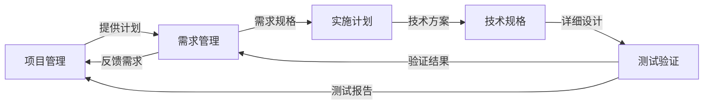

# 项目运维目录

## 📋 概述

本目录包含温柔陪伴助手（YiPet）项目的项目运维相关文档，与项目管理并行运作，共同保障项目的顺利交付和持续运行。主要负责需求管理、实施计划、技术规格和测试验证。

## 🏗️ 目录结构

### 一、需求管理

| 序号 | 文档名称 | 说明 |
|------|---------|------|
| 01-01 | [项目需求规格.md](./31_需求文档/01-01_项目需求规格.md) | 项目整体需求规格说明 |
| 01-02 | [宠物管理模块需求.md](./31_需求文档/01-02_宠物管理模块需求.md) | 宠物管理模块详细需求 |
| 01-03 | [聊天功能模块需求.md](./31_需求文档/01-03_聊天功能模块需求.md) | 聊天功能模块详细需求 |
| 01-04 | [FAQ系统模块需求.md](./31_需求文档/01-04_FAQ系统模块需求.md) | FAQ系统模块详细需求 |
| 01-05 | [会话管理模块需求.md](./31_需求文档/01-05_会话管理模块需求.md) | 会话管理模块详细需求 |

### 二、实施计划

| 序号 | 文档名称 | 说明 |
|------|---------|------|
| 02-01 | [项目实施计划.md](./32_实施计划/02-01_项目实施计划.md) | 项目整体实施计划 |
| 02-02 | [宠物管理模块实施计划.md](./32_实施计划/02-02_宠物管理模块实施计划.md) | 宠物管理模块详细计划 |
| 02-03 | [聊天功能模块实施计划.md](./32_实施计划/02-03_聊天功能模块实施计划.md) | 聊天功能模块详细计划 |
| 02-04 | [FAQ系统模块实施计划.md](./32_实施计划/02-04_FAQ系统模块实施计划.md) | FAQ系统模块详细计划 |
| 02-05 | [会话管理模块实施计划.md](./32_实施计划/02-05_会话管理模块实施计划.md) | 会话管理模块详细计划 |

### 三、技术规格

| 序号 | 文档名称 | 说明 |
|------|---------|------|
| 03-01 | [系统架构设计.md](./33_规格文档/03-01_系统架构设计.md) | 系统整体架构设计 |
| 03-02 | [宠物管理模块规格.md](./33_规格文档/03-02_宠物管理模块规格.md) | 宠物管理模块技术规格 |
| 03-03 | [聊天功能模块规格.md](./33_规格文档/03-03_聊天功能模块规格.md) | 聊天功能模块技术规格 |
| 03-04 | [FAQ系统模块规格.md](./33_规格文档/03-04_FAQ系统模块规格.md) | FAQ系统模块技术规格 |
| 03-05 | [会话管理模块规格.md](./33_规格文档/03-05_会话管理模块规格.md) | 会话管理模块技术规格 |

### 四、测试验证

| 序号 | 文档名称 | 说明 |
|------|---------|------|
| 04-01 | [测试策略.md](./34_测试报告/04-01_测试策略.md) | 项目测试策略说明 |
| 04-02 | [宠物管理模块测试报告.md](./34_测试报告/04-02_宠物管理模块测试报告.md) | 宠物管理模块测试报告 |
| 04-03 | [聊天功能模块测试报告.md](./34_测试报告/04-03_聊天功能模块测试报告.md) | 聊天功能模块测试报告 |
| 04-04 | [FAQ系统模块测试报告.md](./34_测试报告/04-04_FAQ系统模块测试报告.md) | FAQ系统模块测试报告 |
| 04-05 | [会话管理模块测试报告.md](./34_测试报告/04-05_会话管理模块测试报告.md) | 会话管理模块测试报告 |

## 🎯 核心职责

### 1. 需求管理
- 需求分析与规格定义
- 需求变更控制
- 需求验证与确认

### 2. 实施计划
- 项目进度规划
- 资源分配管理
- 风险评估与缓解

### 3. 技术规格
- 系统架构设计
- 技术方案选择
- 接口规范定义
- 数据库设计

### 4. 测试验证
- 测试策略制定
- 测试用例设计
- 测试执行与报告
- 缺陷跟踪与管理

## 🤝 与项目管理协作

### 协作机制



### 协作流程

#### 需求阶段协作
1. **需求规划**：项目管理与项目运维共同参与
2. **需求分析**：项目运维负责详细分析
3. **需求验证**：项目运维负责需求验证

#### 设计阶段协作
1. **技术方案**：项目运维负责架构设计
2. **实施计划**：项目运维负责详细计划
3. **资源配置**：项目管理负责资源协调

#### 开发阶段协作
1. **任务分配**：项目管理负责任务分配
2. **进度跟踪**：项目管理负责进度监控
3. **质量保证**：项目运维负责质量控制

#### 测试阶段协作
1. **测试设计**：项目运维负责测试策略
2. **测试执行**：项目运维负责测试执行
3. **缺陷管理**：双方共同参与缺陷管理

## 📊 文档对齐机制

### 文档关联关系

| 项目管理文档 | DevOps对应文档 | 关联关系 |
|---------|---------|----------|
| [项目管理总览.md](../35_项目管理/00_项目管理总览.md) | [项目需求规格.md](./31_需求文档/01-01_项目需求规格.md) | 项目范围对齐 |
| [任务看板系统.md](../35_项目管理/01_任务看板系统.md) | [项目实施计划.md](./32_实施计划/02-01_项目实施计划.md) | 任务关联计划 |
| [功能模块分解.md](../35_项目管理/05_功能模块分解.md) | [系统架构设计.md](./33_规格文档/03-01_系统架构设计.md) | 模块对应架构 |
| [任务进度监控.md](../35_项目管理/07_任务进度监控.md) | [测试策略.md](./34_测试报告/04-01_测试策略.md) | 进度关联测试 |
| [与项目运维对齐.md](../35_项目管理/08_与项目运维对齐.md) | 本文件 | 协作机制文档 |

### 文档版本控制

```markdown
# 文档版本控制机制

## 版本号格式
**格式**：主版本号.次版本号.修订号
- **主版本号**：项目阶段变更
- **次版本号**：功能模块变更
- **修订号**：内容细节变更

## 变更管理流程
1. 文档变更申请
2. 变更影响评估
3. 变更审批
4. 变更实施
5. 变更通知

## 版本历史记录
| 版本号 | 更新时间 | 更新内容 | 更新人 |
|---------|---------|---------|--------|
| v1.0.0 | 2026-03-21 | 初始创建 | 产品经理 |
| v1.0.1 | 2026-03-22 | 补充宠物管理模块需求 | 产品经理 |
```

## 📋 快速开始

### 需求分析流程
1. 阅读 [项目需求规格.md](./02_需求文档/02-01_项目需求规格.md) 了解项目范围
2. 查看对应模块的详细需求文档
3. 参与需求规格评审会议

### 实施计划流程
1. 参考 [项目实施计划.md](./03_实施计划/03-01_项目实施计划.md) 了解整体计划
2. 查看对应模块的详细实施计划
3. 参与计划评审会议

### 技术规格流程
1. 阅读 [系统架构设计.md](./04_规格文档/04-01_系统架构设计.md) 了解整体架构
2. 查看对应模块的详细技术规格
3. 参与技术规格评审

### 测试验证流程
1. 阅读 [测试策略.md](./05_测试报告/05-01_测试策略.md) 了解测试方法
2. 查看对应模块的详细测试报告
3. 参与测试结果评审

## 🔗 快速导航

### 项目管理文档
- [项目管理总览.md](../35_项目管理/00_项目管理总览.md)
- [任务看板系统.md](../35_项目管理/01_任务看板系统.md)
- [功能模块分解.md](../35_项目管理/05_功能模块分解.md)
- [实施路线图.md](../35_项目管理/06_实施路线图.md)

### 核心功能文档
- [在网页上展示虚拟宠物.md](../核心功能/21_宠物交互/在网页上展示虚拟宠物.md)
- [与AI进行智能对话.md](../核心功能/22_AI对话/与AI进行智能对话.md)
- [管理和使用FAQ知识库.md](../核心功能/23_数据管理/管理和使用FAQ知识库.md)
- [管理对话会话.md](../核心功能/23_数据管理/管理对话会话.md)

### 开发规范文档
- [代码审查.md](../开发规范/01_代码质量/代码审查.md)
- [代码结构.md](../开发规范/01_代码质量/代码结构.md)
- [编码规范.md](../开发规范/01_代码质量/编码规范.md)

## 📋 项目信息

| 项目信息 | 内容 |
|---------|------|
| 项目名称 | 温柔陪伴助手（YiPet） |
| 项目类型 | Chrome浏览器扩展 |
| 项目阶段 | 第一阶段：项目启动 |
| 文档状态 | 文档完善中 |
| 需求文档 | 5个模块需求文档 |
| 实施计划 | 5个模块实施计划 |
| 技术规格 | 5个模块技术规格 |
| 测试报告 | 5个模块测试报告 |

---

**文档版本**：v1.0
**创建时间**：2026年3月21日
**最后更新**：2026年3月21日
