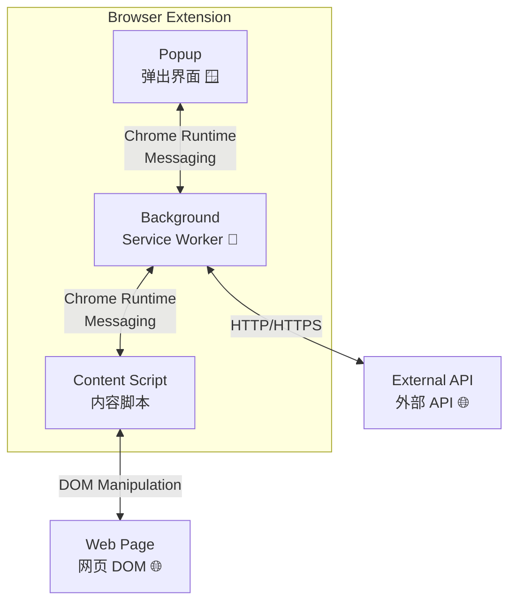
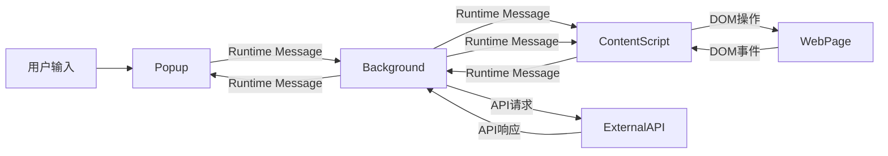
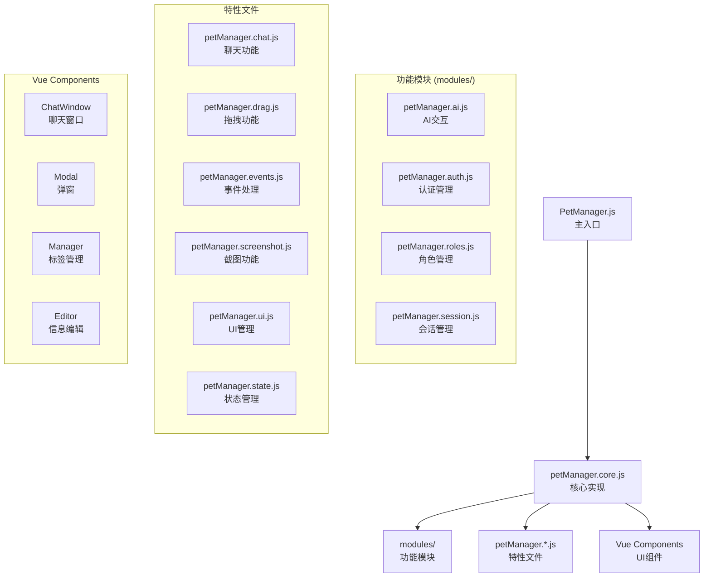
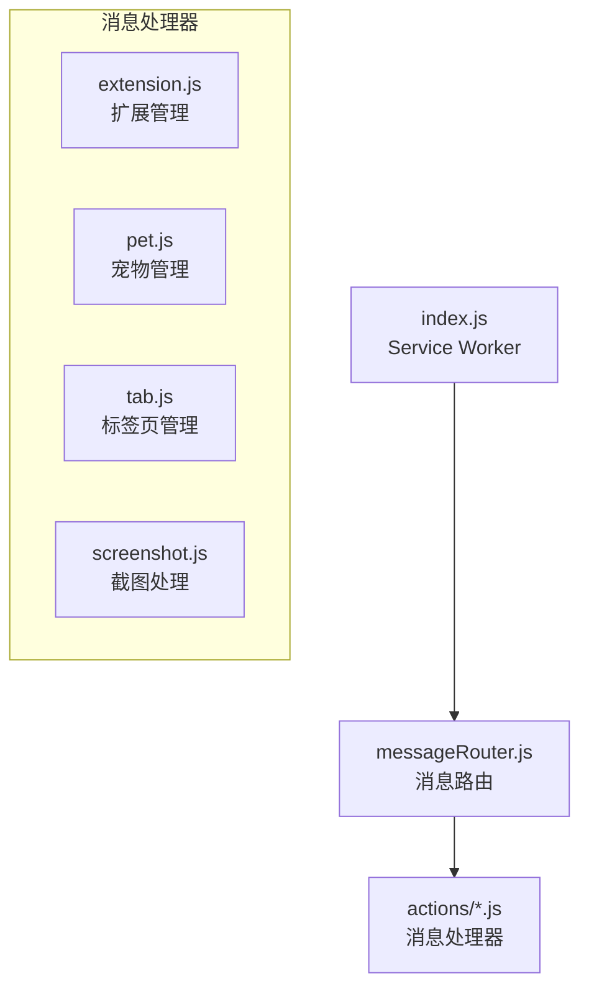
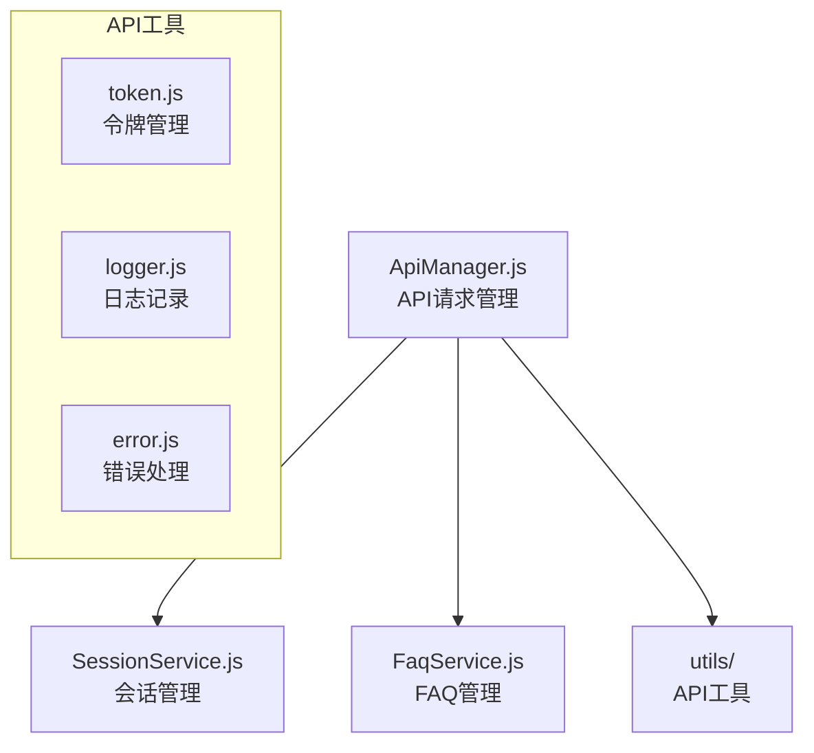
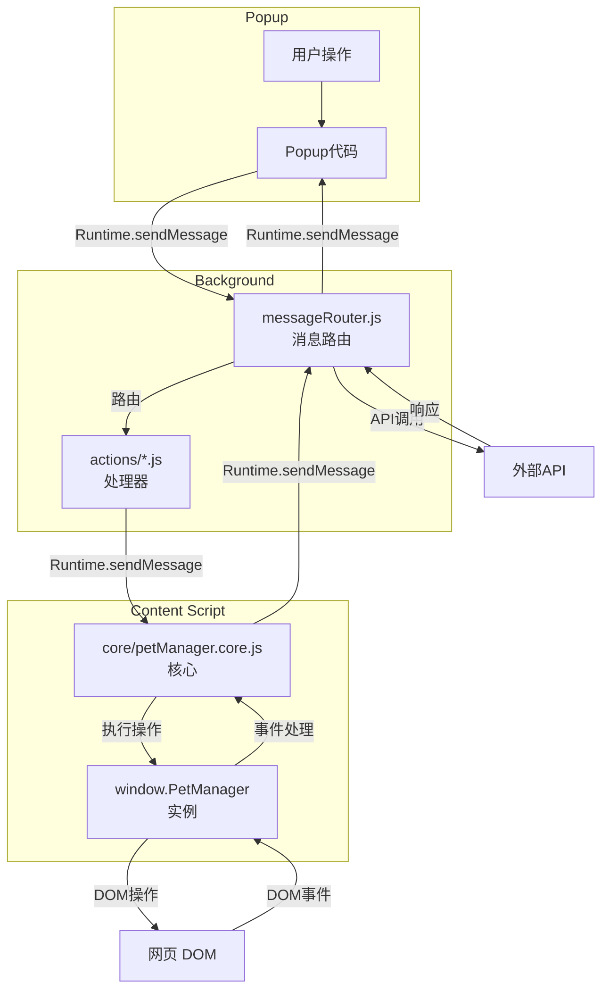

# 温柔陪伴助手

[项目概述](#-项目概述) • [技术栈](#-技术栈) • [配置指南](./配置指南.md) • [快速开始](#-快速开始) • [核心功能](./核心功能/) • [架构设计](#-架构设计) • [组件库](#-组件库) • [API 端点](#-api-端点) • [目录结构](#-目录结构) • [开发规范](#-开发规范) • [故障排除](#-故障排除) • [更新日志](#-更新日志) • [贡献指南](#-贡献指南)

---

## 📋 项目概述

### 项目简介

**温柔陪伴助手**是一款基于 Chrome Manifest V3 的创新浏览器扩展，为网页浏览提供智能虚拟伴侣服务。它革命性地解决了传统浏览器浏览体验单调、缺乏互动性的痛点，通过在网页上添加栩栩如生的虚拟宠物形象和强大的 AI 交互功能，为用户带来全新的浏览体验。

**设计理念**：
- 将陪伴感融入日常浏览
- 让学习和工作变得更有趣
- 提供实用工具提升效率
- 创造一个友好的数字陪伴空间

### 核心功能

- 🐾 **实时虚拟宠物**：在任意网页上显示可爱的虚拟宠物，支持拖拽、缩放和流畅动画效果
- 💬 **AI 对话系统**：流式响应的智能对话，支持 Markdown 渲染和图表解析，提供专业的回答
- 📸 **智能截图工具**：自由选择区域的截图功能，支持一键保存和分享
- 📦 **会话管理**：保存和管理多个对话会话，支持标签分类和搜索
- 📚 **FAQ 知识库**：存储常用问题和答案，支持快速检索和复用
- 🎭 **角色系统**：提供 4 种专业角色（教师、医生、甜品师、警察），每种角色有独特的对话风格
- 📊 **Mermaid 图表渲染**：支持 Mermaid 语法的图表渲染，轻松创建流程图、时序图等

### 应用场景

- 👩‍🎓 **学习辅助**：遇到问题随时咨询，获得专业的解释和指导
- 👨‍💻 **工作助手**：提供快速的信息检索和任务帮助
- 🎯 **个人发展**：记录学习笔记，整理知识体系
- 🎮 **休闲娱乐**：与虚拟宠物互动，缓解压力

---

## 🛠️ 技术栈

| 类别         | 技术/库                     | 用途说明                                  | 选择理由 |
|--------------|------------------------------|-------------------------------------------|---------|
| **核心技术** | 🗼 Vanilla JavaScript        | 核心扩展逻辑（无框架，性能更优）          | 轻量、高性能、无依赖 |
|              | 💚 Vue.js 3                   | 现代化 UI 组件框架                        | 简单易用、性能优秀、生态丰富 |
|              | 🔌 Chrome Extension API (Manifest V3) | 最新浏览器扩展 API                  | 性能更好、更安全、支持 Service Worker |
| **第三方库** | 📝 marked                    | Markdown 快速渲染                          | 轻量、快速、支持 GFM |
|              | 📊 mermaid                   | 专业图表渲染                              | 强大的图表功能、语法简单 |
|              | 🔄 turndown                  | HTML 转 Markdown 工具                      | 转换质量高、配置灵活 |
|              | 🔒 md5                       | 安全哈希计算                              | 简单易用、广泛支持 |

### 架构决策

1. **无框架核心逻辑**：确保扩展启动快速，避免框架加载开销
2. **组件化架构**：Vue 组件库提供可复用的 UI 组件
3. **模块化设计**：核心功能模块化，便于扩展和维护
4. **三层架构**：Popup ↔ Background ↔ Content Script 确保安全性和稳定性

---

## 🛠️ 技术栈

| 类别         | 技术/库                     | 用途说明                                  |
|--------------|------------------------------|-------------------------------------------|
| **核心技术** | 🗼 Vanilla JavaScript        | 核心扩展逻辑（无框架，性能更优）          |
|              | 💚 Vue.js 3                   | 现代化 UI 组件框架                        |
|              | 🔌 Chrome Extension API (Manifest V3) | 最新浏览器扩展 API                  |
| **第三方库** | 📝 marked                    | Markdown 快速渲染                          |
|              | 📊 mermaid                   | 专业图表渲染                              |
|              | 🔄 turndown                  | HTML 转 Markdown 工具                      |
|              | 🔒 md5                       | 安全哈希计算                              |

---
---

## ⚙️ 配置指南

| 配置分类 | 配置说明 |
|---------|---------|
| 🌍 环境配置 | 生产/开发/测试环境灵活切换 |
| 🔌 API 端点配置 | 不同环境的 API 地址配置 |
| 💾 Chrome 存储说明 | 数据存储和读取说明 |
| ⚙️ 功能配置 | AI、角色、快捷键等功能配置 |
| 🔧 高级配置 | 调试模式、权限设置等高级选项 |
| 📝 配置示例 | 完整的配置文件示例 |

详细的配置说明请参考独立文档 [配置指南](./配置指南.md)，该文档提供了全面的参数说明和使用方法，帮助用户根据需求调整扩展行为，从基础的 API 设置到高级的调试选项，覆盖了扩展使用的各个方面。

---

## 🚀 快速开始

[📥 安装步骤](#-安装步骤) • [🎮 开始使用](#-开始使用) • [✅ 验证安装](#-验证安装)

### 📥 安装步骤

#### 方法一：从源码安装

1. **获取源代码**
   ```bash
   git clone https://github.com/effiy/YiPet.git
   cd YiPet
   ```

2. **加载扩展到 Chrome**
   - 🖥️ 打开 Chrome 浏览器（推荐版本 88+）
   - 🔗 在地址栏输入 `chrome://extensions/` 并回车
   - 🔄 确保右上角的"开发者模式"开关已打开
   - 📁 点击"加载已解压的扩展程序"按钮
   - 🎯 选择刚才克隆的仓库根目录

#### 方法二：开发模式使用

```javascript
// 在浏览器控制台中设置开发模式
window.__PET_ENV_MODE__ = 'development'; // 或 'staging'
```

### 🎮 开始使用

1. **启动扩展**
   - 🌐 打开任意普通网页（如 https://example.com）
   - 🐾 您应该能看到虚拟宠物出现在页面右下角
   - 💬 点击宠物打开聊天窗口

2. **基本操作**
   - `Ctrl+Shift+P` (Mac: `Cmd+Shift+P`) - 切换宠物显示/隐藏
   - `Ctrl+Shift+X` (Mac: `Cmd+Shift+X`) - 快速打开聊天窗口
   - 拖拽宠物可以改变位置
   - 双击宠物可以切换角色

3. **首次配置**
   - 点击聊天窗口右上角的设置图标
   - 配置您的 API 访问令牌
   - 选择喜欢的宠物角色
   - 开始与您的虚拟伴侣对话！

### ✅ 验证安装

| 检查项 | 验证方法 | 预期结果 |
|--------|---------|---------|
| 🔍 扩展加载 | 打开 `chrome://extensions/` | 看到"温柔陪伴助手"已启用 |
| ✨ 宠物显示 | 打开 https://example.com | 页面右下角有虚拟宠物 |
| 🎯 聊天功能 | 点击宠物 | 弹出聊天窗口 |
| 📸 截图功能 | 右键点击宠物选择截图 | 出现截图选择框 |
| 🔧 控制台检查 | 按 F12 打开 DevTools | Console 无 JavaScript 错误 |

### 常见快速问题

| 问题 | 快速解决 |
|-----|---------|
| 宠物不显示 | 确保不是 Chrome 内部页面，尝试 https://example.com |
| 聊天无法使用 | 检查 API 令牌是否正确配置 |
| 扩展无法加载 | 确认已启用开发者模式，重新加载扩展 |
| 宠物无法拖拽 | 检查浏览器控制台是否有错误 |

---

## 🎯 核心功能

### 📋 功能分类

| 功能分类 | 功能名称 | 功能说明 |
|---------|---------|---------|
| 🐾 基础功能 | [虚拟宠物展示](./核心功能/虚拟宠物展示.md) | 在网页上显示可爱的虚拟宠物，支持拖拽和动画效果 |
| | [AI 聊天界面](./核心功能/AI聊天界面.md) | 流式响应的 AI 对话体验，支持 Markdown 渲染 |
| | [多种宠物角色](./核心功能/多种宠物角色.md) | 多种可爱的虚拟宠物角色可选，满足不同喜好 |
| 🛠️ 实用工具 | [区域截图功能](./核心功能/区域截图功能.md) | 自由选择截图区域，便捷快速截图 |
| | [键盘快捷键](./核心功能/键盘快捷键.md) | 快捷操作，提高效率 |
| 📦 数据管理 | [会话管理](./核心功能/会话管理.md) | 保存和管理多个对话会话，支持标签分类 |
| | [FAQ 系统](./核心功能/FAQ系统.md) | 保存常用问题和答案，快速检索和复用 |
| 📊 增强功能 | [Mermaid 图表渲染](./核心功能/Mermaid图表渲染.md) | 支持 Mermaid 语法的图表渲染 |

详细的功能说明请参考独立文档 [核心功能文档](./核心功能/)，该文档提供了各个核心功能的详细说明，从基础的虚拟宠物展示到增强的 Mermaid 图表渲染，涵盖了扩展的全部功能特性。

---

## 🏗️ 架构设计

### 🔄 整体架构



扩展采用经典的 Chrome 扩展三层架构，确保架构清晰、功能分离，各层通过 Chrome Runtime Messaging 进行通信。这种架构设计遵循了 Chrome 扩展的最佳实践，实现了高性能和稳定的运行。

### 📊 数据流向



### 📦 核心模块架构

#### 🐾 PetManager (`modules/pet/content/`)

PetManager 是内容脚本的核心控制器，采用模块化架构设计，支持功能扩展：



#### 🔄 Background Script (`modules/extension/background/`)



后台脚本采用事件驱动架构，处理扩展的后台任务和消息路由。

#### 🔗 API Layer (`core/api/`)



API 层负责与外部服务器通信，采用统一的请求管理和错误处理机制。

#### 🎨 Vue Components (`modules/pet/components/`)

Vue 3 组件库提供了可复用的 UI 组件：
- `chat/ChatWindow/` - 主聊天界面
- `modal/` - 设置弹窗（AI、token）
- `manager/` - FAQ 和会话标签管理器
- `editor/` - 会话信息编辑器

### 💬 消息流程



### 🏗️ 架构优势

1. **清晰的层次分离**：三层架构确保了功能模块化，各层职责明确
2. **高性能通信**：使用 Chrome Runtime Messaging 实现异步通信
3. **稳定的后台处理**：Service Worker 提供持久化的后台服务
4. **安全的内容注入**：Content Script 在隔离的上下文中运行
5. **扩展的生命周期管理**：良好的架构支持完整的扩展生命周期

整体架构设计采用分层模块化思想，确保了扩展的可维护性、可扩展性和稳定性，为用户提供了流畅的虚拟宠物交互体验。

详细的架构设计文档请参考：[架构设计文档](./架构设计.md)

---

## 🎨 组件库

### Vue 组件 (`modules/pet/components/`)

| 组件分类 | 组件名称 | 功能说明 |
|---------|---------|---------|
| 💬 聊天组件 | [ChatWindow](./组件库/聊天组件/ChatWindow.md) | 主聊天界面 |
| | [ChatInput](./组件库/聊天组件/ChatInput.md) | 聊天输入框 |
| | [ChatMessage](./组件库/聊天组件/ChatMessage.md) | 聊天消息展示 |
| 🪟 弹窗组件 | [AiSettingsModal](./组件库/弹窗组件/AiSettingsModal.md) | AI 配置弹窗 |
| | [TokenSettingsModal](./组件库/弹窗组件/TokenSettingsModal.md) | Token 设置弹窗 |
| 📦 管理组件 | [FaqManager](./组件库/管理组件/FaqManager.md) | FAQ 管理器 |
| | [SessionTagManager](./组件库/管理组件/SessionTagManager.md) | 会话标签管理器 |
| ✏️ 编辑组件 | [SessionInfoEditor](./组件库/编辑组件/SessionInfoEditor.md) | 会话信息编辑器 |
| 🔧 通用组件 | [LoadingSpinner](./组件库/通用组件/LoadingSpinner.md) | 加载动画 |
| | [Notification](./组件库/通用组件/Notification.md) | 通知组件 |

### 组件特点
- 每个组件有独立的目录结构
- 包含 `.vue` 模板、`.js` 逻辑和 `.css` 样式
- 支持组件间通信和状态管理

---

## 🔗 API 端点

API 端点包含环境配置、认证、会话、FAQ 等接口，支持生产、测试、开发三种环境切换。

### 主要功能
- 🌍 多环境 API 配置（生产/测试/开发）
- 🔐 完整的认证体系（登录、登出、令牌刷新）
- 📦 会话 CRUD 操作（创建、更新、删除、搜索）
- ❓ FAQ 管理（增删改查、标签分类）
- 🤖 AI 对话接口（支持流式和非流式响应）

详细的 API 接口文档请参考：[API 端点文档](./API端点.md)

---

## 📁 目录结构

```
├── manifest.json                    # 📄 扩展配置文件
├── assets/                          # 🎨 全局资源
│   ├── styles/                      # 🎭 样式文件
│   ├── images/                      # 🖼️ 宠物角色图片
│   └── icons/                       # 🏷️ 扩展图标
├── core/                            # ⚙️ 核心系统模块
│   ├── config.js                    # 📋 集中式配置
│   ├── bootstrap/                   # 🚀 启动/初始化代码
│   ├── constants/                   # 📌 常量定义（端点等）
│   ├── api/                         # 🔗 API 集成层
│   │   ├── core/                    # 📡 API 管理器
│   │   ├── services/                # 🔧 API 服务（Session、FAQ）
│   │   └── utils/                   # 🛠️ API 工具（token、logger、error）
│   └── utils/                       # 🔧 全局工具模块
│       ├── api/                     # 🔗 API 特定工具
│       ├── dom/                     # 🌐 DOM 操作
│       ├── storage/                 # 💾 Chrome 存储工具
│       ├── media/                   # 🎥 媒体处理（图片、资源）
│       └── ui/                      # 🎨 UI 工具（加载、通知）
├── libs/                            # 📦 第三方库
├── modules/                         # 📦 功能模块（按功能划分）
│   ├── pet/                         # 🐾 宠物管理模块
│   │   ├── components/              # 🎨 Vue 组件（chat、modal、manager）
│   │   ├── content/                 # 🐾 核心宠物管理器逻辑
│   │   │   ├── core/                # 🐾 主宠物管理器实现
│   │   │   └── modules/             # 🔧 功能模块（ai、auth、roles 等）
│   │   └── styles/                  # 🎭 宠物特定样式
│   ├── chat/                        # 💬 聊天功能模块
│   ├── faq/                         # 📚 FAQ 系统模块
│   ├── session/                     # 💾 会话管理模块
│   ├── screenshot/                  # 📸 截图功能模块
│   ├── mermaid/                     # 📊 Mermaid 图表渲染模块
│   └── extension/                   # 🔌 Chrome 扩展系统
│       ├── background/              # ⚙️ 后台服务 worker
│       ├── content-scripts/         # 🌐 内容脚本
│       ├── popup/                   # 🪟 弹窗 UI
│       └── messaging/               # 🔄 消息路由
└── docs/                            # 📖 文档
```

目录结构采用清晰的模块化组织方式，将核心系统、功能模块和资源文件分离，便于开发和维护。核心系统 `core/` 提供基础服务，功能模块 `modules/` 按业务逻辑划分，资源文件 `assets/` 和第三方库 `libs/` 独立管理，确保了项目的可扩展性和可维护性。

详细的目录结构说明请参考：[目录结构文档](./目录结构.md)

---

## 🛠️ 开发规范

### 规范分类

| 规范分类 | 规范名称 | 规范说明 |
|---------|---------|---------|
| 🔒 安全规范 | [安全规范](./开发规范/安全规范.md) | 安全编码规范和最佳实践 |
| 💻 编码规范 | [编码规范](./开发规范/编码规范.md) | JavaScript 代码规范和风格指南 |
| | [代码结构](./开发规范/代码结构.md) | 项目代码组织和架构规范 |
| | [模块设计](./开发规范/模块设计.md) | 模块设计和架构原则 |
| 🚀 部署规范 | [部署规范](./开发规范/部署规范.md) | 扩展打包和部署流程 |
| | [版本控制](./开发规范/版本控制.md) | 版本号管理和发布策略 |
| 🧪 测试规范 | [测试规范](./开发规范/测试规范.md) | 单元测试、集成测试和验收测试 |
| | [测试策略](./开发规范/测试策略.md) | 测试方法论和最佳实践 |
| ⚠️ 错误处理规范 | [错误处理规范](./开发规范/错误处理规范.md) | 异常处理和错误报告 |
| 📝 日志规范 | [日志规范](./开发规范/日志规范.md) | 日志记录和管理 |
| 📚 文档规范 | [文档规范](./开发规范/文档规范.md) | 文档编写和维护规范 |
| | [API文档](./开发规范/API文档.md) | API 文档编写规范 |
| 🎯 GIT 规范 | [GIT提交规范](./开发规范/GIT提交规范.md) | 提交信息规范和工作流程 |
| | [分支管理](./开发规范/分支管理.md) | 分支策略和代码合并流程 |
| | [代码审查](./开发规范/代码审查.md) | 代码审查流程和规范 |

---

## 🐛 故障排除

### 常见问题

| 问题 | 🔍 可能原因 | ✅ 解决方案 |
|-----|------------|------------|
| **🚫 扩展无法加载** | - 未启用"开发者模式"<br>- `manifest.json` 有语法错误<br>- 目录结构不正确 | - 确认在 `chrome://extensions/` 页面已启用"开发者模式"<br>- 使用 JSON 验证工具检查 `manifest.json`<br>- 确认仓库目录结构完整 |
| **🐾 宠物不显示** | - 浏览器控制台有 JavaScript 错误<br>- 在不支持的网站上（如 Chrome 内部页面）<br>- 扩展权限问题 | - 打开网页 DevTools 查看 Console 是否有错误<br>- 尝试在普通的 HTTPS 网站（如 https://example.com）上使用<br>- 检查扩展权限是否正确配置 |
| **💬 聊天功能无法使用** | - 网络连接问题<br>- 未配置有效的 API 令牌<br>- API 端点配置错误 | - 检查网络连接是否正常<br>- 确认已在设置中配置了有效的 API 令牌<br>- 查看浏览器控制台的错误信息<br>- 确认 API 端点配置正确（检查 `core/config.js`） |

---

## 📝 更新日志

### v1.0.0 (2026-03-18)
- ✨ 初始版本发布
- 🐾 实现虚拟宠物展示和拖拽功能
- 💬 添加 AI 聊天界面，支持流式响应
- 📸 集成智能截图工具，支持区域选择
- 📦 实现会话管理，支持标签分类
- 📚 添加 FAQ 知识库系统
- 🎭 支持 4 种宠物角色（教师、医生、甜品师、警察）
- 📊 集成 Mermaid 图表渲染功能
- 🔧 完善开发规范和文档体系

### v1.0.1 (2026-03-19)
- 📖 优化文档结构
  - 调整核心功能位置
  - 简化快速开始目录
  - 将组件库移到目录结构上面
  - 在目录结构上面添加 API 端点部分

### v1.0.2 (2026-03-21)
- 📝 文档优化
  - 去除一级标题下的描述文字
  - 在故障排除下面添加更新日志
  - 补充项目概述，添加设计理念和应用场景
  - 优化技术栈说明，添加选择理由和架构决策
  - 完善快速开始指南，添加安装方法、基本操作和验证清单

---

## 🤝 贡献指南

我们欢迎任何形式的贡献！

### 开发流程

1. **Fork 仓库** - 在 GitHub 上 Fork 本仓库
2. **创建分支** - 从 main 分支创建新的功能分支
3. **提交更改** - 遵循 GIT 提交规范进行提交
4. **推送到 Fork** - 将更改推送到您的 Fork 仓库
5. **创建 Pull Request** - 从您的分支到 main 分支创建 PR

### 代码规范

- 遵循 [编码规范](./开发规范/编码规范.md)
- 确保代码符合 [安全规范](./开发规范/安全规范.md)
- 提交前运行相关检查
- 添加必要的注释和文档

### 提交信息规范

遵循 [GIT 提交规范](./开发规范/GIT提交规范.md)：

- `feat:` - 新功能
- `fix:` - 修复 bug
- `docs:` - 文档更新
- `style:` - 代码格式调整
- `refactor:` - 重构
- `test:` - 测试相关
- `chore:` - 构建/工具相关

---

## 📄 许可证

本项目采用 MIT 许可证 - 详见 LICENSE 文件

---

## 🔗 相关链接

- [项目主页](https://github.com/effiy/YiPet)
- [问题反馈](https://github.com/effiy/YiPet/issues)
- [功能建议](https://github.com/effiy/YiPet/discussions)
- [开发规范](./开发规范/)
- [API 文档](./API端点.md)

---

## 🙏 致谢

感谢所有为本项目做出贡献的开发者！

---

*最后更新：2026-03-21*
