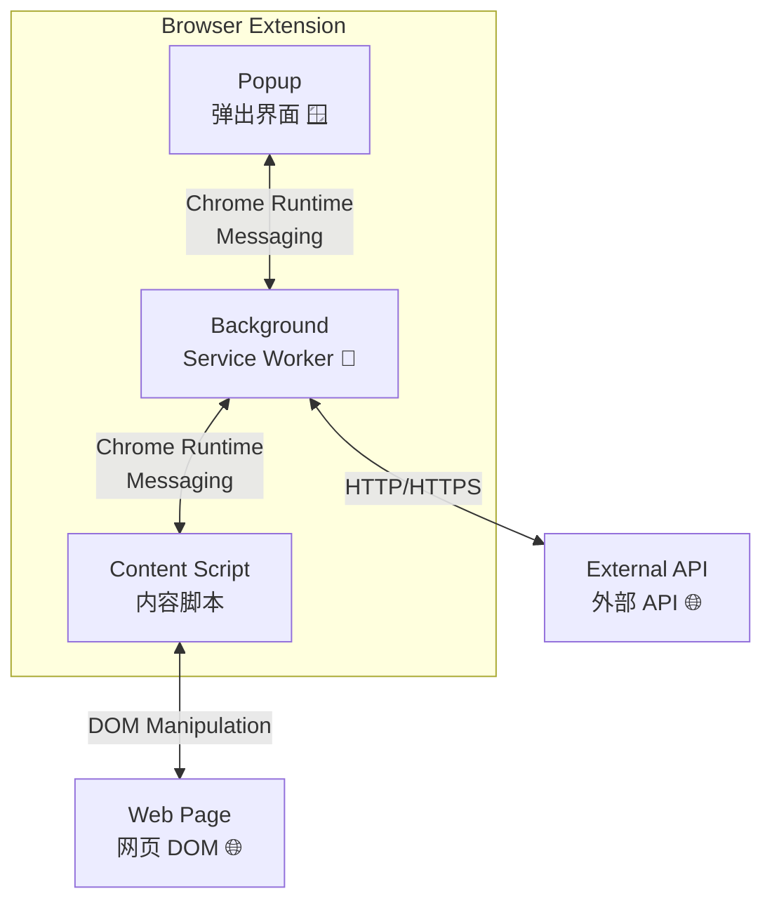
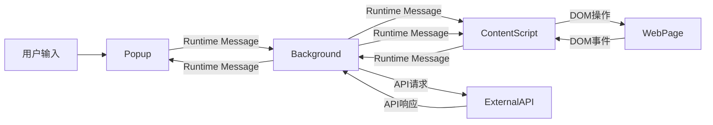
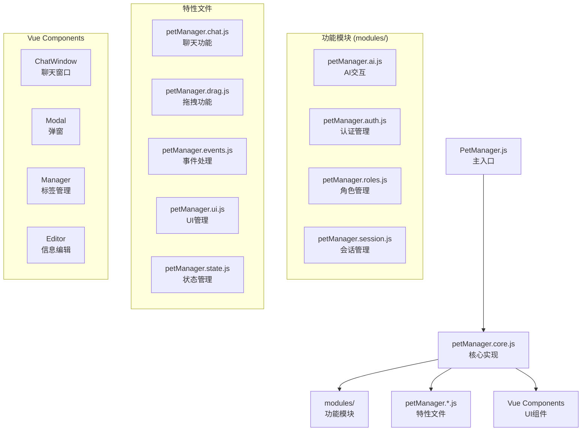
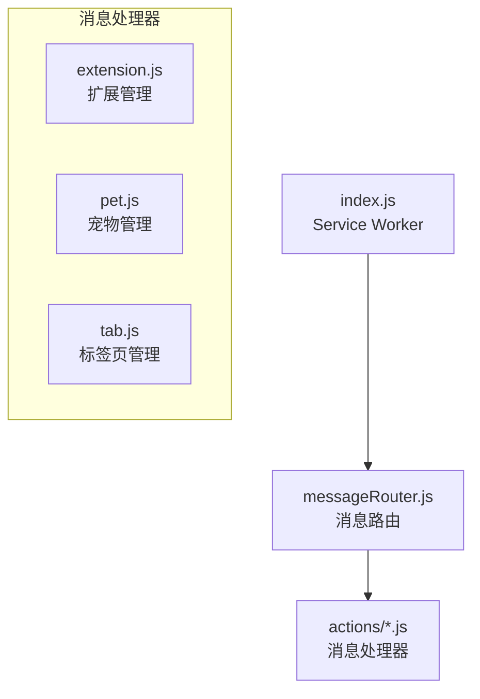
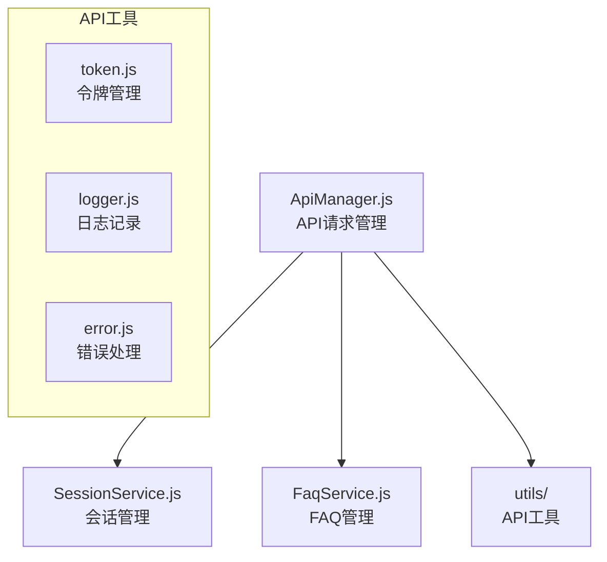
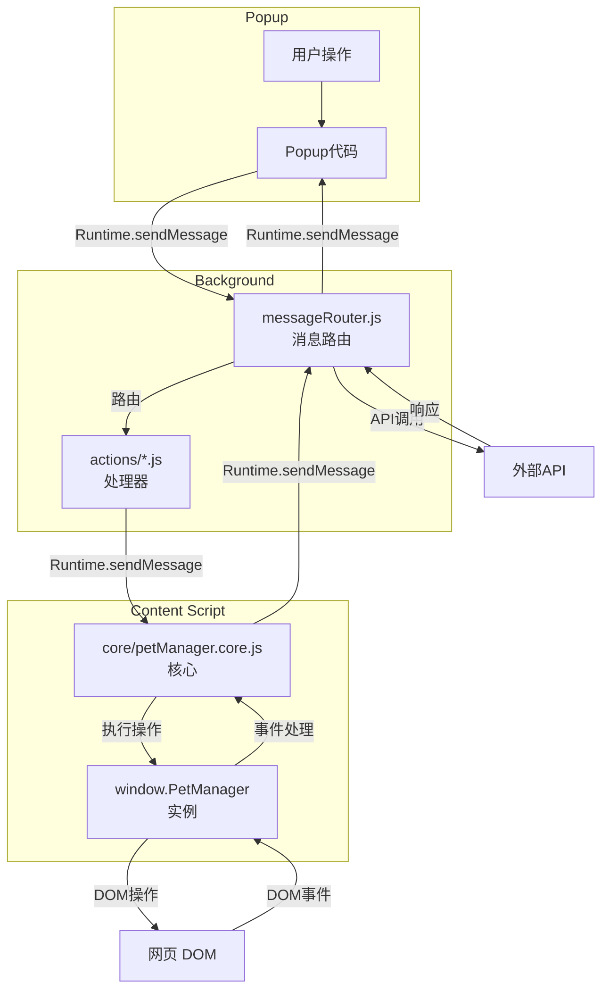

# 温柔陪伴助手 - 详细文档

[返回根目录](../README.md) • [配置指南](./配置指南.md) • [核心功能](./02_核心功能/) • [架构设计](#-架构设计) • [组件库](#-组件库) • [API 端点](#-api-端点) • [目录结构](#-目录结构) • [开发规范](#-开发规范) • [项目运维](#-项目运维)

---

## ⚙️ 配置指南

| 类别 | 配置项 | 默认值 | 说明 |
|------|--------|--------|------|
| 🌍 环境配置 | `__PET_ENV_MODE__` | `production` | 全局环境变量，用于切换环境 |
| | `API_BASE_URL` (生产) | `https://api.effiy.cn` | 正式使用的 API 基础地址 |
| | `API_BASE_URL` (开发) | `http://localhost:8000` | 本地开发调试的 API 地址 |
| | `API_BASE_URL` (测试) | `https://staging.api.effiy.cn` | 测试验证的 API 地址 |
| 🔌 API 配置 | `streamPromptUrl` | `https://api.effiy.cn/prompt` | 流式提示接口 |
| | `promptUrl` | `https://api.effiy.cn/prompt/` | 提示接口 |
| | `yiaiBaseUrl` | `https://api.effiy.cn` | 基础 API 地址 |
| | `faqApiUrl` | `https://api.effiy.cn` | FAQ API 地址 |
| 💾 存储配置 | `petGlobalState` | `{"visible":false,"position":{"x":20,"y":"20%"}}` | 宠物全局状态（可见性、位置、大小、颜色） |
| | `petChatWindowState` | `{"position":{"x":"center","y":"12%"}}` | 聊天窗口状态（位置、大小） |
| | `petSettings` | `{"apiToken":"","aiModel":"gpt-4","autoSave":true}` | 用户设置（API 令牌、AI 配置、角色） |
| | `petDevMode` | `false` | 开发模式标志 |
| 🐾 宠物配置 | `defaultSize` | `260` | 默认宠物大小 |
| | `defaultPosition` | `{ x: 20, y: '20%' }` | 默认宠物位置 |
| 🪟 聊天窗口配置 | `defaultSize.width` | `700` | 默认窗口宽度 |
| | `defaultSize.height` | `720` | 默认窗口高度 |
| 🤖 AI 配置 | `aiModel` | `'gpt-4'` | AI 模型名称 |
| | `aiTemperature` | `0.7` | 生成温度 (0-1) |
| 🔧 高级配置 | `env.flags.debug` | `false` | 调试模式标志 |
| | `env.flags.mockApi` | `false` | Mock API 标志 |
| | `<all_urls>` | 已配置 | 访问所有网站的主机权限 |

---

## 🎯 核心功能

### 🐾 宠物交互

| 功能名称 | 功能说明 | 使用方法 |
|---------|---------|---------|
| [在网页上展示虚拟宠物](./02_核心功能/21_宠物交互/在网页上展示虚拟宠物.md) | 在网页上显示可爱的虚拟宠物，支持拖拽和动画效果 | • 显示/隐藏：`Ctrl+Shift+P`<br>• 移动：按住左键拖动<br>• 位置自动记忆 |
| [选择不同的宠物角色](./02_核心功能/21_宠物交互/选择不同的宠物角色.md) | 提供不同类型的虚拟宠物角色，每个角色有独特的外观和性格特点 | • 打开聊天窗口<br>• 点击角色选择按钮<br>• 选择角色 |
| [宠物拖拽和移动](./02_核心功能/21_宠物交互/宠物拖拽和移动.md) | 支持宠物在网页上的自由拖拽和精确定位 | • 按住宠物左键拖动到目标位置<br>• 位置自动保存到本地存储 |
| [宠物动画效果](./02_核心功能/21_宠物交互/宠物动画效果.md) | 宠物具有丰富的动画效果，包括行走、跳跃、表情变化等 | • 宠物自动播放动画<br>• 交互时会有特殊动画反馈 |
| [宠物设置和个性化](./02_核心功能/21_宠物交互/宠物设置和个性化.md) | 自定义宠物的外观、大小、位置等个性化选项 | • 打开设置 → 宠物设置<br>• 调整宠物大小、颜色等<br>• 重置宠物位置 |
| [使用键盘快捷键操作](./02_核心功能/21_宠物交互/使用键盘快捷键操作.md) | 提供便捷的键盘快捷键操作，提高使用效率 | • 切换宠物显示/隐藏：`Ctrl+Shift+P`<br>• 打开/关闭聊天窗口：`Ctrl+Shift+X` |

### 💬 AI对话

| 功能名称 | 功能说明 | 使用方法 |
|---------|---------|---------|
| [与AI进行智能对话](./02_核心功能/22_AI对话/与AI进行智能对话.md) | 流式响应的 AI 对话体验，支持 Markdown 渲染 | • 打开/关闭：`Ctrl+Shift+X`<br>• 发送：Enter 或点击 |
| [API配置和认证](./02_核心功能/22_AI对话/API配置和认证.md) | 配置API令牌和AI模型参数，确保安全连接 | • 打开设置 → API设置<br>• 输入API令牌<br>• 配置AI模型和参数 |
| [消息解析和处理](./02_核心功能/22_AI对话/消息解析和处理.md) | 解析和处理聊天消息，支持复杂交互 | • 自动解析消息内容<br>• 处理特殊指令和功能<br>• 支持消息格式化 |
| [Markdown格式渲染](./02_核心功能/22_AI对话/Markdown格式渲染.md) | 聊天消息支持 Markdown 格式渲染，包括代码高亮 | • 发送包含 Markdown 语法的消息<br>• 支持标题、列表、代码块、表格等 |
| [渲染Mermaid图表](./02_核心功能/22_AI对话/渲染Mermaid图表.md) | 支持 Mermaid 语法的图表渲染功能（流程图、时序图、甘特图等） | • 使用三个反引号包裹 Mermaid 代码块发送<br>• 示例：```mermaid graph TD A[开始] --> B``` |

### 📦 数据管理

| 功能名称 | 功能说明 | 使用方法 |
|---------|---------|---------|
| [管理对话会话](./02_核心功能/23_数据管理/管理对话会话.md) | 保存和管理多个对话会话，支持标签分类 | • 创建：会话列表 → 新建会话<br>• 切换：直接点击<br>• 编辑：点击编辑按钮 |
| [管理和使用FAQ知识库](./02_核心功能/23_数据管理/管理和使用FAQ知识库.md) | 保存常用问题和答案，快速检索和复用 | • 打开 FAQ 管理器<br>• 点击"添加 FAQ"<br>• 输入问题和答案<br>• 可选添加标签 |
| [会话标签管理](./02_核心功能/23_数据管理/会话标签管理.md) | 为对话会话添加和管理标签，便于分类和搜索 | • 在会话编辑中添加标签<br>• 支持标签的创建和删除<br>• 按标签筛选会话 |
| [FAQ标签管理](./02_核心功能/23_数据管理/FAQ标签管理.md) | 为FAQ条目添加和管理标签，提高检索效率 | • 在FAQ编辑中添加标签<br>• 支持标签的创建和删除<br>• 按标签筛选FAQ |
| [会话编辑功能](./02_核心功能/23_数据管理/会话编辑功能.md) | 编辑会话信息，包括标题、标签和内容 | • 点击会话信息<br>• 进行编辑和修改<br>• 保存更改 |
| [聊天消息管理](./02_核心功能/23_数据管理/聊天消息管理.md) | 管理聊天消息，支持搜索、筛选和操作 | • 搜索聊天消息<br>• 复制、删除、转发消息<br>• 查看消息历史记录 |

### 🛠️ 工具集成

| 功能名称 | 功能说明 | 使用方法 |
|---------|---------|---------|
| [媒体内容管理](./02_核心功能/24_工具集成/媒体内容管理.md) | 管理聊天中的媒体内容，包括图片和截图 | • 插入图片到聊天<br>• 管理截图内容<br>• 支持图片展示和操作 |
| [UI组件管理](./02_核心功能/24_工具集成/UI组件管理.md) | 管理应用程序的 UI 组件，确保用户界面一致性 | • 统一管理 UI 组件<br>• 确保响应式设计<br>• 支持主题切换 |
| [页面内容提取和分析](./02_核心功能/24_工具集成/页面内容提取和分析.md) | 自动提取和分析网页内容，提供相关信息支持 | • 自动分析页面内容<br>• 提供上下文相关信息<br>• 支持关键词提取 |
| [页面上下文编辑器](./02_核心功能/24_工具集成/页面上下文编辑器.md) | 提供页面上下文的编辑和预览功能，支持 Markdown 格式 | • 打开上下文编辑器<br>• 编辑页面信息<br>• 预览和保存修改 |
| [企微机器人集成](./02_核心功能/24_工具集成/企微机器人集成.md) | 集成企微机器人功能，支持消息推送和交互 | • 配置企微机器人<br>• 设置消息推送规则<br>• 与机器人进行互动 |
| [开发模式和调试](./02_核心功能/24_工具集成/开发模式和调试.md) | 提供开发模式和调试功能，帮助开发者定位问题 | • 在控制台启用开发模式<br>• 查看详细的日志信息<br>• 测试功能开关 |

---

### 🎭 宠物角色详情

| 角色 | 定位 | 性格特点 | 适用场景 |
|------|------|----------|----------|
| 📚 教师 | 知识渊博的学习伙伴 | 耐心、智慧、乐于助人 | 学习辅导、知识问答 |
| 👨‍⚕️ 医生 | 关心健康的医疗顾问 | 专业、关怀、温和 | 健康咨询、医疗建议 |
| 👨‍🍳 甜品师 | 甜蜜温馨的生活伴侣 | 温柔、甜美、乐观 | 日常聊天、生活建议 |
| 👮 警察 | 正直可靠的安全卫士 | 严谨、可靠、果断 | 安全咨询、问题解决 |

---

### ⌨️ 快捷键参考

| 功能 | Windows/Linux | Mac | 描述 |
|------|--------------|-----|------|
| 切换宠物显示/隐藏 | `Ctrl+Shift+P` | `Cmd+Shift+P` | 快速显示或隐藏宠物 |
| 打开/关闭聊天窗口 | `Ctrl+Shift+X` | `Cmd+Shift+X` | 快速打开或关闭聊天 |

**自定义快捷键：** 打开 `chrome://extensions/` → 点击"键盘快捷键" → 找到"温柔陪伴助手"扩展 → 修改或添加快捷键

---

## 🏗️ 架构设计

### 🔄 整体架构



扩展采用经典的 Chrome 扩展三层架构，确保架构清晰、功能分离，各层通过 Chrome Runtime Messaging 进行通信。这种架构设计遵循了 Chrome 扩展的最佳实践，实现了高性能和稳定的运行。

### 📊 数据流向



### 📦 核心模块架构

#### 🐾 PetManager (`modules/pet/content/`)

PetManager 是内容脚本的核心控制器，采用模块化架构设计，支持功能扩展：



#### 🔄 Background Script (`modules/extension/background/`)



后台脚本采用事件驱动架构，处理扩展的后台任务和消息路由。

#### 🔗 API Layer (`core/api/`)



API 层负责与外部服务器通信，采用统一的请求管理和错误处理机制。

#### 🎨 Vue Components (`modules/pet/components/`)

Vue 3 组件库提供了可复用的 UI 组件：
- `chat/ChatWindow/` - 主聊天界面
- `modal/` - 设置弹窗（AI、token）
- `manager/` - FAQ 和会话标签管理器
- `editor/` - 会话信息编辑器

### 💬 消息流程



### 🏗️ 架构优势

1. **清晰的层次分离**：三层架构确保了功能模块化，各层职责明确
2. **高性能通信**：使用 Chrome Runtime Messaging 实现异步通信
3. **稳定的后台处理**：Service Worker 提供持久化的后台服务
4. **安全的内容注入**：Content Script 在隔离的上下文中运行
5. **扩展的生命周期管理**：良好的架构支持完整的扩展生命周期

整体架构设计采用分层模块化思想，确保了扩展的可维护性、可扩展性和稳定性，为用户提供了流畅的虚拟宠物交互体验。

详细的架构设计文档请参考：[架构设计文档](./架构设计.md)

---

## 🎨 组件库

### Vue 组件 (`modules/pet/components/`)

| 组件分类 | 组件名称 | 功能说明 |
|---------|---------|---------|
| 💬 聊天组件 | [聊天窗口](./01_组件库/11_聊天组件/聊天窗口.md) | 主聊天界面 |
| | [聊天输入框](./01_组件库/11_聊天组件/聊天输入框.md) | 聊天输入框 |
| | [聊天消息](./01_组件库/11_聊天组件/聊天消息.md) | 聊天消息展示 |
| 🪟 弹窗组件 | [AI设置弹窗](./01_组件库/12_弹窗组件/AI设置弹窗.md) | AI 配置弹窗 |
| | [令牌设置弹窗](./01_组件库/12_弹窗组件/令牌设置弹窗.md) | Token 设置弹窗 |
| 📦 管理组件 | [FAQ管理器](./01_组件库/13_管理组件/FAQ管理器.md) | FAQ 管理器 |
| | [会话标签管理器](./01_组件库/13_管理组件/会话标签管理器.md) | 会话标签管理器 |
| ✏️ 编辑组件 | [会话信息编辑器](./01_组件库/14_编辑组件/会话信息编辑器.md) | 会话信息编辑器 |
| 🔧 通用组件 | [加载动画](./01_组件库/15_通用组件/加载动画.md) | 加载动画 |
| | [通知组件](./01_组件库/15_通用组件/通知组件.md) | 通知组件 |

### 组件特点
- 每个组件有独立的目录结构
- 包含 `.vue` 模板、`.js` 逻辑和 `.css` 样式
- 支持组件间通信和状态管理

---

## 🔗 API 端点

API 端点包含环境配置、认证、会话、FAQ 等接口，支持生产、测试、开发三种环境切换。

### 主要功能
- 🌍 多环境 API 配置（生产/测试/开发）
- 🔐 完整的认证体系（登录、登出、令牌刷新）
- 📦 会话 CRUD 操作（创建、更新、删除、搜索）
- ❓ FAQ 管理（增删改查、标签分类）
- 🤖 AI 对话接口（支持流式和非流式响应）

详细的 API 接口文档请参考：[API 端点文档](./API端点.md)

---

## 📁 目录结构

```
├── manifest.json                    # 📄 扩展配置文件
├── assets/                          # 🎨 全局资源
│   ├── styles/                      # 🎭 样式文件
│   ├── images/                      # 🖼️ 宠物角色图片
│   └── icons/                       # 🏷️ 扩展图标
├── core/                            # ⚙️ 核心系统模块
│   ├── config.js                    # 📋 集中式配置
│   ├── bootstrap/                   # 🚀 启动/初始化代码
│   ├── constants/                   # 📌 常量定义（端点等）
│   ├── api/                         # 🔗 API 集成层
│   │   ├── core/                    # 📡 API 管理器
│   │   ├── services/                # 🔧 API 服务（Session、FAQ）
│   │   └── utils/                   # 🛠️ API 工具（token、logger、error）
│   └── utils/                       # 🔧 全局工具模块
│       ├── api/                     # 🔗 API 特定工具
│       ├── dom/                     # 🌐 DOM 操作
│       ├── storage/                 # 💾 Chrome 存储工具
│       ├── media/                   # 🎥 媒体处理（图片、资源）
│       └── ui/                      # 🎨 UI 工具（加载、通知）
├── libs/                            # 📦 第三方库
├── modules/                         # 📦 功能模块（按功能划分）
│   ├── pet/                         # 🐾 宠物管理模块
│   │   ├── components/              # 🎨 Vue 组件（chat、modal、manager）
│   │   ├── content/                 # 🐾 核心宠物管理器逻辑
│   │   │   ├── core/                # 🐾 主宠物管理器实现
│   │   │   └── modules/             # 🔧 功能模块（ai、auth、roles 等）
│   │   └── styles/                  # 🎭 宠物特定样式
│   ├── chat/                        # 💬 聊天功能模块
│   ├── faq/                         # 📚 FAQ 系统模块
│   ├── session/                     # 💾 会话管理模块
│   ├── mermaid/                     # 📊 Mermaid 图表渲染模块
│   └── extension/                   # 🔌 Chrome 扩展系统
│       ├── background/              # ⚙️ 后台服务 worker
│       ├── content-scripts/         # 🌐 内容脚本
│       ├── popup/                   # 🪟 弹窗 UI
│       └── messaging/               # 🔄 消息路由
└── docs/                            # 📖 文档
    ├── 项目运维/                       # 🏗️ 项目运维文档（原devOps）
```

目录结构采用清晰的模块化组织方式，将核心系统、功能模块和资源文件分离，便于开发和维护。核心系统 `core/` 提供基础服务，功能模块 `modules/` 按业务逻辑划分，资源文件 `assets/` 和第三方库 `libs/` 独立管理，确保了项目的可扩展性和可维护性。

详细的目录结构说明请参考：[目录结构文档](./目录结构.md)

---

## 🛠️ 开发规范

| 规范分类 | 规范名称 | 规范说明 |
|---------|---------|---------|
| 代码质量 | [编码规范](./00_开发规范/01_代码质量/编码规范.md) | JavaScript 代码规范和风格指南 |
| | [代码结构](./00_开发规范/01_代码质量/代码结构.md) | 项目代码组织和架构规范 |
| | [模块设计](./00_开发规范/01_代码质量/模块设计.md) | 模块设计和架构原则 |
| | [代码审查](./00_开发规范/01_代码质量/代码审查.md) | 代码审查流程和规范 |
| 流程管理 | [版本控制](./00_开发规范/02_流程管理/版本控制.md) | 版本号管理和发布策略 |
| | [GIT提交规范](./00_开发规范/02_流程管理/GIT提交规范.md) | 提交信息规范和工作流程 |
| | [分支管理](./00_开发规范/02_流程管理/分支管理.md) | 分支策略和代码合并流程 |
| | [部署规范](./00_开发规范/02_流程管理/部署规范.md) | 扩展打包和部署流程 |
| 质量保障 | [安全规范](./00_开发规范/03_质量保障/安全规范.md) | 安全编码规范和最佳实践 |
| | [测试规范](./00_开发规范/03_质量保障/测试规范.md) | 单元测试、集成测试和验收测试 |
| | [测试策略](./00_开发规范/03_质量保障/测试策略.md) | 测试方法论和最佳实践 |
| | [错误处理规范](./00_开发规范/03_质量保障/错误处理规范.md) | 异常处理和错误报告 |
| 文档与日志 | [文档规范](./00_开发规范/04_文档与日志/文档规范.md) | 文档编写和维护规范 |
| | [API文档](./00_开发规范/04_文档与日志/API文档.md) | API 文档编写规范 |
| | [日志规范](./00_开发规范/04_文档与日志/日志规范.md) | 日志记录和管理 |

---

## 🏗️ 项目运维

### 任务状态说明：✅ 已完成 | 🔄 进行中 | 📋 待开始

### 运维列表

| 运维分类 | 运维名称 | 运维说明 |
|---------|---------|---------|
| 功能任务 | ✅ 移除会话管理的ZIP导入导出功能 | 移除会话管理的ZIP导入导出功能 |
| | ✅ 移除聊天记录导出为图片功能 | 移除聊天记录导出为图片功能 |
| | 🔄 移除智能截图工具功能 | 移除智能截图工具功能 |
| | 📋 优化聊天界面布局 | 优化聊天窗口布局，提升响应式体验 |
| | 📋 增强FAQ搜索功能 | 增强FAQ搜索功能，支持模糊搜索 |
| 专项任务 | 📋 Vue 3组件库升级 | 将Vue组件从Options API升级到Composition API |
| | 📋 升级marked库到最新版本 | 升级marked库到最新版本，获取新特性和安全修复 |
| | 📋 添加TypeScript支持 | 逐步为核心模块添加TypeScript类型定义 |
| | 📋 API请求安全加固 | 对API请求进行安全加固，包括请求验证等 |
| 重构任务 | 📋 消息模块架构优化 | 将消息处理逻辑从主模块中分离，独立成单独的消息服务模块 |
| | 📋 优化PetManager模块代码组织 | 优化PetManager模块代码组织，建立清晰的目录结构 |
| | 📋 统一错误处理机制 | 建立统一的错误处理机制，规范错误码定义和错误信息格式 |
| | 📋 DOM操作优化 | 优化频繁的DOM操作，减少重绘和回流，提升页面响应速度 |


详细内容请参考：[项目运维文档](./03_项目运维/README.md)

---

*最后更新：2026-03-22*
