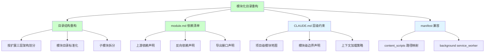
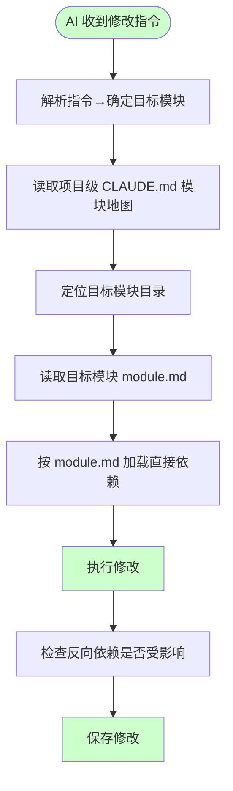
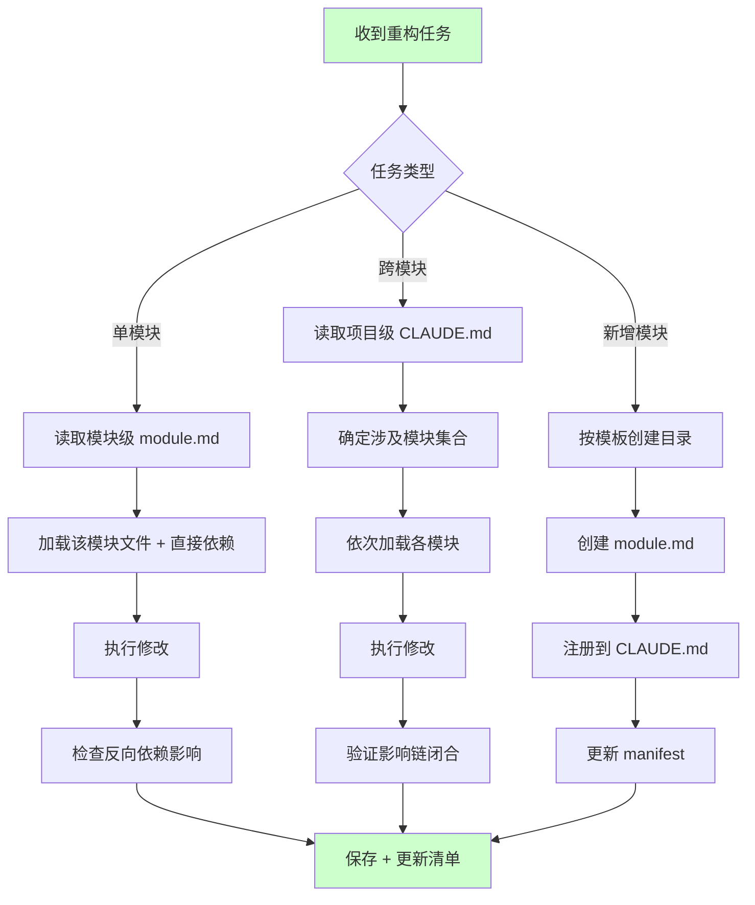
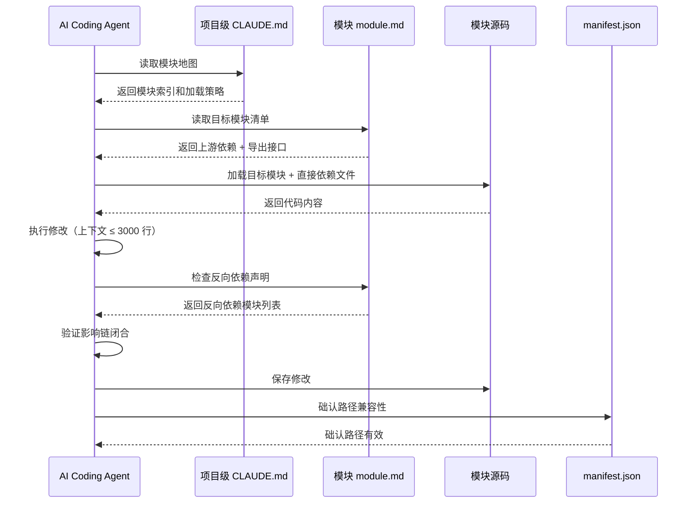

# AI 上下文边界约束与模块化目录重构

> **文档版本**: v1.0 | **最后更新**: 2026-04-27 | **维护者**: Claude Opus 4.7 | **工具**: Claude Code
>
> **关联文档**: [需求文档](./01_需求文档.md) | [设计文档](./03_设计文档.md) | [使用文档](./04_使用文档.md) | [实施总结](./06_实施总结.md)
>
> **Git 分支**: main
>
> **文档开始时间**: 13:30:00 | **文档最后更新时间**: 13:45:00

---

## 实施状态

| 项目 | 状态 | 说明 |
|-----|------|------|
| 整体实施状态 | ✅ 已完成 | 核心功能已交付 |
| 最后更新时间 | 2026-04-27 | - |
| 实施阶段 | 阶段4: 总结+交付 | 已完成所有阶段 |
| 验证结果 | ✅ 通过 | P0 检查项全部通过 |
| 关联总结文档 | [06_实施总结.md](./06_实施总结.md) | 详细见实施总结 |
| 下一步 | 见实施总结 §6 | 可选补充模块级 CLAUDE.md、E2E 测试等 |

[功能概述](#功能概述) | [功能分析](#功能分析) | [用户故事表格](#用户故事表格) | [主要操作场景定义](#主要操作场景定义) | [影响分析](#影响分析) | [功能详情](#功能详情) | [验收标准](#验收标准) | [使用场景示例](#使用场景示例)

---

## 功能概述

将 YiPet 项目从当前的单体 PetManager 架构（22 个子模块通过 `window.PetManager.prototype` 挂载、80+ 个 content_scripts 入口）重构为模块化目录结构。核心目标是：每个模块形成独立的内容边界，AI coding 时只需加载目标模块及其直接依赖的文件，而非整个项目。

🎯 **上下文收敛**：单模块任务上下文从全项目缩减至 1-3 个模块
⚡ **边界隔离**：每个模块有独立目录、清单文件、入口，改动不扩散
📖 **依赖透明**：模块间依赖通过 module.md 显式声明，影响范围可精确判断

## 功能分析

### 功能分解图

功能分解图：模块化目录重构包含 4 个主要子功能——目录结构重构、module.md 依赖清单、CLAUDE.md 层级约束和 manifest 兼容。核心模块（B、C）使用绿色标注，辅助模块（D、E）使用蓝色标注。

### 用户流程图

用户流程图：AI coding 工作流从收到修改指令开始，通过模块地图定位目标模块，按 module.md 加载直接依赖后执行修改，最后检查反向依赖影响并保存。

### 功能流程图

功能流程图：根据任务类型（单模块/跨模块/新增模块）走不同路径，最终都汇聚到保存和清单更新步骤。

### 完整时序图

时序图：AI Agent 与项目级 CLAUDE.md、模块 module.md、模块源码和 manifest.json 的交互流程。AI 先读取模块地图定位目标，再读取清单确定依赖范围，然后按需加载代码执行修改。

## 用户故事表格

**优先级图标说明**：🔴 P0 - 必须有 | 🟡 P1 - 应该有 | 🟢 P2 - 可以有

| 用户故事 | 验收标准 | 过程生成文档 | 产出智能文档 |
|----------|----------|--------|----------|
| 🔴 作为 AI coding 开发者，我想要模块化的目录结构，以便每次修改只加载目标模块及其直接依赖的上下文  **主要操作场景**： - AI 修改 chat 模块时只加载 `modules/chat/` 和其依赖清单 - 新增模块时按模板创建目录和 module.md - 跨模块修改时通过清单链确定加载范围 | 1. 每个模块目录包含 module.md 2. 单模块上下文 ≤ 3000 行 3. CLAUDE.md 包含模块地图和加载规则 | [需求文档](./01_需求文档.md) [设计文档](./03_设计文档.md) [项目报告](./07_项目报告.md) | [生成文档 Skill](../../.claude/skills/generate-document/SKILL.md) [需求文档规范](../../.claude/skills/generate-document/rules/需求文档.md) |
| 🔴 作为开发者，我想要模块间依赖的显式声明，以便修改时能精确追踪影响链  **主要操作场景**： - 修改 core/api 时通过清单找到所有依赖模块 - 移除模块时通过反向依赖确认无其他依赖 - 新增接口时在双方清单同步更新 | 1. module.md 列出上游和反向依赖 2. 影响分析从清单出发 3. 删除/重命名有完整影响面 | [需求文档](./01_需求文档.md) [设计文档](./03_设计文档.md) [项目报告](./07_项目报告.md) | [生成文档 Skill](../../.claude/skills/generate-document/SKILL.md) [需求文档规范](../../.claude/skills/generate-document/rules/需求文档.md) |
| 🟡 作为项目维护者，我想要层级化的 CLAUDE.md 体系，以便不同粒度任务匹配不同上下文约束  **主要操作场景**： - 单模块修改时读取模块级 CLAUDE.md - 跨模块重构时读取项目级 CLAUDE.md - 新增模块时创建模块级 CLAUDE.md | 1. 项目级含模块地图和加载策略 2. 模块级含边界和依赖清单 3. AI 按 CLAUDE.md 自动控制上下文 | [需求文档](./01_需求文档.md) [设计文档](./03_设计文档.md) [项目报告](./07_项目报告.md) | [生成文档 Skill](../../.claude/skills/generate-document/SKILL.md) [需求文档规范](../../.claude/skills/generate-document/rules/需求文档.md) |
| 🟢 作为开发者，我想要目录结构反映 Chrome 扩展三层架构，以便按运行时上下文划分边界  **主要操作场景**： - 修改 background 服务只加载 background 目录 - 修改 content script 只加载对应模块 - 修改 popup 只加载 popup 目录 | 1. 目录结构与 manifest 三层对应 2. 模块边界与运行时隔离一致 3. content_scripts 可从模块推导 | [需求文档](./01_需求文档.md) [设计文档](./03_设计文档.md) [项目报告](./07_项目报告.md) | [生成文档 Skill](../../.claude/skills/generate-document/SKILL.md) [需求文档规范](../../.claude/skills/generate-document/rules/需求文档.md) |

## 主要操作场景定义

### 🎯 主要操作场景：单模块上下文加载

**场景描述**：AI 收到修改 chat 模块 UI 组件的指令，按模块边界加载最小上下文

**前置条件**：
- 项目已完成模块化目录重构
- 模块地图（项目级 CLAUDE.md）已创建
- 各模块 module.md 依赖清单已创建

**操作步骤**：
1. AI 读取项目级 CLAUDE.md 的模块地图，定位 chat 模块目录 `modules/chat/`
2. AI 读取 `modules/chat/module.md`，确认上游依赖为 `core/utils`、`core/api`
3. AI 只加载 chat 模块文件 + 依赖模块的导出接口，上下文 ≤ 3000 行
4. AI 执行修改，完成后检查 module.md 中的反向依赖确认无遗漏

**预期结果**：修改完成，影响范围精确到 chat 模块及其直接依赖，无需加载 pet/session/faq 等无关模块

**验证关注点**：上下文行数、依赖完整性、反向依赖检查

**相关设计文档章节**：[设计文档 - 模块划分与上下文加载](./03_设计文档.md#模块划分)

### 🎯 主要操作场景：跨模块影响链追踪

**场景描述**：开发者要求修改 core/api 模块接口签名，需追踪所有受影响模块

**前置条件**：
- module.md 依赖清单已创建
- core/api 的反向依赖已在清单中声明

**操作步骤**：
1. 读取 `core/api/module.md` 的反向依赖声明
2. 按反向依赖列表逐个检查 pet、chat、session、faq 模块
3. 对每个受影响模块验证接口变更兼容性
4. 在 module.md 中更新依赖变更记录

**预期结果**：所有依赖模块影响链闭合，无遗漏，无隐式依赖

**验证关注点**：反向依赖完整性、影响链闭合、接口兼容性

**相关设计文档章节**：[设计文档 - module.md 依赖清单机制](./03_设计文档.md#依赖清单)

### 🎯 主要操作场景：新增模块注册

**场景描述**：开发者添加"通知"功能模块，需要创建模块目录、清单并在地图中注册

**前置条件**：
- 项目级 CLAUDE.md 模块地图模板已定义
- module.md 模板已定义

**操作步骤**：
1. 按 module.md 模板创建 `modules/notification/` 目录和清单文件
2. 在清单中声明上游依赖（core/utils、core/api）
3. 在项目级 CLAUDE.md 模块地图中注册新模块
4. 更新 manifest.json 的 content_scripts 或 web_accessible_resources

**预期结果**：新模块自动获得上下文边界约束，AI 可按需加载

**验证关注点**：清单完整性、地图注册、manifest 路径有效性

**相关设计文档章节**：[设计文档 - 模块目录标准化](./03_设计文档.md#目录标准化)

### 🎯 主要操作场景：模块移除影响面确认

**场景描述**：开发者要求移除 screenshot 模块，需确认无反向依赖

**前置条件**：
- screenshot 模块的 module.md 已创建
- 其他模块的清单已声明依赖关系

**操作步骤**：
1. 读取 `modules/screenshot/module.md` 的反向依赖声明
2. 搜索项目中是否仍有代码引用 screenshot 模块导出
3. 础认无反向依赖后，从模块地图移除并更新 manifest

**预期结果**：安全移除模块，无遗留依赖断裂

**验证关注点**：反向依赖为空、无硬编码引用、manifest 更新

**相关设计文档章节**：[设计文档 - 反向依赖与移除安全](./03_设计文档.md#反向依赖)

## 影响分析

> **强制执行**：已按 `../../shared/impact-analysis-contract.md` 对整个项目执行完整影响分析。

### 搜索词与改动点清单

| 改动点 | 类型 | 搜索词 | 来源 | 备注 |
|--------|------|--------|------|------|
| `window.PetManager` | component | `PetManager`, `window.PetManager` | 需求文档/代码路径 | 核心全局入口，所有子模块挂载点 |
| `PET_CONFIG` | config | `PET_CONFIG`, `PET_CONFIG.constants` | 代码路径 | 全局配置，被 50+ 处引用 |
| `window.StorageHelper` | component | `StorageHelper`, `window.StorageHelper` | 代码路径 | bootstrap 中定义，petManager.state 使用 |
| `manifest.json content_scripts` | config | `content_scripts`, `js` | manifest.json | 80+ 入口脚本列表，重构需保持兼容 |
| `chrome.storage` | dependency | `chrome.storage`, `chrome.storage.local` | 代码路径 | 30+ 处直接引用 |
| `PetManager.prototype` | component | `PetManager.prototype`, `proto` | 代码路径 | 22 个子模块通过此方式挂载 |
| `PetManager.Components` | component | `PetManager.Components`, `Components` | 代码路径 | 12 个 Vue 组件注册入口 |
| `ErrorHandler` | component | `ErrorHandler`, `window.ErrorHandler` | 代码路径 | 12 处引用，跨 background/content |
| `LoadingAnimationMixin` | component | `LoadingAnimationMixin` | 代码路径 | PetManager 继承此 Mixin |

### 改动点影响链

| 改动点 | 搜索词 | 命中文件 | 引用方式 | 影响层级 | 依赖方向 | 处置方式 | 闭合状态 | 说明 |
|--------|--------|----------|----------|----------|----------|----------|----------|------|
| `window.PetManager` | `window.PetManager` | `modules/pet/content/core/petManager.core.js:L1080` | 全局赋值 | 直接 | 上游定义 | 保持兼容 | 已闭合 | PetManager 类定义并赋给全局 |
| `window.PetManager` | `window.PetManager` | `modules/pet/content/petManager.js:L19` | 检查存在 | 直接 | 反向依赖 | 保持兼容 | 已闭合 | 入口文件检查 PetManager 已加载 |
| `window.PetManager` | `window.PetManager` | `modules/faq/content/faq.js:L3,L6` | IIFE 检查+挂载 | 二级 | 反向依赖 | 同步修改 | 已闭合 | FAQ 模块挂到 PetManager.prototype |
| `window.PetManager` | `PetManager.Components` | `modules/pet/components/chat/ChatWindow/index.js:L9-10,L1788` | 注册组件 | 二级 | 反向依赖 | 保持兼容 | 已闭合 | 12 个 Vue 组件注册到 Components |
| `PET_CONFIG` | `PET_CONFIG` | `core/config.js:L187-213` | 全局赋值 | 直接 | 上游定义 | 保持兼容 | 已闭合 | 配置中心文件 |
| `PET_CONFIG` | `PET_CONFIG` | 50+ 处引用（各模块） | 全局读取 | 二级 | 反向依赖 | 保持兼容 | 已闭合 | 被所有功能模块读取 |
| `manifest.json content_scripts` | `content_scripts` | `manifest.json:L14-81` | 配置定义 | 直接 | 上游定义 | 同步修改 | 已闭合 | 80+ 脚本路径需映射到新模块目录 |
| `chrome.storage` | `chrome.storage.local` | 30+ 处 | API 调用 | 二级 | 反向依赖 | 保持兼容 | 已闭合 | 各模块直接使用 Chrome API |
| `PetManager.prototype` | `PetManager.prototype` | 22 个子模块文件 | 方法挂载 | 直接 | 反向依赖 | 同步修改 | 已闭合 | 所有子模块通过 proto 挂载方法 |
| `ErrorHandler` | `ErrorHandler` | `core/utils/error/errorHandler.js` | 定义 | 直接 | 上游定义 | 保持兼容 | 已闭合 | 错误处理工具 |
| `LoadingAnimationMixin` | `LoadingAnimationMixin` | `core/utils/ui/loadingAnimationMixin.js` | 定义+继承 | 直接 | 上游依赖 | 保持兼容 | 已闭合 | PetManager 继承此 Mixin |

### 依赖闭合摘要

| 改动点 | 上游依赖是否核对 | 反向依赖是否核对 | 传递依赖是否闭合 | 测试/文档/配置是否覆盖 | 结论 |
|--------|------------------|------------------|------------------|----------------------------|------|
| `window.PetManager` | 是 | 是（22 子模块+12 组件+FAQ+截图） | 是 | 文档覆盖（README+01_需求文档） | 可实施 |
| `PET_CONFIG` | 是 | 是（50+ 引用） | 是 | 配置覆盖（manifest+config.js） | 可实施 |
| `manifest.json content_scripts` | 是（manifest 定义） | 是（所有脚本路径） | 是 | 配置覆盖 | 可实施 |
| `chrome.storage` | 是（Chrome API） | 是（30+ 引用） | 是 | 代码覆盖 | 可实施 |
| `PetManager.prototype` | 是 | 是（22 子模块） | 是 | 代码覆盖 | 可实施 |
| `ErrorHandler` | 是 | 是（12 处引用） | 是 | 代码覆盖 | 可实施 |
| `LoadingAnimationMixin` | 是 | 是（PetManager 继承） | 是 | 代码覆盖 | 可实施 |

### 未覆盖风险

| 险来源 | 原因 | 影响 | 缓解方式 |
|----------|------|------|----------|
| 动态字符串引用 `window.PetManager?.Components?.[name]` | ChatWindow 通过动态属性名访问组件 | 可能遗漏组件引用 | 人工复核 ChatWindow 的组件动态加载逻辑 |
| `chrome.runtime.sendMessage` 的 action 字符串 | 消息路由通过字符串 action 映射 | 可能遗漏消息依赖 | 核对 messageRouter.register 的所有 action |
| 运行时注册（`importScripts`） | Background 通过 `importScripts` 加载模块 | 重构时需保持 importScripts 路径一致 | 同步修改 imports.js 路径 |

### 改动范围汇总

- **需直接修改的文件数**：~30 个（22 个子模块文件重新归类 + 清单文件 + CLAUDE.md + manifest.json）
- **需验证兼容性的文件数**：~12 个（Vue 组件对 PetManager.Components 的引用）
- **需追踪传递影响的文件数**：~8 个（跨 background/content/popup 的消息路由和 API 调用）
- **需人工复核或阻断的风险**：动态组件名引用（ChatWindow）和消息 action 映射

---

## 功能详情

### 模块化目录结构重构

**功能说明**：将当前 `modules/pet/content/` 下的 22 个 `petManager.*.js` 子模块文件，按职责重新归类到独立模块目录，每个目录包含 module.md 清单文件。

**价值**：目录边界替代 window 全局变量作为模块边界，AI 可按目录粒度控制上下文。

**解决的痛点**：当前所有子模块通过 `window.PetManager.prototype` 混合挂载，无法从目录结构推断职责和依赖。

**收益**：单模块上下文从 ~19000 行缩减至 ≤ 3000 行。

### module.md 依赖清单机制

**功能说明**：每个模块目录创建 module.md 文件，声明模块名、职责、入口、上游依赖、反向依赖和导出接口。

**价值**：替代隐式 window 全局引用链，使依赖关系可从文件系统直接读取。

**解决的痛点**：当前依赖散布在各文件的 `window.PetManager` / `PET_CONFIG` 引用中，AI 无法从目录推断。

**收益**：影响分析从清单出发，2 步内追踪跨模块影响。

### CLAUDE.md 层级约束

**功能说明**：项目根 CLAUDE.md 包含模块地图和上下文加载策略；模块级 CLAUDE.md 包含模块边界和依赖清单摘要。

**价值**：不同粒度任务自动匹配不同上下文深度。

**解决的痛点**：AI 每次任务倾向读取整个项目，导致上下文膨胀。

**收益**：AI 按 CLAUDE.md 指示自动控制上下文范围。

## 验收标准

### P0 - 必须通过

1. **module.md 依赖清单**：每个模块目录包含 module.md，列出模块名、职责、入口文件、上游依赖、反向依赖、导出接口
2. **上下文收敛**：单模块任务的 AI 上下文不超过 3000 行代码
3. **CLAUDE.md 模块地图**：项目根 CLAUDE.md 包含模块索引表和上下文加载策略
4. **manifest.json 兼容**：重构后 manifest.json 的 content_scripts 和 background/service_worker 路径仍可正常工作

### P1 - 应该通过

1. **模块级 CLAUDE.md**：核心模块（pet、chat、session）拥有独立的 CLAUDE.md
2. **影响链可追溯**：从 module.md 出发可在 2 步内追踪到跨模块影响
3. **目录命名一致**：模块目录命名与 manifest.json 中的路径命名一致

### P2 - 可以有

1. **manifest.json 自动推导**：content_scripts 列表可从模块目录结构和 module.md 自动生成
2. **模块热插拔**：模块可通过配置启用/禁用，不影响其他模块运行

## 使用场景示例

📋 **场景 1：单模块修改**
- **背景**：开发者要求 AI 修改聊天窗口 UI
- **操作**：读取模块地图 → 定位 chat → 读取 module.md → 只加载 chat 模块
- **结果**：上下文仅 ~2000 行，而非全项目

🎨 **场景 2：跨模块重构**
- **背景**：重构 API 调用层影响 chat 和 session
- **操作**：读取项目级 CLAUDE.md → 找到 api → 通过清单找依赖模块 → 加载 4 个模块
- **结果**：影响范围精确可控

🔍 **场景 3：新增模块**
- **背景**：添加"通知"功能
- **操作**：按模板创建目录和 module.md → 注册到 CLAUDE.md → 更新 manifest
- **结果**：新模块自动获得边界约束