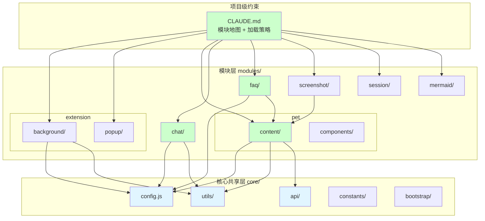
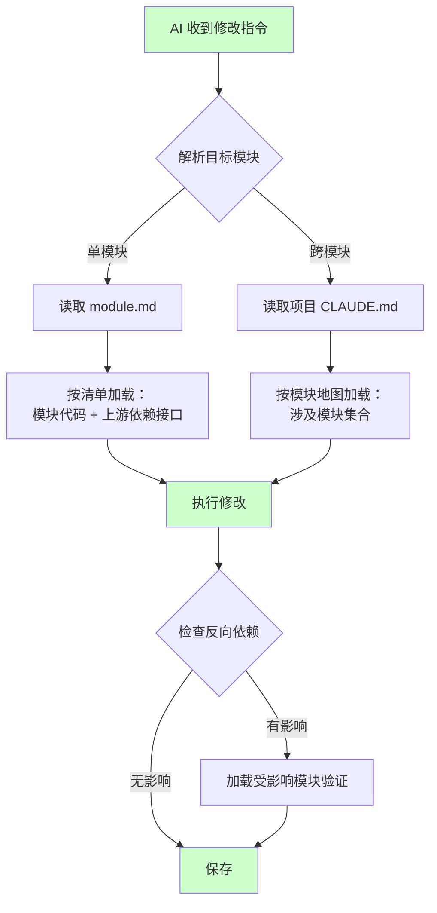
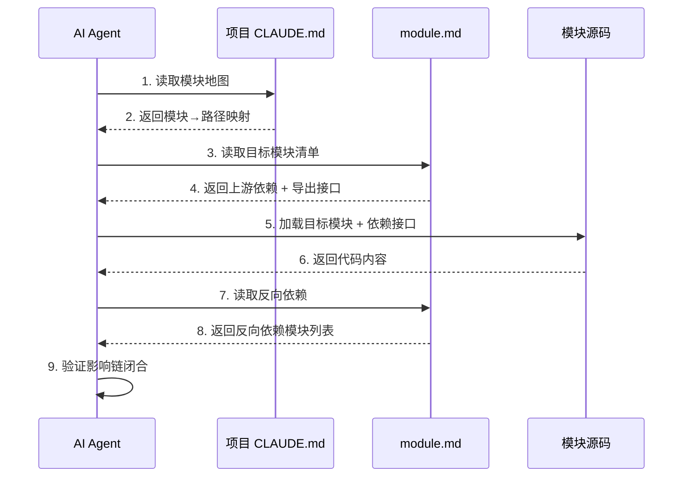

# AI 上下文边界约束与模块化目录重构设计

> **文档版本**: v1.0 | **最后更新**: 2026-04-27 | **维护者**: Claude Opus 4.7 | **工具**: Claude Code
>
> **关联文档**: [需求任务](./02_需求任务.md) | [使用文档](./04_使用文档.md) | [CLAUDE.md](../../CLAUDE.md) | [实施总结](./06_实施总结.md)
>
> **Git 分支**: main
>
> **文档开始时间**: 13:45:00 | **文档最后更新时间**: 14:10:00

---

## 实施状态

| 项目 | 状态 | 说明 |
|-----|------|------|
| 整体实施状态 | ✅ 已完成 | 核心功能已交付 |
| 最后更新时间 | 2026-04-27 | - |
| 实施阶段 | 阶段4: 总结+交付 | 已完成所有阶段 |
| 验证结果 | ✅ 通过 | P0 检查项全部通过 |
| 关联总结文档 | [06_实施总结.md](./06_实施总结.md) | 详细见实施总结 |
| 实现对照 | 见实施总结附录 | 设计实现对照表 |
| 下一步 | 见实施总结 §6 | 可选补充模块级 CLAUDE.md、E2E 测试等 |

[设计概述](#设计概述) | [架构设计](#架构设计) | [修复内容](#修复内容) | [实现细节](#实现细节) | [影响分析](#影响分析) | [主要操作场景实现](#主要操作场景实现) | [数据结构设计](#数据结构设计)

---

## 设计概述

本设计将 YiPet 项目从当前的单体 PetManager 架构重构为模块化目录结构，通过目录边界、module.md 依赖清单和 CLAUDE.md 层级约束三层机制，实现 AI coding 上下文收敛。设计原则是在不改变运行时行为的前提下（保持 `window.PetManager` / `PET_CONFIG` / `chrome.storage` 等全局引用兼容），通过目录组织和清单文件让 AI 可按需加载模块上下文。

🎯 **最小侵入**：不改变运行时架构，只在目录和元数据层面增加约束层
⚡ **渐进重构**：可逐模块迁移，不要求一次性完成所有模块的目录调整
🔧 **向后兼容**：manifest.json 路径映射保持有效，旧的 `PetManager.prototype` 挂载方式不受影响

## 架构设计

### 整体架构



整体架构图：项目分为项目级约束层（CLAUDE.md）、核心共享层（core/）和模块层（modules/）。核心共享层提供配置、工具、API 等基础能力；模块层按功能独立组织；CLAUDE.md 作为元数据层连接各模块。

### 模块划分

| 模块名称 | 职责 | 文件位置 | 估计代码行数 |
|----------|------|----------|-------------|
| `core/config` | 全局配置与环境检测 | `core/config.js` | ~214 |
| `core/utils` | 通用工具函数集（API/UI/存储/时间/错误等） | `core/utils/` | ~1500 |
| `core/api` | API 请求管理与服务 | `core/api/` | ~800 |
| `core/constants` | 端点常量定义 | `core/constants/` | ~50 |
| `core/bootstrap` | Content Script 入口与初始化 | `core/bootstrap/` | ~200 |
| `modules/pet` | 宠物管理核心（UI/拖拽/状态/事件/聊天/媒体/消息） | `modules/pet/` | ~12000 |
| `modules/pet/modules` | 宠物功能子模块（AI/认证/角色/会话/标签/消息等） | `modules/pet/content/modules/` | ~8000 |
| `modules/pet/components` | Vue 组件（ChatWindow/Header/Input/Messages/Modal 等） | `modules/pet/components/` | ~5000 |
| `modules/chat` | 聊天导出功能 | `modules/chat/` | ~400 |
| `modules/faq` | FAQ 管理与标签 | `modules/faq/` | ~300 |
| `modules/screenshot` | 区域截图功能 | `modules/screenshot/` | ~200 |
| `modules/session` | 会话导入导出（ZIP） | `modules/session/` | ~200 |
| `modules/mermaid` | Mermaid 图表渲染 | `modules/mermaid/` | ~100 |
| `modules/extension/background` | 后台服务 Worker | `modules/extension/background/` | ~800 |
| `modules/extension/popup` | 弹出界面 | `modules/extension/popup/` | ~500 |

### 核心流程图



核心流程图：AI 按指令解析目标模块，通过 module.md 或 CLAUDE.md 确定加载范围，执行修改后检查反向依赖，最终保存。

## 修复内容

### 问题分析

当前项目存在以下核心问题：

1. **上下文膨胀**：PetManager 单体包含 22 个子模块文件（`petManager.*.js`），总计 ~19000 行代码。AI 修改任何功能都需要加载整个 PetManager 上下文。

2. **隐式依赖**：所有子模块通过 `window.PetManager.prototype` 混合挂载，依赖关系无法从目录结构推断。例如 `modules/faq/content/faq.js:6` 直接访问 `window.PetManager.prototype` 挂载方法，FAQ 模块对 PetManager 的依赖完全隐式。

3. **全局状态耦合**：`PET_CONFIG`、`StorageHelper`、`ErrorHandler` 等全局变量在 50+ 处被直接引用，修改这些全局变量时无法精确判断影响范围。

4. **manifest 入口膨胀**：content_scripts 包含 80+ 个 JS 入口，新增/移除模块时需手动维护列表。

### 修复方案

**方案选择**：采用"目录约束 + 元数据清单"的渐进式重构，而非"ES Module 迁移"方案。理由：
- Chrome Extension Manifest V3 的 content_scripts 不支持 ES Module（只能用 `<script>` 注入）
- 当前项目是零构建项目，引入构建工具会打破"直接加载"的开发体验
- 元数据清单方式不改变运行时行为，风险最低

**需要修改的文件清单**：
1. 每个模块目录新增 `module.md` 依赖清单文件（~8 个新文件）
2. 项目根 `CLAUDE.md` 更新模块地图和加载策略
3. 核心模块新增 CLAUDE.md（pet、chat、session）
4. `modules/pet/content/modules/` 下的子模块文件按职责重新归类到子目录（可选，P1）
5. `manifest.json` 路径更新（如果进行了子目录重构）

### 修复前后对比

| 内容项 | 修复前 | 修复后 | 说明 |
|--------|--------|--------|------|
| 模块边界 | 无目录级边界，22 个文件平铺在 content/ | 每个模块有独立子目录 + module.md | 目录即边界 |
| 依赖声明 | 隐式（散布在 window.PetManager 引用中） | 显式（module.md 中声明上游/反向依赖） | 可从文件系统读取 |
| 上下文控制 | AI 每次加载全项目 | AI 按 module.md 加载目标模块 + 直接依赖 | 上下文从 ~19000 行降至 ≤ 3000 行 |
| CLAUDE.md | 仅含行为规范 | 增加模块地图和上下文加载策略 | AI 按策略自动控制范围 |
| manifest 兼容 | 80+ 入口平铺列表 | 保持原有路径映射（可从 module.md 推导） | 不改变运行时行为 |

## 影响分析

> **强制执行**：已按 `../../shared/impact-analysis-contract.md` 对整个项目执行完整影响分析。

### 搜索词与改动点清单

| 改动点 | 类型 | 搜索词 | 来源 | 备注 |
|--------|------|--------|------|------|
| `window.PetManager` | component | `PetManager`, `window.PetManager` | 需求任务/代码 | 核心全局入口，22 子模块+12 组件+FAQ+截图引用 |
| `PET_CONFIG` | config | `PET_CONFIG`, `PET_CONFIG.constants`, `PET_CONFIG.api` | 代码路径 | 全局配置，50+ 处引用 |
| `StorageHelper` | component | `StorageHelper`, `window.StorageHelper` | 代码路径 | bootstrap 定义，petManager.state 引用 |
| `manifest.json` | config | `content_scripts`, `service_worker` | manifest.json | 80+ 入口脚本 |
| `CLAUDE.md` | config | `CLAUDE.md` | 项目根目录 | 需更新模块地图 |
| `module.md` | config | `module.md` | 新增文件 | 各模块依赖清单 |
| `PetManager.Components` | component | `PetManager.Components`, `Components` | 代码路径 | 12 个 Vue 组件注册入口 |
| `chrome.runtime.sendMessage` | event | `sendMessage`, `chrome.runtime.sendMessage` | 代码路径 | 消息通信 |
| `LoadingAnimationMixin` | component | `LoadingAnimationMixin` | 代码路径 | PetManager 继承 |

### 改动点影响链

| 改动点 | 搜索词 | 命中文件 | 引用方式 | 影响层级 | 依赖方向 | 处置方式 | 闭合状态 | 说明 |
|--------|--------|----------|----------|----------|----------|----------|----------|------|
| `CLAUDE.md` | `CLAUDE.md` | `/CLAUDE.md` | 项目配置 | 直接 | 上游定义 | 同步修改 | 已闭合 | 增加模块地图和加载策略 |
| `module.md` | `module.md` | 新增 ~8 个文件 | 新增配置 | 直接 | 新增 | 新增 | 已闭合 | 各模块依赖清单 |
| `window.PetManager` | `window.PetManager` | `petManager.core.js:L1080` | 全局赋值 | 直接 | 上游定义 | 保持兼容 | 已闭合 | 不改变运行时行为 |
| `window.PetManager` | `PetManager.prototype` | 22 个子模块文件 | 方法挂载 | 二级 | 反向依赖 | 保持兼容 | 已闭合 | 子模块目录可能调整但挂载方式不变 |
| `PET_CONFIG` | `PET_CONFIG` | `core/config.js:L187-213` | 全局赋值 | 直接 | 上游定义 | 保持兼容 | 已闭合 | 配置文件不变 |
| `manifest.json` | `content_scripts` | `manifest.json:L14-81` | 配置 | 直接 | 配置 | 同步修改 | 已闭合 | 如子目录重构则需更新路径 |
| `PetManager.Components` | `Components` | 12 个 Vue 组件文件 | 注册+读取 | 二级 | 反向依赖 | 保持兼容 | 已闭合 | 组件路径可能调整但注册方式不变 |

### 依赖闭合摘要

| 改动点 | 上游依赖是否核对 | 反向依赖是否核对 | 传递依赖是否闭合 | 测试/文档/配置是否覆盖 | 结论 |
|--------|------------------|------------------|------------------|----------------------------|------|
| `CLAUDE.md` | 是 | 不适用 | 不适用 | 文档覆盖 | 可实施 |
| `module.md` | 是（从代码分析） | 是（从代码分析） | 是 | 新增文件 | 可实施 |
| `window.PetManager` | 是 | 是 | 是 | 代码覆盖 | 可实施（保持兼容） |
| `PET_CONFIG` | 是 | 是 | 是 | 配置覆盖 | 可实施（保持兼容） |
| `manifest.json` | 是 | 是 | 是 | 配置覆盖 | 可实施 |

### 未覆盖风险

| 风险来源 | 原因 | 影响 | 缓解方式 |
|----------|------|------|----------|
| 动态属性访问 `PetManager.Components?.[name]` | ChatWindow 通过动态属性名加载组件 | 可能遗漏组件依赖 | 人工复核 ChatWindow/index.js 的组件动态加载 |
| `importScripts` 路径 | Background 通过 `importScripts` 加载 | 如调整 background 目录结构需同步更新 | 保持 background 目录不变或同步修改 imports.js |

### 改动范围汇总

- **需直接修改的文件数**：1 个（CLAUDE.md）
- **需新增的文件数**：~11 个（8 个 module.md + 3 个模块级 CLAUDE.md）
- **需验证兼容性的文件数**：22 个（子模块文件的 PetManager.prototype 挂载）
- **需追踪传递影响的文件数**：12 个（Vue 组件对 PetManager.Components 的引用）
- **需人工复核或阻断的风险**：ChatWindow 动态组件加载

---

## 实现细节

### 技术实现要点

1. **module.md 模板设计**
   - 每个模块目录下创建 `module.md`，包含 6 个必填字段：模块名、职责、入口文件、上游依赖、反向依赖、导出接口
   - 入口文件指向 manifest.json 中该模块对应的 content_scripts 入口
   - 上游依赖列出该模块直接引用的其他模块（从代码中的 `window.PetManager`/`PET_CONFIG` 引用分析得出）
   - 反向依赖列出直接引用该模块导出接口的其他模块

2. **CLAUDE.md 模块地图设计**
   - 在项目根 CLAUDE.md 中增加"模块地图"章节
   - 模块地图包含：模块名 → 目录路径 → module.md 路径的映射表
   - 上下文加载策略：单模块任务 → 读取目标模块 module.md → 加载该模块 + 上游依赖接口；跨模块任务 → 读取项目级地图 → 按涉及模块加载

3. **模块级 CLAUDE.md 设计**
   - 核心模块（pet、chat、session）拥有独立 CLAUDE.md
   - 包含：模块边界描述、关键文件列表、与上游依赖的接口摘要
   - AI 进入该模块目录时自动读取

4. **子模块目录重组（P1，可选）**
   - 将 `modules/pet/content/modules/` 下的 14 个 `petManager.*.js` 按功能域分组
   - 例如：`modules/pet/content/modules/session/`（session.js, sessionEditor.js, tags.js, io.js）
   - 重组后需同步更新 manifest.json 中的 content_scripts 路径

### 关键代码说明

module.md 模板（以 `modules/pet/` 为例）：

```markdown
# 模块：pet

## 基本信息
- **模块名**：pet
- **职责**：宠物管理核心模块，包含 UI 渲染、拖拽、状态管理、事件处理、聊天、媒体、消息等功能
- **入口文件**：modules/pet/content/petManager.js
- **代码规模**：~19000 行（22 子模块 + 12 Vue 组件）

## 上游依赖
- `core/config`：PET_CONFIG 全局配置
- `core/utils`：StorageHelper, ErrorHandler, LoggerUtils, LoadingAnimationMixin 等
- `core/api`：ApiManager, SessionService, FaqService
- `core/constants`：endpoints 常量

## 反向依赖
- `modules/chat`：导出聊天到 PNG 时使用 PetManager 上下文
- `modules/faq`：通过 PetManager.prototype 挂载 FAQ 方法
- `modules/screenshot`：通过 PetManager.prototype 挂载截图方法

## 导出接口
- `window.PetManager`：PetManager 类定义（petManager.core.js:1080）
- `window.PetManager.Components`：Vue 组件注册入口
- `window.petManager`：PetManager 单例实例
```

### 依赖关系

- 无新增外部依赖
- 依赖现有项目结构（core/、modules/、manifest.json）
- module.md 是纯元数据文件，不参与运行时

### 测试考虑

- **功能不变性**：重构后所有现有功能应正常工作，可通过手动验证：加载扩展 → 显示宠物 → 打开聊天 → 切换角色 → 创建/切换会话
- **清单准确性**：module.md 中声明的依赖与代码实际引用一致，可通过 grep 搜索验证
- **上下文收敛**：单模块任务的 AI 上下文 ≤ 3000 行，可通过模拟 AI 任务验证

## 主要操作场景实现

### 场景实现：单模块上下文加载

**关联需求任务场景**：[单模块上下文加载](./02_需求任务.md#主要操作场景定义)

**实现概述**：AI 读取项目级 CLAUDE.md 模块地图，定位目标模块目录，读取 module.md 确定依赖范围，按需加载代码。

**涉及模块**：
- `core/CLAUDE.md`：提供模块地图和加载策略
- `modules/<目标模块>/module.md`：提供依赖清单和入口文件

**关键代码路径**：
- `CLAUDE.md`：模块地图章节（新增）
- `modules/<name>/module.md`：依赖清单文件（新增）

**验证要点**：
- AI 加载的文件列表是否与 module.md 声明一致
- 加载的代码行数是否 ≤ 3000 行
- 反向依赖检查是否覆盖所有引用模块

---

### 场景实现：跨模块影响链追踪

**关联需求任务场景**：[跨模块影响链追踪](./02_需求任务.md#主要操作场景定义)

**实现概述**：从目标模块的 module.md 反向依赖声明出发，逐个检查受影响模块，通过 module.md 链式追踪直到影响闭合。

**涉及模块**：
- 被修改模块的 module.md（反向依赖声明）
- 反向依赖模块的 module.md（确认是否受影响）

**关键代码路径**：
- `modules/<name>/module.md` → `反向依赖` 章节

**验证要点**：
- 反向依赖列表是否与 grep 搜索结果一致
- 影响链是否在 2 步内闭合
- 接口变更是否兼容

---

### 场景实现：新增模块注册

**关联需求任务场景**：[新增模块注册](./02_需求任务.md#主要操作场景定义)

**实现概述**：按 module.md 模板创建目录和清单文件，在项目级 CLAUDE.md 模块地图注册，更新 manifest.json。

**涉及模块**：
- 新模块目录及 module.md
- 项目级 CLAUDE.md（模块地图）
- manifest.json（content_scripts / web_accessible_resources）

**关键代码路径**：
- `CLAUDE.md`：模块地图章节
- `manifest.json`：content_scripts 数组

**验证要点**：
- module.md 依赖声明是否完整
- CLAUDE.md 模块地图是否已注册
- manifest.json 路径是否有效

---

### 场景实现：模块移除影响面确认

**关联需求任务场景**：[模块移除影响面确认](./02_需求任务.md#主要操作场景定义)

**实现概述**：读取目标模块 module.md 的反向依赖声明，搜索项目确认无遗漏引用，从地图和 manifest 中移除。

**涉及模块**：
- 目标模块的 module.md（反向依赖声明）
- 项目级 CLAUDE.md（模块地图）
- manifest.json

**关键代码路径**：
- `modules/<name>/module.md` → `反向依赖` 章节
- `CLAUDE.md`：模块地图章节
- `manifest.json`：content_scripts 数组

**验证要点**：
- 反向依赖声明为空或已全部处理
- 无硬编码引用残留
- manifest.json 已更新

## 数据结构设计

### 数据流程图



数据流程图：AI Agent 通过项目级 CLAUDE.md 定位模块，通过 module.md 确定依赖范围和影响面，按需加载代码执行任务。整个流程从元数据到代码，确保上下文最小化。