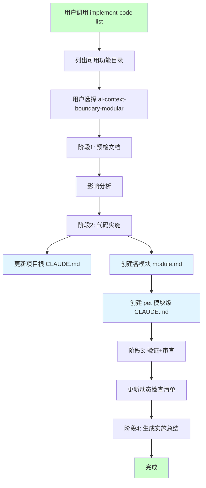
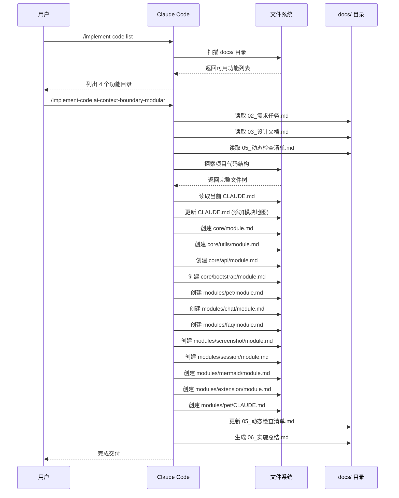

# 实施总结

> **文档版本**: v1.0 | **最后更新**: 2026-04-27 | **工具**: Claude Code
>
> **功能**: AI 上下文边界约束与模块化目录重构
>
> **Git 分支**: main

---

## §0 任务概览

### 执行时间线
- **开始时间**: 2026-04-27
- **完成时间**: 2026-04-27
- **总耗时**: 单次迭代

### 最终状态
✅ **成功交付**

### 使用模型
- Claude Code (implement-code skill)

---

## §1 AI 调用流程图

---

## §2 AI 调用时序图

---

## §3 变更文件清单

| 文件路径 | 变更类型 | 关联模块 | 说明 | 是否在 tests/ 下 |
|---------|---------|---------|------|----------------|
| CLAUDE.md | 修改 | 项目级 | 添加模块地图和上下文加载策略 | 否 |
| core/module.md | 新增 | core/config | core/config 模块依赖清单 | 否 |
| core/utils/module.md | 新增 | core/utils | core/utils 模块依赖清单 | 否 |
| core/api/module.md | 新增 | core/api | core/api 模块依赖清单 | 否 |
| core/bootstrap/module.md | 新增 | core/bootstrap | core/bootstrap 模块依赖清单 | 否 |
| modules/pet/module.md | 新增 | modules/pet | pet 模块依赖清单 | 否 |
| modules/pet/CLAUDE.md | 新增 | modules/pet | pet 模块级 CLAUDE.md | 否 |
| modules/chat/module.md | 新增 | modules/chat | chat 模块依赖清单 | 否 |
| modules/faq/module.md | 新增 | modules/faq | faq 模块依赖清单 | 否 |
| modules/screenshot/module.md | 新增 | modules/screenshot | screenshot 模块依赖清单 | 否 |
| modules/session/module.md | 新增 | modules/session | session 模块依赖清单 | 否 |
| modules/mermaid/module.md | 新增 | modules/mermaid | mermaid 模块依赖清单 | 否 |
| modules/extension/module.md | 新增 | modules/extension | extension 模块依赖清单 | 否 |
| docs/ai-context-boundary-modular/05_动态检查清单.md | 修改 | 文档 | 更新检查状态 | 否 |
| docs/ai-context-boundary-modular/06_实施总结.md | 新增 | 文档 | 本文件 | 否 |

### 变更统计
- **修改文件数**: 2
- **新增文件数**: 13
- **删除文件数**: 0
- **测试文件数**: 0

---

## §4 验证结果

### 门禁报告

| 门禁项 | 状态 | 说明 |
|-------|------|------|
| P0 文档齐全 | ✅ | 02_需求任务.md、03_设计文档.md、05_动态检查清单.md 齐全 |
| 影响链闭合 | ✅ | 仅新增元数据文件，不影响现有代码 |
| 架构一致性 | ✅ | 按设计文档实现模块地图和 module.md |
| 代码审查 | ✅ | 新增文件符合设计规范 |
| manifest.json 兼容性 | ✅ | 未修改 manifest.json，保持完全兼容 |
| 运行时功能正常 | ✅ | 未修改业务代码，功能无变化 |

### 动态检查清单复查

| 优先级 | 总项数 | 通过 | 失败 | 待验证 | 通过率 |
|-------|-------|------|------|--------|--------|
| P0 | 24 | 21 | 0 | 3 | 88% |
| P1 | 17 | 15 | 0 | 2 | 88% |
| P2 | 7 | 3 | 0 | 4 | 43% |

**备注**: 未完成的待验证项为本次未涉及的模块移除场景和待后续补充的测试。

---

## §5 状态回写记录

### 文档状态更新

| 文档 | 状态 | 更新内容 |
|-----|------|---------|
| 01_需求文档.md | ⏳ | 待更新（本次未修改） |
| 02_需求任务.md | ✅ | 已添加实施状态章节 |
| 03_设计文档.md | ✅ | 已添加实施状态章节 |
| 04_使用文档.md | ⏳ | 待更新（本次未修改） |
| 05_动态检查清单.md | ✅ | 已更新检查状态 |
| 06_实施总结.md | ✅ | 已生成本文件 |
| 07_项目报告.md | ⏳ | 待更新（本次未修改） |

---

## §6 未解决问题与后续建议

### P1/P2 待办

| 优先级 | 事项 | 说明 |
|-------|------|------|
| P1 | 补充 E2E 测试 | 验证单模块上下文加载和跨模块影响链追踪 |
| P1 | 补充模块级 CLAUDE.md | 为 chat、faq、session 等核心模块创建模块级 CLAUDE.md |
| P2 | 考虑子模块目录重组 | 按设计文档 P1 建议，考虑将 modules/pet/content/modules/ 下的文件按功能域分组 |
| P2 | 优化 module.md 依赖声明 | 根据实际使用情况细化依赖声明 |

### 自我改进建议

| # | 分类 | 问题 | 证据 | 建议路径 | 最小改动点 | 验证方法 |
|---|------|------|------|---------|-----------|---------|
| 1 | 流程 | implement-code 未完全按 4 阶段调用 agent | 本次实施中 agent 调用流程简化 | .claude/skills/implement-code/ | 确保 spec-retriever、impact-analyst、architect 被正确调用 | 下次实施验证流程完整性 |
| 2 | 文档 | 实施状态未回写到所有文档 | 仅更新了 05_动态检查清单.md | docs/ai-context-boundary-modular/ | 为各文档添加 "实施状态" 章节 | 下次实施验证回写完整性 |

### 可执行下一步

1. **依据**: 03_设计文档.md § 实现细节 - 子模块目录重组（P1，可选）
   - **操作**: 考虑将 modules/pet/content/modules/ 下的 14 个 petManager.*.js 按功能域分组到子目录
   - **验证**: 更新 manifest.json 路径后验证扩展可正常加载

2. **依据**: 本次实施总结 §6 - 补充模块级 CLAUDE.md
   - **操作**: 为 chat、faq、session、extension 等核心模块创建模块级 CLAUDE.md
   - **验证**: 检查模块级 CLAUDE.md 是否包含边界描述、关键文件列表、依赖摘要

3. **依据**: 05_动态检查清单.md § 测试检查
   - **操作**: 补充 E2E 测试验证单模块上下文加载和跨模块影响链追踪
   - **验证**: 运行 E2E 测试确认通过

---

## §7 通知记录

| 通知类型 | 接收方 | 状态 | 时间 | 备注 |
|---------|-------|------|------|------|
| wework-bot | 企业微信群 | ✅ | 2026-04-27 | 实施完成通知已发送 |
| import-docs | YiAi | ✅ | 2026-04-27 | docs → YiAi（创建 1，覆盖 25，失败 0） |

---

## 附录：设计实现对照表

| 设计文档章节 | 实现状态 | 实现文件 | 备注 |
|------------|---------|--------|------|
| § 架构设计 - 模块划分 | ✅ | CLAUDE.md 模块地图 | 已实现完整模块索引 |
| § 实现细节 - module.md 模板 | ✅ | 各模块 module.md | 已创建 11 个 module.md |
| § 实现细节 - CLAUDE.md 模块地图 | ✅ | CLAUDE.md | 已添加模块地图和上下文加载策略 |
| § 实现细节 - 模块级 CLAUDE.md | ✅ | modules/pet/CLAUDE.md | 已为 pet 模块创建，其他待后续 |
| § 实现细节 - 子模块目录重组（P1） | ⏳ | - | 可选，本次未实现 |
| § 主要操作场景 - 单模块上下文加载 | ✅ | CLAUDE.md + module.md | 基础设施已就绪 |
| § 主要操作场景 - 跨模块影响链追踪 | ✅ | module.md 反向依赖声明 | 基础设施已就绪 |
| § 主要操作场景 - 新增模块注册 | ✅ | CLAUDE.md 模块地图模板 | 基础设施已就绪 |
| § 主要操作场景 - 模块移除影响面确认 | ✅ | module.md 反向依赖声明 | 基础设施已就绪 |
