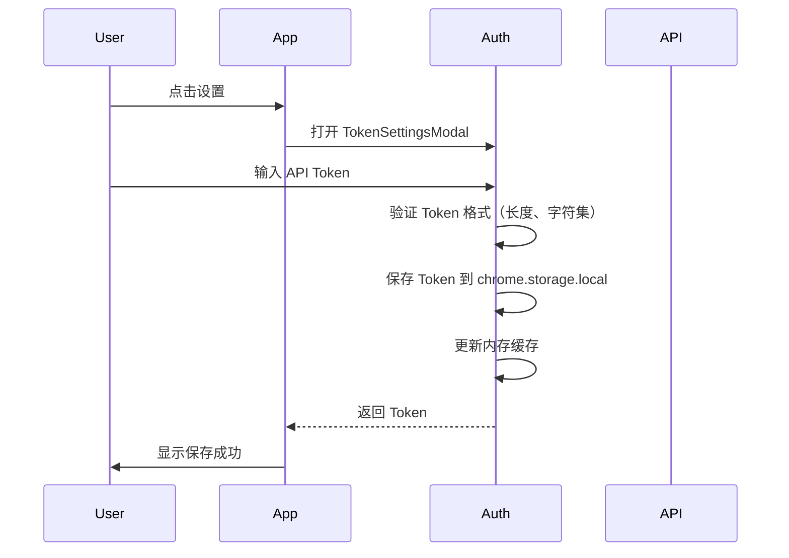
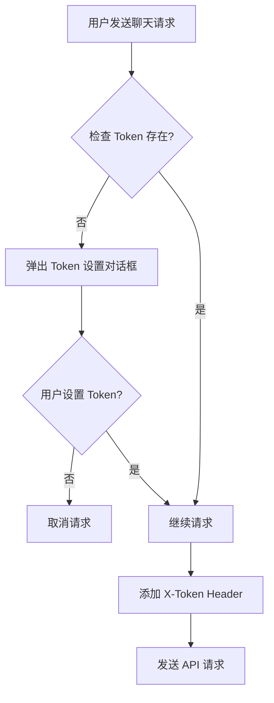

# 认证与鉴权方案

> 本文档描述项目的认证/鉴权架构，供 AI 和人工开发者参考。AI 在实施涉及鉴权的代码时，必须遵守本文档的自检规则。

## 认证架构概览

| 维度 | 方案 | 配置来源 |
|------|------|---------|
| 认证方式 | Token 认证 | core/config.js、TokenSettingsModal 组件 |
| Token 类型 | API Key / X-Token Header | core/utils/api/token.js |
| Token 存储 | chrome.storage.local + 内存缓存 | core/utils/api/token.js |
| Token 传递 | Header X-Token | modules/pet/content/modules/petManager.auth.js |
| 登录入口 | TokenSettingsModal 组件 | modules/pet/components/modal/TokenSettingsModal/ |
| 登出入口 | TokenSettingsModal 组件 | modules/pet/components/modal/TokenSettingsModal/ |

## 认证流程

## 鉴权流程

### 权限层级

| 层级 | 权限模型 | 代码实现 | 配置来源 |
|------|---------|---------|---------|
| 功能级 | Token 存在性检查 | PetManager.auth.ensureTokenSet() | modules/pet/content/modules/petManager.auth.js |
| API 级 | Token 传递（X-Token Header） | PetManager.auth.getAuthHeaders() | modules/pet/content/modules/petManager.auth.js |

### 权限定义

| 角色/权限 | 允许操作 | 代码标识 | 来源 |
|-----------|---------|---------|------|
| 所有用户 | 宠物展示、拖拽、设置 | N/A（无需 Token） | manifest.json |
| 已认证用户 | AI 聊天、会话管理 | hasApiToken() | core/utils/api/token.js |

## Token 管理

### 生命周期

| 阶段 | 行为 | 代码路径 | 配置 |
|------|------|---------|------|
| 获取 | 用户在 TokenSettingsModal 中输入 | modules/pet/components/modal/TokenSettingsModal/ | storageKey: 'YiPet.apiToken.v1' |
| 存储 | 保存到 chrome.storage.local + 内存缓存 | core/utils/api/token.js | TokenManager._saveTokenToChromeStorage() |
| 传递 | 在 API 请求 Header 中携带 X-Token | modules/pet/content/modules/petManager.auth.js | getAuthHeaders() |
| 刷新 | 待补充 | 待补充 | 待补充 |
| 过期 | 待补充 | 待补充 | 待补充 |
| 销毁 | 用户在设置中清除 Token | core/utils/api/token.js | clearToken() |

### Token 安全

- **存储位置**: chrome.storage.local（而非 localStorage），防止恶意网站访问
- **内存缓存**: TokenManager 使用 _cachedToken 进行快速访问，避免频繁读取 chrome.storage
- **格式验证**: validateToken() 检查长度（至少 10 字符）和字符集（a-zA-Z0-9_-）
- **Header 名称**: 使用 X-Token 而非 Authorization，与后端 API 规范保持一致

## 鉴权自检规则

> 以下规则供 AI 和人工在实施涉及鉴权代码时自检，提升一次通过率。

### 必须遵守（P0）

| # | 自检项 | 检查方法 | 不通过的后果 |
|---|--------|---------|-------------|
| 1 | Token 必须存储在 chrome.storage.local 而非 localStorage | `grep -r 'localStorage.*token\|token.*localStorage' modules/ core/` | Token 可能被其他网站访问 |
| 2 | API 请求必须检查 Token 是否存在 | `grep -r 'X-Token\|getAuthHeaders' core/utils/api/ modules/pet/` | 无 Token 时发送请求导致 API 错误 |
| 3 | Token 输入必须有验证反馈 | 检查 TokenSettingsModal 组件 | 用户不知道 Token 是否有效 |
| 4 | 登出必须清除所有认证信息 | 检查 PetManager.auth 模块和 TokenManager.clearToken() | 登出后 Token 仍残留 |

### 应该遵守（P1）

| # | 自检项 | 检查方法 | 备注 |
|---|--------|---------|------|
| 1 | Token 有过期处理 | 检查是否有 Token 过期检测 | 长期使用 Token 可能失效 |
| 2 | API 401/403 有统一处理 | 检查 HTTP 错误码处理 | 用户体验差 |

### 典型故障与修复

| 症状 | 原因 | 排查命令 | 修复方案 |
|------|------|---------|---------|
| Token 跨 Tab 不同步 | 仅使用内存缓存未监听 storage 变化 | `chrome.storage.local.get('YiPet.apiToken.v1')` | 添加 chrome.storage.onChanged 监听 |
| Token 在某些页面无法获取 | chrome.storage 不可用（如系统页面） | 检查 URL 是否在 chrome://、about: 等协议 | 优雅降级处理 |
| Token 设置后仍提示未设置 | 内存缓存与 chrome.storage 不同步 | `tokenManager.getTokenSync()` vs `tokenManager.getToken()` | 确保设置后同时更新缓存和存储 |

## 核心代码路径

| 功能 | 文件路径 | 关键函数/类 |
|------|---------|-----------|
| Token 管理 | core/utils/api/token.js | TokenManager、TokenUtils |
| 认证逻辑 | modules/pet/content/modules/petManager.auth.js | PetManager.prototype.getApiToken、getAuthHeaders、ensureTokenSet |
| Token 设置 UI | modules/pet/components/modal/TokenSettingsModal/ | createComponent |
| API 请求 | core/utils/api/request.js | RequestClient |
