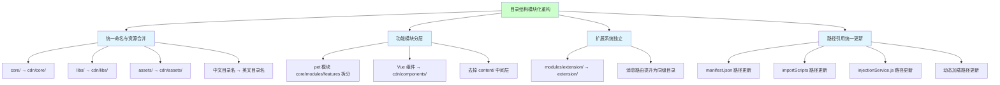
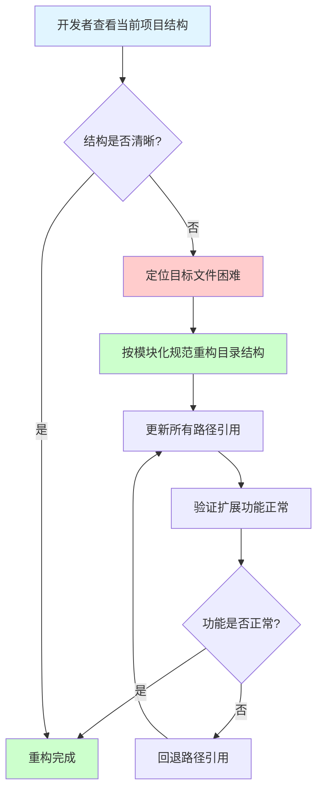
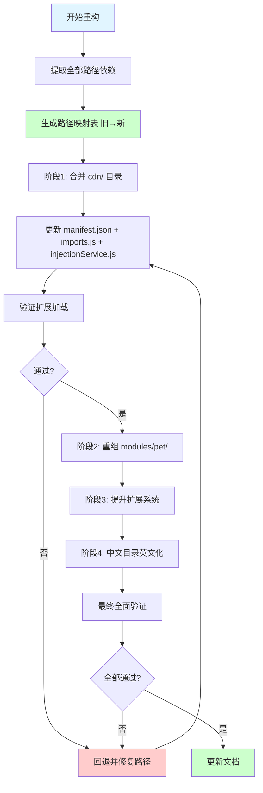
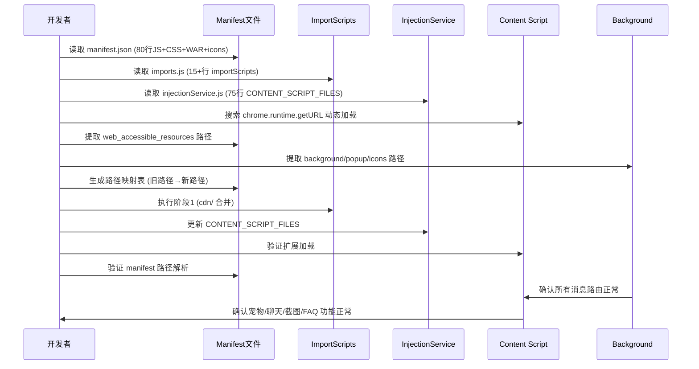

# 项目目录结构模块化重构

> **文档版本**: v1.1 | **最后更新**: 2026-04-27 | **维护者**: Claude Opus 4.7 | **工具**: Claude Code
>
> **关联文档**: [需求文档](./01_需求文档.md) | [设计文档](./03_设计文档.md) | [使用文档](./04_使用文档.md)
>
> **Git 分支**: main
>
> **文档开始时间**: 10:45:00 | **文档最后更新时间**: 11:10:00

[功能概述](#功能概述) | [功能分析](#功能分析) | [功能详情](#功能详情) | [验收标准](#验收标准) | [使用场景示例](#使用场景示例)

---

## 功能概述

YiPet 温柔陪伴助手的目录结构存在命名不一致、层级混乱、职责交叉等问题。本文档将需求文档中的用户故事细化为可执行的任务，定义主要操作场景和验证要点，为设计文档提供输入。

- 🎯 **问题可追溯**：每个优化任务对应明确的用户故事和验收标准
- ⚡ **场景可验证**：每个操作场景都有前置条件、操作步骤和预期结果
- 📖 **结构可复用**：优化后的目录结构可在 YiWeb 项目体系中复用

## 功能分析

### 功能分解图

本图展示了目录结构模块化重构的四个核心方向及其子任务。

### 用户流程图

开发者从发现问题到完成重构的完整流程。

### 功能流程图

分阶段执行的重构流程，每步可独立验证。

### 完整时序图

开发者、配置文件和运行时组件在重构过程中的交互时序。

## 用户故事表格

| 用户故事 | 验收标准 | 过程生成文档 | 产出智能文档 |
|----------|----------|--------|----------|
| 🔴 作为开发者，我想要将项目目录结构按模块化开发需求重新组织，以便在不同功能模块间快速切换开发  **主要操作场景**： - 合并核心资源到 cdn/ - 重组 pet 模块分层 - 提升扩展系统 - 英文化中文目录 - 统一路径引用 | 1. 所有目录名英文小写+短横线 2. manifest.json 路径可正确解析 3. 全部功能正常运行 4. core/modules/features 三层结构 5. Vue 组件与逻辑分离 | [需求文档](./01_需求文档.md) [设计文档](./03_设计文档.md) | [生成文档 Skill](../../.claude/skills/generate-document/SKILL.md) |

## 主要操作场景定义

### 🎯 主要操作场景：合并核心资源到 cdn/

**场景描述**：将 `core/`、`libs/`、`assets/` 三个顶级目录合并到 `cdn/` 目录下按子职责分层。

**前置条件**：
- 项目当前目录结构为 `core/`、`libs/`、`assets/` 三个顶级目录并存
- `manifest.json` 的 content_scripts.js 和 web_accessible_resources 引用了 `core/`、`libs/`、`assets/` 下的路径
- `injectionService.js` 的 CONTENT_SCRIPT_FILES（75行）引用了 `core/` 和 `libs/` 下的路径

**操作步骤**：
1. 创建 `cdn/core/`、`cdn/utils/`、`cdn/libs/`、`cdn/assets/` 目录
2. 将 `core/config.js`、`core/bootstrap/`、`core/constants/`、`core/api/` 移入 `cdn/core/`
3. 将 `core/utils/` 整体移入 `cdn/utils/`（从 core 下提升为独立子目录）
4. 将 `libs/` 整体移入 `cdn/libs/`
5. 将 `assets/` 整体移入 `cdn/assets/`

**预期结果**：`core/`、`libs/`、`assets/` 目录不再存在，所有内容在 `cdn/` 下按职责分层。

**验证关注点**：manifest.json 路径可解析、importScripts 路径可解析、扩展加载无 404 错误。

**相关设计文档章节**：[设计文档 § 实现细节](./03_设计文档.md#实现细节)

### 🎯 主要操作场景：重组 pet 模块分层

**场景描述**：将 `modules/pet/content/` 下混合放置的 14+ 文件按职责拆分为 core/modules/features 三层子目录，去掉 content/ 中间层。

**前置条件**：
- `modules/pet/content/` 下存在 `petManager.core.js`、`petManager.js`（入口）、10 个 petManager.*.js 特性文件
- `modules/pet/content/modules/` 下存在 13 个 `petManager.*.js` 功能模块文件
- manifest.json 和 injectionService.js 按特定顺序引用这些文件

**操作步骤**：
1. 在 `modules/pet/` 下创建 `core/`、`modules/`、`features/` 三个子目录
2. 将 `content/core/petManager.core.js` 移入 `core/`
3. 将 `content/modules/petManager.*.js`（13个功能模块）移入 `modules/`
4. 将 `content/petManager.chat.js` 等 10 个特性文件移入 `features/`
5. 将 `content/petManager.js`（入口）保留在 `modules/pet/` 顶层
6. 删除 `content/` 中间层目录

**预期结果**：`modules/pet/` 下按 core/modules/features 三层组织，无 content/ 中间层。

**验证关注点**：PetManager 类初始化链完整、所有 prototype 扩展方法可用、manifest.json 加载顺序正确。

**相关设计文档章节**：[设计文档 § 实现细节](./03_设计文档.md#实现细节)

### 🎯 主要操作场景：提升 Vue 组件到共享层

**场景描述**：将 `modules/pet/components/` 下的 Vue 组件目录移入 `cdn/components/`，使组件与业务逻辑分离。

**前置条件**：
- `modules/pet/components/chat/` 含 ChatWindow、ChatHeader、ChatInput、ChatMessages 四个组件
- `modules/pet/components/modal/` 含 AiSettingsModal、TokenSettingsModal
- `modules/pet/components/manager/` 含 FaqManager、FaqTagManager、SessionTagManager
- `modules/pet/components/editor/` 含 SessionInfoEditor
- manifest.json web_accessible_resources 引用了这些组件的 HTML 模板路径

**操作步骤**：
1. 创建 `cdn/components/chat/`、`cdn/components/modal/`、`cdn/components/manager/`、`cdn/components/editor/`
2. 将各组件目录从 `modules/pet/components/` 移入对应 `cdn/components/` 子目录
3. 更新 manifest.json 中 web_accessible_resources 的模板路径
4. 更新 manifest.json 中 content_scripts.js 的组件 JS 引用

**预期结果**：Vue 组件在 `cdn/components/` 下独立组织，与 `modules/pet/` 业务逻辑分离。

**验证关注点**：HTML 模板可通过 web_accessible_resources 正确加载、组件 JS 加载顺序正确。

**相关设计文档章节**：[设计文档 § 实现细节](./03_设计文档.md#实现细节)

### 🎯 主要操作场景：提升扩展系统为顶级目录

**场景描述**：将 `modules/extension/` 提升为顶级 `extension/` 目录，使扩展系统代码与业务模块解耦。

**前置条件**：
- `modules/extension/background/` 含 actions、app、bootstrap、integrations、messaging、services
- `modules/extension/popup/` 含弹出页面
- manifest.json 的 background.service_worker 和 action.default_popup 引用 `modules/extension/` 下的路径
- `imports.js` 使用 importScripts 加载 `modules/extension/background/` 下的模块

**操作步骤**：
1. 将 `modules/extension/` 整体移动到 `extension/` 顶级目录
2. 更新 manifest.json 的 background.service_worker 路径（`modules/extension/background/index.js` → `extension/background/index.js`）
3. 更新 manifest.json 的 action.default_popup 路径
4. 更新 `imports.js` 中的 importScripts 路径（去掉 `modules/extension/` 前缀）

**预期结果**：扩展系统在 `extension/` 顶级目录独立组织。

**验证关注点**：background service worker 正常启动、popup 页面可正常显示、消息路由正常工作。

**相关设计文档章节**：[设计文档 § 实现细节](./03_设计文档.md#实现细节)

### 🎯 主要操作场景：英文化中文目录名

**场景描述**：将 `assets/images/` 下的中文角色目录名（医生、教师、甜品师、警察）改为英文（doctor、teacher、chef、police）。

**前置条件**：
- `assets/images/` 下存在 `医生/`、`教师/`（含 run/ 动画帧）、`甜品师/`、`警察/` 四个中文目录
- `petManager.roles.js` 中角色配置使用中文键名
- manifest.json 的 web_accessible_resources 使用 `assets/images/*/icon.png` 和 `assets/images/*/run/*.png` 通配

**操作步骤**：
1. 重命名 `assets/images/医生/` → `assets/images/doctor/`
2. 重命名 `assets/images/教师/` → `assets/images/teacher/`
3. 重命名 `assets/images/甜品师/` → `assets/images/chef/`
4. 重命名 `assets/images/警察/` → `assets/images/police/`
5. 更新 `petManager.roles.js` 中角色配置的图片路径引用

**预期结果**：所有角色图片目录使用英文名，角色配置引用路径已更新。

**验证关注点**：角色图片加载无 404 错误、宠物角色切换正常显示。

**相关设计文档章节**：[设计文档 § 实现细节](./03_设计文档.md#实现细节)

### 🎯 主要操作场景：统一所有路径引用

**场景描述**：将所有文件路径引用从旧路径更新为新路径，确保 Chrome Extension 的路径依赖完整。

**前置条件**：
- manifest.json 有 80 行 JS 引用、3 行 CSS 引用、20+ 行 web_accessible_resources、1 行 background、1 行 popup、4 行 icons
- `imports.js` 有 15+ 行 importScripts
- `injectionService.js` 有 75 行 CONTENT_SCRIPT_FILES
- 多处使用 `chrome.runtime.getURL()` 动态加载

**操作步骤**：
1. 从 manifest.json、imports.js、injectionService.js 提取所有路径
2. 生成路径映射表（旧→新）
3. 批量替换 manifest.json 中的所有路径
4. 批量替换 imports.js 中的所有路径
5. 批量替换 injectionService.js 中的所有路径
6. 搜索并替换所有 `chrome.runtime.getURL()` 调用中的路径

**预期结果**：所有路径引用统一更新，无旧路径残留。

**验证关注点**：扩展加载无 404 错误、所有功能正常运行、控制台无路径相关错误。

**相关设计文档章节**：[设计文档 § 实现细节](./03_设计文档.md#实现细节)

## 影响分析

> **强制执行**：生成需求任务文档前，已按 `../../.claude/shared/impact-analysis-contract.md` 对整个项目执行完整影响分析。

### 搜索词与改动点清单

| 改动点 | 类型 | 搜索词 | 来源 | 备注 |
|--------|------|--------|------|------|
| `core/` | config | `core/config.js`, `core/bootstrap/`, `core/constants/`, `core/api/`, `PET_CONFIG` | manifest.json:18-30, injectionService.js:13-34 | 将合并到 cdn/core/ |
| `core/utils/` | config | `core/utils/`, `DomHelper`, `ErrorHandler`, `LoggerUtils`, `StorageHelper`, `StorageUtils` | manifest.json:18-30, injectionService.js:13-34, 代码引用 | 将提升到 cdn/utils/ |
| `libs/` | dependency | `libs/vue.global.js`, `libs/marked.min.js`, `libs/html2canvas.min.js`, `libs/mermaid.min.js`, `libs/jszip.min.js`, `libs/md5.js`, `libs/turndown.js` | manifest.json:18-30, injectionService.js:13-30 | 将合并到 cdn/libs/ |
| `assets/` | css | `assets/styles/`, `assets/images/`, `assets/icons/`, `tailwind.css`, `content.css` | manifest.json:82-87, web_accessible_resources:118-142 | 将合并到 cdn/assets/ |
| `modules/pet/content/` | component | `modules/pet/content/core/`, `modules/pet/content/modules/`, `petManager.core.js`, `petManager.*.js`, `PetManager`, `window.PetManager` | manifest.json:41-79, injectionService.js:35-74, 42个JS文件引用 | 将重组为 core/modules/features 三层 |
| `modules/pet/components/` | component | `modules/pet/components/`, `ChatWindow`, `AiSettingsModal`, `TokenSettingsModal`, `FaqManager` | manifest.json:42-68, web_accessible_resources:130-139 | Vue 组件需提升到 cdn/components/ |
| `modules/extension/` | route | `modules/extension/background/`, `modules/extension/popup/`, `importScripts` | manifest.json:12, manifest.json:90-93, imports.js:21-43 | 将提升为顶级 extension/ |
| `modules/mermaid/` | dependency | `modules/mermaid/page/`, `load-mermaid.js`, `render-mermaid.js`, `preview-mermaid.js` | web_accessible_resources:123-125 | mermaid 模块 |
| `modules/session/` | dependency | `modules/session/page/`, `load-jszip.js`, `export-sessions.js`, `import-sessions.js` | web_accessible_resources:127-129 | session 模块 |
| 中文图片目录 | css | `医生`, `教师`, `甜品师`, `警察`, `assets/images/*/icon.png` | manifest.json:119-122, petManager.roles.js | 需改为英文目录名 |
| `manifest.json` | config | `content_scripts`, `web_accessible_resources`, `background.service_worker`, `action.default_popup` | manifest.json 全文 | 路径集中管理入口 |
| `imports.js` | config | `importScripts`, `safeImport` | imports.js 全文 | 背景脚本加载入口 |
| `injectionService.js` | config | `CONTENT_SCRIPT_FILES`, `InjectionService` | injectionService.js:12-75 | 动态注入路径入口 |

### 改动点影响链

| 改动点 | 搜索词 | 命中文件 | 引用方式 | 影响层级 | 依赖方向 | 处置方式 | 闭合状态 | 说明 |
|--------|--------|----------|----------|----------|----------|----------|----------|------|
| `core/` | `core/config.js` | manifest.json:18 | 字符串路径 | 直接 | 反向依赖 | 同步修改 | 已闭合 | |
| `core/` | `core/utils/` | manifest.json:19-28 | 字符串路径 | 直接 | 反向依赖 | 同步修改 | 已闭合 | |
| `core/` | `core/bootstrap/` | manifest.json:40,80 | 字符串路径 | 直接 | 反向依赖 | 同步修改 | 已闭合 | |
| `PET_CONFIG` | `PET_CONFIG` | core/config.js:207-208, 42个JS文件 | 全局变量 | 二级 | 上游依赖 | 同步修改 | 已闭合 | config.js 全局暴露 |
| `StorageHelper` | `StorageHelper` | core/bootstrap/bootstrap.js:18, core/bootstrap/index.js, petManager.state.js | 全局变量 | 二级 | 反向依赖 | 同步修改 | 已闭合 | bootstrap.js 定义 |
| `libs/` | `libs/vue.global.js` | manifest.json:34 | 字符串路径 | 直接 | 反向依赖 | 同步修改 | 已闭合 | |
| `libs/` | `libs/marked.min.js` | manifest.json:32, injectionService.js:27 | 字符串路径 | 直接 | 反向依赖 | 同步修改 | 已闭合 | |
| `libs/` | `libs/html2canvas.min.js` | manifest.json:35, injectionService.js:29 | 字符串路径 | 直接 | 反向依赖 | 同步修改 | 已闭合 | |
| `assets/` | `assets/styles/` | manifest.json:82-87 | 字符串路径 | 直接 | 反向依赖 | 同步修改 | 已闭合 | |
| `assets/` | `assets/icons/` | manifest.json:111-114 | 字符串路径 | 直接 | 反向依赖 | 同步修改 | 已闭合 | |
| `modules/pet/content/` | `modules/pet/content/` | manifest.json:41-79, injectionService.js:35-74 | 字符串路径 | 直接 | 反向依赖 | 同步修改 | 已闭合 | |
| `PetManager` | `window.PetManager` | core/bootstrap/index.js:17, 42个JS文件 | 全局变量 | 二级 | 反向依赖 | 同步修改 | 已闭合 | 实例化入口 |
| `modules/pet/components/` | `modules/pet/components/` | manifest.json:42-68, web_accessible_resources:130-139 | 字符串路径 | 直接 | 反向依赖 | 同步修改 | 已闭合 | Vue 组件 HTML |
| `modules/mermaid/page/` | `modules/mermaid/page/` | web_accessible_resources:123-125 | 字符串路径 | 直接 | 反向依赖 | 同步修改 | 已闭合 | mermaid 脚本 |
| `modules/session/page/` | `modules/session/page/` | web_accessible_resources:127-129 | 字符串路径 | 直接 | 反向依赖 | 同步修改 | 已闭合 | session 脚本 |
| `modules/extension/` | `modules/extension/background/` | manifest.json:12 | 字符串路径 | 直接 | 反向依赖 | 同步修改 | 已闭合 | background 入口 |
| `modules/extension/` | `modules/extension/popup/` | manifest.json:90-93 | 字符串路径 | 直接 | 反向依赖 | 同步修改 | 已闭合 | popup 入口 |
| `modules/extension/` | `modules/extension/` | imports.js:21-43 | importScripts | 直接 | 反向依赖 | 同步修改 | 已闭合 | background 加载 |
| 中文图片目录 | `医生`, `教师`, `甜品师`, `警察` | manifest.json:119-122 (通配符), petManager.roles.js | 字符串路径/代码引用 | 直接 | 反向依赖 | 同步修改 | 已闭合 | |

### 依赖闭合摘要

| 改动点 | 上游依赖是否核对 | 反向依赖是否核对 | 传递依赖是否闭合 | 测试/文档/配置是否覆盖 | 结论 |
|--------|------------------|------------------|------------------|----------------------------|------|
| `core/` → `cdn/core/` | 是 | 是 | 是 | 是（manifest + injection + imports） | 可实施 |
| `libs/` → `cdn/libs/` | 是 | 是 | 是 | 是（manifest + injection） | 可实施 |
| `assets/` → `cdn/assets/` | 是 | 是 | 是 | 是（manifest + WAR + icons） | 可实施 |
| `modules/pet/content/` 重组 | 是 | 是 | 是 | 是（manifest 80行 + injection 75行） | 可实施 |
| `modules/pet/components/` → `cdn/components/` | 是 | 是 | 是 | 是（manifest + web_accessible_resources） | 可实施 |
| `modules/extension/` → `extension/` | 是 | 是 | 是 | 是（manifest + imports.js） | 可实施 |
| 中文目录 → 英文目录 | 是 | 是 | 是 | 是（manifest WAR 通配 + roles.js） | 可实施 |

### 未覆盖风险

| 雨险来源 | 原因 | 影响 | 缓解方式 |
|----------|------|------|----------|
| `chrome.runtime.getURL()` 动态路径 | 运行时字符串拼接，无法静态搜索全部 | 可能遗漏动态加载路径 | 人工复核所有 getURL 调用 |
| `content/` 嵌套层级删除 | 中间层删除后 manifest 加载顺序不变但路径前缀变化 | 可能影响脚本加载顺序验证 | 保持加载顺序不变 |
| 图片通配符 `assets/images/*/icon.png` | 通配符模式重命名后自动匹配新目录名 | 可能遗漏角色动画帧路径 | 人工复核 run/*.png 通配 |

### 改动范围汇总

- **需直接修改的文件数**：3 个（manifest.json、imports.js、injectionService.js）
- **需验证兼容性的文件数**：42 个（所有引用 PetManager/PET_CONFIG 的 JS 文件）
- **需追踪传递影响的文件数**：14 个（所有 petManager.*.js 功能模块）
- **需人工复核或阻断的风险**：`chrome.runtime.getURL()` 动态路径需人工复核

## 功能详情

### 核心资源合并

- **功能说明**：将分散的 `core/`、`libs/`、`assets/` 合并为 `cdn/` 目录
- **价值**：与 YiWeb 项目体系一致，减少顶级目录数量
- **解决的痛点**：`core/utils/api/` 与 `core/api/` 职责重叠；开发者困惑 `libs/` vs `cdn/libs/`

### 功能模块分层

- **功能说明**：将 `modules/pet/content/` 下混合文件拆分为 core/modules/features 三层
- **价值**：每个文件职责一目了然
- **解决的痛点**：14+ 文件混合放置，无法一眼区分核心代码和功能扩展

### 扩展系统独立

- **功能说明**：将 `modules/extension/` 提升为顶级 `extension/` 目录
- **价值**：扩展系统代码与业务逻辑解耦
- **解决的痛点**：消息处理器和服务的组织方式不一致

## 验收标准

### P0 - 必须通过

1. 所有目录名使用英文小写+短横线分隔，不含中文或大写字母
2. `manifest.json` 中所有脚本和资源路径可正确解析
3. 扩展加载后全部功能正常运行（宠物显示、聊天、截图、会话管理、FAQ）
4. 功能模块按 core/modules/features 三层结构组织
5. Vue 组件目录与逻辑代码目录分离
6. `injectionService.js` 中 CONTENT_SCRIPT_FILES 路径同步更新
7. `imports.js` 中 importScripts 路径同步更新
8. `web_accessible_resources` 中路径全部更新

### P1 - 应该通过

1. 公共样式按功能分类存放（base/components/features）
2. 第三方库集中在 `cdn/libs/` 目录
3. 扩展系统代码独立组织
4. 角色图片目录使用英文名（doctor/teacher/chef/police）
5. 所有文件路径引用更新后无控制台 404 错误

### P2 - 可以有

1. `docs/` 目录按规范文档体系组织
2. `docs/structure.md` 同步更新

## 使用场景示例

📋 **场景 1：开发者执行目录重构**

- **背景**：开发者需要将项目结构按模块化规范重构
- **操作**：按 4 个阶段依次执行 cdn/ 合并、pet 重组、扩展提升、英文化
- **结果**：项目结构清晰、功能完整、路径引用统一

🎨 **场景 2：重构后验证功能完整性**

- **背景**：重构完成后需要验证 Chrome Extension 全部功能正常
- **操作**：加载扩展到 Chrome，逐一测试宠物显示、聊天、截图、会话、FAQ
- **结果**：所有功能正常运行，无控制台路径错误

📋 **场景 3：重构后添加新功能模块**

- **背景**：重构后需要为宠物添加新功能
- **操作**：在 `modules/pet/modules/` 下创建新模块文件
- **结果**：新模块遵循分层规范，开发体验更清晰