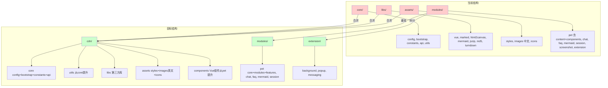
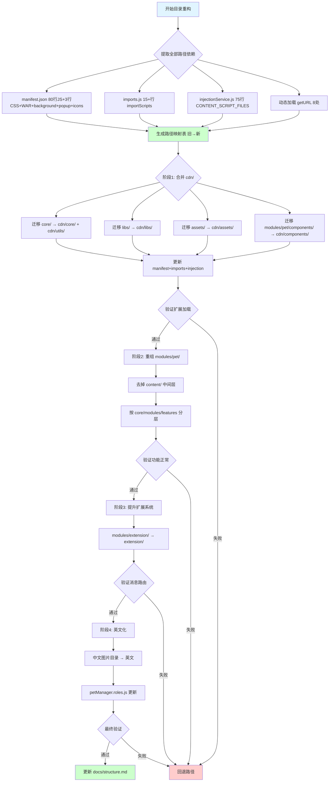
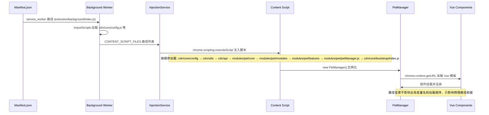

# 项目目录结构模块化重构设计

> **文档版本**: v1.1 | **最后更新**: 2026-04-27 | **维护者**: Claude Opus 4.7 | **工具**: Claude Code
>
> **关联文档**: [需求任务](./02_需求任务.md) | [使用文档](./04_使用文档.md) | [CLAUDE.md](../../CLAUDE.md)
>
> **Git 分支**: main
>
> **文档开始时间**: 11:10:00 | **文档最后更新时间**: 11:40:00

[设计概述](#设计概述) | [架构设计](#架构设计) | [修复内容](#修复内容) | [实现细节](#实现细节) | [数据结构](#数据结构)

---

## 设计概述

本设计文档基于需求任务中定义的六个主要操作场景，提供项目目录结构模块化重构的技术方案。核心目标是使 YiPet 的目录结构与 YiWeb 代码结构规范（`rules/代码结构.md`）对齐，同时保证 Chrome Extension（Manifest V3）的功能完整性。

- 🎯 **最小变更原则**：优先重命名和移动文件，不修改代码逻辑
- ⚡ **路径一致性**：所有路径变更通过 `manifest.json`、`importScripts`、`injectionService` 三处集中管理
- 🔧 **可回退性**：分四个阶段执行，每步变更可独立验证，失败时可快速回退

## 架构设计

### 整体架构



当前结构中 `core/`、`libs/`、`assets/` 职责分散，`modules/` 混合了业务模块和扩展系统，`modules/pet/` 下混合了内容脚本和 Vue 组件。目标结构按 YiWeb 规范整合为 `cdn/`（共享资源+组件）、`modules/`（业务模块按 core/modules/features 分层）、`extension/`（扩展系统独立）三大块。

### 模块划分

| 模块名称 | 职责 | 文件位置 |
|----------|------|----------|
| cdn/core | 配置、常量、引导、API 层 | `cdn/core/` |
| cdn/utils | 工具函数（从 core/utils 提升） | `cdn/utils/` |
| cdn/libs | 第三方库 | `cdn/libs/` |
| cdn/assets | 样式、图片（英文名）、图标 | `cdn/assets/` |
| cdn/components | Vue 组件（从 pet/components 提升） | `cdn/components/` |
| modules/pet | 宠物管理核心模块（core/modules/features 三层） | `modules/pet/` |
| modules/chat | 聊天导出功能 | `modules/chat/` |
| modules/faq | FAQ 系统模块 | `modules/faq/` |
| modules/mermaid | Mermaid 图表渲染模块 | `modules/mermaid/` |
| modules/session | 会话导入导出模块 | `modules/session/` |
| extension/background | 后台服务 Worker | `extension/background/` |
| extension/popup | 弹出页面 | `extension/popup/` |
| extension/messaging | 消息路由（从 background/messaging 提升） | `extension/messaging/` |

### 核心流程图



分四阶段执行的重构流程。每个阶段产出路径映射表，更新三处路径集中入口（manifest、imports、injection），然后验证。

## 修复内容

### 问题分析

当前 YiPet 项目目录结构存在以下核心问题：

1. **顶级目录职责分散**：`core/`（配置+工具+API+常量+引导）、`libs/`（第三方库）、`assets/`（资源）三个顶级目录职责重叠且命名与 YiWeb 规范不一致（YiWeb 规范使用 `cdn/` 作为共享资源根目录）

2. **功能模块混合放置**：`modules/pet/content/` 下存在 14+ 个 `petManager.*.js` 文件混合放置，核心实现（`petManager.core.js`）、功能模块（13 个 `modules/petManager.*.js`）、特性文件（10 个 `petManager.*.js`）缺乏分层，且存在多余的 `content/` 中间层

3. **Vue 组件与业务逻辑耦合**：`modules/pet/components/` 下的 Vue 组件（chat/modal/manager/editor）嵌套在业务模块内部，应提升到共享层 `cdn/components/`

4. **扩展系统与业务模块混合**：`modules/extension/` 混合在业务模块目录中，background、popup、messaging 应独立组织

5. **中文目录名**：角色图片使用中文目录名（医生、教师、甜品师、警察），与英文命名规范不一致

### 修复方案

采用分阶段重构策略：

- **阶段1**：合并 `core/`、`libs/`、`assets/` 到 `cdn/`，同时提升 `modules/pet/components/` 到 `cdn/components/`
- **阶段2**：重组 `modules/pet/content/` 为 `core/modules/features` 三层结构
- **阶段3**：将 `modules/extension/` 提升为顶级 `extension/` 目录
- **阶段4**：将中文角色图片目录名改为英文

### 修复前后对比

| 内容项 | 修复前 | 修复后 | 说明 |
|--------|--------|--------|------|
| 顶级目录 | `core/` + `libs/` + `assets/` + `modules/` | `cdn/` + `modules/` + `extension/` | 消除职责分散 |
| pet 模块结构 | `modules/pet/content/` 混合14+文件 | `modules/pet/` 下 core/modules/features 三层 | 消除混合放置 |
| Vue 组件位置 | `modules/pet/components/` | `cdn/components/` | 共享层独立 |
| 扩展系统位置 | `modules/extension/` | `extension/` 顶级目录 | 系统独立 |
| 图片目录名 | 医生/教师/甜品师/警察 | doctor/teacher/chef/police | 英文命名 |

## 影响分析

> **强制执行**：已按 `../../.claude/shared/impact-analysis-contract.md` 对整个项目执行完整影响分析。

### 搜索词与改动点清单

| 改动点 | 类型 | 搜索词 | 来源 | 备注 |
|--------|------|--------|------|------|
| `core/` → `cdn/core/` + `cdn/utils/` | config | `core/config.js`, `core/bootstrap/`, `core/constants/`, `core/api/`, `core/utils/` | manifest.json:18-30, injectionService.js:13-34 | 配置+工具+API+常量+引导 |
| `libs/` → `cdn/libs/` | dependency | `libs/vue.global.js`, `libs/marked.min.js`, `libs/html2canvas.min.js`, `libs/mermaid.min.js`, `libs/jszip.min.js`, `libs/md5.js`, `libs/turndown.js` | manifest.json:18-30, injectionService.js:13-30 | 7 个第三方库 |
| `assets/` → `cdn/assets/` | css | `assets/styles/`, `assets/images/`, `assets/icons/` | manifest.json:82-87, manifest.json:111-114 | 样式+图片+图标 |
| `modules/pet/content/` → `modules/pet/` 三层 | component | `modules/pet/content/core/`, `modules/pet/content/modules/`, `modules/pet/content/petManager.*.js`, `PetManager`, `window.PetManager` | manifest.json:41-79, injectionService.js:35-74, 42 个 JS 文件 | 宠物管理核心 |
| `modules/pet/components/` → `cdn/components/` | component | `modules/pet/components/`, `ChatWindow`, `AiSettingsModal`, `TokenSettingsModal`, `FaqManager`, `SessionTagManager` | manifest.json:42-68, web_accessible_resources:130-139 | Vue 组件 |
| `modules/extension/` → `extension/` | route | `modules/extension/background/`, `modules/extension/popup/`, `importScripts` | manifest.json:12, manifest.json:90-93, imports.js:21-43 | 扩展系统 |
| `modules/mermaid/` | dependency | `modules/mermaid/page/`, `load-mermaid.js`, `render-mermaid.js`, `preview-mermaid.js` | web_accessible_resources:123-125 | mermaid 模块（保持不变） |
| `modules/session/` | dependency | `modules/session/page/`, `load-jszip.js`, `export-sessions.js`, `import-sessions.js` | web_accessible_resources:127-129 | session 模块（保持不变） |
| 中文图片目录 | css | `医生`, `教师`, `甜品师`, `警察` | manifest.json:119-122 (通配符), petManager.roles.js | 需改为英文 |
| `manifest.json` | config | `content_scripts`, `web_accessible_resources`, `background.service_worker`, `action.default_popup` | manifest.json 全文 | 路径集中入口 |
| `imports.js` | config | `importScripts`, `safeImport` | imports.js 全文 | background 加载入口 |
| `injectionService.js` | config | `CONTENT_SCRIPT_FILES` | injectionService.js:12-75 | 动态注入入口 |

### 改动点影响链

| 改动点 | 搜索词 | 命中文件 | 引用方式 | 影响层级 | 依赖方向 | 处置方式 | 闭合状态 | 说明 |
|--------|--------|----------|----------|----------|----------|----------|----------|------|
| `core/` | `core/config.js` | manifest.json:18 | 字符串路径 | 直接 | 反向依赖 | 同步修改 | 已闭合 | |
| `core/` | `core/utils/api/` | manifest.json:19-22, injectionService.js:15-18 | 字符串路径 | 直接 | 反向依赖 | 同步修改 | 已闭合 | 4 个 API 工具 |
| `core/` | `core/utils/` | manifest.json:23-30, injectionService.js:19-34 | 字符串路径 | 直接 | 反向依赖 | 同步修改 | 已闭合 | 6 个工具子目录 |
| `core/` | `core/api/` | manifest.json:28-30 | 字符串路径 | 直接 | 反向依赖 | 同步修改 | 已闭合 | ApiManager + 2 Service |
| `core/` | `core/bootstrap/` | manifest.json:40,80 | 字符串路径 | 直接 | 反向依赖 | 同步修改 | 已闭合 | bootstrap + index |
| `PET_CONFIG` | `PET_CONFIG` | core/config.js:207-208, 48 个文件 | 全局变量 | 二级 | 上游依赖 | 无需处理 | 已闭合 | 全局暴露，路径无关 |
| `PetManager` | `window.PetManager` | core/bootstrap/index.js:17, petManager.js:19-52 | 全局变量 | 二级 | 上游依赖 | 无需处理 | 已闭合 | 类定义路径变更但全局名不变 |
| `libs/` | `libs/*.js` | manifest.json:18-30, injectionService.js:13-30 | 字符串路径 | 直接 | 反向依赖 | 同步修改 | 已闭合 | 7 个第三方库 |
| `assets/` | `assets/styles/` | manifest.json:82-87 | 字符串路径 | 直接 | 反向依赖 | 同步修改 | 已闭合 | 3 行 CSS |
| `assets/` | `assets/icons/` | manifest.json:111-114 | 字符串路径 | 直接 | 反向依赖 | 同步修改 | 已闭合 | 4 个图标 |
| `assets/` | `assets/images/` | web_accessible_resources:118-122 | 字符串路径 | 直接 | 反向依赖 | 同步修改 | 已闭合 | 角色图片通配 |
| `modules/pet/content/` | `modules/pet/content/` | manifest.json:41-79, injectionService.js:35-74 | 字符串路径 | 直接 | 反向依赖 | 同步修改 | 已闭合 | 38 行 JS 引用 |
| `modules/pet/components/` | `modules/pet/components/` | manifest.json:42-68, web_accessible_resources:130-139 | 字符串路径 | 直接 | 反向依赖 | 同步修改 | 已闭合 | Vue 组件 HTML |
| `modules/extension/` | `modules/extension/background/` | manifest.json:12 | 字符串路径 | 直接 | 反向依赖 | 同步修改 | 已闭合 | background 入口 |
| `modules/extension/` | `modules/extension/popup/` | manifest.json:90-93 | 字符串路径 | 直接 | 反向依赖 | 同步修改 | 已闭合 | popup 入口 |
| `modules/extension/` | `modules/extension/` | imports.js:21-43 | importScripts | 直接 | 反向依赖 | 同步修改 | 已闭合 | 15+ 行 background 加载 |
| 中文目录 | `医生` 等 | petManager.roles.js | 代码引用 | 直接 | 反向依赖 | 同步修改 | 已闭合 | 角色配置中图片路径 |

### 依赖闭合摘要

| 改动点 | 上游依赖是否核对 | 反向依赖是否核对 | 传递依赖是否闭合 | 测试/文档/配置是否覆盖 | 结论 |
|--------|------------------|------------------|------------------|----------------------------|------|
| `core/` → `cdn/core/` + `cdn/utils/` | 是 | 是 | 是 | 是（manifest + injection + imports） | 可实施 |
| `libs/` → `cdn/libs/` | 是 | 是 | 是 | 是（manifest + injection） | 可实施 |
| `assets/` → `cdn/assets/` | 是 | 是 | 是 | 是（manifest + WAR + icons） | 可实施 |
| `modules/pet/content/` → 三层 | 是 | 是 | 是 | 是（manifest 80行 + injection 75行） | 可实施 |
| `modules/pet/components/` → `cdn/components/` | 是 | 是 | 是 | 是（manifest + web_accessible_resources） | 可实施 |
| `modules/extension/` → `extension/` | 是 | 是 | 是 | 是（manifest + imports.js） | 可实施 |
| 中文目录 → 英文 | 是 | 是 | 是 | 是（manifest WAR 通配 + roles.js） | 可实施 |

### 未覆盖风险

| 风险来源 | 原因 | 影响 | 缓解方式 |
|----------|------|------|----------|
| `chrome.runtime.getURL()` 动态路径 | 运行时字符串拼接 | 可能遗漏动态加载路径 | 人工复核所有 getURL 调用 |
| 图片通配符 `*/run/*.png` | 通配符模式可能不匹配新目录 | 可能遗漏角色动画帧 | 人工复核 run 目录 |

### 改动范围汇总

- **需直接修改的文件数**：3 个（manifest.json、imports.js、injectionService.js）
- **需验证兼容性的文件数**：48 个（所有引用 PET_CONFIG/PetManager 的 JS 文件）
- **需追踪传递影响的文件数**：1 个（petManager.roles.js 中角色图片路径）
- **需人工复核或阻断的风险**：`chrome.runtime.getURL()` 动态路径需人工复核

---

## 实现细节

### 技术实现要点

1. **路径映射表生成**：从 manifest.json（content_scripts.js 80行+CSS 3行+WAR 20行+background+popup+icons）、imports.js（15+行）、injectionService.js（75行）和所有 `chrome.runtime.getURL()` 调用中提取路径，生成旧→新映射表
2. **分阶段执行**：按 cdn/ 合并 → pet 重组 → extension 提升 → 英文化 四阶段执行，每步独立验证
3. **加载顺序保持不变**：manifest.json content_scripts.js 的脚本加载顺序是 PetManager 功能链的关键依赖（PET_CONFIG → token → logger → error → request → … → petManager.core → modules → features → petManager.js → bootstrap/index），重构只改路径前缀不改顺序
4. **全局变量不变**：PET_CONFIG、PetManager、StorageHelper、Utils 等全局变量名不变，只改定义文件的物理路径

### 关键代码说明

**manifest.json content_scripts.js 加载顺序（当前）**：
```
core/config.js → libs/md5.js → core/utils/api/（4个）→ core/utils/（6个）→
core/constants → core/api/（3个）→ libs/marked → libs/vue → libs/html2canvas →
modules/chat → core/utils/（3个）→ core/bootstrap/bootstrap.js →
modules/pet/content/core/petManager.core.js → modules/pet/content/modules/（13个）→
modules/pet/content/（10个features）→ modules/screenshot →
modules/pet/content/petManager.js → core/bootstrap/index.js
```

**重构后加载顺序（路径变更，顺序不变）**：
```
cdn/core/config.js → cdn/libs/md5.js → cdn/utils/api/（4个）→ cdn/utils/（6个）→
cdn/constants → cdn/core/api/（3个）→ cdn/libs/marked → cdn/libs/vue → cdn/libs/html2canvas →
modules/chat → cdn/utils/（3个）→ cdn/core/bootstrap/bootstrap.js →
modules/pet/core/petManager.core.js → modules/pet/modules/（13个）→
modules/pet/features/（10个）→ modules/screenshot →
modules/pet/petManager.js → cdn/core/bootstrap/index.js
```

### 依赖关系

- **新增依赖**：无。本次重构只移动文件和修改路径引用，不引入新代码或新库
- **路径变更**：3 处集中入口（manifest.json、imports.js、injectionService.js）+ petManager.roles.js 中角色图片路径

### 测试考虑

- 验证扩展加载：在 Chrome 中加载扩展，确认无 404 错误
- 验证功能完整性：逐一测试宠物显示、聊天、截图、会话管理、FAQ
- 验证消息路由：background → content script → popup 消息传递正常
- 验证角色切换：doctor/teacher/chef/police 图片加载正常
- 验证 Mermaid 渲染：动态加载 mermaid.min.js 和渲染脚本路径正确
- 验证会话导出：动态加载 jszip.min.js 和导出脚本路径正确

## 主要操作场景实现

### 场景实现：合并核心资源到 cdn/

**关联需求任务场景**：[合并核心资源到 cdn/](./02_需求任务.md#-主要操作场景合并核心资源到-cdn)

**实现概述**：将 `core/`、`libs/`、`assets/` 三个顶级目录合并到 `cdn/` 目录下按子职责分层，同时将 Vue 组件从 `modules/pet/components/` 提升到 `cdn/components/`。

**涉及模块**：
- cdn/core：配置（config.js）、引导（bootstrap/）、常量（constants/）、API（api/）
- cdn/utils：工具函数（从 core/utils 提升，保持子目录结构）
- cdn/libs：第三方库（7 个）
- cdn/assets：样式（styles/）、图片（images/ 英文名）、图标（icons/）
- cdn/components：Vue 组件（chat/modal/manager/editor 四类）

**关键代码路径**：
- `manifest.json`：content_scripts.js 80行 + CSS 3行 + web_accessible_resources 20行 + background + popup + icons
- `modules/extension/background/bootstrap/imports.js`：15+ 行 importScripts
- `modules/extension/background/services/injectionService.js`：75 行 CONTENT_SCRIPT_FILES

**验证要点**：
- manifest.json 所有路径前缀 `core/` → `cdn/core/` 或 `cdn/utils/`、`libs/` → `cdn/libs/`、`assets/` → `cdn/assets/`
- imports.js 所有路径前缀 `core/` → `cdn/core/`、`modules/extension/` → `extension/`
- injectionService.js 所有路径同 manifest.json 变更
- web_accessible_resources 中组件模板路径 `modules/pet/components/` → `cdn/components/`
- 扩展加载无 404 错误

---

### 场景实现：重组 pet 模块分层

**关联需求任务场景**：[重组 pet 模块分层](./02_需求任务.md#-主要操作场景重组-pet-模块分层)

**实现概述**：将 `modules/pet/content/` 下的混合文件按职责拆分为 core/modules/features 三层子目录，去掉 content/ 中间层。

**涉及模块**：
- modules/pet/core：PetManager 类定义（petManager.core.js）
- modules/pet/modules：13 个功能模块（petManager.ai.js、petManager.auth.js 等）
- modules/pet/features：10 个特性文件（petManager.chat.js、petManager.drag.js 等）
- modules/pet：入口文件（petManager.js）保留在顶层

**关键代码路径**：
- `modules/pet/content/core/petManager.core.js` → `modules/pet/core/petManager.core.js`
- `modules/pet/content/modules/petManager.*.js` → `modules/pet/modules/petManager.*.js`
- `modules/pet/content/petManager.*.js` → `modules/pet/features/petManager.*.js`
- `modules/pet/content/petManager.js` → `modules/pet/petManager.js`
- manifest.json:41-79 和 injectionService.js:35-74 中路径需同步更新

**验证要点**：
- PetManager 类初始化链完整（PET_CONFIG → core → modules → features → entry → bootstrap/index）
- 所有 prototype 扩展方法可用
- manifest.json 加载顺序不变

---

### 场景实现：提升 Vue 组件到共享层

**关联需求任务场景**：[提升 Vue 组件到共享层](./02_需求任务.md#-主要操作场景提升-vue-组件到共享层)

**实现概述**：将 `modules/pet/components/` 下的 Vue 组件移入 `cdn/components/`，与阶段1合并执行。

**涉及模块**：
- cdn/components/chat：ChatWindow、ChatHeader、ChatInput、ChatMessages
- cdn/components/modal：AiSettingsModal、TokenSettingsModal
- cdn/components/manager：FaqManager、FaqTagManager、SessionTagManager
- cdn/components/editor：SessionInfoEditor

**关键代码路径**：
- `modules/pet/components/chat/ChatWindow/` → `cdn/components/chat/ChatWindow/`
- `modules/pet/components/modal/` → `cdn/components/modal/`
- manifest.json web_accessible_resources:130-139 中模板路径需更新

**验证要点**：
- HTML 模板可通过 web_accessible_resources 正确加载
- 组件 JS 加载顺序正确
- ChatWindow 的 hooks/store.js、useMethods.js、useComputed.js 路径引用更新

---

### 场景实现：提升扩展系统为顶级目录

**关联需求任务场景**：[提升扩展系统为顶级目录](./02_需求任务.md#-主要操作场景提升扩展系统为顶级目录)

**实现概述**：将 `modules/extension/` 提升为顶级 `extension/` 目录。

**涉及模块**：
- extension/background：index.js、actions/、app/、bootstrap/、integrations/、messaging/、services/
- extension/popup：index.html、index.js

**关键代码路径**：
- manifest.json:12 `background.service_worker` 路径更新
- manifest.json:90-93 `action.default_popup` 路径更新
- `modules/extension/background/bootstrap/imports.js` 内部 importScripts 路径去掉 `modules/extension/` 前缀

**验证要点**：
- background service worker 正常启动
- popup 页面可正常显示
- 消息路由正常工作
- 企业微信集成功能正常

---

### 场景实现：英文化中文目录名

**关联需求任务场景**：[英文化中文目录名](./02_需求任务.md#-主要操作场景英文化中文目录名)

**实现概述**：将角色图片中文目录名改为英文名。

**涉及模块**：
- cdn/assets/images/doctor（原 医生）
- cdn/assets/images/teacher（原 教师，含 run/ 动画帧）
- cdn/assets/images/chef（原 甜品师）
- cdn/assets/images/police（原 警察）

**关键代码路径**：
- `assets/images/医生/` → `cdn/assets/images/doctor/`
- `assets/images/教师/` → `cdn/assets/images/teacher/`
- `modules/pet/modules/petManager.roles.js` 中角色配置图片路径更新

**验证要点**：
- 角色图片加载无 404 错误
- 角色切换功能正常
- run 动画帧加载正常

---

### 场景实现：统一所有路径引用

**关联需求任务场景**：[统一所有路径引用](./02_需求任务.md#-主要操作场景统一所有路径引用)

**实现概述**：将所有文件路径引用从旧路径更新为新路径，确保 Chrome Extension 的路径依赖完整。

**涉及模块**：
- manifest.json：80 行 JS + 3 行 CSS + 20 行 WAR + 1 行 background + 1 行 popup + 4 行 icons
- imports.js：15+ 行 importScripts
- injectionService.js：75 行 CONTENT_SCRIPT_FILES
- chrome.runtime.getURL() 动态路径（8处左右）

**关键代码路径**：
- manifest.json：所有 `core/` → `cdn/core/`/`cdn/utils/`，`libs/` → `cdn/libs/`，`assets/` → `cdn/assets/`，`modules/pet/content/` → `modules/pet/`，`modules/pet/components/` → `cdn/components/`，`modules/extension/` → `extension/`
- imports.js：所有 `core/` → `cdn/core/`，`modules/extension/` → `extension/`
- injectionService.js：所有路径同 manifest 变更

**验证要点**：
- 扩展加载无 404 错误
- 所有功能正常运行
- 控制台无路径相关错误

---

## 数据结构设计

### 数据流程图



重构后脚本加载流程不变，只改变物理路径前缀。manifest.json 是路径集中管理入口，imports.js 和 injectionService.js 是辅助入口。