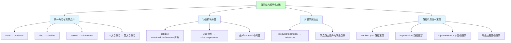
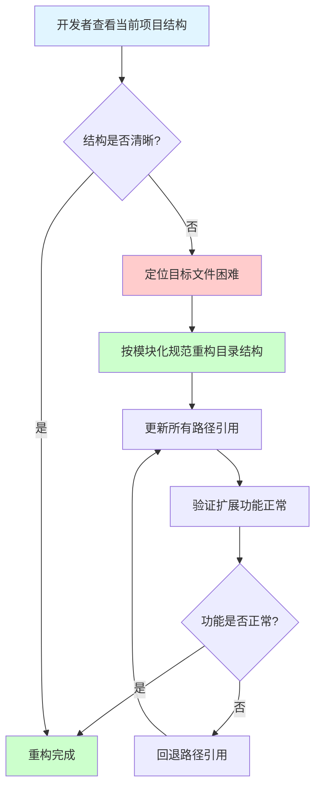
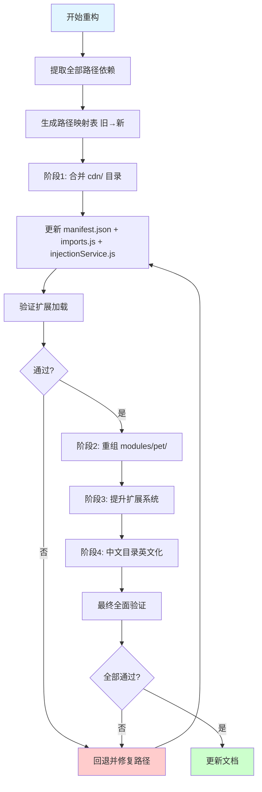
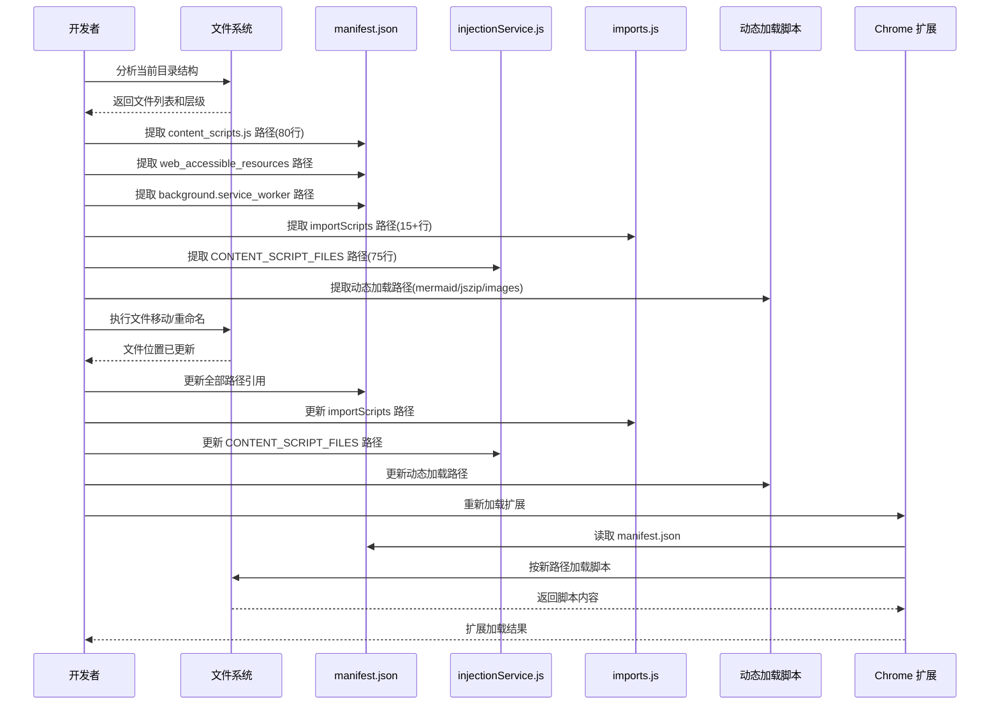

# 项目目录结构模块化重构

> **文档版本**: v1.0 | **最后更新**: 2026-04-27 | **维护者**: Claude Sonnet 4.6 | **工具**: Claude Code
>
> **关联文档**: [需求文档](./01_需求文档.md) | [设计文档](./03_设计文档.md) | [使用文档](./04_使用文档.md)
>
> **Git 分支**: main
>
> **文档开始时间**: 09:00:00 | **文档最后更新时间**: 09:35:00

[功能概述](#功能概述) | [功能分析](#功能分析) | [功能详情](#功能详情) | [验收标准](#验收标准) | [使用场景示例](#使用场景示例)

---

## 功能概述

YiPet 温柔陪伴助手的目录结构存在命名不一致、层级混乱、职责交叉等问题。本文档将需求文档中的用户故事细化为可执行的任务，定义主要操作场景和验证要点，为设计文档提供输入。

- 🎯 **问题可追溯**：每个优化任务对应明确的用户故事和验收标准
- ⚡ **场景可验证**：每个操作场景都有前置条件、操作步骤和预期结果
- 📖 **结构可复用**：优化后的目录结构可在 YiWeb 项目体系中复用

## 功能分析

### 功能分解图

本图展示了目录结构模块化重构的四个核心方向及其子任务。

### 用户流程图

开发者从发现问题到完成重构的完整流程。

### 功能流程图

目录结构重构的执行流程，包含分阶段验证和回退机制。

### 完整时序图

目录结构重构中各参与方的交互时序。

## 用户故事表格

| 用户故事 | 验收标准 | 过程生成文档 | 产出智能文档 |
|----------|----------|--------|----------|
| 🔴 作为开发者，我想要将项目目录结构按模块化开发需求重新组织，以便在不同功能模块间快速切换开发，同时保持 Chrome Extension 的路径依赖完整  **主要操作场景**： - 将 `core/`、`libs/`、`assets/` 合并到 `cdn/` 目录下按职责分层 - 将 `modules/pet/content/` 下的混合文件按 core/modules/features 三层结构重组 - 将 Vue 组件从 `modules/pet/components/` 提升到 `cdn/components/` - 将 `modules/extension/` 提升为顶级 `extension/` 目录 - 将中文角色图片目录名改为英文名 - 统一所有路径引用（manifest.json、importScripts、动态加载、injectionService） | 1. 所有目录名使用英文小写+短横线分隔 2. `manifest.json` 中所有路径可正确解析 3. 扩展加载后全部功能正常运行 4. 功能模块按 core/modules/features 三层结构组织 5. Vue 组件目录与逻辑代码目录分离 6. `injectionService.js` 中 CONTENT_SCRIPT_FILES 路径同步更新 | [需求任务](./02_需求任务.md) [设计文档](./03_设计文档.md) [项目报告](./07_项目报告.md) | [生成文档 Skill](../../.claude/skills/generate-document/SKILL.md) [需求文档规范](../../.claude/skills/generate-document/rules/需求文档.md) [代码审查 Agent](../../.claude/agents/code-reviewer.md) |

## 主要操作场景定义

### 🎯 主要操作场景：将 core/、libs/、assets/ 合并到 cdn/ 目录下按职责分层

**场景描述**：开发者将 `core/`（配置、常量、API、工具）、`libs/`（第三方库）、`assets/`（样式、图片、图标）三个顶级目录合并到 `cdn/` 目录下，并按 YiWeb 代码结构规范重新组织子目录。

**前置条件**：
- 当前 `core/` 目录包含 config、bootstrap、constants、api、utils 五个子目录
- 当前 `libs/` 目录包含 7 个第三方库文件
- 当前 `assets/` 目录包含 styles、images、icons 三类资源
- `docs/structure.md` 中已规划了 `cdn/` 目标结构但实际不存在

**操作步骤**：
1. 创建 `cdn/` 目录及其子目录结构
2. 将 `core/config.js`、`core/bootstrap/`、`core/constants/` 迁移到 `cdn/core/`
3. 将 `core/utils/` 提升到 `cdn/utils/`（不再嵌套在 core 下）
4. 将 `core/api/` 迁移到 `cdn/core/api/`
5. 将 `libs/` 迁移到 `cdn/libs/`
6. 将 `assets/` 迁移到 `cdn/assets/`
7. 更新 `manifest.json` 中所有 `core/`、`libs/`、`assets/` 前缀路径

**预期结果**：目录按 YiWeb 规范统一组织，所有路径引用正确，扩展功能正常

**验证关注点**：
- `manifest.json` 中 `content_scripts.js` 数组内 80 行路径全部更新
- `web_accessible_resources` 中路径全部更新
- `bootstrap/imports.js` 中路径全部更新
- `injectionService.js` 中 CONTENT_SCRIPT_FILES 75 行路径全部更新
- Chrome 扩展重新加载后无报错

**相关设计文档章节**：[设计文档 - 统一命名与资源合并](./03_设计文档.md#统一命名与资源合并)

### 🎯 主要操作场景：将 modules/pet/content/ 下的混合文件按 core/modules/features 三层结构重组

**场景描述**：将 `modules/pet/content/` 下混合放置的 14+ 个文件按职责拆分为 `modules/pet/core/`、`modules/pet/modules/`、`modules/pet/features/` 三个子目录，去掉 `content/` 中间层。

**前置条件**：
- `modules/pet/content/core/petManager.core.js` 在 `core/` 子目录中
- `modules/pet/content/modules/petManager.*.js` 功能模块在 `modules/` 子目录中
- `modules/pet/content/petManager.chat.js` 等特性文件直接在 `content/` 根目录
- `manifest.json` 按顺序加载这些脚本

**操作步骤**：
1. 创建 `modules/pet/core/`、`modules/pet/modules/`、`modules/pet/features/` 目录
2. 将 `modules/pet/content/core/petManager.core.js` → `modules/pet/core/petManager.core.js`
3. 将 `modules/pet/content/modules/petManager.*.js` → `modules/pet/modules/petManager.*.js`
4. 将 `modules/pet/content/petManager.chat.js` 等特性文件 → `modules/pet/features/`
5. 将 `modules/pet/content/petManager.js` 入口文件 → `modules/pet/petManager.js`
6. 将 `modules/screenshot/content/petManager.screenshot.js` → `modules/pet/features/`
7. 更新 `manifest.json` 和 `injectionService.js` 中的路径

**预期结果**：文件按职责清晰分层，`manifest.json` 加载顺序正确

**验证关注点**：
- PetManager 类的 prototype 扩展方法仍可正常挂载
- 聊天窗口功能正常
- 截图功能正常
- 会话管理功能正常

**相关设计文档章节**：[设计文档 - 功能模块分层](./03_设计文档.md#功能模块分层)

### 🎯 主要操作场景：将 Vue 组件从 modules/pet/components/ 提升到 cdn/components/

**场景描述**：将 `modules/pet/components/` 下的 Vue 组件迁移到 `cdn/components/`，作为共享组件统一管理。

**前置条件**：
- `modules/pet/components/` 下包含 chat/modal/manager/editor 四类组件
- 每个组件包含 `index.js`、`index.html`，部分有 `index.css`
- ChatWindow 组件还有 `hooks/` 子目录
- 组件通过 `web_accessible_resources` 暴露 HTML 模板

**操作步骤**：
1. 创建 `cdn/components/chat/`、`cdn/components/modal/`、`cdn/components/manager/`、`cdn/components/editor/` 目录
2. 将 `modules/pet/components/chat/` → `cdn/components/chat/`
3. 将 `modules/pet/components/modal/` → `cdn/components/modal/`
4. 将 `modules/pet/components/manager/` → `cdn/components/manager/`
5. 将 `modules/pet/components/editor/` → `cdn/components/editor/`
6. 更新 `manifest.json` 中 `content_scripts.js` 和 `web_accessible_resources` 路径

**预期结果**：组件在新位置可正常加载和渲染，所有弹窗和聊天窗口功能正常

**验证关注点**：
- ChatWindow 组件可正常创建 Vue 应用
- AiSettingsModal 和 TokenSettingsModal 弹窗可正常打开
- FAQ 管理器和标签管理器可正常操作
- `web_accessible_resources` 中的模板路径全部更新

**相关设计文档章节**：[设计文档 - 功能模块分层](./03_设计文档.md#功能模块分层)

### 🎯 主要操作场景：将 modules/extension/ 提升为顶级 extension/ 目录

**场景描述**：将 `modules/extension/` 提升为顶级 `extension/` 目录，将消息路由从 background 子目录提升到与 background 同级。

**前置条件**：
- `modules/extension/background/` 下有 actions/app/bootstrap/integrations/messaging/services 六个子目录
- `modules/extension/popup/` 下有 index.html 和 index.js
- `manifest.json` 的 `background.service_worker` 指向 `modules/extension/background/index.js`

**操作步骤**：
1. 将 `modules/extension/background/` → `extension/background/`
2. 将 `modules/extension/popup/` → `extension/popup/`
3. 将 `modules/extension/background/messaging/` → `extension/messaging/`（提升为同级）
4. 更新 `manifest.json` 中 `background.service_worker` 和 `action.default_popup` 路径
5. 更新 `bootstrap/imports.js` 中的路径

**预期结果**：扩展系统代码独立组织，background/popup/messaging 结构清晰

**验证关注点**：
- Background service worker 可正常启动
- `importScripts` 路径全部正确
- 消息路由可正常分发
- Popup 可正常打开

**相关设计文档章节**：[设计文档 - 扩展系统独立](./03_设计文档.md#扩展系统独立)

### 🎯 主要操作场景：将中文角色图片目录名改为英文名

**场景描述**：将 `assets/images/` 下的中文角色目录名（医生、教师、甜品师、警察）改为英文名（doctor、teacher、chef、police），消除中文路径的跨平台兼容性风险。

**前置条件**：
- `assets/images/` 下有医生、教师、甜品师、警察四个中文目录
- `core/utils/media/imageResourceManager.js` 中使用模板字符串构建图片路径
- `modules/pet/content/petManager.pet.js` 中通过 `chrome.runtime.getURL()` 加载角色图标

**操作步骤**：
1. 将 `assets/images/医生/` → `cdn/assets/images/doctor/`
2. 将 `assets/images/教师/` → `cdn/assets/images/teacher/`
3. 将 `assets/images/甜品师/` → `cdn/assets/images/chef/`
4. 将 `assets/images/警察/` → `cdn/assets/images/police/`
5. 更新 `imageResourceManager.js` 中的角色名映射
6. 更新 `petManager.pet.js` 中的角色名引用
7. 更新 `core/config.js` 中的 DEFAULTS.PET_ROLE 默认值
8. 更新 `manifest.json` 中 `web_accessible_resources` 的图片路径

**预期结果**：角色图片可正常加载，角色切换功能正常

**验证关注点**：
- 角色图片路径在 `chrome.runtime.getURL()` 中正确解析
- `imageResourceManager.js` 中的 `assets/images/${role}/run/${frame}.png` 模板正确生成
- 角色切换后图片和动画正常显示

**相关设计文档章节**：[设计文档 - 中文目录英文化](./03_设计文档.md#中文目录英文化)

### 🎯 主要操作场景：统一所有路径引用（manifest.json、importScripts、动态加载、injectionService）

**场景描述**：在完成目录结构重组后，统一更新所有引用路径，确保零遗漏。

**前置条件**：
- 所有文件迁移已完成
- 已建立完整的旧路径 → 新路径映射表

**操作步骤**：
1. 更新 `manifest.json` 中全部路径（content_scripts.js 80行 + web_accessible_resources + background + popup + icons）
2. 更新 `extension/background/bootstrap/imports.js` 中 importScripts 路径（15+行）
3. 更新 `extension/background/services/injectionService.js` 中 CONTENT_SCRIPT_FILES 路径（75行）
4. 更新动态加载路径：`modules/mermaid/page/load-mermaid.js`、`modules/session/page/load-jszip.js`
5. 更新 `cdn/utils/media/imageResourceManager.js` 中的图片路径
6. 更新 `modules/pet/features/petManager.pet.js` 中的角色图标路径
7. 更新 `modules/pet/modules/petManager.mermaid.js` 中的动态加载路径
8. 更新 `cdn/utils/dom/domHelper.js` 中的资源路径

**预期结果**：所有路径引用更新完成，Chrome 扩展加载后无 404 错误

**验证关注点**：
- Chrome DevTools 控制台无 404 错误
- `PET_CONFIG` 全局变量可正常访问
- `Utils` 全局变量可正常访问
- 所有功能模块正常运行

**相关设计文档章节**：[设计文档 - 路径引用统一更新](./03_设计文档.md#路径引用统一更新)

## 影响分析

> **强制执行**：按 `../../.claude/shared/impact-analysis-contract.md` 对整个项目执行完整影响分析。

### 搜索词与改动点清单

| 改动点 | 类型 | 搜索词 | 来源 | 备注 |
|--------|------|--------|------|------|
| `core/` 目录 | config | `core/`, `core/config`, `core/utils`, `core/api`, `core/bootstrap`, `core/constants` | manifest.json:17-80, imports.js:22-43, injectionService.js:13-74 | YiWeb 规范要求 `cdn/` 命名 |
| `libs/` 目录 | dependency | `libs/`, `libs/md5`, `libs/marked`, `libs/vue`, `libs/html2canvas`, `libs/mermaid`, `libs/jszip`, `libs/turndown` | manifest.json:19-34, load-mermaid.js:23, load-jszip.js:23 | 7 个第三方库文件 |
| `assets/` 目录 | css | `assets/styles/`, `assets/images/`, `assets/icons/` | manifest.json:83-85,111-114,116-121 | 样式+图片+图标 |
| `modules/extension/` | route | `modules/extension/` | manifest.json:12,91, imports.js:29-43, injectionService.js | 需提升为顶级目录 |
| `modules/pet/content/` | component | `modules/pet/content/` | manifest.json:41-79, injectionService.js:35-73 | 14+ 个混合文件 |
| `modules/pet/components/` | component | `modules/pet/components/` | manifest.json:42-68, web_accessible_resources:130-139 | Vue 组件需提升 |
| 动态加载路径 | dependency | `chrome.runtime.getURL(` | load-mermaid.js:23, load-jszip.js:23, imageResourceManager.js:37, petManager.pet.js:92,126, domHelper.js:52,240, petManager.io.js:36, petManager.mermaid.js:71,72,269,301,1841 | 所有动态路径引用 |
| `PET_CONFIG` | config | `PET_CONFIG` | config.js:202-207, storageUtils.js:24-31, bootstrap.js:8,14-15, errorHandler.js:31, injectionService.js:111 | 全局配置变量 |
| 中文角色目录 | css | `医生/`, `教师/`, `甜品师/`, `警察/`, `assets/images/` | assets/images/ 目录列表, imageResourceManager.js:182,194,227, petManager.pet.js:92,126 | 需改为英文 |
| `injectionService.js` 路径列表 | config | `CONTENT_SCRIPT_FILES` | injectionService.js:12-75 | 与 manifest.json 镜像 |

### 改动点影响链

| 改动点 | 搜索词 | 命中文件 | 引用方式 | 影响层级 | 依赖方向 | 处置方式 | 闭合状态 | 说明 |
|--------|--------|----------|----------|----------|----------|----------|----------|------|
| `core/` 目录 | `core/config.js` | manifest.json:18 | 字符串路径 | 直接 | 反向依赖 | 同步修改 | 已闭合 | content_scripts.js 引用 |
| `core/` 目录 | `core/config.js` | imports.js:22 | importScripts | 直接 | 反向依赖 | 同步修改 | 已闭合 | background 加载 |
| `core/` 目录 | `core/config.js` | injectionService.js:13 | 字符串路径 | 直接 | 反向依赖 | 同步修改 | 已闭合 | 动态注入列表 |
| `core/` 目录 | `core/utils/` | manifest.json:20-29 | 字符串路径 | 直接 | 反向依赖 | 同步修改 | 已闭合 | 10 个 utils 脚本 |
| `libs/` 目录 | `libs/mermaid.min.js` | load-mermaid.js:23 | chrome.runtime.getURL | 直接 | 反向依赖 | 同步修改 | 已闭合 | 动态加载 |
| `libs/` 目录 | `libs/jszip.min.js` | load-jszip.js:23 | chrome.runtime.getURL | 直接 | 反向依赖 | 同步修改 | 已闭合 | 动态加载 |
| `libs/` 目录 | `libs/mermaid.min.js` | petManager.mermaid.js:71 | chrome.runtime.getURL | 直接 | 反向依赖 | 同步修改 | 已闭合 | 动态加载 |
| `assets/` 目录 | `assets/images/` | imageResourceManager.js:182,194,227 | 模板字符串 | 直接 | 反向依赖 | 同步修改 | 已闭合 | 图片路径构建 |
| `assets/` 目录 | `assets/images/` | petManager.pet.js:92,126 | chrome.runtime.getURL | 直接 | 反向依赖 | 同步修改 | 已闭合 | 角色图标加载 |
| `assets/` 目录 | `assets/styles/` | manifest.json:83-85 | 字符串路径 | 直接 | 反向依赖 | 同步修改 | 已闭合 | CSS 引用 |
| `assets/` 目录 | `assets/icons/` | manifest.json:111-114 | 字符串路径 | 直接 | 反向依赖 | 同步修改 | 已闭合 | 扩展图标 |
| `modules/extension/` | `modules/extension/` | manifest.json:12,91 | 字符串路径 | 直接 | 反向依赖 | 同步修改 | 已闭合 | service_worker + popup |
| `modules/extension/` | `modules/extension/` | imports.js:29-43 | importScripts | 直接 | 反向依赖 | 同步修改 | 已闭合 | background 脚本 |
| `modules/pet/content/` | `modules/pet/content/` | manifest.json:41-79 | 字符串路径 | 直接 | 反向依赖 | 同步修改 | 已闭合 | content_scripts |
| `modules/pet/content/` | `modules/pet/content/` | injectionService.js:35-73 | 字符串路径 | 直接 | 反向依赖 | 同步修改 | 已闭合 | 动态注入列表 |
| `modules/pet/components/` | `modules/pet/components/` | manifest.json:42-68 | 字符串路径 | 直接 | 反向依赖 | 同步修改 | 已闭合 | Vue 组件 JS |
| `modules/pet/components/` | `modules/pet/components/` | web_accessible_resources:130-139 | 字符串路径 | 直接 | 反向依赖 | 同步修改 | 已闭合 | Vue 组件 HTML |
| `PET_CONFIG` | `PET_CONFIG` | storageUtils.js:24-31 | 全局变量读取 | 传递 | 上游依赖 | 保持兼容 | 已闭合 | 全局变量不受路径影响 |
| 中文角色目录 | `医生/` 等 | imageResourceManager.js:182,194,227 | 模板字符串 | 直接 | 反向依赖 | 同步修改 | 已闭合 | 需更新角色名映射 |
| 中文角色目录 | `教师/` | config.js:130 | 常量定义 | 直接 | 上游依赖 | 同步修改 | 已闭合 | DEFAULTS.PET_ROLE |
| 中文角色目录 | `教师/` | loadingAnimation.js:173 | 硬编码路径 | 直接 | 反向依赖 | 同步修改 | 已闭合 | 硬编码中文角色名 |
| `modules/mermaid/page/` | `modules/mermaid/page/` | web_accessible_resources:123-125 | 字符串路径 | 直接 | 反向依赖 | 同步修改 | 已闭合 | mermaid 脚本 |
| `modules/mermaid/page/` | `modules/mermaid/page/` | petManager.mermaid.js:72,269,301,1841 | chrome.runtime.getURL | 直接 | 反向依赖 | 同步修改 | 已闭合 | 动态加载 |
| `modules/session/page/` | `modules/session/page/` | web_accessible_resources:127-129 | 字符串路径 | 直接 | 反向依赖 | 同步修改 | 已闭合 | session 脚本 |
| `modules/session/page/` | `modules/session/page/` | petManager.io.js:36 | chrome.runtime.getURL | 直接 | 反向依赖 | 同步修改 | 已闭合 | 动态加载 |

### 依赖闭合摘要

| 改动点 | 上游依赖是否核对 | 反向依赖是否核对 | 传递依赖是否闭合 | 测试 / 文档 / 配置是否覆盖 | 结论 |
|--------|------------------|------------------|------------------|----------------------------|------|
| `core/` → `cdn/core/` | 是 | 是 | 是 | 是（manifest + imports + injectionService） | 可实施 |
| `libs/` → `cdn/libs/` | 是 | 是 | 是 | 是（manifest + 动态加载） | 可实施 |
| `assets/` → `cdn/assets/` | 是 | 是 | 是 | 是（manifest + JS 模板字符串） | 可实施 |
| `modules/extension/` → `extension/` | 是 | 是 | 是 | 是（manifest + imports） | 可实施 |
| `modules/pet/content/` → `modules/pet/` | 是 | 是 | 是 | 是（manifest + injectionService） | 可实施 |
| `modules/pet/components/` → `cdn/components/` | 是 | 是 | 是 | 是（manifest + web_accessible_resources） | 可实施 |
| 中文角色目录 | 是 | 是 | 是 | 是（imageResourceManager + petManager.pet + config + loadingAnimation） | 可实施 |
| 动态加载路径 | 是 | 是 | 是 | 是（全部 getURL 调用已追踪） | 可实施 |
| `PET_CONFIG` 全局变量 | 是 | 不适用 | 不适用 | 不适用 | 无需处理（全局变量不受路径影响） |
| `modules/mermaid/` | 是 | 是 | 是 | 是（web_accessible_resources + petManager.mermaid） | 可实施 |
| `modules/session/` | 是 | 是 | 是 | 是（web_accessible_resources + petManager.io） | 可实施 |

### 未覆盖风险

| 风险来源 | 原因 | 影响 | 缓解方式 |
|----------|------|------|----------|
| `modules/chat/content/` | 仅含 `export-chat-to-png.js` 一个文件，无需分层 | 无影响 | 保持现有结构 |
| `modules/faq/content/` | 仅含 `faq.js` 和 `tags.js` 两个文件，无需分层 | 无影响 | 保持现有结构 |
| `libs/turndown.js` 引用 | 仅在 manifest.json 中引用，无动态加载 | 低影响 | 仅更新 manifest 路径 |
| CSS `url()` 引用 | 全项目搜索未发现 CSS 中使用 `url()` 引用资源 | 无影响 | 无需处理 |
| `loadingAnimation.js:173` 硬编码中文 | `assets/images/教师/run/${frame}.png` 硬编码中文角色名 | 需同步修改 | 同步更新为英文角色名 |

### 改动范围汇总

- **需直接修改的文件数**：6 个（manifest.json、imports.js、injectionService.js、imageResourceManager.js、petManager.pet.js、loadingAnimation.js）
- **需验证兼容性的文件数**：4 个（load-mermaid.js、load-jszip.js、petManager.mermaid.js、petManager.io.js）
- **需追踪传递影响的文件数**：3 个（domHelper.js、config.js、core/utils/ui/loadingAnimationMixin.js）
- **需人工复核或阻断的风险**：无

## 功能详情

### 统一命名与资源合并

- **功能说明**：将 `core/`、`libs/`、`assets/` 三个顶级目录合并到 `cdn/` 目录下
- **价值**：与 YiWeb 项目体系一致，消除命名歧义
- **解决的痛点**：`core/utils/api/` 与 `core/api/` 职责重叠；`libs/` 命名与规范不一致
- **收益**：新开发者无需猜测目录含义

### 功能模块分层

- **功能说明**：将 `modules/pet/content/` 下的混合文件按职责拆分为 core/modules/features
- **价值**：每个文件的职责一目了然
- **解决的痛点**：14+ 个文件混合在一个目录下，无法区分核心和扩展
- **收益**：新增功能时知道该放在哪里

### 扩展系统独立

- **功能说明**：将 `modules/extension/` 提升为顶级 `extension/` 目录
- **价值**：扩展系统代码与业务逻辑解耦
- **解决的痛点**：消息处理器和服务的组织方式不一致
- **收益**：便于独立测试和维护

### 中文目录英文化

- **功能说明**：将角色图片目录从中文名改为英文名
- **价值**：消除跨平台兼容性风险
- **解决的痛点**：中文路径在某些系统和工具中可能导致编码问题
- **收益**：路径在所有环境中稳定可解析

## 验收标准

### P0 - 必须通过

- 所有目录名使用英文小写 + 短横线分隔，不含中文或大写字母
- `manifest.json` 中所有脚本和资源路径可正确解析
- 扩展加载后全部功能正常运行（宠物显示、聊天、截图、会话管理、FAQ）
- 功能模块按 core/modules/features 三层结构组织
- Vue 组件目录与逻辑代码目录分离
- `injectionService.js` 中 CONTENT_SCRIPT_FILES 路径同步更新
- `imports.js` 中 importScripts 路径同步更新
- 动态加载路径（mermaid、jszip、images）同步更新

### P1 - 应该通过

- 公共样式按功能分类存放（base/components/features）
- 第三方库集中在 `cdn/libs/` 目录
- 扩展系统代码（background/popup/messaging）独立组织
- 角色图片目录使用英文名（doctor/teacher/chef/police）
- 所有文件路径引用更新后无控制台 404 错误

### P2 - 可以有

- `docs/` 目录按规范文档体系组织
- `docs/structure.md` 同步更新
- 添加 `.gitignore` 排除构建产物和临时文件

## 使用场景示例

📋 **场景1：新开发者首次查看项目**

- 背景：新加入的开发者需要理解项目结构
- 操作：查看目录结构，根据命名即可判断每个目录的职责
- 结果：5 分钟内理解项目整体架构，快速定位目标文件

🎨 **场景2：添加新的宠物角色**

- 背景：需要添加"程序员"角色
- 操作：在 `cdn/assets/images/programmer/` 按英文名创建子目录，在角色配置模块添加新角色
- 结果：角色图片和配置都在预期位置，命名规范一致

📋 **场景3：修复聊天功能的 Bug**

- 背景：聊天窗口出现渲染问题
- 操作：在 `modules/pet/features/` 定位聊天特性逻辑，在 `cdn/components/chat/` 定位 UI 代码
- 结果：核心逻辑和 UI 代码分离清晰，修改不互相影响

🎨 **场景4：更新第三方库版本**

- 背景：需要将 Vue.js 升级到最新版本
- 操作：在 `cdn/libs/` 中替换 vue.global.js
- 结果：所有依赖该库的模块自动使用新版本

📋 **场景5：调试消息路由问题**

- 背景：Popup 发送的消息无法到达 Content Script
- 操作：在 `extension/messaging/` 定位消息路由器
- 结果：消息路由和处理器的组织清晰，快速定位问题