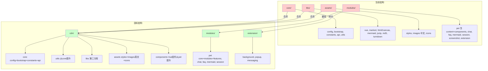
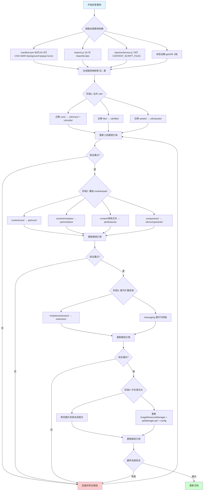
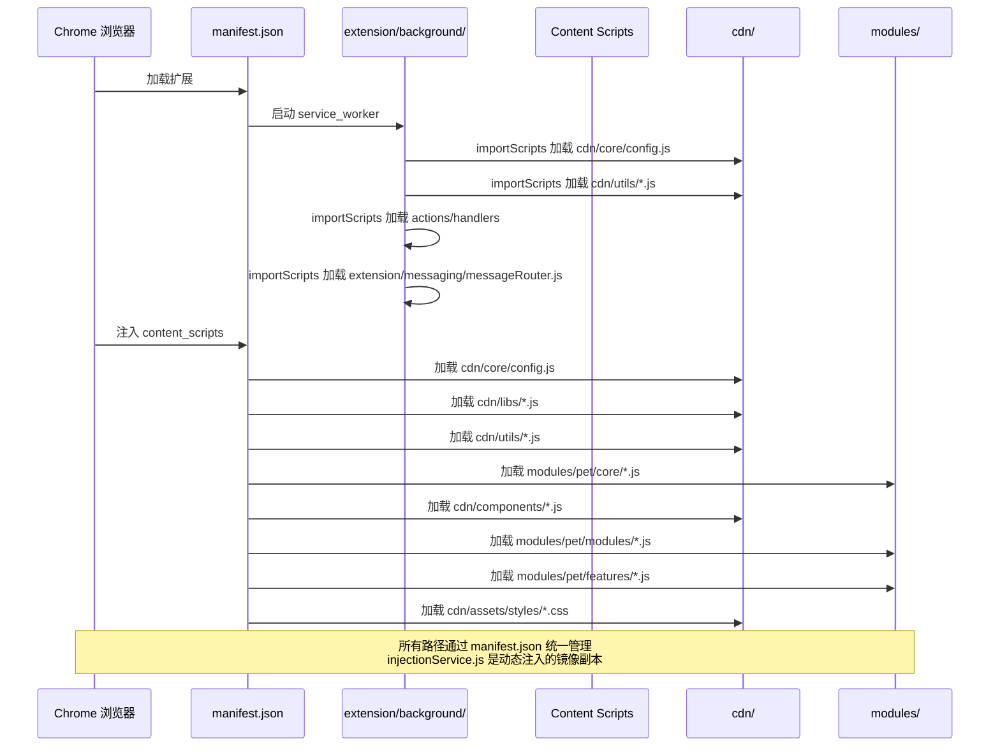

# 项目目录结构模块化重构设计

> **文档版本**: v1.0 | **最后更新**: 2026-04-27 | **维护者**: Claude Sonnet 4.6 | **工具**: Claude Code
>
> **关联文档**: [需求任务](./02_需求任务.md) | [使用文档](./04_使用文档.md) | [CLAUDE.md](../../CLAUDE.md)
>
> **Git 分支**: main
>
> **文档开始时间**: 09:00:00 | **文档最后更新时间**: 09:45:00

[设计概述](#设计概述) | [架构设计](#架构设计) | [修复内容](#修复内容) | [实现细节](#实现细节) | [数据结构](#数据结构)

---

## 设计概述

本设计文档基于需求任务中定义的六个主要操作场景，提供项目目录结构模块化重构的技术方案。核心目标是使 YiPet 的目录结构与 YiWeb 代码结构规范（`rules/代码结构.md`）对齐，同时保证 Chrome Extension（Manifest V3）的功能完整性。

- 🎯 **最小变更原则**：优先重命名和移动文件，不修改代码逻辑
- ⚡ **路径一致性**：所有路径变更通过 `manifest.json`、`importScripts`、`injectionService` 三处集中管理
- 🔧 **可回退性**：分四个阶段执行，每步变更可独立验证，失败时可快速回退

## 架构设计

### 整体架构



当前结构中 `core/`、`libs/`、`assets/` 职责分散，`modules/` 混合了业务模块和扩展系统，`modules/pet/` 下混合了内容脚本和 Vue 组件。目标结构按 YiWeb 规范整合为 `cdn/`（共享资源+组件）、`modules/`（业务模块按 core/modules/features 分层）、`extension/`（扩展系统独立）三大块。

### 模块划分

| 模块名称 | 职责 | 文件位置 |
|----------|------|----------|
| cdn/core | 配置、常量、API 层 | `cdn/core/` |
| cdn/utils | 工具函数（从 core/utils 提升） | `cdn/utils/` |
| cdn/libs | 第三方库 | `cdn/libs/` |
| cdn/assets | 样式、图片（英文名）、图标 | `cdn/assets/` |
| cdn/components | Vue 组件（从 pet/components 提升） | `cdn/components/` |
| modules/pet | 宠物管理核心模块（core/modules/features 三层） | `modules/pet/` |
| modules/chat | 聊天导出功能 | `modules/chat/` |
| modules/faq | FAQ 系统模块 | `modules/faq/` |
| modules/mermaid | Mermaid 图表渲染模块 | `modules/mermaid/` |
| modules/session | 会话导入导出模块 | `modules/session/` |
| extension/background | 后台服务 Worker | `extension/background/` |
| extension/popup | 弹出页面 | `extension/popup/` |
| extension/messaging | 消息路由（从 background/messaging 提升） | `extension/messaging/` |

### 核心流程图



目录重构的核心流程：先提取所有路径依赖生成映射表，再分四个阶段执行迁移，每阶段独立验证。

## 修复内容

### 问题分析

当前项目目录结构存在以下问题：

1. **命名不一致**：`core/` 目录与 YiWeb 规范的 `cdn/` 概念对应，但实际使用 `core/` 命名；`libs/` 目录名与 YiWeb 规范不一致
2. **职责交叉**：`core/utils/api/`（token、logger、error、request）与 `core/api/` 职责边界模糊；`utils` 嵌套在 `core` 下不符合 YiWeb 规范中 `cdn/utils/` 的独立定位
3. **层级混乱**：`modules/pet/content/` 下 14+ 个文件混合放置，核心实现、功能模块、特性文件缺乏分层；`content/` 中间层无实际意义
4. **模块归属不清**：`modules/extension/` 混合了扩展系统代码，应独立为顶级目录；Vue 组件放在 `modules/pet/components/` 下但实际上是跨模块共享资源
5. **中文路径风险**：`assets/images/医生/`、`教师/`、`甜品师/`、`警察/` 使用中文目录名，存在跨平台编码风险
6. **路径镜像不一致**：`injectionService.js` 中的 `CONTENT_SCRIPT_FILES` 是 `manifest.json` 中 `content_scripts.js` 的镜像副本，路径变更时必须同步更新两处

### 修复方案

**整体策略**：分四个阶段执行，每个阶段可独立验证。

**阶段 1：统一命名与资源合并 — 将 `core/`、`libs/`、`assets/` 合并到 `cdn/`**

| 变更项 | 修复前 | 修复后 |
|--------|--------|--------|
| 核心目录 | `core/config.js`、`core/bootstrap/`、`core/constants/`、`core/api/` | `cdn/core/config.js`、`cdn/core/bootstrap/`、`cdn/core/constants/`、`cdn/core/api/` |
| 工具目录 | `core/utils/` | `cdn/utils/`（提升一级） |
| 第三方库 | `libs/` | `cdn/libs/` |
| 资源目录 | `assets/styles/`、`assets/images/`、`assets/icons/` | `cdn/assets/styles/`、`cdn/assets/images/`、`cdn/assets/icons/` |
| 工具索引 | `core/utils/index.js` | `cdn/utils/index.js` |

**阶段 2：功能模块分层 — 重组 `modules/pet/` + 提升 Vue 组件**

| 变更项 | 修复前 | 修复后 |
|--------|--------|--------|
| 核心实现 | `modules/pet/content/core/petManager.core.js` | `modules/pet/core/petManager.core.js` |
| 功能模块 | `modules/pet/content/modules/petManager.*.js` | `modules/pet/modules/petManager.*.js` |
| 特性文件 | `modules/pet/content/petManager.chat.js` 等 | `modules/pet/features/petManager.chat.js` 等 |
| Vue 组件 | `modules/pet/components/` | `cdn/components/` |
| 入口文件 | `modules/pet/content/petManager.js` | `modules/pet/petManager.js` |
| 截图模块 | `modules/screenshot/content/petManager.screenshot.js` | `modules/pet/features/petManager.screenshot.js` |

**阶段 3：扩展系统独立 — 将 `modules/extension/` 提升为顶级目录**

| 变更项 | 修复前 | 修复后 |
|--------|--------|--------|
| 后台脚本 | `modules/extension/background/` | `extension/background/` |
| 弹出页面 | `modules/extension/popup/` | `extension/popup/` |
| 消息路由 | `modules/extension/background/messaging/` | `extension/messaging/`（与 background 同级） |

**阶段 4：中文目录英文化**

| 变更项 | 修复前 | 修复后 |
|--------|--------|--------|
| 医生角色 | `assets/images/医生/` | `cdn/assets/images/doctor/` |
| 教师角色 | `assets/images/教师/` | `cdn/assets/images/teacher/` |
| 甜品师角色 | `assets/images/甜品师/` | `cdn/assets/images/chef/` |
| 警察角色 | `assets/images/警察/` | `cdn/assets/images/police/` |
| 默认角色配置 | `config.js:130: DEFAULTS.PET_ROLE: '教师'` | `DEFAULTS.PET_ROLE: 'teacher'` |
| 硬编码路径 | `loadingAnimation.js:173: assets/images/教师/run/` | `assets/images/teacher/run/` |

### 修复前后对比

| 内容项 | 修复前 | 修复后 | 说明 |
|--------|--------|--------|------|
| 顶层目录 | `core/`、`libs/`、`assets/`、`modules/` | `cdn/`、`modules/`、`extension/` | 对齐 YiWeb 规范 |
| Vue 组件位置 | `modules/pet/components/` | `cdn/components/` | 共享组件提升到 cdn |
| 扩展系统位置 | `modules/extension/` | `extension/` | 提升为顶级目录 |
| 工具函数位置 | `core/utils/` | `cdn/utils/` | 提升到 cdn 一级 |
| 图片目录命名 | 中文角色名 | 英文角色名 | 消除中文路径 |
| pet 模块结构 | `modules/pet/content/`（扁平） | `modules/pet/`（core/modules/features 三层） | 职责分层 |
| 消息路由位置 | `modules/extension/background/messaging/` | `extension/messaging/` | 与 background 同级 |
| 路径镜像 | manifest + injectionService 两处 | 同步更新两处 | 必须保持一致 |

## 影响分析

> **强制执行**：按 `../../.claude/shared/impact-analysis-contract.md` 对整个项目执行完整影响分析。

### 搜索词与改动点清单

| 改动点 | 类型 | 搜索词 | 来源 | 备注 |
|--------|------|--------|------|------|
| `core/` 目录 | config | `core/config.js`, `core/utils/`, `core/api/`, `core/bootstrap/`, `core/constants/` | manifest.json:17-80, imports.js:22-43, injectionService.js:13-74 | 需迁移到 cdn/core/ + cdn/utils/ |
| `libs/` 目录 | dependency | `libs/md5.js`, `libs/marked.min.js`, `libs/vue.global.js`, `libs/html2canvas.min.js`, `libs/mermaid.min.js`, `libs/jszip.min.js`, `libs/turndown.js` | manifest.json:19-34, load-mermaid.js:23, load-jszip.js:23 | 需迁移到 cdn/libs/ |
| `assets/` 目录 | css | `assets/styles/`, `assets/images/`, `assets/icons/` | manifest.json:83-85,111-114,116-121 | 需迁移到 cdn/assets/ |
| `modules/extension/` | route | `modules/extension/` | manifest.json:12,91, imports.js:29-43 | 需提升为顶级 extension/ |
| `modules/pet/content/` | component | `modules/pet/content/` | manifest.json:41-79, injectionService.js:35-73 | 需重组为 core/modules/features |
| `modules/pet/components/` | component | `modules/pet/components/` | manifest.json:42-68, web_accessible_resources:130-139 | 需提升到 cdn/components/ |
| 动态加载路径 | dependency | `chrome.runtime.getURL(` | 8 处 JS 文件 | 所有 getURL 调用需更新参数 |
| 中文角色目录 | css | `医生`, `教师`, `甜品师`, `警察` | imageResourceManager.js:182,194,227, petManager.pet.js:92,126, loadingAnimation.js:155,173 | 需改为英文 |
| `injectionService.js` | config | `CONTENT_SCRIPT_FILES` | injectionService.js:12-75 | 与 manifest.json 镜像，必须同步 |
| `PET_CONFIG` | config | `PET_CONFIG` | 全局变量，10+ 处引用 | 路径变更不影响全局变量 |

### 改动点影响链

| 改动点 | 搜索词 | 命中文件 | 引用方式 | 影响层级 | 依赖方向 | 处置方式 | 闭合状态 | 说明 |
|--------|--------|----------|----------|----------|----------|----------|----------|------|
| `core/` | `core/config.js` | manifest.json:18 | 字符串路径 | 直接 | 反向依赖 | 同步修改 | 已闭合 | content_scripts 引用 |
| `core/` | `core/config.js` | imports.js:22 | importScripts | 直接 | 反向依赖 | 同步修改 | 已闭合 | background 加载 |
| `core/` | `core/utils/api/` | manifest.json:20-23 | 字符串路径 | 直接 | 反向依赖 | 同步修改 | 已闭合 | 4个API工具文件 |
| `core/` | `core/utils/` | manifest.json:24-29 | 字符串路径 | 直接 | 反向依赖 | 同步修改 | 已闭合 | 6个utils文件 |
| `core/` | `core/utils/logging/` | imports.js:24 | importScripts | 直接 | 反向依赖 | 同步修改 | 已闭合 | |
| `core/` | `core/utils/error/` | imports.js:25 | importScripts | 直接 | 反向依赖 | 同步修改 | 已闭合 | |
| `core/` | `core/utils/runtime/` | imports.js:26-27 | importScripts | 直接 | 反向依赖 | 同步修改 | 已闭合 | |
| `core/` | `core/api/` | manifest.json:28-30 | 字符串路径 | 直接 | 反向依赖 | 同步修改 | 已闭合 | |
| `core/` | `core/constants/` | manifest.json:27 | 字符串路径 | 直接 | 反向依赖 | 同步修改 | 已闭合 | |
| `core/` | `core/bootstrap/` | manifest.json:40,80 | 字符串路径 | 直接 | 反向依赖 | 同步修改 | 已闭合 | |
| `libs/` | `libs/mermaid.min.js` | load-mermaid.js:23 | chrome.runtime.getURL | 直接 | 反向依赖 | 同步修改 | 已闭合 | |
| `libs/` | `libs/jszip.min.js` | load-jszip.js:23 | chrome.runtime.getURL | 直接 | 反向依赖 | 同步修改 | 已闭合 | |
| `libs/` | `libs/mermaid.min.js` | petManager.mermaid.js:71 | chrome.runtime.getURL | 直接 | 反向依赖 | 同步修改 | 已闭合 | |
| `assets/` | `assets/images/` | imageResourceManager.js:182,194,227 | 模板字符串 | 直接 | 反向依赖 | 同步修改 | 已闭合 | |
| `assets/` | `assets/images/` | petManager.pet.js:92,126 | chrome.runtime.getURL | 直接 | 反向依赖 | 同步修改 | 已闭合 | |
| `assets/` | `assets/styles/` | manifest.json:83-85 | 字符串路径 | 直接 | 反向依赖 | 同步修改 | 已闭合 | |
| `assets/` | `assets/icons/` | manifest.json:111-114 | 字符串路径 | 直接 | 反向依赖 | 同步修改 | 已闭合 | |
| `assets/` | `assets/images/` | loadingAnimation.js:155,173 | 模板字符串 | 直接 | 反向依赖 | 同步修改 | 已闭合 | 硬编码中文角色名 |
| `modules/extension/` | `modules/extension/` | manifest.json:12,91 | 字符串路径 | 直接 | 反向依赖 | 同步修改 | 已闭合 | |
| `modules/extension/` | `modules/extension/` | imports.js:29-43 | importScripts | 直接 | 反向依赖 | 同步修改 | 已闭合 | |
| `modules/pet/content/` | `modules/pet/content/` | manifest.json:41-79 | 字符串路径 | 直接 | 反向依赖 | 同步修改 | 已闭合 | |
| `modules/pet/content/` | `modules/pet/content/` | injectionService.js:35-73 | 字符串路径 | 直接 | 反向依赖 | 同步修改 | 已闭合 | |
| `modules/pet/components/` | `modules/pet/components/` | manifest.json:42-68 | 字符串路径 | 直接 | 反向依赖 | 同步修改 | 已闭合 | |
| `modules/pet/components/` | `modules/pet/components/` | web_accessible_resources:130-139 | 字符串路径 | 直接 | 反向依赖 | 同步修改 | 已闭合 | |
| `modules/mermaid/` | `modules/mermaid/page/` | web_accessible_resources:123-125 | 字符串路径 | 直接 | 反向依赖 | 同步修改 | 已闭合 | |
| `modules/mermaid/` | `modules/mermaid/page/` | petManager.mermaid.js:72,269,301,1841 | chrome.runtime.getURL | 直接 | 反向依赖 | 同步修改 | 已闭合 | |
| `modules/session/` | `modules/session/page/` | web_accessible_resources:127-129 | 字符串路径 | 直接 | 反向依赖 | 同步修改 | 已闭合 | |
| 中文角色 | `教师` | config.js:130 | 常量 | 直接 | 上游依赖 | 同步修改 | 已闭合 | DEFAULTS.PET_ROLE |
| 中文角色 | `教师` | loadingAnimation.js:173 | 硬编码 | 直接 | 反向依赖 | 同步修改 | 已闭合 | |
| `PET_CONFIG` | `PET_CONFIG` | 10+ 文件 | 全局变量 | 传递 | 上游依赖 | 无需处理 | 已闭合 | 路径不影响全局变量 |

### 依赖闭合摘要

| 改动点 | 上游依赖是否核对 | 反向依赖是否核对 | 传递依赖是否闭合 | 测试 / 文档 / 配置是否覆盖 | 结论 |
|--------|------------------|------------------|------------------|----------------------------|------|
| `core/` → `cdn/core/` + `cdn/utils/` | 是 | 是 | 是 | 是 | 可实施 |
| `libs/` → `cdn/libs/` | 是 | 是 | 是 | 是 | 可实施 |
| `assets/` → `cdn/assets/` | 是 | 是 | 是 | 是 | 可实施 |
| `modules/extension/` → `extension/` | 是 | 是 | 是 | 是 | 可实施 |
| `modules/pet/content/` → `modules/pet/` 三层 | 是 | 是 | 是 | 是 | 可实施 |
| `modules/pet/components/` → `cdn/components/` | 是 | 是 | 是 | 是 | 可实施 |
| 中文角色目录 → 英文 | 是 | 是 | 是 | 是 | 可实施 |
| 动态加载路径 | 是 | 是 | 是 | 是 | 可实施 |
| `PET_CONFIG` | 不适用 | 不适用 | 不适用 | 不适用 | 无需处理 |

### 未覆盖风险

| 风险来源 | 原因 | 影响 | 缓解方式 |
|----------|------|------|----------|
| 角色名映射 | 需要建立中文角色名到英文角色名的双向映射 | 角色切换时需要从配置读取英文名 | 在 config.js 或 petManager.roles.js 中维护映射表 |
| `modules/mermaid/` 结构 | 目前使用 `page/` 子目录而非 `content/` | 命名与其他模块不一致 | 可保持现状或统一为 `content/` |

### 改动范围汇总

- **需直接修改的文件数**：6 个（manifest.json、imports.js、injectionService.js、imageResourceManager.js、petManager.pet.js、loadingAnimation.js）
- **需验证兼容性的文件数**：5 个（load-mermaid.js、load-jszip.js、petManager.mermaid.js、petManager.io.js、domHelper.js）
- **需追踪传递影响的文件数**：3 个（config.js、loadingAnimationMixin.js、petManager.roles.js）
- **需人工复核或阻断的风险**：角色名映射需确认中文→英文对应关系（教师→teacher、医生→doctor、甜品师→chef、警察→police）

## 实现细节

### 技术实现要点

#### 1. 路径映射表生成

在做任何文件移动前，必须先生成完整的路径映射表。本项目是零构建 Chrome Extension，所有路径变更无法依赖构建工具自动解析，必须手动更新每一处引用。

**路径引用位置清单**（从实际代码搜索结果得出）：

| 引用位置 | 引用方式 | 路径数量 | 更新策略 |
|----------|----------|----------|----------|
| `manifest.json` content_scripts.js | 字符串数组 | 80 行 | 批量替换前缀 |
| `manifest.json` content_scripts.css | 字符串数组 | 3 行 | 批量替换前缀 |
| `manifest.json` web_accessible_resources | 字符串数组 | 20+ 行 | 批量替换前缀 |
| `manifest.json` background.service_worker | 字符串 | 1 行 | 直接替换 |
| `manifest.json` action.default_popup | 字符串 | 1 行 | 直接替换 |
| `manifest.json` icons | 字符串 | 4 行 | 批量替换前缀 |
| `imports.js` | importScripts | 15+ 行 | 批量替换前缀 |
| `injectionService.js` CONTENT_SCRIPT_FILES | 字符串数组 | 75 行 | 批量替换前缀（必须与 manifest.json 保持一致） |
| 动态加载 (load-mermaid.js, load-jszip.js) | chrome.runtime.getURL | 2 行 | 直接替换参数 |
| petManager.mermaid.js | chrome.runtime.getURL | 4 行 | 直接替换参数 |
| imageResourceManager.js | 模板字符串 | 3 行 | 更新路径前缀 |
| petManager.pet.js | chrome.runtime.getURL | 2 行 | 更新路径前缀 |
| loadingAnimation.js | 模板字符串 | 2 行 | 更新路径前缀+角色名 |
| domHelper.js | chrome.runtime.getURL | 2 行 | 验证是否需更新 |
| petManager.io.js | chrome.runtime.getURL | 1 行 | 验证是否需更新 |
| config.js | 常量 | 1 行 | 更新默认角色名 |

#### 2. 文件移动策略

使用 `git mv` 而非 `cp + rm`，确保 git 历史可追溯。对于目录重命名，采用分步策略：

```bash
# 阶段 1：合并 cdn/
mkdir -p cdn/core cdn/utils cdn/libs cdn/assets
git mv core/config.js cdn/core/config.js
git mv core/bootstrap/ cdn/core/bootstrap/
git mv core/constants/ cdn/core/constants/
git mv core/api/ cdn/core/api/
git mv core/utils/ cdn/utils/
git mv libs/ cdn/libs/
git mv assets/ cdn/assets/

# 阶段 2：重组 modules/pet/
mkdir -p modules/pet/core modules/pet/modules modules/pet/features
git mv modules/pet/content/core/petManager.core.js modules/pet/core/
git mv modules/pet/content/modules/petManager.*.js modules/pet/modules/
# 特性文件逐个迁移
git mv modules/pet/content/petManager.chat.js modules/pet/features/
git mv modules/pet/content/petManager.chatUi.js modules/pet/features/
git mv modules/pet/content/petManager.drag.js modules/pet/features/
git mv modules/pet/content/petManager.events.js modules/pet/features/
git mv modules/pet/content/petManager.media.js modules/pet/features/
git mv modules/pet/content/petManager.message.js modules/pet/features/
git mv modules/pet/content/petManager.pet.js modules/pet/features/
git mv modules/pet/content/petManager.state.js modules/pet/features/
git mv modules/pet/content/petManager.ui.js modules/pet/features/
git mv modules/pet/content/petManager.js modules/pet/
git mv modules/screenshot/content/petManager.screenshot.js modules/pet/features/
# Vue 组件提升
git mv modules/pet/components/ cdn/components/

# 阶段 3：提升扩展系统
git mv modules/extension/background/ extension/background/
git mv modules/extension/popup/ extension/popup/
mkdir -p extension/messaging
git mv modules/extension/background/messaging/messageRouter.js extension/messaging/

# 阶段 4：中文目录英文化
git mv cdn/assets/images/医生/ cdn/assets/images/doctor/
git mv cdn/assets/images/教师/ cdn/assets/images/teacher/
git mv cdn/assets/images/甜品师/ cdn/assets/images/chef/
git mv cdn/assets/images/警察/ cdn/assets/images/police/
```

#### 3. manifest.json 路径更新

`manifest.json` 中有 80+ 个脚本路径需要更新。更新规则：

- `core/config.js` → `cdn/core/config.js`
- `core/utils/api/` → `cdn/utils/api/`
- `core/utils/media/` → `cdn/utils/media/`
- `core/utils/ui/` → `cdn/utils/ui/`
- `core/utils/logging/` → `cdn/utils/logging/`
- `core/utils/error/` → `cdn/utils/error/`
- `core/utils/dom/` → `cdn/utils/dom/`
- `core/utils/session/` → `cdn/utils/session/`
- `core/constants/` → `cdn/core/constants/`
- `core/api/` → `cdn/core/api/`
- `core/bootstrap/` → `cdn/core/bootstrap/`
- `libs/` → `cdn/libs/`
- `assets/styles/` → `cdn/assets/styles/`
- `assets/images/` → `cdn/assets/images/`
- `assets/icons/` → `cdn/assets/icons/`
- `modules/extension/` → `extension/`
- `modules/pet/content/core/` → `modules/pet/core/`
- `modules/pet/content/modules/` → `modules/pet/modules/`
- `modules/pet/content/petManager.*.js` → `modules/pet/features/petManager.*.js`
- `modules/pet/content/petManager.js` → `modules/pet/petManager.js`
- `modules/pet/components/` → `cdn/components/`
- `modules/screenshot/content/` → `modules/pet/features/`

#### 4. injectionService.js 路径更新

`injectionService.js` 中的 `CONTENT_SCRIPT_FILES` 静态属性必须与 `manifest.json` 中的 `content_scripts.js` 保持完全一致。路径更新规则与 manifest.json 相同。

#### 5. 动态脚本加载路径更新

以下文件包含动态脚本加载，需要更新路径参数：

- `load-mermaid.js:23`：`'libs/mermaid.min.js'` → `'cdn/libs/mermaid.min.js'`
- `load-jszip.js:23`：`'libs/jszip.min.js'` → `'cdn/libs/jszip.min.js'`
- `petManager.mermaid.js:71`：`'libs/mermaid.min.js'` → `'cdn/libs/mermaid.min.js'`
- `petManager.mermaid.js:72`：`'modules/mermaid/page/load-mermaid.js'` → 保持或更新
- `petManager.mermaid.js:269,301,1841`：`'modules/mermaid/page/render-mermaid.js'` → 保持或更新
- `imageResourceManager.js:182,194,227`：`'assets/images/${role}/...'` → `'cdn/assets/images/${role}/...'`
- `petManager.pet.js:92,126`：`'assets/images/${role}/icon.png'` → `'cdn/assets/images/${role}/icon.png'`
- `loadingAnimation.js:155,173`：`'assets/images/${role}/run/...'` → `'cdn/assets/images/${role}/run/...'`
- `domHelper.js:52,243`：验证 `chrome.runtime.getURL` 参数是否需更新

### 关键代码说明

#### injectionService.js 路径更新示例

```javascript
// 修复前
static CONTENT_SCRIPT_FILES = [
  'core/config.js',
  'libs/md5.js',
  'core/utils/api/token.js',
  // ...75 行
  'core/bootstrap/index.js'
]

// 修复后
static CONTENT_SCRIPT_FILES = [
  'cdn/core/config.js',
  'cdn/libs/md5.js',
  'cdn/utils/api/token.js',
  // ...75 行
  'cdn/core/bootstrap/index.js'
]
```

#### imageResourceManager.js 路径更新示例

```javascript
// 修复前
const imagePath = `assets/images/${role}/run/${frame}.png`

// 修复后
const imagePath = `cdn/assets/images/${role}/run/${frame}.png`
```

#### config.js 角色名更新示例

```javascript
// 修复前
DEFAULTS: {
  PET_ROLE: '教师'
}

// 修复后
DEFAULTS: {
  PET_ROLE: 'teacher'
}
```

### 依赖关系

本次重构不引入新依赖，仅调整文件位置。需要关注的依赖方向：

- `manifest.json` → 所有脚本和资源路径（最高优先级）
- `injectionService.js` → 与 manifest.json 镜像，必须同步
- `bootstrap/imports.js` → background 脚本加载顺序
- 动态加载脚本 → `chrome.runtime.getURL()` 参数
- `imageResourceManager.js` → 图片路径模板字符串

### 测试考虑

#### 必须验证的功能场景

1. **扩展加载**：Chrome 加载解包扩展后无错误
2. **宠物显示**：点击扩展图标或使用快捷键可显示/隐藏宠物
3. **聊天功能**：打开聊天窗口，发送消息，AI 响应流式渲染
4. **截图功能**：区域截图正常工作
5. **会话管理**：创建、切换、导入、导出会话
6. **FAQ 管理**：FAQ 的增删改查和标签管理
7. **Mermaid 渲染**：聊天中 Mermaid 代码块可渲染为图表
8. **角色切换**：切换宠物角色后图片和配置正确加载
9. **设置弹窗**：AI 设置和 Token 设置弹窗可正常打开和操作

#### 关键验证路径

| 功能 | 验证入口 | 涉及的关键路径 |
|------|---------|---------------|
| 宠物显示 | 点击图标/Ctrl+Shift+P | `cdn/core/config.js` → `modules/pet/core/petManager.core.js` |
| 聊天窗口 | Ctrl+Shift+X | `cdn/components/chat/ChatWindow/index.html` |
| 截图 | 聊天窗口截图按钮 | `modules/pet/features/petManager.screenshot.js` |
| 会话导入导出 | 聊天窗口菜单 | `cdn/libs/jszip.min.js`（动态加载） |
| Mermaid | 聊天中含 mermaid 代码 | `cdn/libs/mermaid.min.js`（动态加载） |
| 设置弹窗 | 聊天窗口设置按钮 | `cdn/components/modal/AiSettingsModal/index.html` |

## 主要操作场景实现

### 场景实现：将 core/、libs/、assets/ 合并到 cdn/ 目录下按职责分层

**关联需求任务场景**：[将 core/、libs/、assets/ 合并到 cdn/](./02_需求任务.md#主要操作场景定义)

**实现概述**：将 `core/` 目录整体迁移到 `cdn/core/`，将 `core/utils/` 提升到 `cdn/utils/`，将 `libs/` 迁移到 `cdn/libs/`，将 `assets/` 迁移到 `cdn/assets/`，同时更新所有引用路径。

**涉及模块**：
- `cdn/core/`：配置、常量、API 层
- `cdn/utils/`：工具函数（从 `core/utils/` 提升）
- `cdn/libs/`：第三方库
- `cdn/assets/`：样式、图片、图标

**关键代码路径**：
- `core/config.js` → `cdn/core/config.js`
- `core/utils/index.js` → `cdn/utils/index.js`
- `libs/vue.global.js` → `cdn/libs/vue.global.js`
- `assets/styles/content.css` → `cdn/assets/styles/content.css`
- `manifest.json`：content_scripts.js 数组 80 行路径更新
- `imports.js`：importScripts 15+ 行路径更新
- `injectionService.js`：CONTENT_SCRIPT_FILES 75 行路径更新

**验证要点**：
- `manifest.json` 中 `content_scripts.js` 数组的所有路径更新
- `imports.js` 中的所有路径更新
- `injectionService.js` 中的所有路径更新
- `PET_CONFIG` 全局变量可正常访问
- `Utils` 全局变量可正常访问

### 场景实现：将 modules/pet/content/ 下的混合文件按 core/modules/features 三层结构重组

**关联需求任务场景**：[将 modules/pet/content/ 重组](./02_需求任务.md#主要操作场景定义)

**实现概述**：将 `modules/pet/content/` 下的文件按职责拆分为 `modules/pet/core/`、`modules/pet/modules/`、`modules/pet/features/` 三个子目录，去掉 `content/` 中间层。

**涉及模块**：
- `modules/pet/core/`：PetManager 核心类定义
- `modules/pet/modules/`：功能扩展模块
- `modules/pet/features/`：特性文件（chat、drag、pet、state 等）

**关键代码路径**：
- `modules/pet/content/core/petManager.core.js` → `modules/pet/core/petManager.core.js`
- `modules/pet/content/modules/petManager.ai.js` → `modules/pet/modules/petManager.ai.js`
- `modules/pet/content/petManager.chat.js` → `modules/pet/features/petManager.chat.js`
- `modules/pet/content/petManager.js` → `modules/pet/petManager.js`
- `modules/screenshot/content/petManager.screenshot.js` → `modules/pet/features/petManager.screenshot.js`

**验证要点**：
- PetManager 类的 prototype 扩展方法正常挂载
- `manifest.json` 中 content_scripts.js 的加载顺序正确
- 聊天、截图、拖拽、事件处理等功能正常

### 场景实现：将 Vue 组件从 modules/pet/components/ 提升到 cdn/components/

**关联需求任务场景**：[Vue 组件提升](./02_需求任务.md#主要操作场景定义)

**实现概述**：将 `modules/pet/components/` 下的 Vue 组件迁移到 `cdn/components/`，作为共享组件统一管理。

**涉及模块**：
- `cdn/components/chat/`：聊天相关组件
- `cdn/components/modal/`：弹窗组件
- `cdn/components/manager/`：管理器组件
- `cdn/components/editor/`：编辑器组件

**关键代码路径**：
- `modules/pet/components/chat/ChatWindow/` → `cdn/components/chat/ChatWindow/`
- `modules/pet/components/modal/AiSettingsModal/` → `cdn/components/modal/AiSettingsModal/`
- `modules/pet/components/manager/FaqManager/` → `cdn/components/manager/FaqManager/`
- `manifest.json`：`web_accessible_resources` 路径更新

**验证要点**：
- ChatWindow 的 HTML 模板可通过 `web_accessible_resources` 正确加载
- Vue 应用可正常创建和挂载
- 弹窗组件可正常打开和关闭

### 场景实现：将 modules/extension/ 提升为顶级 extension/ 目录

**关联需求任务场景**：[扩展系统独立](./02_需求任务.md#主要操作场景定义)

**实现概述**：将 `modules/extension/` 提升为顶级 `extension/` 目录，将消息路由从 background 子目录提升到与 background 同级。

**涉及模块**：
- `extension/background/`：后台服务 Worker
- `extension/popup/`：弹出页面
- `extension/messaging/`：消息路由（从 background/messaging/ 提升）

**关键代码路径**：
- `modules/extension/background/index.js` → `extension/background/index.js`
- `modules/extension/background/bootstrap/imports.js` → `extension/background/bootstrap/imports.js`
- `modules/extension/background/messaging/messageRouter.js` → `extension/messaging/messageRouter.js`
- `modules/extension/popup/index.html` → `extension/popup/index.html`
- `manifest.json`：background.service_worker 和 action.default_popup 路径更新

**验证要点**：
- Background service worker 可正常启动
- `importScripts` 路径全部正确
- 消息路由可正常分发
- Popup 可正常打开

### 场景实现：将中文角色图片目录名改为英文名

**关联需求任务场景**：[中文目录英文化](./02_需求任务.md#主要操作场景定义)

**实现概述**：将 `cdn/assets/images/` 下的中文角色目录名改为英文名，并更新代码中所有引用。

**涉及模块**：
- `cdn/assets/images/`：角色图片资源
- `cdn/utils/media/imageResourceManager.js`：图片路径构建
- `modules/pet/features/petManager.pet.js`：角色图标加载
- `cdn/utils/ui/loadingAnimation.js`：加载动画
- `cdn/core/config.js`：默认角色配置

**关键代码路径**：
- `cdn/assets/images/医生/` → `cdn/assets/images/doctor/`
- `cdn/assets/images/教师/` → `cdn/assets/images/teacher/`
- `cdn/assets/images/甜品师/` → `cdn/assets/images/chef/`
- `cdn/assets/images/警察/` → `cdn/assets/images/police/`
- `imageResourceManager.js:182,194,227`：路径模板更新
- `petManager.pet.js:92,126`：getURL 参数更新
- `loadingAnimation.js:155,173`：路径模板+角色名更新
- `config.js:130`：DEFAULTS.PET_ROLE 更新

**验证要点**：
- 角色图片路径在 `chrome.runtime.getURL()` 中正确解析
- `imageResourceManager.js` 中的模板字符串正确生成
- 角色切换后图片和动画正常显示

### 场景实现：统一所有路径引用

**关联需求任务场景**：[路径引用统一更新](./02_需求任务.md#主要操作场景定义)

**实现概述**：在完成目录结构重组后，统一更新所有引用路径，确保零遗漏。核心是同步更新 manifest.json、imports.js、injectionService.js 三处路径列表，以及所有动态加载路径。

**涉及模块**：
- `manifest.json`：80+ 行 JS 路径 + 3 行 CSS + 20+ 行 WAR + background + popup + icons
- `extension/background/bootstrap/imports.js`：15+ 行 importScripts
- `extension/background/services/injectionService.js`：75 行 CONTENT_SCRIPT_FILES
- 动态加载脚本：8 处 `chrome.runtime.getURL()` 调用

**关键代码路径**：
- 全部路径更新规则见「实现细节 - manifest.json 路径更新」一节

**验证要点**：
- Chrome DevTools 控制台无 404 错误
- `PET_CONFIG` 全局变量可正常访问
- `Utils` 全局变量可正常访问
- 所有功能模块正常运行

## 数据结构

### 数据流程图



Chrome 扩展加载时的脚本依赖流程。`manifest.json` 是所有路径的入口，cdn/ 提供共享资源和工具，modules/ 提供业务逻辑，extension/ 提供扩展系统支持。`injectionService.js` 中的路径列表必须与 manifest.json 保持一致。