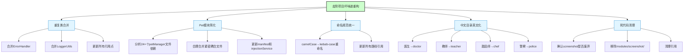
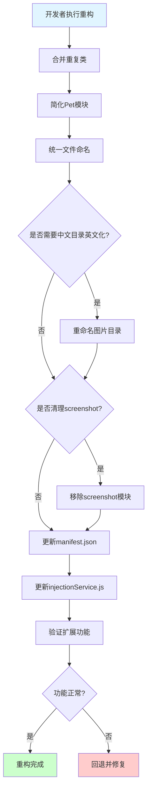
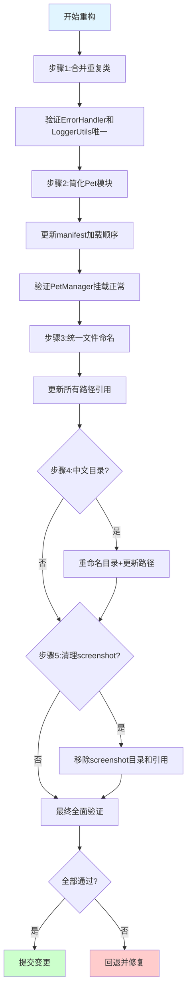
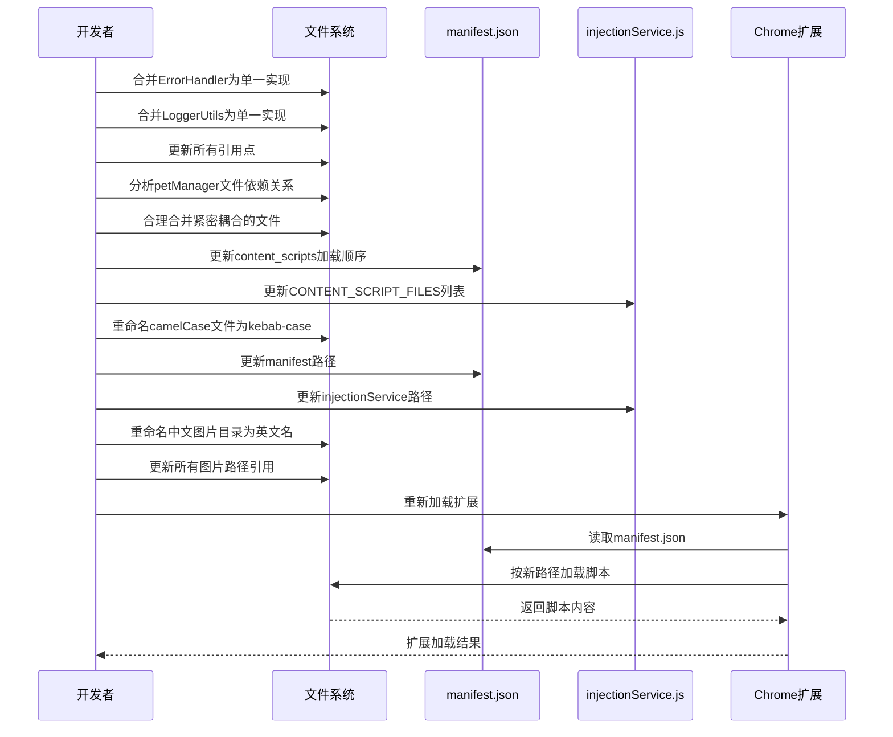

# 去除项目坏味道与模块化重构

> **文档版本**: v1.0 | **最后更新**: 2026-04-27 | **维护者**: Claude Opus 4.7 | **工具**: Claude Code
>
> **关联文档**: [需求文档](./01_需求文档.md) | [设计文档](./03_设计文档.md) | [使用文档](./04_使用文档.md)
>
> **Git 分支**: main
>
> **文档开始时间**: 21:00:00 | **文档最后更新时间**: 21:30:00

[功能概述](#功能概述) | [功能分析](#功能分析) | [功能详情](#功能详情) | [验收标准](#验收标准) | [使用场景示例](#使用场景示例)

---

## 功能概述

YiPet 温柔陪伴助手当前存在多处代码味道：重复的 ErrorHandler 和 LoggerUtils 类、pet 模块过度细分为 24+ 个文件、manifest.json 中硬编码 76 个脚本路径、命名不一致、中文目录名存在跨平台风险、screenshot 模块疑似死代码等。本文档将需求文档中的用户故事细化为可执行的任务，定义主要操作场景和验证要点，为设计文档提供输入。

- 🎯 **重复代码消除**：ErrorHandler 和 LoggerUtils 合并为单一实现
- ⚡ **模块结构简化**：petManager 文件合理合并，降低复杂度
- 🔧 **命名规范统一**：文件命名统一为 kebab-case
- 📖 **死代码清理**：移除未使用的 screenshot 模块（如确认废弃）
- 🔒 **影响可追溯**：所有变更有完整的影响分析

## 功能分析

### 功能分解图

**功能分解图说明**：去除代码味道重构的五个核心方向及其子任务。

### 用户流程图

**用户流程图说明**：开发者执行重构的完整流程，包含验证和回退机制。

### 功能流程图

**功能流程图说明**：重构的执行步骤，分阶段验证确保可回退。

### 完整时序图

**时序图说明**：重构过程中各参与方的交互时序。

## 用户故事表格（必须从需求文档提取）

| 用户故事 | 验收标准 | 过程生成文档 | 产出智能文档 |
|----------|----------|--------|----------|
| 🔴 作为开发者，我想要合并重复的 ErrorHandler 和 LoggerUtils 类，以便消除代码冗余，避免维护两套实现  **主要操作场景**： - 合并 `core/utils/api/error.js` 和 `core/utils/error/errorHandler.js` - 合并 `core/utils/api/logger.js` 和 `core/utils/logging/loggerUtils.js` - 更新所有引用点 - 验证功能正常 | 1. 项目中只有一个 ErrorHandler 实现 2. 项目中只有一个 LoggerUtils 实现 3. 所有引用点指向同一实现 4. 日志和错误处理功能正常 | [需求任务](./02_需求任务.md) [设计文档](./03_设计文档.md) [项目报告](./07_项目报告.md) | [生成文档 Skill](../../.claude/skills/generate-document/SKILL.md) [需求文档规范](../../.claude/skills/generate-document/rules/需求文档.md) [文档检索 Agent](../../.claude/agents/docs-lookup.md) [代码审查 Agent](../../.claude/agents/code-reviewer.md) |
| 🔴 作为开发者，我想要合理合并 petManager 过度细分的文件，以便降低模块复杂度，提升可维护性  **主要操作场景**： - 分析 24+ 个 petManager.*.js 文件的依赖关系 - 将紧密耦合的文件合并 - 保持核心逻辑与功能扩展的分离 - 更新 manifest.json 和 injectionService.js | 1. pet 模块文件数量合理减少（目标 <15 个） 2. manifest.json 脚本加载顺序正确 3. PetManager 所有方法正常挂载 4. 宠物功能全部正常 | [需求任务](./02_需求任务.md) [设计文档](./03_设计文档.md) [项目报告](./07_项目报告.md) | [生成文档 Skill](../../.claude/skills/generate-document/SKILL.md) [需求文档规范](../../.claude/skills/generate-document/rules/需求文档.md) [架构设计 Agent](../../.claude/agents/architect.md) |
| 🔴 作为开发者，我想要统一文件命名规范，以便提升代码一致性和可读性  **主要操作场景**： - 将 camelCase 文件名改为 kebab-case - 保持类名 PascalCase 不变 - 更新所有 importScripts 和动态加载路径 - 更新 manifest.json 和 injectionService.js | 1. 所有文件名使用 kebab-case 2. 所有类名使用 PascalCase 3. manifest.json 路径正确 4. 无控制台 404 错误 | [需求任务](./02_需求任务.md) [设计文档](./03_设计文档.md) [项目报告](./07_项目报告.md) | [生成文档 Skill](../../.claude/skills/generate-document/SKILL.md) [需求文档规范](../../.claude/skills/generate-document/rules/需求文档.md) |
| 🟡 作为开发者，我想要将中文角色图片目录改为英文名，以便消除跨平台编码风险  **主要操作场景**： - 将 `医生/` 改为 `doctor/` - 将 `教师/` 改为 `teacher/` - 将 `甜品师/` 改为 `chef/` - 将 `警察/` 改为 `police/` - 更新 config.js 默认角色名 - 更新所有图片路径引用 | 1. assets/images/ 下无中文目录名 2. config.js 默认角色使用英文名 3. 图片加载无 404 错误 4. 角色切换功能正常 | [需求任务](./02_需求任务.md) [设计文档](./03_设计文档.md) [项目报告](./07_项目报告.md) | [生成文档 Skill](../../.claude/skills/generate-document/SKILL.md) [需求文档规范](../../.claude/skills/generate-document/rules/需求文档.md) |
| 🟡 作为开发者，我想要移除未使用的 screenshot 模块，以便减少代码库负担  **主要操作场景**： - 确认 screenshot 功能是否真的已废弃 - 移除 modules/screenshot/ 目录 - 移除 manifest.json 中相关脚本 - 移除其他模块中对 screenshot 的引用 | 1. modules/screenshot/ 目录已删除 2. manifest.json 中无 screenshot 相关脚本 3. 无对 screenshot 模块的遗留引用 4. 其他功能不受影响 | [需求任务](./02_需求任务.md) [设计文档](./03_设计文档.md) [项目报告](./07_项目报告.md) | [生成文档 Skill](../../.claude/skills/generate-document/SKILL.md) [需求文档规范](../../.claude/skills/generate-document/rules/需求文档.md) |

## 主要操作场景定义（必须包含）

#### 🎯 主要操作场景：合并重复的 ErrorHandler 类

**场景描述**：将 `core/utils/api/error.js` 和 `core/utils/error/errorHandler.js` 合并为单一实现，消除代码冗余。

**前置条件**：
- 项目可正常构建
- 当前两个 ErrorHandler 实现都正常工作
- 已备份当前状态（git commit）

**操作步骤**：
1. 对比分析两个 ErrorHandler 实现的功能差异
2. 选择功能更完整的实现作为基准（`core/utils/error/errorHandler.js`）
3. 将另一个实现的独有功能合并进来
4. 搜索所有引用 `ErrorHandler` 的文件
5. 更新所有引用点，指向新的统一实现
6. 删除冗余的 `core/utils/api/error.js`
7. 更新 manifest.json 移除对已删除文件的引用
8. 更新 injectionService.js 移除对已删除文件的引用

**预期结果**：
- 项目中只有一个 ErrorHandler 实现
- 所有引用点指向同一实现
- 错误处理功能正常
- 无控制台错误

**验证关注点**：
- 确认没有遗漏的引用点
- 验证 API 调用错误处理正常
- 验证网络错误处理正常
- 验证超时错误处理正常

**相关设计文档章节**：[设计文档-重复类合并](./03_设计文档.md#修复内容)

---

#### 🎯 主要操作场景：合并重复的 LoggerUtils 类

**场景描述**：将 `core/utils/api/logger.js` 和 `core/utils/logging/loggerUtils.js` 合并为单一实现，消除代码冗余。

**前置条件**：
- 项目可正常构建
- 当前两个 Logger/LoggerUtils 实现都正常工作
- 已备份当前状态（git commit）

**操作步骤**：
1. 对比分析两个日志实现的功能差异
2. 选择功能更完整的实现作为基准
3. 将另一个实现的独有功能合并进来
4. 搜索所有引用 `Logger` 或 `LoggerUtils` 的文件
5. 更新所有引用点，指向新的统一实现
6. 删除冗余的日志文件
7. 更新 manifest.json 移除对已删除文件的引用
8. 更新 injectionService.js 移除对已删除文件的引用

**预期结果**：
- 项目中只有一个 LoggerUtils 实现
- 所有引用点指向同一实现
- 日志记录功能正常
- 日志静默功能正常
- 无控制台错误

**验证关注点**：
- 确认没有遗漏的引用点
- 验证日志输出正常
- 验证日志静默开关正常
- 验证不同日志级别正常

**相关设计文档章节**：[设计文档-重复类合并](./03_设计文档.md#修复内容)

---

#### 🎯 主要操作场景：简化 Pet 模块文件结构

**场景描述**：分析并合理合并 petManager 过度细分的 24+ 个文件，降低模块复杂度。

**前置条件**：
- 项目可正常构建
- 当前 pet 模块功能正常
- 已备份当前状态（git commit）
- 已完成重复类合并

**操作步骤**：
1. 分析 `modules/pet/content/` 和 `modules/pet/content/modules/` 下所有文件的依赖关系
2. 识别紧密耦合的文件组（如 chat+chatUi+message、pet+state+ui 等）
3. 将紧密耦合的文件合并，保持 core/modules/features 的逻辑分层
4. 更新 manifest.json 中的脚本列表和加载顺序
5. 更新 injectionService.js 中的 CONTENT_SCRIPT_FILES 列表
6. 验证 PetManager 原型链正确挂载

**预期结果**：
- pet 模块文件数量合理减少（目标 <15 个）
- manifest.json 脚本加载顺序正确
- PetManager 所有方法正常挂载
- 宠物显示、聊天、拖拽等功能全部正常
- 无控制台错误

**验证关注点**：
- PetManager 核心类必须在扩展方法之前加载
- 验证所有原型方法正常挂载
- 验证宠物显示/隐藏正常
- 验证聊天窗口功能正常
- 验证拖拽功能正常
- 验证角色切换正常

**相关设计文档章节**：[设计文档-Pet模块简化](./03_设计文档.md#修复内容)

---

#### 🎯 主要操作场景：统一文件命名规范

**场景描述**：将所有文件名从 camelCase 或 petManager.*.js 格式统一为 kebab-case 格式。

**前置条件**：
- 项目可正常构建
- 当前功能正常
- 已备份当前状态（git commit）
- 已完成重复类合并和 Pet 模块简化

**操作步骤**：
1. 识别所有不符合 kebab-case 规范的文件
2. 使用 git mv 重命名文件（保留 git 历史）：
   - `petManager.chat.js` → `pet-manager-chat.js`
   - `petManager.chatUi.js` → `pet-manager-chat-ui.js`
   - `injectionService.js` → `injection-service.js`
   - 等等
3. 更新 manifest.json 中所有路径引用
4. 更新 injectionService.js 中所有路径引用
5. 更新 imports.js 中所有路径引用
6. 更新所有动态加载路径（如 load-mermaid.js、load-jszip.js）
7. 更新 web_accessible_resources 中的路径

**预期结果**：
- 所有文件名使用 kebab-case
- 所有类名保持 PascalCase
- manifest.json 路径正确
- 无控制台 404 错误
- 所有功能正常

**验证关注点**：
- 逐行比对 manifest.json 路径
- 逐行比对 injectionService.js 路径
- 验证 Chrome DevTools Network 面板无 404
- 验证所有功能正常

**相关设计文档章节**：[设计文档-命名规范统一](./03_设计文档.md#修复内容)

---

#### 🎯 主要操作场景：中文角色图片目录英文化

**场景描述**：将 `assets/images/` 下的中文目录名改为英文名，消除跨平台编码风险。

**前置条件**：
- 项目可正常构建
- 当前图片加载正常
- 已备份当前状态（git commit）
- 已完成前面的重构步骤

**操作步骤**：
1. 使用 git mv 重命名目录（保留 git 历史）：
   - `医生/` → `doctor/`
   - `教师/` → `teacher/`
   - `甜品师/` → `chef/`
   - `警察/` → `police/`
2. 更新 `core/config.js` 中 DEFAULTS.PET_ROLE 从 `'教师'` 改为 `'teacher'`
3. 更新 `core/utils/media/imageResourceManager.js` 中的路径引用
4. 更新 `modules/pet/content/petManager.pet.js` 中的角色名引用
5. 更新 `core/utils/ui/loadingAnimation.js` 中的路径和角色名
6. 更新 manifest.json web_accessible_resources 中的图片路径

**预期结果**：
- assets/images/ 下无中文目录名
- config.js 默认角色使用英文名
- 图片加载无 404 错误
- 角色切换功能正常
- 加载动画正常

**验证关注点**：
- Chrome DevTools Network 面板无图片 404
- 默认角色（teacher）图片正常显示
- 角色切换到 doctor/chef/police 都正常
- 加载动画正常

**相关设计文档章节**：[设计文档-中文目录英文化](./03_设计文档.md#修复内容)

---

#### 🎯 主要操作场景：清理 Screenshot 死代码

**场景描述**：确认并移除未使用的 screenshot 模块，减少代码库负担。

**前置条件**：
- 已确认 screenshot 功能确实已废弃（参考 README.md v1.1.0）
- 已备份当前状态（git commit）

**操作步骤**：
1. 确认 README.md 中关于"移除截图功能"的记录
2. 搜索整个代码库中对 screenshot 模块的引用
3. 删除 `modules/screenshot/` 目录
4. 从 manifest.json 移除 screenshot 相关脚本
5. 从 injectionService.js 移除 screenshot 相关脚本
6. 清理其他模块中对 screenshot 的引用（如菜单、按钮等）

**预期结果**：
- modules/screenshot/ 目录已删除
- manifest.json 中无 screenshot 相关脚本
- 无对 screenshot 模块的遗留引用
- 其他功能不受影响

**验证关注点**：
- 确认无遗留的 import 或引用
- 验证菜单功能正常（如存在截图菜单项需移除）
- 验证聊天窗口功能正常
- 验证其他功能不受影响

**相关设计文档章节**：[设计文档-死代码清理](./03_设计文档.md#修复内容)

## 影响分析（必须包含）

#### 执行步骤

0. **读取共享契约**：先读取 `../../shared/impact-analysis-contract.md`，适用阶段、搜索范围、必查维度、输出格式、依赖闭合标准和 P0 门禁以该文件为准。
1. **确定核心标识符**：从需求文档中提取本次功能涉及的核心模块名、组件名、事件名、Store key、路由路径、CSS 类名/变量、公用工具函数名、配置项、依赖包名等关键标识符，形成"搜索词与改动点清单"。
2. **按契约全项目搜索**：对每个搜索词在整个仓库执行分类搜索，记录所有命中路径与行号；不得只搜索当前目录或 `src/`。搜索必须覆盖实现点、导出入口、注册入口、公共聚合入口、测试、文档、配置与外部依赖。
3. **追踪依赖链闭合**：对每个命中点继续检查其上游依赖、调用方、导出方、注册入口、消费方、测试和文档引用，直到影响链闭合或明确记录停止原因。
4. **排除无关结果**：排除 `node_modules/`、`dist/`、`*.lock`、文档自身等非业务文件；如排除的自动生成快照可能影响验收，必须写入未覆盖风险。
5. **标注处置方式**：同步修改、保持兼容、补充验证、人工复核、无需处理。

#### 搜索词与改动点清单

| 改动点 | 类型 | 搜索词 | 来源 | 备注 |
|--------|------|--------|------|------|
| ErrorHandler 类 | class | ErrorHandler, errorHandler | core/utils/api/error.js, core/utils/error/errorHandler.js | 重复实现，需合并 |
| Logger/LoggerUtils 类 | class | Logger, LoggerUtils, loggerUtils | core/utils/api/logger.js, core/utils/logging/loggerUtils.js | 重复实现，需合并 |
| petManager.*.js 文件 | file | petManager\. | modules/pet/content/ | 过度细分，需简化 |
| injectionService.js | file | injectionService | modules/extension/background/services/ | 路径可能需更新 |
| imports.js | file | imports\.js | core/ | 路径可能需更新 |
| 中文目录名 | directory | 医生, 教师, 甜品师, 警察 | assets/images/ | 需改为英文名 |
| screenshot 模块 | module | screenshot | modules/screenshot/ | 疑似死代码，需确认 |
| DEFAULTS.PET_ROLE | config | PET_ROLE | core/config.js | 默认角色名需更新 |

#### 改动点影响链

| 改动点 | 搜索词 | 命中文件 | 引用方式 | 影响层级 | 依赖方向 | 处置方式 | 闭合状态 | 说明 |
|--------|--------|----------|----------|----------|----------|--------|------|
| ErrorHandler | ErrorHandler | manifest.json | content_scripts | 直接 | 反向依赖 | 同步修改 | 待搜索 | manifest 中引用 |
| ErrorHandler | ErrorHandler | injectionService.js | CONTENT_SCRIPT_FILES | 直接 | 反向依赖 | 同步修改 | 待搜索 | injectionService 中引用 |
| ErrorHandler | ErrorHandler | 其他文件 | import/全局引用 | 直接 | 反向依赖 | 同步修改 | 待搜索 | 需全项目搜索 |
| LoggerUtils | Logger, LoggerUtils | manifest.json | content_scripts | 直接 | 反向依赖 | 同步修改 | 待搜索 | manifest 中引用 |
| LoggerUtils | Logger, LoggerUtils | injectionService.js | CONTENT_SCRIPT_FILES | 直接 | 反向依赖 | 同步修改 | 待搜索 | injectionService 中引用 |
| LoggerUtils | Logger, LoggerUtils | 其他文件 | import/全局引用 | 直接 | 反向依赖 | 同步修改 | 待搜索 | 需全项目搜索 |
| petManager 文件 | petManager\. | manifest.json | content_scripts | 直接 | 反向依赖 | 同步修改 | 待搜索 | 76 个脚本引用 |
| petManager 文件 | petManager\. | injectionService.js | CONTENT_SCRIPT_FILES | 直接 | 反向依赖 | 同步修改 | 待搜索 | 76 个脚本引用 |
| 中文目录 | 医生, 教师, 甜品师, 警察 | imageResourceManager.js | chrome.runtime.getURL | 直接 | 反向依赖 | 同步修改 | 待搜索 | 图片路径引用 |
| 中文目录 | 医生, 教师, 甜品师, 警察 | petManager.pet.js | 角色名引用 | 直接 | 反向依赖 | 同步修改 | 待搜索 | 角色名引用 |
| 中文目录 | 医生, 教师, 甜品师, 警察 | loadingAnimation.js | 路径/角色名 | 直接 | 反向依赖 | 同步修改 | 待搜索 | 路径/角色名引用 |
| screenshot | screenshot | manifest.json | content_scripts | 直接 | 反向依赖 | 移除 | 待搜索 | 需确认是否废弃 |
| screenshot | screenshot | injectionService.js | CONTENT_SCRIPT_FILES | 直接 | 反向依赖 | 移除 | 待搜索 | 需确认是否废弃 |
| screenshot | screenshot | 其他文件 | 菜单/按钮引用 | 二级 | 传递依赖 | 清理 | 待搜索 | 需全项目搜索 |
| DEFAULTS.PET_ROLE | PET_ROLE | core/config.js | 配置项 | 直接 | 反向依赖 | 同步修改 | 待搜索 | 默认角色名 |
| DEFAULTS.PET_ROLE | PET_ROLE | 其他文件 | 引用配置 | 二级 | 传递依赖 | 验证 | 待搜索 | 需搜索引用 |

#### 依赖闭合摘要

| 改动点 | 上游依赖是否核对 | 反向依赖是否核对 | 传递依赖是否闭合 | 测试/文档/配置是否覆盖 | 结论 |
|--------|------------------|------------------|------------------|------------------------|------|
| ErrorHandler 合并 | 待执行 | 待执行 | 待执行 | 待执行 | 待分析 |
| LoggerUtils 合并 | 待执行 | 待执行 | 待执行 | 待执行 | 待分析 |
| Pet 模块简化 | 待执行 | 待执行 | 待执行 | 待执行 | 待分析 |
| 文件重命名 | 待执行 | 待执行 | 待执行 | 待执行 | 待分析 |
| 中文目录英文化 | 待执行 | 待执行 | 待执行 | 待执行 | 待分析 |
| Screenshot 清理 | 待执行 | 待执行 | 待执行 | 待执行 | 待分析 |

#### 未覆盖风险

| 风险来源 | 原因 | 影响 | 缓解方式 |
|----------|------|------|----------|
| 动态字符串路径 | 某些路径可能通过字符串拼接生成，无法静态搜索 | 可能遗漏路径更新 | 实施后验证 Network 面板无 404 |
| 未知引用 | 可能存在未被搜索到的引用点 | 运行时错误 | 充分测试 + 人工复核 |
| Git 历史 | 文件重命名使用 git mv 保留历史，但可能影响某些工具 | 历史追踪 | 使用 git mv 重命名 |
| screenshot 仍在使用 | 可能 README 描述不准确，screenshot 功能仍在使用 | 误删有用代码 | 实施前充分确认 |

#### 改动范围汇总

- **需直接修改的文件数**：约 20-30 个（待精确搜索后确定）
- **需验证兼容性的文件数**：manifest.json、injectionService.js、imports.js
- **需追踪传递影响的文件数**：所有使用 ErrorHandler/LoggerUtils 的文件
- **需人工复核或阻断的风险**：screenshot 模块是否真的废弃需确认

## 功能详情

### 重复类合并

**功能说明**：合并 ErrorHandler 和 LoggerUtils 的重复实现，消除代码冗余。

**价值**：避免维护两套实现导致的 Bug 不一致，减少代码库负担。

**解决的痛点**：`core/utils/api/error.js` 和 `core/utils/error/errorHandler.js` 都定义 ErrorHandler，`core/utils/api/logger.js` 和 `core/utils/logging/loggerUtils.js` 都定义 LoggerUtils，造成混淆和维护成本。

**收益**：减少约 200-300 行重复代码，降低维护成本。

### Pet 模块简化

**功能说明**：合理合并 petManager 过度细分的 24+ 个文件，降低模块复杂度。

**价值**：减少过度细分带来的认知负担，让文件组织更合理。

**解决的痛点**：24+ 个 petManager 文件分布在 `modules/pet/content/` 和 `modules/pet/content/modules/` 下，职责边界不清晰，加载顺序依赖脆弱。

**收益**：文件数量减少 40-50%，模块结构更清晰。

### 命名规范统一

**功能说明**：统一文件命名为 kebab-case，类名保持 PascalCase。

**价值**：提升代码一致性和可读性，降低找文件的认知负担。

**解决的痛点**：当前混用 petManager.*.js（manager 后缀）、export-chat-to-png.js（kebab-case）、injectionService.js（camelCase），命名不统一。

**收益**：命名规范统一，新开发者更容易理解。

### 中文目录英文化

**功能说明**：将角色图片目录从中文名改为英文名。

**价值**：消除跨平台编码风险，提升路径稳定性。

**解决的痛点**：`assets/images/医生/` 等中文目录名在某些系统或工具链下可能导致编码问题。

**收益**：路径在所有环境下稳定可解析。

### 死代码清理

**功能说明**：移除未使用的 screenshot 模块（如确认废弃）。

**价值**：减少代码库负担，避免维护无用代码。

**解决的痛点**：README.md v1.1.0 提到"移除截图功能"，但 `modules/screenshot/` 目录仍存在，造成困惑。

**收益**：代码库更精简，减少约 200-500 行死代码。

## 验收标准

### P0 - 必须通过

- [ ] ErrorHandler 只有一个实现，所有引用统一指向该实现
- [ ] LoggerUtils 只有一个实现，所有引用统一指向该实现
- [ ] pet 模块文件数量合理（<15 个），核心与功能分离清晰
- [ ] manifest.json 所有脚本路径正确，扩展可正常加载
- [ ] PetManager 所有方法正常挂载，宠物功能全部正常
- [ ] 所有文件名使用 kebab-case，类名使用 PascalCase

### P1 - 应该通过

- [ ] 中文目录名改为英文名（doctor/teacher/chef/police）
- [ ] screenshot 模块已安全移除（如确认废弃）
- [ ] 控制台无 404 错误
- [ ] 无遗留的对已删除/已合并文件的引用

### P2 - 可以有

- [ ] manifest.json 脚本列表可通过配置生成（可选）
- [ ] 补充 E2E 测试验证重构后的功能
- [ ] 更新 docs/structure.md 与实际结构对齐

## 使用场景示例

#### 📋 场景1：新开发者首次查看项目

> **背景**：新加入的开发者需要理解项目结构
>
> **操作**：查看项目目录和文件组织
>
> **结果**：文件命名统一，模块结构清晰，3 分钟内理解整体架构

#### 🎨 场景2：修复日志功能 Bug

> **背景**：需要修复日志记录问题
>
> **操作**：在 `core/utils/logging/` 找到唯一的 LoggerUtils 实现
>
> **结果**：无需纠结使用哪个 LoggerUtils，快速定位修复

#### 📋 场景3：新增宠物功能特性

> **背景**：需要为宠物添加新功能
>
> **操作**：在 `modules/pet/` 下找到合适的文件进行扩展
>
> **结果**：模块组织合理，文件数量适中，快速找到扩展点

