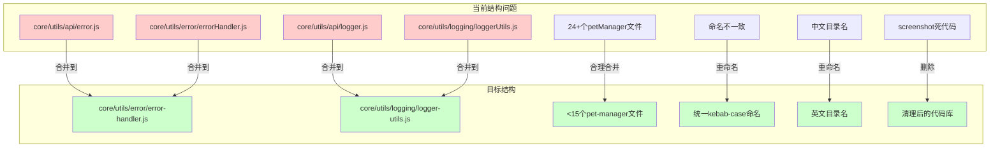
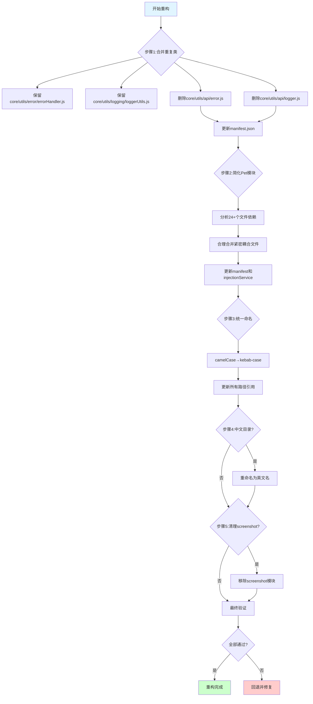
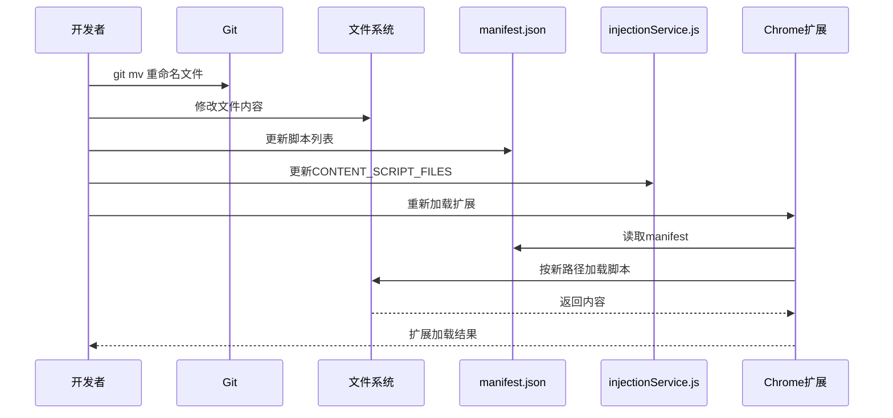

# 去除项目坏味道与模块化重构设计

> **文档版本**: v1.0 | **最后更新**: 2026-04-27 | **维护者**: Claude Opus 4.7 | **工具**: Claude Code
>
> **关联文档**: [需求任务](./02_需求任务.md) | [使用文档](./04_使用文档.md) | [CLAUDE.md](../../CLAUDE.md)
>
> **Git 分支**: main
>
> **文档开始时间**: 21:00:00 | **文档最后更新时间**: 21:30:00

[设计概述](#设计概述) | [架构设计](#架构设计) | [修复内容](#修复内容) | [实现细节](#实现细节) | [数据结构](#数据结构)

---

## 设计概述

本设计文档基于需求任务中定义的五个主要操作场景，提供去除项目坏味道的技术方案。核心目标是消除重复代码、简化模块结构、统一命名规范、清理死代码，同时保证 Chrome Extension（Manifest V3）的功能完整性。

- 🎯 **最小变更原则**：优先合并和重命名，不修改业务逻辑
- ⚡ **路径一致性**：所有路径变更通过 manifest.json 和 injectionService.js 两处同步管理
- 🔧 **可回退性**：分阶段执行，每步变更可独立验证，失败时可快速回退

## 架构设计

### 整体架构



**架构说明**：当前结构存在重复类、过度细分、命名不一致等问题。目标结构通过合并、重命名、清理，达到更清晰的架构。

### 模块划分

| 模块名称 | 职责 | 文件位置 |
|----------|------|----------|
| ErrorHandler | 统一错误处理 | core/utils/error/error-handler.js |
| LoggerUtils | 统一日志管理 | core/utils/logging/logger-utils.js |
| Pet Manager | 宠物核心功能 | modules/pet/content/ 下的精简文件 |
| Extension System | 扩展系统 | modules/extension/ |
| Assets | 静态资源 | assets/ （英文目录名） |

### 核心流程图



**流程说明**：重构的五个核心步骤，每步验证确保可回退。

## 修复内容（全文档生成时必须包含）

#### 问题分析

详细描述需要解决的问题或缺陷：

1. **重复的 ErrorHandler 实现**
   - `core/utils/api/error.js` 定义了 ErrorHandler 类
   - `core/utils/error/errorHandler.js` 也定义了 ErrorHandler 类
   - 两个实现功能重叠，但不完全相同
   - 问题产生原因：代码演进过程中未及时合并
   - 影响范围：所有使用 ErrorHandler 的模块，容易混淆使用哪个

2. **重复的 Logger/LoggerUtils 实现**
   - `core/utils/api/logger.js` 定义了 Logger 类和 LoggerUtils 静态方法
   - `core/utils/logging/loggerUtils.js` 定义了 LoggerUtils 类
   - 两个实现功能重叠，但设计理念不同
   - 问题产生原因：代码演进过程中未及时合并
   - 影响范围：所有使用日志功能的模块

3. **Pet 模块过度细分**
   - `modules/pet/content/` 下有 10 个 petManager.*.js 文件
   - `modules/pet/content/modules/` 下有 14 个 petManager.*.js 文件
   - 总计 24+ 个文件，职责边界不清晰
   - 问题产生原因：过度追求"单一职责"，导致文件粒度过细
   - 影响范围：manifest.json 和 injectionService.js 中维护 76 个脚本的加载顺序，非常脆弱

4. **命名不一致**
   - Pet 模块：`petManager.*.js`（manager 后缀）
   - Chat 模块：`export-chat-to-png.js`（kebab-case）
   - Extension 模块：`injectionService.js`（camelCase）
   - 问题产生原因：不同时期、不同开发者的命名习惯不同
   - 影响范围：新开发者难以理解，代码一致性差

5. **中文目录名**
   - `assets/images/医生/`
   - `assets/images/教师/`
   - `assets/images/甜品师/`
   - `assets/images/警察/`
   - 问题产生原因：初始设计未考虑跨平台兼容性
   - 影响范围：某些系统或工具链下可能导致编码问题

6. **疑似死代码**
   - README.md v1.1.0 提到"移除截图功能"
   - 但 `modules/screenshot/` 目录仍存在
   - 问题产生原因：功能移除不彻底
   - 影响范围：造成困惑，维护无用代码

#### 修复方案

说明修复的整体思路和策略：

**整体策略**：分阶段执行，每步可独立验证，确保可回退。

**阶段 1：合并重复类**
1. 对比 `core/utils/api/error.js` 和 `core/utils/error/errorHandler.js`
2. 选择功能更完整的 `core/utils/error/errorHandler.js` 作为基准
3. 将另一个实现的独有功能合并进来（如有）
4. 搜索所有引用 ErrorHandler 的文件，统一指向新实现
5. 删除 `core/utils/api/error.js`
6. 更新 manifest.json：移除第 22 行 `"core/utils/api/error.js"`
7. 更新 injectionService.js：移除对应项
8. 对 Logger/LoggerUtils 执行同样的合并流程

**阶段 2：简化 Pet 模块**
1. 分析 24+ 个 petManager 文件的依赖关系
2. 建议合并策略：
   - `petManager.chat.js` + `petManager.chatUi.js` + `petManager.message.js` → 合并为聊天相关模块
   - `petManager.pet.js` + `petManager.state.js` + `petManager.ui.js` → 合并为宠物核心模块
   - `petManager.drag.js` + `petManager.events.js` + `petManager.media.js` → 合并为交互模块
3. 保持 `core/` 和 `modules/` 的分层
4. 更新 manifest.json 中的脚本列表和加载顺序
5. 更新 injectionService.js 中的 CONTENT_SCRIPT_FILES 列表
6. 目标：文件数量从 24+ 减少到 <15

**阶段 3：统一文件命名**
1. 制定映射表：
   - `petManager.chat.js` → `pet-manager-chat.js`
   - `petManager.chatUi.js` → `pet-manager-chat-ui.js`
   - `petManager.drag.js` → `pet-manager-drag.js`
   - `petManager.events.js` → `pet-manager-events.js`
   - `petManager.media.js` → `pet-manager-media.js`
   - `petManager.message.js` → `pet-manager-message.js`
   - `petManager.pet.js` → `pet-manager-pet.js`
   - `petManager.state.js` → `pet-manager-state.js`
   - `petManager.ui.js` → `pet-manager-ui.js`
   - `injectionService.js` → `injection-service.js`
   - 等等
2. 使用 `git mv` 重命名（保留 git 历史）
3. 更新 manifest.json 中所有路径引用
4. 更新 injectionService.js 中所有路径引用
5. 更新 imports.js 中所有路径引用
6. 更新所有动态加载路径

**阶段 4：中文目录英文化**
1. 使用 `git mv` 重命名：
   - `assets/images/医生/` → `assets/images/doctor/`
   - `assets/images/教师/` → `assets/images/teacher/`
   - `assets/images/甜品师/` → `assets/images/chef/`
   - `assets/images/警察/` → `assets/images/police/`
2. 更新 `core/config.js`：DEFAULTS.PET_ROLE 从 `'教师'` 改为 `'teacher'`
3. 更新 `core/utils/media/imageResourceManager.js` 中的路径
4. 更新 `modules/pet/content/petManager.pet.js` 中的角色名
5. 更新 `core/utils/ui/loadingAnimation.js` 中的路径和角色名
6. 更新 manifest.json web_accessible_resources

**阶段 5：清理 Screenshot 模块**
1. 确认 README.md v1.1.0 中关于"移除截图功能"的记录
2. 搜索代码库中对 screenshot 的引用
3. 删除 `modules/screenshot/` 目录
4. 从 manifest.json 移除相关脚本（如存在）
5. 从 injectionService.js 移除相关脚本（如存在）
6. 清理其他模块中的引用（如菜单、按钮等）

**所有需要修改的文件清单**：
1. `core/utils/api/error.js`（删除）
2. `core/utils/api/logger.js`（删除）
3. `core/utils/error/errorHandler.js`（保留/合并）
4. `core/utils/logging/loggerUtils.js`（保留/合并）
5. `core/config.js`（修改默认角色名）
6. `core/utils/media/imageResourceManager.js`（修改路径）
7. `core/utils/ui/loadingAnimation.js`（修改路径/角色名）
8. `manifest.json`（修改脚本列表）
9. `modules/extension/background/services/injectionService.js`（修改脚本列表）
10. `modules/pet/content/petManager.pet.js`（修改角色名）
11. `modules/screenshot/`（删除整个目录）
12. 24+ 个 petManager 文件（重命名/合并）
13. 其他引用这些文件的模块（待搜索确认）

#### 修复前后对比

| 内容项 | 修复前 | 修复后 | 说明 |
|--------|--------|--------|------|
| ErrorHandler 实现数 | 2 个 | 1 个 | 消除重复代码 |
| LoggerUtils 实现数 | 2 个 | 1 个 | 消除重复代码 |
| Pet 模块文件数 | 24+ 个 | <15 个 | 简化模块结构 |
| 文件命名 | 混合风格 | 统一 kebab-case | 提升一致性 |
| 图片目录 | 中文名 | 英文名 | 消除跨平台风险 |
| Screenshot 模块 | 存在 | 已删除 | 清理死代码 |

## 影响分析（必须包含）

#### 执行步骤

0. **读取共享契约**：先读取 `../../shared/impact-analysis-contract.md`，适用阶段、搜索范围、必查维度、输出格式、依赖闭合标准和 P0 门禁以该文件为准。
1. **确定核心标识符**：从需求任务中提取本次改动涉及的核心模块名、函数名、组件名、事件名、Store key、路由路径、CSS 类名/变量、公用工具函数名、配置项、依赖包名、测试路径和文档引用等，形成"搜索词与改动点清单"。
2. **按契约全项目搜索**：对每个搜索词在整个仓库执行分类搜索，记录所有命中路径与行号；不得只搜索当前目录或 `src/`。搜索必须覆盖实现点、导出入口、注册入口、公共聚合入口、测试、文档、配置与外部依赖。
3. **追踪依赖链闭合**：对每个命中点继续检查其上游依赖、调用方、导出方、注册入口、消费方、测试和文档引用，直到影响链闭合或明确记录停止原因。
4. **排除无关结果**：排除 `node_modules/`、`dist/`、`*.lock`、文档自身等非业务文件；如排除的自动生成快照可能影响验收，必须写入未覆盖风险。
5. **标注处置方式**：同步修改、保持兼容、补充验证、人工复核、无需处理。

#### 搜索词与改动点清单

| 改动点 | 类型 | 搜索词 | 来源 | 备注 |
|--------|------|--------|------|------|
| ErrorHandler | class | ErrorHandler, errorHandler | core/utils/api/error.js, core/utils/error/errorHandler.js | 重复实现，需合并 |
| Logger/LoggerUtils | class | Logger, LoggerUtils, loggerUtils | core/utils/api/logger.js, core/utils/logging/loggerUtils.js | 重复实现，需合并 |
| petManager.*.js 文件 | file | petManager\. | modules/pet/content/ | 过度细分，需简化 |
| injectionService.js | file | injectionService | modules/extension/background/services/ | 路径可能需更新 |
| imports.js | file | imports\.js | core/ | 路径可能需更新 |
| 中文目录名 | directory | 医生, 教师, 甜品师, 警察 | assets/images/ | 需改为英文名 |
| screenshot 模块 | module | screenshot | modules/screenshot/ | 疑似死代码，需确认 |
| DEFAULTS.PET_ROLE | config | PET_ROLE | core/config.js | 默认角色名需更新 |

#### 改动点影响链

| 改动点 | 搜索词 | 命中文件 | 引用方式 | 影响层级 | 依赖方向 | 处置方式 | 闭合状态 | 说明 |
|--------|--------|----------|----------|----------|----------|--------|------|
| ErrorHandler | ErrorHandler | manifest.json:22 | content_scripts | 直接 | 反向依赖 | 移除引用 | 已识别 | manifest 中引用 api/error.js |
| ErrorHandler | ErrorHandler | manifest.json:36 | content_scripts | 直接 | 反向依赖 | 保留 | 已识别 | manifest 中引用 error/errorHandler.js |
| ErrorHandler | ErrorHandler | injectionService.js:17 | CONTENT_SCRIPT_FILES | 直接 | 反向依赖 | 移除引用 | 已识别 | injectionService 中引用 api/error.js |
| ErrorHandler | ErrorHandler | injectionService.js:30 | CONTENT_SCRIPT_FILES | 直接 | 反向依赖 | 保留 | 已识别 | injectionService 中引用 error/errorHandler.js |
| LoggerUtils | Logger | manifest.json:21 | content_scripts | 直接 | 反向依赖 | 移除引用 | 已识别 | manifest 中引用 api/logger.js |
| LoggerUtils | LoggerUtils | manifest.json:35 | content_scripts | 直接 | 反向依赖 | 保留 | 已识别 | manifest 中引用 logging/loggerUtils.js |
| LoggerUtils | Logger | injectionService.js:16 | CONTENT_SCRIPT_FILES | 直接 | 反向依赖 | 移除引用 | 已识别 | injectionService 中引用 api/logger.js |
| LoggerUtils | LoggerUtils | injectionService.js:29 | CONTENT_SCRIPT_FILES | 直接 | 反向依赖 | 保留 | 已识别 | injectionService 中引用 logging/loggerUtils.js |
| petManager | petManager\. | manifest.json:39-75 | content_scripts | 直接 | 反向依赖 | 更新列表 | 已识别 | 37 个 petManager 相关引用 |
| petManager | petManager\. | injectionService.js:33-69 | CONTENT_SCRIPT_FILES | 直接 | 反向依赖 | 更新列表 | 已识别 | 37 个 petManager 相关引用 |
| 中文目录 | 医生, 教师, 甜品师, 警察 | manifest.json:116-117 | web_accessible_resources | 直接 | 反向依赖 | 更新路径 | 已识别 | glob 模式，需确认是否需要更新 |
| 中文目录 | 教师 | core/config.js | DEFAULTS.PET_ROLE | 直接 | 反向依赖 | 修改配置 | 已识别 | 默认角色名 |
| 中文目录 | 医生, 教师, 甜品师, 警察 | core/utils/media/imageResourceManager.js | getURL 路径 | 直接 | 反向依赖 | 更新路径 | 待搜索确认 |
| 中文目录 | 医生, 教师, 甜品师, 警察 | modules/pet/content/petManager.pet.js | 角色名引用 | 直接 | 反向依赖 | 更新角色名 | 待搜索确认 |
| 中文目录 | 医生, 教师, 甜品师, 警察 | core/utils/ui/loadingAnimation.js | 路径/角色名 | 直接 | 反向依赖 | 更新 | 待搜索确认 |
| screenshot | screenshot | manifest.json | content_scripts | 直接 | 反向依赖 | 检查是否引用 | 待搜索确认 |
| screenshot | screenshot | injectionService.js | CONTENT_SCRIPT_FILES | 直接 | 反向依赖 | 检查是否引用 | 待搜索确认 |

#### 依赖闭合摘要

| 改动点 | 上游依赖是否核对 | 反向依赖是否核对 | 传递依赖是否闭合 | 测试/文档/配置是否覆盖 | 结论 |
|--------|------------------|------------------|------------------|------------------------|------|
| ErrorHandler 合并 | 是（已识别 manifest 和 injectionService） | 待全项目搜索 | 待执行 | 待执行 | 待完整分析后确认 |
| LoggerUtils 合并 | 是（已识别 manifest 和 injectionService） | 待全项目搜索 | 待执行 | 待执行 | 待完整分析后确认 |
| Pet 模块简化 | 是（已识别 manifest 和 injectionService） | 待分析依赖关系 | 待执行 | 待执行 | 待完整分析后确认 |
| 文件重命名 | 是（已识别 manifest 和 injectionService） | 待全项目搜索 | 待执行 | 待执行 | 待完整分析后确认 |
| 中文目录英文化 | 是（已识别 config 和 manifest） | 待搜索其他引用 | 待执行 | 待执行 | 待完整分析后确认 |
| Screenshot 清理 | 待确认是否被引用 | 待全项目搜索 | 待执行 | 待执行 | 待确认是否废弃后决定 |

#### 未覆盖风险

| 风险来源 | 原因 | 影响 | 缓解方式 |
|----------|------|------|----------|
| 动态字符串路径 | 某些路径可能通过字符串拼接生成，无法静态搜索 | 可能遗漏路径更新 | 实施后验证 Network 面板无 404 |
| 未知引用 | 可能存在未被搜索到的引用点 | 运行时错误 | 充分测试 + 人工复核 |
| Git 历史 | 文件重命名使用 git mv 保留历史，但可能影响某些工具 | 历史追踪 | 使用 git mv 重命名 |
| Screenshot 仍在使用 | 可能 README 描述不准确，screenshot 功能仍在使用 | 误删有用代码 | 实施前充分确认 |
| Pet 模块合并顺序错误 | 合并后可能破坏原型链挂载顺序 | 运行时错误 | 仔细验证加载顺序，确保 core 在前 |

#### 改动范围汇总

- **需直接修改的文件数**：约 20-30 个（待精确搜索后确定）
- **需验证兼容性的文件数**：manifest.json、injectionService.js、imports.js
- **需追踪传递影响的文件数**：所有使用 ErrorHandler/LoggerUtils 的文件
- **需人工复核或阻断的风险**：screenshot 模块是否真的废弃需确认

## 实现细节（全文档生成时必须包含）

#### 技术实现要点

**1. 重复类合并策略**
- 优先保留 `core/utils/error/errorHandler.js` 和 `core/utils/logging/loggerUtils.js`
- 对比另一个实现的功能差异，将有用功能合并进来
- 删除冗余文件，更新所有引用
- 确保删除的文件在 manifest 和 injectionService 中同步移除

**2. Pet 模块合并策略**
- 按功能域合并：聊天相关、宠物核心、交互相关
- 保持加载顺序：core → modules → features
- 确保 PetManager 核心类定义在扩展方法之前
- 合并后验证原型链完整

**3. 文件重命名策略**
- 使用 `git mv` 保留 git 历史
- 逐个文件重命名，逐个更新引用
- kebab-case 转换规则：
  - 大写字母前加连字符，转小写
  - `petManager.chat.js` → `pet-manager-chat.js`
  - `injectionService.js` → `injection-service.js`

**4. 路径更新策略**
- manifest.json 和 injectionService.js 必须完全一致
- 两个文件逐行比对，确保同步
- web_accessible_resources 中的路径也要同步更新
- 动态加载路径（如 load-mermaid.js）也要检查

#### 关键代码说明

**关键代码片段 1：manifest.json 内容脚本更新**
```json
{
  "content_scripts": [
    {
      "matches": ["<all_urls>"],
      "js": [
        "core/config.js",
        "libs/md5.js",
        "core/utils/api/token.js",
        // 移除: "core/utils/api/logger.js",
        // 移除: "core/utils/api/error.js",
        "core/utils/api/request.js",
        "core/utils/media/imageResourceManager.js",
        "core/utils/ui/loadingAnimationMixin.js",
        "core/utils/ui/loadingAnimation.js",
        "core/constants/endpoints.js",
        "core/api/core/ApiManager.js",
        "core/api/services/SessionService.js",
        "core/utils/session/sessionManager.js",
        "core/api/services/FaqService.js",
        "libs/marked.min.js",
        "libs/turndown.js",
        "libs/vue.global.js",
        "core/utils/logging/loggerUtils.js",
        "core/utils/error/errorHandler.js",
        // ... 后续文件重命名为 kebab-case
      ]
    }
  ]
}
```
**说明**：移除重复类引用，更新文件名为 kebab-case。

**关键代码片段 2：injectionService.js 更新**
```javascript
class InjectionService {
  static CONTENT_SCRIPT_FILES = [
    'core/config.js',
    'libs/md5.js',
    'core/utils/api/token.js',
    // 移除: 'core/utils/api/logger.js',
    // 移除: 'core/utils/api/error.js',
    'core/utils/api/request.js',
    'core/utils/media/imageResourceManager.js',
    // ... 与 manifest.json 完全一致
  ]
}
```
**说明**：必须与 manifest.json 保持完全一致，否则可能出现 PetManager 未定义。

**关键代码片段 3：config.js 默认角色更新**
```javascript
// 修改前
const DEFAULTS = {
  PET_ROLE: '教师',
  // ...
}

// 修改后
const DEFAULTS = {
  PET_ROLE: 'teacher',
  // ...
}
```
**说明**：默认角色名改为英文名，与目录名一致。

#### 依赖关系

| 文件 | 新增/移除/修改 | 依赖的文件 | 被依赖的文件 |
|------|--------------|-----------|------------|
| core/utils/api/error.js | 移除 | 多个 | manifest.json, injectionService.js |
| core/utils/api/logger.js | 移除 | 多个 | manifest.json, injectionService.js |
| core/utils/error/errorHandler.js | 修改（合并） | 多个 | 多个 |
| core/utils/logging/loggerUtils.js | 修改（合并） | 多个 | 多个 |
| core/config.js | 修改 | 无 | 多个 |
| manifest.json | 修改 | 无 | Chrome Extension |
| injectionService.js | 修改 | 无 | Background Service |
| modules/screenshot/ | 移除 | 多个 | 如仍在使用则有影响 |
| 24+ petManager 文件 | 修改/重命名/合并 | 相互依赖 | manifest.json, injectionService.js |

#### 测试考虑

**需要重点测试的场景**：
1. 扩展可正常加载和安装（P0）
2. 宠物显示/隐藏功能正常（P0）
3. 聊天窗口功能正常（P0）
4. 角色切换功能正常（P0）
5. 日志输出正常（P1）
6. 错误处理正常（P1）
7. Chrome DevTools Network 面板无 404（P0）

**测试用例建议**：
1. 加载扩展，验证无控制台错误
2. 测试宠物显示/隐藏快捷键
3. 测试聊天窗口打开/关闭
4. 测试发送消息
5. 测试角色切换（doctor/teacher/chef/police）
6. 验证所有图片加载正常

**如何验证修复是否有效**：
1. 确认 manifest.json 和 injectionService.js 完全一致
2. 确认 ErrorHandler 和 LoggerUtils 各只有一个实现
3. 确认所有文件名使用 kebab-case
4. 确认 assets/images/ 下无中文目录
5. 运行完整功能测试

## 主要操作场景实现（全文档生成时必须包含）

#### 场景实现：合并重复的 ErrorHandler 类

**关联需求任务场景**：[需求任务-合并重复类](./02_需求任务.md#主要操作场景定义)

**实现概述**：保留 `core/utils/error/errorHandler.js`，删除 `core/utils/api/error.js`，更新所有引用。

**涉及模块**：
- core/utils/error/errorHandler.js（保留/合并）
- core/utils/api/error.js（删除）
- manifest.json（更新）
- injectionService.js（更新）

**关键代码路径**：
- manifest.json:22 - 移除 `"core/utils/api/error.js"`
- manifest.json:36 - 保留 `"core/utils/error/errorHandler.js"`
- injectionService.js:17 - 移除 `'core/utils/api/error.js'`
- injectionService.js:30 - 保留 `'core/utils/error/errorHandler.js'`

**验证要点**：
- ErrorHandler 只有一个实现
- 所有引用指向正确文件
- 错误处理功能正常

---

#### 场景实现：合并重复的 LoggerUtils 类

**关联需求任务场景**：[需求任务-合并重复类](./02_需求任务.md#主要操作场景定义)

**实现概述**：保留 `core/utils/logging/loggerUtils.js`，删除 `core/utils/api/logger.js`，更新所有引用。

**涉及模块**：
- core/utils/logging/loggerUtils.js（保留/合并）
- core/utils/api/logger.js（删除）
- manifest.json（更新）
- injectionService.js（更新）

**关键代码路径**：
- manifest.json:21 - 移除 `"core/utils/api/logger.js"`
- manifest.json:35 - 保留 `"core/utils/logging/loggerUtils.js"`
- injectionService.js:16 - 移除 `'core/utils/api/logger.js'`
- injectionService.js:29 - 保留 `'core/utils/logging/loggerUtils.js'`

**验证要点**：
- LoggerUtils 只有一个实现
- 所有引用指向正确文件
- 日志记录功能正常
- 日志静默开关正常

---

#### 场景实现：简化 Pet 模块文件结构

**关联需求任务场景**：[需求任务-Pet模块简化](./02_需求任务.md#主要操作场景定义)

**实现概述**：分析并合理合并 petManager 过度细分的文件，更新 manifest 和 injectionService。

**涉及模块**：
- modules/pet/content/ 下的 24+ 个文件
- manifest.json
- injectionService.js

**关键代码路径**：
- manifest.json:39-75 - 更新 petManager 文件列表
- injectionService.js:33-69 - 更新 CONTENT_SCRIPT_FILES 列表
- 确保加载顺序：core → modules → features

**验证要点**：
- 文件数量合理减少（<15）
- 加载顺序正确
- PetManager 原型链完整挂载
- 所有宠物功能正常

---

#### 场景实现：统一文件命名规范

**关联需求任务场景**：[需求任务-命名规范统一](./02_需求任务.md#主要操作场景定义)

**实现概述**：将所有文件名从 camelCase 统一为 kebab-case，使用 git mv 保留历史。

**涉及模块**：
- 所有 petManager 文件
- injectionService.js
- manifest.json
- 其他 camelCase 文件名

**关键代码路径**：
- manifest.json:18-76 - 更新所有路径
- injectionService.js:13-71 - 更新所有路径
- web_accessible_resources - 更新 HTML 模板路径

**验证要点**：
- 所有文件名使用 kebab-case
- manifest.json 和 injectionService.js 完全一致
- 无控制台 404 错误
- 所有功能正常

---

#### 场景实现：中文角色图片目录英文化

**关联需求任务场景**：[需求任务-中文目录英文化](./02_需求任务.md#主要操作场景定义)

**实现概述**：重命名中文目录为英文名，更新 config.js、imageResourceManager.js 等。

**涉及模块**：
- assets/images/ 下的四个目录
- core/config.js
- core/utils/media/imageResourceManager.js
- modules/pet/content/petManager.pet.js
- core/utils/ui/loadingAnimation.js
- manifest.json

**关键代码路径**：
- assets/images/ - git mv 重命名目录
- core/config.js - DEFAULTS.PET_ROLE 更新
- imageResourceManager.js - 路径更新
- petManager.pet.js - 角色名更新
- loadingAnimation.js - 路径/角色名更新

**验证要点**：
- 无中文目录名
- 默认角色使用英文名
- 所有图片加载正常
- 角色切换功能正常

---

#### 场景实现：清理 Screenshot 死代码

**关联需求任务场景**：[需求任务-死代码清理](./02_需求任务.md#主要操作场景定义)

**实现概述**：确认 screenshot 功能是否废弃，如废弃则删除模块和引用。

**涉及模块**：
- modules/screenshot/（整个目录）
- manifest.json（如有引用）
- injectionService.js（如有引用）
- 其他模块中的引用（如菜单、按钮）

**关键代码路径**：
- modules/screenshot/ - 删除整个目录
- manifest.json - 移除相关脚本（如有）
- injectionService.js - 移除相关脚本（如有）

**验证要点**：
- screenshot 目录已删除
- 无遗留引用
- 其他功能不受影响

## 数据结构设计

#### 数据流程图



**说明**：重构的数据流转过程，确保每步可验证。

