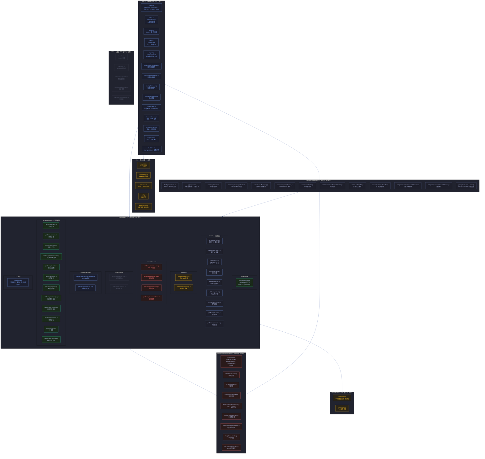

# 场景 1: 模块地图与拓扑

> | v1.1.1 | 2026-06-05 | Claude Opus 4.8 | 🌿 main | ⏱️ 15:00–16:30 | 📎 [CLAUDE.md](../../../CLAUDE.md) |

[概述](#overview) · [§0 技术评审](#sec0) · [§1 测试设计](#sec1) · [§2 实施报告](#sec2) · [§3 测试报告](#sec3) · [§4 自改进](#sec4)

## 概述

**角色**: 架构师/开发者 · **目标**: 掌握 YiPet 全量模块拓扑、依赖关系、IIFE 全局命名空间模式 · **优先级**: P0

---

## §0 技术评审

### 模块全景拓扑图

### IIFE 全局命名空间模式

```mermaid
flowchart LR
    subgraph iife["IIFE 模块注册模式"]
        direction LR
        A["(function(root) { ... })<br/>(globalThis)"]:::good
        B["class ClassName { ... }"]:::good
        C["root.ClassName = ClassName"]:::good
        D["全局可访问"]:::good
        A --> B --> C --> D
    end

    subgraph globals["全局命名空间（window / self）"]
        direction TB
        G1["PET_CONFIG / config<br/>配置对象"]:::core
        G2["TokenManager / tokenManager / TokenUtils<br/>Token 管理"]:::core
        G3["RequestClient / requestClient<br/>请求客户端"]:::core
        G4["PetManager<br/>核心宠物管理类"]:::core
        G5["petManager<br/>PetManager 实例"]:::core
        G6["StorageHelper<br/>存储辅助工具"]:::core
        G7["MessageRouter<br/>消息路由器（SW 环境）"]:::core
        G8["InjectionService<br/>注入服务（SW 环境）"]:::core
        G9["TabMessaging<br/>Tab 消息服务（SW 环境）"]:::core
        G10["PopupController<br/>弹窗控制器（popup 环境）"]:::core
        G11["ApiManager / SessionService / FaqService<br/>API 层"]:::core
        G12["ErrorHandler / Logger / LoggerUtils<br/>工具类"]:::core
    end

    iife --> globals

    classDef core fill:#1b1e2e,stroke:#7aa2f7,color:#7aa2f7
    classDef good fill:#1a2a1a,stroke:#34d399,color:#a9b1d6
```

### 模块注册与消费关系表

| 模块文件 | 注册方式 | 命名空间 | 导出符号 | 主要消费者 |
|---------|---------|---------|---------|-----------|
| `core/config.js` | 直接赋值 | `window / self` | `PET_CONFIG`, `config`, `ENDPOINTS`, `buildUrl`, `buildQueryParams`, `buildDatabaseUrl` | 全部模块 |
| `core/utils/api/token.js` | IIFE | `root` (globalThis) | `TokenManager`, `createTokenManager`, `tokenManager`, `TokenUtils` | ApiManager, PopupController |
| `core/utils/api/request.js` | IIFE | `root` (globalThis) | `RequestClient`, `createRequestClient`, `requestClient` | ApiManager |
| `core/utils/api/logger.js` | IIFE | `root` | `Logger` | ApiManager |
| `core/utils/api/error.js` | IIFE | `root` | `ErrorHandler` | ApiManager, StorageHelper |
| `core/api/core/ApiManager.js` | IIFE | `root` | `ApiManager` | SessionService, FaqService |
| `core/api/services/SessionService.js` | IIFE | `root` | `SessionService` | PetManager |
| `core/api/services/FaqService.js` | IIFE | `root` | `FaqService` | PetManager, FAQ 模块 |
| `core/utils/session/sessionManager.js` | 类声明 | `window` | `SessionManager` | PetManager |
| `core/bootstrap/bootstrap.js` | 直接赋值 | `window` | `StorageHelper`, `getPetDefaultPosition`, `getChatWindowDefaultPosition`, `getCenterPosition` | PetManager, UI 模块 |
| `modules/pet/content/core/petManager.core.js` | IIFE | `window` | `PetManager` | 所有 pet/ 子模块 |
| `modules/pet/content/petManager.js` | IIFE | `window` | `petManager` (实例) | PopupController, SW |
| `modules/pet/content/petManager.chat.js` | IIFE | `window.PetManager.prototype` | 挂载方法 | 用户交互 |
| `modules/faq/content/faq.js` | IIFE | `window.PetManager.prototype` | 挂载方法 | PetManager 实例 |
| `modules/extension/background/messaging/messageRouter.js` | 类声明 | `self` | `MessageRouter` | register.js |
| `modules/extension/background/services/tabMessaging.js` | IIFE | `root` | `TabMessaging` | injectionService, 消息转发 |
| `modules/extension/background/services/injectionService.js` | 类声明 | `self` | `InjectionService` | PetHandler, register.js |

### Content Script 加载顺序（manifest.json 确定的依赖树）

```mermaid
flowchart TB
    subgraph phase1["阶段 1: 基础设施（Index 0–13）"]
        direction TB
        CFG["core/config.js"]:::core
        MD5["libs/md5.js"]:::core
        TOKEN["core/utils/api/token.js"]:::core
        LOGGER["core/utils/api/logger.js"]:::core
        ERROR["core/utils/api/error.js"]:::core
        REQ["core/utils/api/request.js"]:::core
        IMGRES["core/utils/media/imageResourceManager.js"]:::core
        LOADMIX["core/utils/ui/loadingAnimationMixin.js"]:::core
        LOAD["core/utils/ui/loadingAnimation.js"]:::core
        EP["core/constants/endpoints.js"]:::core
        APIMGR["core/api/core/ApiManager.js"]:::core
        SESSSVC["core/api/services/SessionService.js"]:::core
        SESSMGR["core/utils/session/sessionManager.js"]:::core
        FAQSVC["core/api/services/FaqService.js"]:::core
    end

    subgraph phase2["阶段 2: 第三方库 + 工具（Index 14–22）"]
        direction TB
        MARKED["libs/marked.min.js"]:::milestone
        CMDOWN["cdn/markdown/markdown.js"]:::milestone
        TURNDOWN["libs/turndown.js"]:::milestone
        VUE["libs/vue.global.js"]:::milestone
        LOGUTIL["core/utils/logging/loggerUtils.js"]:::milestone
        ERRUTIL["core/utils/error/errorHandler.js"]:::milestone
        DOMUTIL["core/utils/dom/domHelper.js"]:::milestone
        BOOT["core/bootstrap/bootstrap.js"]:::milestone
    end

    subgraph phase3["阶段 3: PetManager 核心 + 子模块（Index 23–87）"]
        direction TB
        PMCORE["core/petManager.core.js"]:::good
        SUBMOD["32 个 petManager.*.js 子模块"]:::good
        VUECMP["9 个 Vue 组件 index.js"]:::good
        FAQSUB["faq.js · tags.js"]:::good
        BOOTIDX["core/bootstrap/index.js"]:::good
    end

    phase1 --> phase2 --> phase3

    classDef core fill:#1b1e2e,stroke:#7aa2f7,color:#7aa2f7
    classDef good fill:#1a2a1a,stroke:#34d399,color:#a9b1d6
    classDef milestone fill:#2a2417,stroke:#fbbf24,color:#fbbf24
```

> **关键约束**: manifest.json `content_scripts[0].js` 数组顺序 = 加载顺序。`petManager.core.js` 必须在 `petManager.js` 之前；`vue.global.js` 必须在所有 Vue 组件之前；`config.js` 必须在所有依赖 PET_CONFIG 的模块之前。

### 全局导出验证矩阵

| 导出符号 | 类型 | 环境 | 依赖的前置加载 | 验证方法 |
|---------|------|------|-------------|---------|
| `window.PET_CONFIG` | Object | Content Script | `config.js` | `typeof PET_CONFIG !== 'undefined'` |
| `window.PetManager` | Class | Content Script | `core.js` + 全部前置 | `typeof window.PetManager !== 'undefined'` |
| `window.petManager` | Instance | Content Script | `petManager.js` | `window.petManager instanceof PetManager` |
| `window.StorageHelper` | Object | Content Script | `bootstrap.js` | `typeof StorageHelper.isChromeStorageAvailable === 'function'` |
| `window.TokenManager` | Class | Content Script | `token.js` | `typeof TokenManager !== 'undefined'` |
| `tokenManager` | Instance | Content Script | `token.js` | `typeof tokenManager !== 'undefined'` |
| `window.requestClient` | Instance | Content Script | `request.js` | `requestClient instanceof RequestClient` |
| `self.MessageRouter` | Class | Service Worker | `messageRouter.js` | `typeof self.MessageRouter !== 'undefined'` |
| `self.InjectionService` | Class | Service Worker | `injectionService.js` | `typeof self.InjectionService !== 'undefined'` |
| `self.TabMessaging` | Object | Service Worker | `tabMessaging.js` | `typeof self.TabMessaging !== 'undefined'` |

---

## §1 测试设计

### TC-1-1: 模块存在性验证

| 用例 ID | 场景 | Given | When | Then |
|---------|------|-------|------|------|
| TC-1-1-1 | 核心模块全部加载 | Chrome 扩展已安装，打开任意网页 | 在 DevTools Console 检查 `window` 上关键导出 | `PET_CONFIG`、`PetManager`、`StorageHelper`、`TokenManager`、`requestClient` 全部 `typeof !== 'undefined'` |
| TC-1-1-2 | PetManager 实例创建成功 | 核心模块已加载 | `console.log(window.petManager instanceof PetManager)` | 输出 `true` |
| TC-1-1-3 | Vue 全局变量可用 | vue.global.js 已加载 | `console.log(typeof Vue)` | 输出 `'function'` 或 `'object'`，非 `'undefined'` |
| TC-1-1-4 | marked 库可用 | marked.min.js 已加载 | `console.log(typeof marked)` | 输出 `'function'`，非 `'undefined'` |
| TC-1-1-5 | Service Worker MessageRouter 存在 | SW DevTools Console | `typeof self.MessageRouter` | 非 `'undefined'` |

### TC-1-2: 依赖完整性验证

| 用例 ID | 场景 | Given | When | Then |
|---------|------|-------|------|------|
| TC-1-2-1 | manifest.json 声明的 88 个 JS 文件全部存在 | 项目根目录 | 遍历 `content_scripts[0].js` 数组，检查每路径文件是否存在 | 全部路径对应的文件存在 |
| TC-1-2-2 | manifest 加载顺序无循环依赖 | 读取 manifest.json | 按 Index 顺序构建依赖图，使用拓扑排序检测 | 无循环 |
| TC-1-2-3 | InjectionService.CONTENT_SCRIPT_FILES 与 manifest 一致 | 对比两者数组 | 逐元素比较路径 | 完全一致（顺序 + 内容） |
| TC-1-2-4 | PetManager 子模块不依赖未声明的全局变量 | 审查每个 petManager.*.js 的 IIFE 头部 | 检查 `typeof window.X === 'undefined'` 守卫 | 所有引用的全局变量在 manifest 中先于本文件加载 |

### TC-1-3: 全局命名空间无冲突验证

| 用例 ID | 场景 | Given | When | Then |
|---------|------|-------|------|------|
| TC-1-3-1 | PetManager 不重复声明 | 两次注入同页面 | 检查 `window.PetManager` 是否被覆盖 | 第二次注入不创建新的 PetManager 类（`typeof window.PetManager !== 'undefined'` 时直接 return） |
| TC-1-3-2 | petManager 实例不重复创建 | 已有 `window.petManager` | 再次执行 bootstrap/index.js | `typeof window.petManager === 'undefined'` 为 false，不创建新实例 |
| TC-1-3-3 | 全局变量不与页面原生变量冲突 | 在常见网站（GitHub、知乎）上注入 | 检查页面功能是否正常 | 页面功能不受影响，无 JS 报错 |

### TC-1-4: 模块消费关系验证

| 用例 ID | 场景 | Given | When | Then |
|---------|------|-------|------|------|
| TC-1-4-1 | ApiManager 正确消费 TokenManager | PetManager 初始化完成 | `petManager.ensureTokenSet()` | Token 获取链路：ApiManager.tokenManager.getToken() → TokenManager._getTokenFromChromeStorage() |
| TC-1-4-2 | SessionService 正确消费 ApiManager | 调用会话列表 | `SessionService.getSessions()` | 内部调用 `this.apiManager.client.request(...)` |
| TC-1-4-3 | Vue 组件通过 IIFE 挂载到 window | 任意 Vue 组件 index.js 加载后 | 检查 `window` 上是否有组件对应的暴露接口 | ChatWindow 等组件通过 Vue.createApp 实例化，组件实例挂在 PetManager 实例属性上 |

---

## §2 实施报告

> 待补充 — 由 coder 在实施后填写。

---

## §3 测试报告

> 待补充 — 由 tester 在测试后填写。

---

## §4 自改进

> 待补充 — 检视发现与改进项。

---

> **导航**: [← 故事任务](./故事任务.md) · [场景-2-数据流追踪 →](./场景-2-数据流追踪.md)

### 变更记录

| 版本 | 日期 | 作者 | 变更说明 |
|------|------|------|---------|
| v1.1.1 | 2026-06-05 | Claude Opus 4.8 | 文档标准化：添加 F.meta、F.toc、Tokyo Night Dark 主题、语义化 classDef、§2–§4 占位、变更记录 |
| v1.0.0 | 2026-06-02 | coder | 初始版本 |
