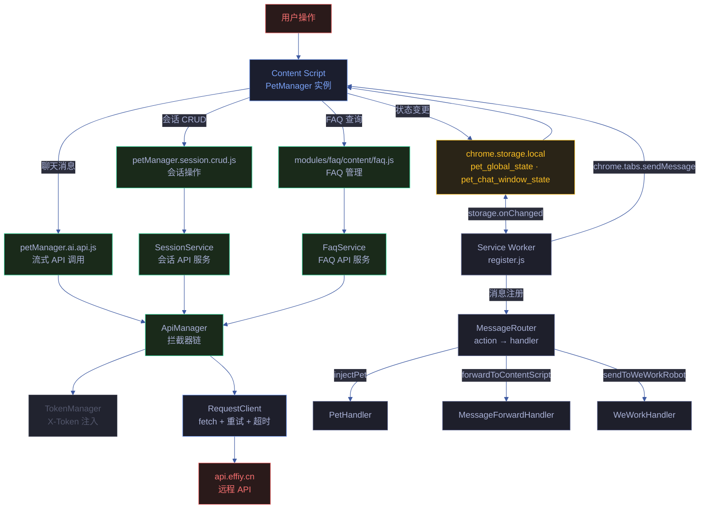
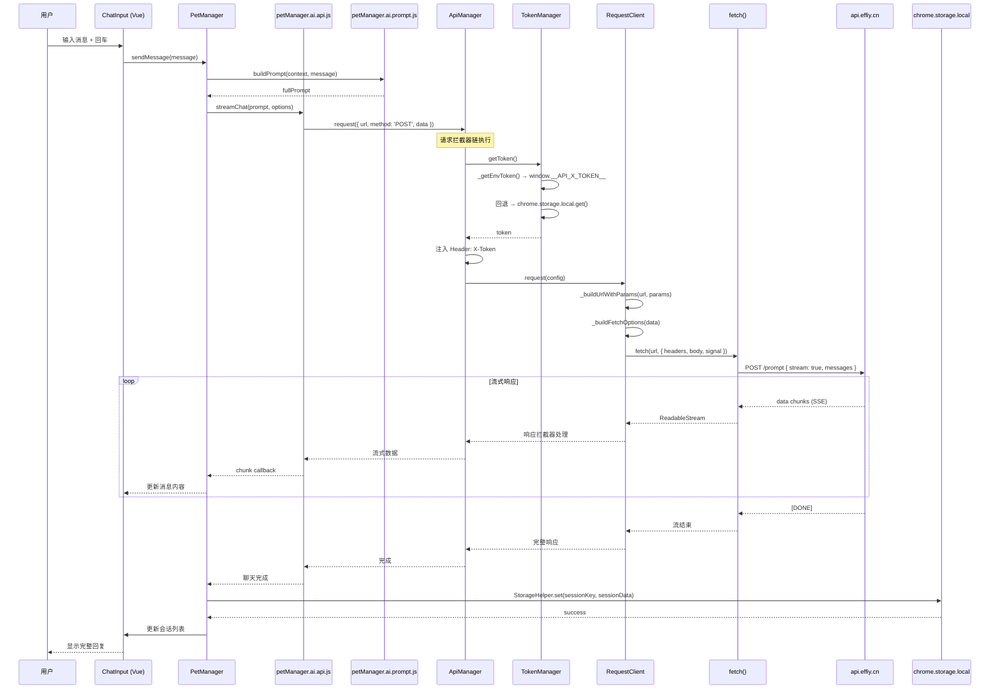
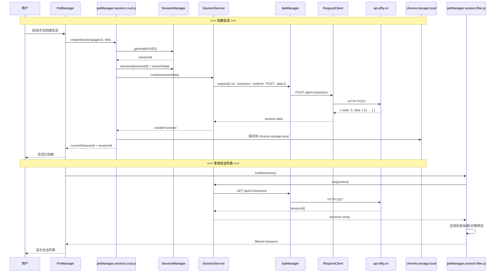
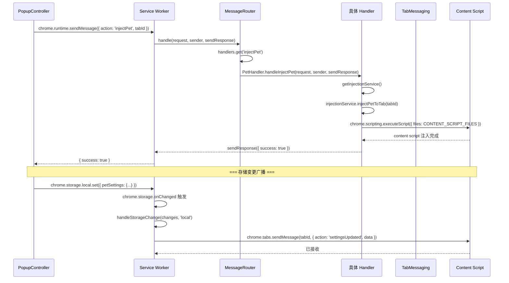
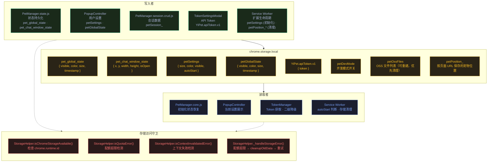
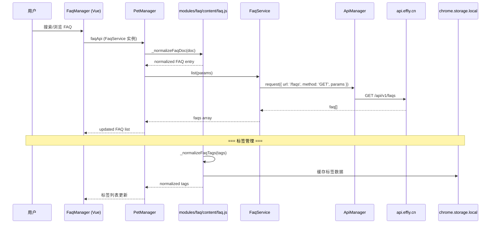
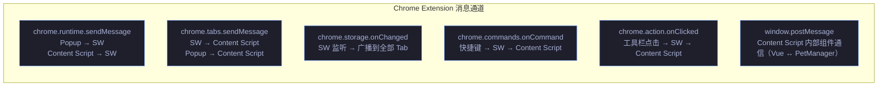

# 场景 2: 数据流与追踪

> | v1.1.1 | 2026-06-05 | Claude Opus 4.8 | 🌿 main | ⏱️ 15:00–16:30 | 📎 [CLAUDE.md](../../../CLAUDE.md) |

[概述](#overview) · [§0 技术评审](#sec0) · [§1 测试设计](#sec1) · [§2 实施报告](#sec2) · [§3 测试报告](#sec3) · [§4 自改进](#sec4)

## 概述

**角色**: 架构师/开发者 · **目标**: 追踪用户输入到 API 端点、chrome.storage 读写路径、Service Worker 消息路由等关键数据流 · **优先级**: P0

---

## §0 技术评审

### 数据流全景

### 聊天请求完整链路（序列图）

### 会话 CRUD 数据流

### Service Worker 消息路由流程

### chrome.storage.local 读写路径

### FAQ 查询数据流

### 消息通道全景

| 消息通道 | 发起方 | 接收方 | 典型 Action | 同步/异步 |
|---------|--------|--------|------------|:---:|
| `chrome.runtime.sendMessage` | PopupController | Service Worker | `injectPet`, `forwardToContentScript`, `sendToWeWorkRobot` | 异步 |
| `chrome.tabs.sendMessage` | Service Worker | Content Script | `settingsUpdated`, `globalStateUpdated`, `toggleVisibility` | 异步 |
| `chrome.storage.onChanged` | chrome.storage.local | Service Worker | 设置/状态变更广播 | 事件触发 |
| `chrome.commands.onCommand` | 键盘快捷键 | Service Worker → Content Script | `toggle-pet` → `toggleVisibility`, `open-chat` → `toggleChatWindow` | 异步 |
| `chrome.action.onClicked` | 工具栏图标点击 | Service Worker → Content Script | `toggleVisibility` | 异步 |
| `window.postMessage` | Content Script 内部 | Content Script 内部 | Vue 组件 ↔ PetManager 实例 | 同步/异步 |

---

## §1 测试设计

### TC-2-1: 聊天请求链路完整性

| 用例 ID | 场景 | Given | When | Then |
|---------|------|-------|------|------|
| TC-2-1-1 | 用户消息完整到达 API | Token 已配置，宠物已初始化 | 在聊天窗口输入 "你好" 并发送 | Chrome DevTools Network 面板显示 POST 请求到 `https://api.effiy.cn/prompt`，请求头含 `X-Token` |
| TC-2-1-2 | 流式响应正确渲染 | API 返回流式数据 | 发送消息后等待回复 | 回复内容逐字/逐块显示在聊天窗口中，无丢字或乱序 |
| TC-2-1-3 | Token 缺失时的降级链路 | Token 未配置 | 发送消息 | ApiManager 的 Token 拦截器获取空 Token → 请求仍发送（无 X-Token 头）→ API 返回认证错误 → 聊天窗口显示错误提示 |
| TC-2-1-4 | 网络错误重试 | 模拟网络断开 | 发送消息后立即断开网络 | RequestClient._fetchWithRetry 最多重试 3 次，每次间隔指数增长，最终显示错误提示 |

### TC-2-2: 会话 CRUD 数据流

| 用例 ID | 场景 | Given | When | Then |
|---------|------|-------|------|------|
| TC-2-2-1 | 创建会话同步到后端 | Token 已配置 | 打开新网页，宠物自动创建会话 | Network 面板显示 POST `/api/v1/sessions`，响应含 `{ id }`，`chrome.storage.local` 中更新了会话数据 |
| TC-2-2-2 | 会话列表加载 | 后端有 5 条会话 | 打开聊天窗口侧边栏 | GET `/api/v1/sessions` 请求返回 5 条，侧边栏渲染 5 个会话项 |
| TC-2-2-3 | 会话筛选 | 后端有带标签的会话 | 点击标签筛选器选择标签 | 仅显示匹配标签的会话，Network 面板无额外请求（前端筛选） |
| TC-2-2-4 | 会话删除 | 选中一个会话 | 执行删除操作 | DELETE `/api/v1/sessions/:id`，响应成功，`chrome.storage.local` 中对应 key 被清除 |

### TC-2-3: chrome.storage.local 读写路径

| 用例 ID | 场景 | Given | When | Then |
|---------|------|-------|------|------|
| TC-2-3-1 | 状态持久化写入 | 宠物可见 | 拖拽宠物到新位置 | `chrome.storage.local` 中 `pet_global_state` 的 position 字段更新 |
| TC-2-3-2 | 状态恢复读取 | 之前保存过位置 | 页面刷新 | 宠物出现在上次保存的位置 |
| TC-2-3-3 | 配额超限清理 | chrome.storage.local 即将满 | 触发存储写入 | `StorageHelper._handleStorageError` 检测配额错误 → `cleanupOldData()` 清理 `petOssFiles` → 重试写入成功 |
| TC-2-3-4 | 上下文失效降级 | 扩展被重新加载 | chrome.storage.local 读写操作 | `isChromeStorageAvailable()` 返回 false → 操作返回 `{ success: false, contextInvalidated: true }` |
| TC-2-3-5 | 存储变更跨 Tab 同步 | 打开两个标签页 | 在 Tab A 修改宠物设置 | Tab B 通过 SW 的 `chrome.storage.onChanged` 监听到变更，`PetManager` 更新显示 |

### TC-2-4: Service Worker 消息路由

| 用例 ID | 场景 | Given | When | Then |
|---------|------|-------|------|------|
| TC-2-4-1 | injectPet 消息路由 | Popup 面板打开 | 点击 "显示宠物" 开关 | `chrome.runtime.sendMessage({ action: 'injectPet', tabId })` → SW → MessageRouter.handlers.get('injectPet') → PetHandler.handleInjectPet → 宠物出现在当前页面 |
| TC-2-4-2 | forwardToContentScript 转发 | 扩展后台消息 | 后台发起转发请求 | MessageRouter → MessageForwardHandler → TabMessaging.sendMessageToTab → Content Script 收到消息 |
| TC-2-4-3 | 未知 action 处理 | SW 运行中 | 发送 `{ action: 'nonexistent' }` | MessageRouter 返回 `{ success: false, error: 'Unknown action: nonexistent' }` |
| TC-2-4-4 | 快捷键命令路由 | 用户按下快捷键 | 按 `Cmd+Shift+P` | SW 收到 `toggle-pet` command → `sendMessageToActiveTab({ action: 'toggleVisibility' })` → Content Script 切换宠物可见性 |

### TC-2-5: FAQ 数据流

| 用例 ID | 场景 | Given | When | Then |
|---------|------|-------|------|------|
| TC-2-5-1 | FAQ 列表加载 | Token 已配置 | 打开 FAQ 管理器 | GET `/api/v1/faqs` 返回 FAQ 列表，按 `order` 字段排序显示 |
| TC-2-5-2 | FAQ 标签规范化 | FAQ 含重复标签 | `_normalizeFaqTags(['tag1', 'TAG1', 'tag2'])` | 返回 `['tag1', 'tag2']`，大小写不敏感去重 |
| TC-2-5-3 | FAQ 文档规范化 | FAQ 仅有 `text` 字段 | `_normalizeFaqDoc({ text: '标题\n内容段落' })` | 返回 `{ title: '标题', prompt: '内容段落', key: 'faq_<timestamp>_<random>' }` |

---

## §2 实施报告

> 待补充 — 由 coder 在实施后填写。

---

## §3 测试报告

> 待补充 — 由 tester 在测试后填写。

---

## §4 自改进

> 待补充 — 检视发现与改进项。

---

> **导航**: [← 场景-1-模块拓扑](./场景-1-模块拓扑.md) · [场景-3-安全边界 →](./场景-3-安全边界.md)

### 变更记录

| 版本 | 日期 | 作者 | 变更说明 |
|------|------|------|---------|
| v1.1.1 | 2026-06-05 | Claude Opus 4.8 | 文档标准化：添加 F.meta、F.toc、Tokyo Night Dark 主题、语义化 classDef、§2–§4 占位、变更记录 |
| v1.0.0 | 2026-06-02 | coder | 初始版本 |
