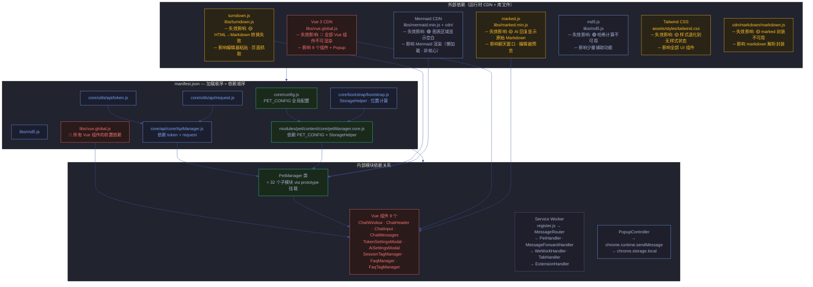
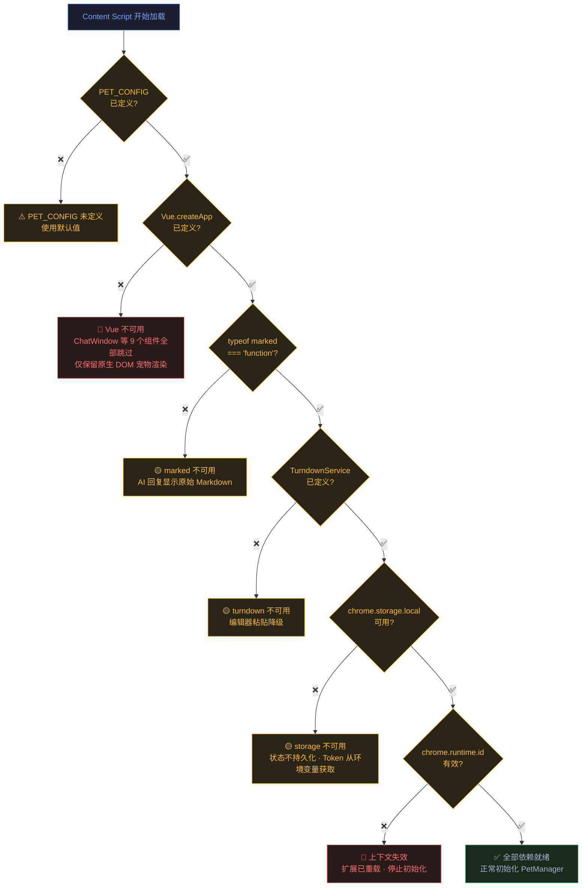

# 场景 4: 依赖关系与变更影响

> | v1.1.1 | 2026-06-05 | Claude Opus 4.8 | 🌿 main | ⏱️ 15:00–16:30 | 📎 [CLAUDE.md](../../../CLAUDE.md) |

[概述](#overview) · [§0 技术评审](#sec0) · [§1 测试设计](#sec1) · [§2 实施报告](#sec2) · [§3 测试报告](#sec3) · [§4 自改进](#sec4)

## 概述

**角色**: 架构师/维护者 · **目标**: 识别全部外部依赖、内部依赖关系，量化每个依赖失效时的爆炸半径 · **优先级**: P0

---

## §0 技术评审

### 依赖全景图（含失效影响标注）

### 外部依赖失效影响矩阵

| 依赖 | 版本/来源 | 加载方式 | 失效影响 | 爆炸半径 | 降级行为 | 检测方法 |
|------|---------|---------|---------|:---:|---------|---------|
| **Vue 3** | CDN `libs/vue.global.js` | manifest content_scripts | 🔴 全部 Vue 组件不可渲染 | 9 组件 + Popup | 无 UI 显示，`typeof Vue === 'undefined'` | `window.Vue !== undefined` |
| **marked.js** | CDN `libs/marked.min.js` | manifest content_scripts | 🟡 AI 回复显示原始 Markdown | 聊天窗口 · 编辑器 | `typeof marked === 'undefined'` → raw text fallback | `typeof marked === 'function'` |
| **turndown.js** | CDN `libs/turndown.js` | manifest content_scripts | 🟡 HTML→Markdown 转换失败 | 编辑器粘贴 · 页面抓取 | 转换 API 不可用，影响编辑器富文本粘贴 | `typeof TurndownService !== 'undefined'` |
| **Mermaid** | CDN `libs/mermaid.min.js` + `cdn/markdown/mermaid*.js` | 懒加载（按需） | 🟢 图表区域空白 | Mermaid 渲染 | 懒加载失败 → 不渲染图表，不影响其他功能 | `typeof mermaid !== 'undefined'` |
| **md5.js** | CDN `libs/md5.js` | manifest content_scripts | 🟢 哈希计算不可用 | 辅助功能 | 少量功能降级 | `typeof md5 === 'function'` |
| **Tailwind CSS** | 本地 `assets/styles/tailwind.css` | manifest content_scripts css | 🟡 样式退化 | 全部 UI | 无样式状态，但 DOM 结构完好 | 检查 font-size/color 等 computed style |

### 内部模块变更影响图

```mermaid
flowchart TB
    subgraph triggers["变更触发源"]
        direction TB
        T1["manifest.json<br/>content_scripts 顺序变更"]:::risk
        T2["PET_CONFIG (config.js)<br/>配置结构变更"]:::risk
        T3["PetManager 类<br/>构造函数/prototype 接口变更"]:::risk
        T4["ApiManager<br/>请求拦截器接口变更"]:::risk
        T5["TokenManager<br/>获取方式/存储 key 变更"]:::milestone
        T6["RequestClient<br/>请求配置接口变更"]:::milestone
        T7["Vue 组件<br/>props/events 接口变更"]:::milestone
        T8["chrome.storage.local<br/>Key 命名变更"]:::milestone
        T9["样式文件<br/>CSS class 变更"]:::review
    end

    subgraph impacts["爆炸半径"]
        direction TB
        I1["manifest 顺序变更<br/>→ 全部 88 个文件的加载稳定性<br/>→ InjectionService.CONTENT_SCRIPT_FILES 需同步"]:::core
        I2["config 变更<br/>→ 37 个引用 PET_CONFIG 的模块<br/>→ config.js 全局赋值逻辑"]:::core
        I3["PetManager 接口变更<br/>→ 32 个子模块 prototype 挂载<br/>→ 9 个 Vue 组件调用<br/>→ PopupController 引用<br/>→ Service Worker 引用"]:::core
        I4["ApiManager 变更<br/>→ SessionService · FaqService<br/>→ 所有 API 调用链路"]:::core
        I5["TokenManager 变更<br/>→ ApiManager 默认拦截器<br/>→ TokenSettingsModal<br/>→ Popup 认证逻辑"]:::core
        I6["RequestClient 变更<br/>→ ApiManager<br/>→ 所有 HTTP 请求"]:::core
        I7["Vue 组件接口变更<br/>→ ChatWindow 复合组件树<br/>→ Popup Vue 组件"]:::core
        I8["storage Key 变更<br/>→ PetManager.state · PopupController<br/>→ SW register.js · TokenManager"]:::core
        I9["CSS 变更<br/>→ 7 个样式文件交叉引用<br/>→ 组件内联样式"]:::core
    end

    T1 --> I1
    T2 --> I2
    T3 --> I3
    T4 --> I4
    T5 --> I5
    T6 --> I6
    T7 --> I7
    T8 --> I8
    T9 --> I9

    classDef core fill:#1b1e2e,stroke:#7aa2f7,color:#7aa2f7
    classDef review fill:#1e1f2b,stroke:#7aa2f7,color:#a9b1d6
    classDef risk fill:#2a1a1a,stroke:#f87171,color:#f87171
    classDef milestone fill:#2a2417,stroke:#fbbf24,color:#fbbf24
```

### 变更影响量化表

| 变更类型 | 影响文件数（估算） | 典型变更 | 推荐验证方式 | 风险 |
|---------|:---:|------|---------|:---:|
| `PET_CONFIG` 结构变更 | 37 | 新增/删除/重命名配置字段 | grep `PET_CONFIG` 全项目引用 → 逐一更新 | 高 |
| `PetManager` 方法签名变更 | 32+9+2 | 修改 `toggleChatWindow` 参数 | grep 方法名全项目引用 → 逐一更新调用方 | 高 |
| manifest 加载顺序调整 | 88+1 | 新增/删除/移动 content_script | 与 `InjectionService.CONTENT_SCRIPT_FILES` 同步 | 高 |
| `ApiManager` 接口变更 | 4+2 | 拦截器签名变更 | grep `ApiManager` · `addRequestInterceptor` 调用方 | 高 |
| `TokenManager` 接口变更 | 5 | `getToken()` 返回值类型变更 | grep `tokenManager` · `getToken` 调用方 | 中 |
| `RequestClient` 接口变更 | 3 | `request()` 配置结构变更 | grep `RequestClient` · `requestClient` 调用方 | 中 |
| Vue 组件 props/events 变更 | 9 | ChatWindow 新增 prop | 检查组件模板 + 父组件传参 | 中 |
| chrome.storage Key 变更 | 6 | 重命名 storage key | grep 旧 key 全项目 → 更新读取方 | 中 |
| CSS 样式变更 | 7 | 修改 `.pet-container` 样式 | 视觉回归（影响全部页面注入） | 低 |
| 新增 content_script 模块 | 88+1 | 新文件加入加载顺序 | 更新 manifest + InjectionService.CONTENT_SCRIPT_FILES | 中 |

### 依赖可用性检测流程

---

## §1 测试设计

### TC-4-1: 外部依赖可用性

| 用例 ID | 场景 | Given | When | Then |
|---------|------|-------|------|------|
| TC-4-1-1 | Vue 3 正常加载 | 扩展正常安装 | `console.log(typeof Vue)` | 输出 `'function'` 或 `'object'` |
| TC-4-1-2 | marked.js 正常加载 | 扩展正常安装 | `console.log(typeof marked)` | 输出 `'function'` |
| TC-4-1-3 | turndown.js 正常加载 | 扩展正常安装 | `console.log(typeof TurndownService)` | 输出 `'function'` |
| TC-4-1-4 | md5.js 正常加载 | 扩展正常安装 | `console.log(typeof md5)` | 输出 `'function'` |
| TC-4-1-5 | Tailwind CSS 正常加载 | 扩展正常安装 | 检查宠物 DOM 元素的 `font-size` computed style | 非浏览器默认值（16px），说明 Tailwind 生效 |
| TC-4-1-6 | Mermaid 懒加载可用 | 触发 Mermaid 渲染 | 检查 `petManager.mermaidLoaded` | 加载后为 `true` |

### TC-4-2: 依赖失效降级

| 用例 ID | 场景 | Given | When | Then |
|---------|------|-------|------|------|
| TC-4-2-1 | Vue 缺失降级 | 模拟屏蔽 `vue.global.js` 加载 | 页面注入 content script | ChatWindow 等 Vue 组件不创建，`window.Vue === undefined`，但宠物基础 DOM 渲染正常 |
| TC-4-2-2 | marked 缺失降级 | 模拟屏蔽 `marked.min.js` | AI 返回 Markdown 格式回复 | 回复以原始 Markdown 显示在聊天窗口（不解析） |
| TC-4-2-3 | turndown 缺失降级 | 模拟屏蔽 `turndown.js` | 在编辑器中粘贴富文本 | HTML 转 Markdown 失败，粘贴降级为纯文本 |
| TC-4-2-4 | chrome.storage 不可用降级 | 模拟扩展上下文失效 | 修改宠物颜色 | 操作失败，返回 `{ contextInvalidated: true }` |
| TC-4-2-5 | PET_CONFIG 缺失降级 | 模拟屏蔽 `config.js` | 注入 content script | `petManager.core.js` 检测到 `PET_CONFIG` undefined，使用硬编码默认值兜底 |

### TC-4-3: 内部变更影响验证

| 用例 ID | 场景 | Given | When | Then |
|---------|------|-------|------|------|
| TC-4-3-1 | manifest 与 InjectionService 一致性 | 项目源码 | 对比 `manifest.json content_scripts[0].js` 与 `InjectionService.CONTENT_SCRIPT_FILES` | 两个数组完全一致（顺序 + 内容） |
| TC-4-3-2 | PET_CONFIG 引用完整性 | 项目源码 | `grep -r "PET_CONFIG" --include="*.js"` | 所有引用路径存在，无引用不存在的配置字段 |
| TC-4-3-3 | PetManager.prototype 方法完整性 | 项目源码 | 遍历所有 `petManager.*.js` 的 `proto.xxx = function` | 无重复定义的方法名，无未定义即被调用的方法 |
| TC-4-3-4 | 新增模块加载顺序验证 | 新增一个 content_script 模块 | 将新文件加入 manifest js 数组 | 新模块正确加载，无依赖缺失错误 |
| TC-4-3-5 | 删除模块影响分析 | 移除 `petManager.chat.js` | 页面加载扩展 | 聊天窗口功能不可用，其他宠物功能不受影响（模块隔离验证） |

### TC-4-4: CDN 依赖回退

| 用例 ID | 场景 | Given | When | Then |
|---------|------|-------|------|------|
| TC-4-4-1 | Mermaid 懒加载网络错误 | Mermaid CDN `libs/mermaid.min.js` 不可达 | 触发 Mermaid 渲染 | `petManager.mermaidLoading` 为 false，图表区域显示空白/错误提示 |
| TC-4-4-2 | 外部库文件完整性 | 项目源码 | `ls libs/` 确认 5 个库文件存在 | `md5.js · marked.min.js · mermaid.min.js · turndown.js · vue.global.js` 全部存在 |
| TC-4-4-3 | web_accessible_resources 中的 CDN 文件可访问 | 扩展已加载 | 从网页脚本尝试 fetch `chrome-extension://<id>/libs/mermaid.min.js` | 返回 200（web_accessible_resources 声明了该文件） |

### TC-4-5: 构建与运行环境

| 用例 ID | 场景 | Given | When | Then |
|---------|------|-------|------|------|
| TC-4-5-1 | 无构建步骤验证 | 从源码直接加载 | Chrome `chrome://extensions` → 加载已解压的扩展 → 选择项目根目录 | 扩展加载成功，无编译/构建错误 |
| TC-4-5-2 | manifest_version 3 约束 | 审查 manifest.json | 检查 `manifest_version` | 值为 `3`，无 MV2 特有字段（如 `background.scripts`） |
| TC-4-5-3 | 文件编码验证 | 项目源码 | 检查关键字 JS 文件编码 | 全部为 UTF-8，中文注释正常显示 |

---

## §2 实施报告

> 待补充 — 由 coder 在实施后填写。

---

## §3 测试报告

> 待补充 — 由 tester 在测试后填写。

---

## §4 自改进

> 待补充 — 检视发现与改进项。

---

> **导航**: [← 场景-3-安全边界](./场景-3-安全边界.md) · [场景-5-上手指南 →](./场景-5-上手指南.md)

### 变更记录

| 版本 | 日期 | 作者 | 变更说明 |
|------|------|------|---------|
| v1.1.1 | 2026-06-05 | Claude Opus 4.8 | 文档标准化：添加 F.meta、F.toc、Tokyo Night Dark 主题、语义化 classDef、§2–§4 占位、变更记录 |
| v1.0.0 | 2026-06-02 | coder | 初始版本 |
