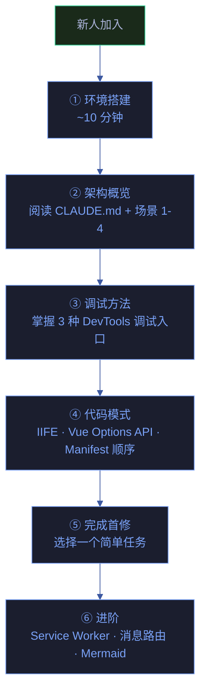
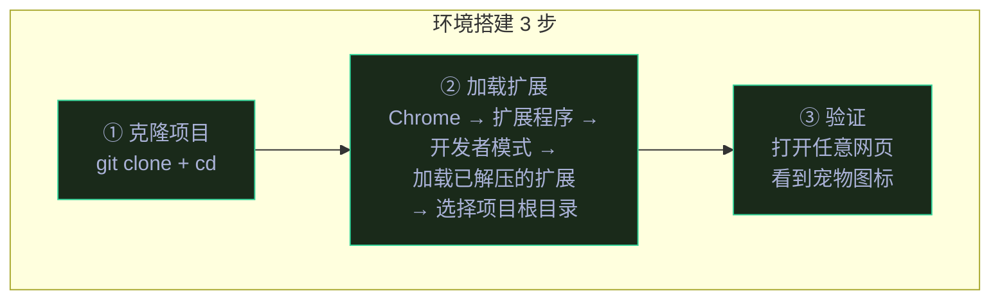
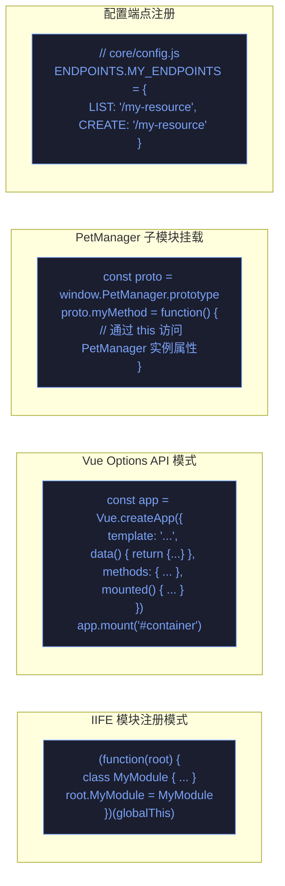
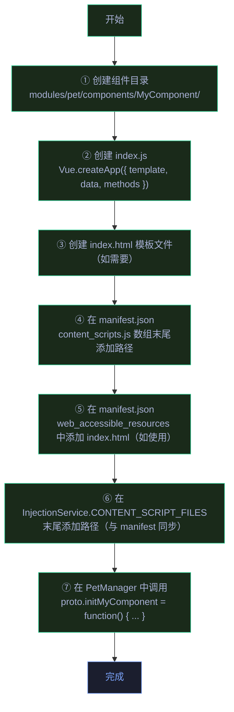
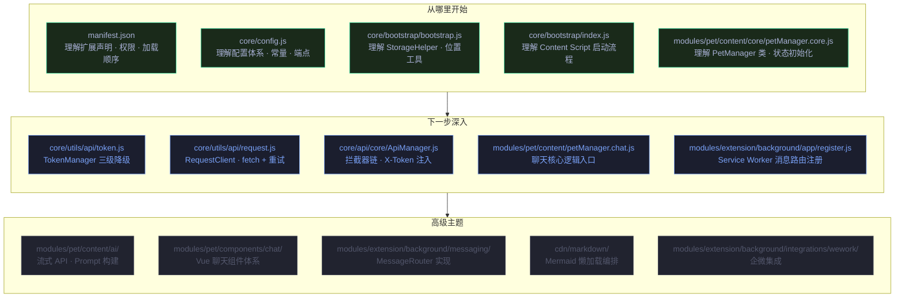

# 场景 5: 新人上手与开发指南

> | v1.1.1 | 2026-06-05 | Claude Opus 4.8 | 🌿 main | ⏱️ 15:00–16:30 | 📎 [CLAUDE.md](../../../CLAUDE.md) |

[概述](#overview) · [§0 技术评审](#sec0) · [§1 测试设计](#sec1) · [§2 实施报告](#sec2) · [§3 测试报告](#sec3) · [§4 自改进](#sec4)

## 概述

**角色**: 新加入开发者 · **目标**: 独立完成环境搭建、掌握调试方法、完成首个代码修改 · **优先级**: P1

---

## §0 技术评审

### 学习路径

### 环境搭建流程

| 步骤 | 操作 | 验证 |
|:---:|------|------|
| 1 | `git clone <repo> && cd YiPet` | `ls manifest.json` 存在 |
| 2 | Chrome `chrome://extensions` → 开启开发者模式 → "加载已解压的扩展程序" → 选择项目根目录 | 扩展卡片出现，ID 分配 |
| 3 | 打开 `https://github.com` | 右下角出现宠物图标 |
| 4 | 点击宠物打开聊天窗口 | 聊天窗口正常显示 |
| 5 | 配置 Token（弹出 Token 设置弹窗） | Token 格式校验通过 |

> **无构建步骤** — YiPet 是纯 JavaScript 项目，无需 `npm install`、`npm run build` 或任何打包工具。直接加载源码目录即可运行。

### 三种调试入口

```mermaid
flowchart TB
    subgraph debug1["入口 1: Content Script Debugging"]
        direction TB
        D1A["打开任意网页<br/>右键 → 检查"]:::good
        D1B["Console 标签<br/>输入 petManager"]:::core
        D1C["Sources 标签<br/>找到 content scripts → 项目文件<br/>可设置断点"]:::good
    end

    subgraph debug2["入口 2: Service Worker Debugging"]
        direction TB
        D2A["chrome://extensions<br/>找到 YiPet 卡片"]:::good
        D2B["点击 Service Worker 链接<br/>检查视图: 后台页"]:::core
        D2C["Console 标签<br/>查看 SW 日志 · 消息路由"]:::core
    end

    subgraph debug3["入口 3: Popup Debugging"]
        direction TB
        D3A["点击工具栏 YiPet 图标<br/>弹出 Popup"]:::good
        D3B["右键 Popup 窗口 → 检查"]:::good
        D3C["独立 DevTools 窗口<br/>调试 PopupController"]:::core
    end

    classDef core fill:#1b1e2e,stroke:#7aa2f7,color:#7aa2f7
    classDef good fill:#1a2a1a,stroke:#34d399,color:#a9b1d6
```

| 调试入口 | 打开方式 | 可调试内容 | 关键全局变量 |
|---------|---------|-----------|------------|
| Content Script | 网页 DevTools → Sources → Content scripts | PetManager · Vue 组件 · UI 渲染 | `window.petManager`, `window.PetManager`, `window.PET_CONFIG` |
| Service Worker | `chrome://extensions` → Service Worker 链接 | 消息路由 · Tab 管理 · 存储监听 | `self.MessageRouter`, `self.InjectionService` |
| Popup | 点击工具栏图标 → 右键 Popup → 检查 | PopupController · 设置面板 | `window.PopupController` |

### 代码规范速查

| 规范 | 说明 | 示例 |
|------|------|------|
| **IIFE 模块** | 所有源码文件使用 IIFE 包裹，通过 `root` 暴露全局变量 | `(function(root) { root.Foo = Foo })(globalThis \|\| self \|\| window)` |
| **Vue Options API** | Vue 3 组件使用 Options API（非 Composition API），与现有 ChatWindow 一致 | `data()`, `methods`, `mounted()` 等选项 |
| **Prototype 扩展** | 拆分 PetManager 时，子模块通过 `PetManager.prototype` 挂载方法 | `const proto = PetManager.prototype; proto.newMethod = function() {}` |
| **配置集中化** | 所有 API 端点、魔法数字、常量定义在 `core/config.js` 的 `PET_CONFIG` 中 | `PET_CONFIG.constants.TIMING.RETRY_DELAY` |
| **存储访问** | 所有 chrome.storage.local 操作通过 `StorageHelper` 工具函数 | `StorageHelper.set(key, value)` / `StorageHelper.get(key)` |
| **Token 获取** | 通过 `TokenManager` / `TokenUtils` 统一获取，不直接读 storage | `tokenManager.getToken()` / `TokenUtils.getApiToken()` |
| **API 请求** | 通过 `ApiManager` → `RequestClient` 链路，不直接使用 `fetch` | `apiManager.get(url, params)` |

### 常见任务操作指南

#### 任务 1: 新增一个 Vue 组件

| 步骤 | 文件 | 关键操作 |
|:---:|------|---------|
| 1 | `modules/pet/components/MyComponent/` | 新建目录 |
| 2 | `index.js` | IIFE 包裹，`Vue.createApp(...)` 或 prototype 挂载 |
| 3 | `index.html` | 可选，仅当组件需要独立模板时 |
| 4 | `manifest.json` | `content_scripts[0].js` 数组末尾追加 |
| 5 | `manifest.json` | `web_accessible_resources[0].resources` 追加（如需要） |
| 6 | `InjectionService.CONTENT_SCRIPT_FILES` | 数组末尾追加，与 manifest 保持同步 |
| 7 | 新增或现有 `petManager.*.js` | 通过 `proto` 挂载方法 |

#### 任务 2: 新增一个 API 端点

| 步骤 | 文件 | 关键操作 |
|:---:|------|---------|
| 1 | `core/config.js` | 在 `ENDPOINTS` 中添加端点定义：`MY_ENDPOINTS: { LIST: '/my-resource', CREATE: '/my-resource' }` |
| 2 | `core/api/services/` | 新建或扩展现有 Service 类，使用 `this.apiManager.get/put/post/delete()` |
| 3 | 调用方 | 在 PetManager 子模块中通过 Service 实例调用新端点 |

#### 任务 3: 新增一个 Content Script 子模块

| 步骤 | 文件 | 关键操作 |
|:---:|------|---------|
| 1 | `modules/pet/content/modules/petManager.myFeature.js` | IIFE 包裹，`PetManager.prototype` 挂载方法 |
| 2 | `manifest.json` | 在 `content_scripts[0].js` 数组中按依赖顺序插入 |
| 3 | `InjectionService.CONTENT_SCRIPT_FILES` | 同步添加路径 |
| 4 | 入口装配 | 在 `petManager.js` 或相关入口文件中调用初始化逻辑 |

### 关键文件地图

### 常见问题速查

| 问题 | 症状 | 排查方式 |
|------|------|---------|
| 扩展加载失败 | `manifest.json` 解析错误 | 检查 JSON 语法；确认文件路径全部存在 |
| 宠物不显示 | 网页无宠物图标 | 检查是否为系统页面（`chrome://` 等）；DevTools Console 查看 `petManager` 是否存在 |
| 聊天窗口空白 | 窗口弹出但无内容 | Console 检查 `typeof Vue`；确认 `vue.global.js` 已加载 |
| API 请求失败 | 聊天回复 "请求失败" | Network 面板查看 HTTP 状态；确认 Token 已配置 |
| Token 无法保存 | 设置后刷新丢失 | 检查 `YiPet.apiToken.v1` 在 chrome.storage.local 中的值；确认扩展未重载 |
| "Extension context invalidated" | 控制台频繁报错 | 扩展被更新或重载；刷新页面重新注入 content script |
| Mermaid 图表不渲染 | 图表区域空白 | Console 检查 `petManager.mermaidLoaded`；可能是 CDN 加载失败 |

---

## §1 测试设计

### TC-5-1: 环境搭建验证

| 用例 ID | 场景 | Given | When | Then |
|---------|------|-------|------|------|
| TC-5-1-1 | 扩展成功加载 | Chrome 开发者模式开启 | `chrome://extensions` → 加载已解压的扩展 → 选择项目根目录 | 扩展卡片出现，显示版本号、权限列表 |
| TC-5-1-2 | Content Script 注入验证 | 打开 `https://github.com` | DevTools Console → `console.log(typeof window.petManager)` | 输出 `'object'` |
| TC-5-1-3 | 宠物图标可见 | 打开任意网页 | 等待 2 秒 | 页面右下角出现宠物图标 |
| TC-5-1-4 | 聊天窗口可打开 | 宠物可见 | 点击宠物图标 → 选择聊天 | 聊天窗口弹出，包含输入框和发送按钮 |
| TC-5-1-5 | Popup 面板可打开 | 扩展工具栏图标 | 点击工具栏 YiPet 图标 | Popup 面板弹出，显示宠物设置控件 |

### TC-5-2: 调试方法验证

| 用例 ID | 场景 | Given | When | Then |
|---------|------|-------|------|------|
| TC-5-2-1 | Content Script 断点调试 | 打开 Sources → Content scripts | 在 `petManager.chat.js` 的 `toggleChatWindow` 方法设置断点 | 点击聊天按钮时断点触发，可查看作用域变量 |
| TC-5-2-2 | Service Worker Console | `chrome://extensions` Service Worker 链接 | 在 SW Console 执行 `console.log(Object.keys(self.MessageRouter.handlers))` | 输出已注册的全部 action 列表 |
| TC-5-2-3 | Popup 独立调试 | 点击工具栏图标 → 右键 Popup → 检查 | 在 Popup Console 执行 `console.log(PopupController)` | 输出 PopupController 类定义 |
| TC-5-2-4 | chrome.storage 数据探查 | Content Script Console | `chrome.storage.local.get(null, d => console.log(d))` | 输出全部 storage 数据 |

### TC-5-3: 常见任务验证

| 用例 ID | 场景 | Given | When | Then |
|---------|------|-------|------|------|
| TC-5-3-1 | 新增组件加载 | 按指南添加 `MyComponent` | 扩展重载 → 打开网页 | `MyComponent` 的文件被加载，Console 无 404 报错 |
| TC-5-3-2 | 新增 API 端点可用 | 按指南添加端点定义 | 在 Console 调用新端点 | Network 面板显示对应的 API 请求 |
| TC-5-3-3 | 新增子模块方法可用 | 按指南添加 `petManager.myFeature.js` | `console.log(typeof petManager.myNewMethod)` | 输出 `'function'` |
| TC-5-3-4 | manifest 与 InjectionService 同步 | 新增文件后 | 对比两者数组 | 完全一致 |

### TC-5-4: 文档准确性验证

| 用例 ID | 场景 | Given | When | Then |
|---------|------|-------|------|------|
| TC-5-4-1 | CLAUDE.md 路径存在 | 项目根目录 | 检查 CLAUDE.md 中的所有文件路径引用 | 全部路径对应的文件存在 |
| TC-5-4-2 | 场景文档导航链完整 | 场景 1-5 文件 | 检查每个文件的导航链接 | 前驱和后继链接全部可访问 |
| TC-5-4-3 | 代码规范示例可执行 | 项目源码 | 复制文档中的代码模式验证语法 | IIFE 模式、Vue Options API 模式语法正确 |
| TC-5-4-4 | 常见问题排查步骤可复现 | 模拟对应问题 | 按排查方式执行 | 能定位到问题根因 |

### TC-5-5: 新人首修端到端

| 用例 ID | 场景 | Given | When | Then |
|---------|------|-------|------|------|
| TC-5-5-1 | 完整首修流程 | 新人环境已搭建 | 1) 创建 feat 分支 2) 修改一个配置常量 3) 重载扩展 4) 验证修改生效 | 全程无需外部指导，30 分钟内完成 |
| TC-5-5-2 | 无构建步骤验证 | 源码直接修改 | 修改 `core/config.js` 中的任意常量 → 重载扩展 | 修改立即生效，无需运行任何构建命令 |
| TC-5-5-3 | Git 工作流验证 | 功能分支已创建 | 修改 → commit → 推送 | 标准 git 工作流正常 |

---

## §2 实施报告

> 待补充 — 由 coder 在实施后填写。

---

## §3 测试报告

> 待补充 — 由 tester 在测试后填写。

---

## §4 自改进

> 待补充 — 检视发现与改进项。

---

> **导航**: [← 场景-4-依赖影响](./场景-4-依赖影响.md)

### 变更记录

| 版本 | 日期 | 作者 | 变更说明 |
|------|------|------|---------|
| v1.1.1 | 2026-06-05 | Claude Opus 4.8 | 文档标准化：添加 F.meta、F.toc、Tokyo Night Dark 主题、语义化 classDef、§2–§4 占位、变更记录 |
| v1.0.0 | 2026-06-02 | coder | 初始版本 |
