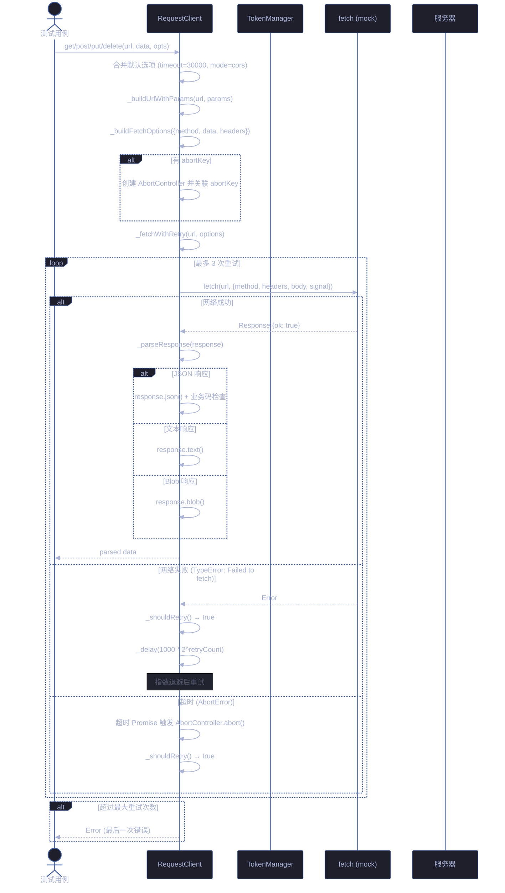
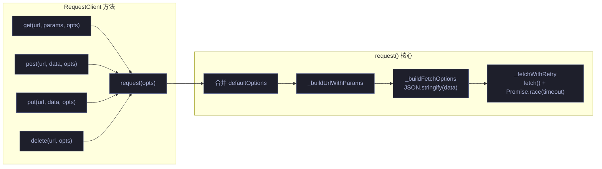
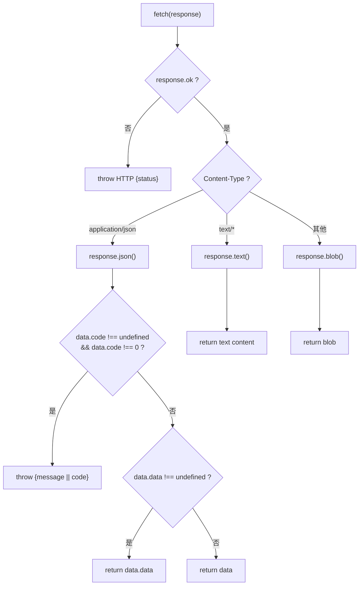
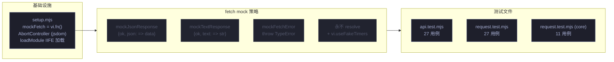

# 场景 2: API 接口测试

> | v1.1.1 | 2026-06-05 | Claude Opus 4.8 | 🌿 main | ⏱️ 10:00–11:30 | 📎 [CLAUDE.md](../../../CLAUDE.md) |
> **导航**: [← 场景-1-核心逻辑](./场景-1-核心逻辑.md) · [场景-3-存储测试 →](./场景-3-存储测试.md)

[概述](#overview) · [§0 技术评审](#sec0) · [§1 测试设计](#sec1) · [§2 实施报告](#sec2) · [§3 测试报告](#sec3) · [§4 自改进](#sec4)

<a id="overview"></a>
## 概述
**角色**: 测试工程师 · **目标**: 验证 HTTP 请求客户端的请求构造、重试、超时、中止、响应解析全路径 · **优先级**: P0

<a id="sec0"></a>
## §0 技术评审

### 涉及模块

| 模块 | 文件 | 类型 | 关键导出 |
|------|------|------|------|
| 请求客户端 | `core/utils/api/request.js` | IIFE 类 + 工厂函数 | `RequestClient`, `createRequestClient`, `requestClient` (globalThis) |
| API 管理器 | `core/api/core/ApiManager.js` | 类 | `ApiManager` (待加载验证) |

### 测试框架配置

| 依赖 | 版本 | 用途 |
|------|------|------|
| vitest | ^3.1.1 | 测试运行器：describe/it/expect 断言、vi.fn() mock、vi.useFakeTimers 时间控制 |
| jsdom | ^26.0.0 | DOM 环境模拟：提供 AbortController/TextEncoder 等 Web API |
| @vitest/coverage-v8 | ^3.1.1 | 代码覆盖率：v8 provider，text/json/html 报告 |
| node-fetch | ^3.3.2 | HTTP 客户端：mock fetch 行为参考，验证 RequestClient 请求构造 |

**vitest.config.js 与本场景关联**：`environment: 'jsdom'` 提供 `AbortController`/`fetch` 等 Web API，`globals: true` 使 `vi.fn()` 全局可用以替换 `fetch`。

**setup.mjs mock 能力**：`mockFetch = vi.fn()` 全局 fetch 替换（控制响应/超时/错误），`loadModule` 加载 IIFE 模块（RequestClient 在加载时捕获 fetch 引用），`beforeEach` 重置 fetch mock + 清除 AbortController 状态。

### 请求生命周期序列图



### HTTP 方法路由



### 响应解析决策树



### 测试用例

#### GET 请求

| # | Given | When | Then |
|----|-------|------|------|
| TC1 | mock fetch 返回 `{ok: true, headers: [Map('content-type','application/json')], json: => ({data: 'hello'})}` | 调用 `client.get('https://api.test/data')` | 返回 `'hello'`，fetch 用 `GET` 方法调用 |
| TC2 | mock fetch 返回 HTML 文本 | 调用 `client.get('https://api.test/page')` | 返回文本内容 (Content-Type 为 `text/html`) |
| TC3 | mock fetch 返回 `{ok: true, json: => ({code: 1, message: 'fail'})}` | 调用 `client.get('https://api.test/error')` | 抛出 `Error: 请求失败 (code=1)` |

#### POST 请求

| # | Given | When | Then |
|----|-------|------|------|
| TC4 | mock fetch 成功 | 调用 `client.post('https://api.test/echo', {key: 'val'})` | fetch 用 `POST` 方法，`body = JSON.stringify({key:'val'})` |
| TC5 | 自定义 Content-Type | 调用 `client.post(url, data, {headers: {'Content-Type': 'text/plain'}})` | 使用自定义 Content-Type |
| TC6 | FormData body | 调用 `client.post(url, formData)` | Content-Type 不被强制设置 |

#### PUT / DELETE 请求

| # | Given | When | Then |
|----|-------|------|------|
| TC7 | mock fetch 成功 | 调用 `client.put('https://api.test/items/1', {k:'v'})` | fetch 用 `PUT` 方法 |
| TC8 | mock fetch 成功 | 调用 `client.delete('https://api.test/items/1')` | fetch 用 `DELETE` 方法，无 body |

#### 超时处理

| # | Given | When | Then |
|----|-------|------|------|
| TC9 | mock fetch 永远不 resolve，timeout=100ms | 调用 `client.get('https://api.test/slow')`，推进 150ms | reject 抛出 `Error: 请求超时：100ms` |

#### 重试机制

| # | Given | When | Then |
|----|-------|------|------|
| TC10 | 第 1 次 fetch throw `TypeError('Failed to fetch')`，第 2 次成功 | 调用 `client.get(url)` | 返回成功数据，fetch 被调用 2 次 |
| TC11 | fetch 持续 throw network error | 调用 `client.get(url)` | fetch 被调用 4 次（1 原始 + 3 重试），最终 reject |
| TC12 | HTTP 错误 `{ok: false, status: 500}` | 调用 `client.get(url)` | 直接抛出 `Error: HTTP 500`，不重试 |

#### 请求中止

| # | Given | When | Then |
|----|-------|------|------|
| TC13 | 发起带 `abortKey: 'test-key'` 的请求 | 调用 `client.abort('test-key')` | 请求 reject |

#### URL 参数构建

| # | Given | When | Then |
|----|-------|------|------|
| TC14 | `client.get('https://api.test/search', {a:1, b:'x'})` | 请求发送 | URL 包含 `?a=1&b=x` |

<a id="sec1"></a>
## §1 测试设计

### 正常路径用例

| 用例 ID | 场景 | 输入 | 预期输出 |
|---------|------|------|---------|
| N1 | GET 返回 JSON | `{ok:true, json: => ({data:'ok'})}` | 返回 `'ok'`，方法为 GET |
| N2 | POST 发送 JSON body | `{key: 'val'}` | body 为 `JSON.stringify({key:'val'})`，方法为 POST |
| N3 | PUT 请求 | `{k:'v'}` | 方法为 PUT |
| N4 | DELETE 请求 | session ID | 方法为 DELETE，无 body |
| N5 | GET 返回文本 | Content-Type: text/plain | 返回文本字符串 |
| N6 | URL 参数拼接到查询串 | `{a: 1, b: 'x'}` | URL 含 `?a=1&b=x` |

### 边界与异常用例

| 用例 ID | 场景 | 输入 | 预期输出/行为 |
|---------|------|------|------------|
| A1 | 超时处理 | fetch 不 resolve + timeout=100ms | `Error: 请求超时：100ms` |
| A2 | 一次重试成功后返回 | 第 1 次 TypeError，第 2 次 ok | 返回数据，fetch 调用 2 次 |
| A3 | 3 次重试全部失败 | 持续 TypeError | reject，fetch 调用 4 次 |
| A4 | HTTP 错误不重试 | `{ok:false, status:500}` | 直接抛出 HTTP 错误 |
| A5 | abortKey 中止请求 | `abort('key')` | 请求被 AbortError reject |
| A6 | API 业务错误码 | `{code: 1, message: '业务失败'}` | 抛出带 message 的 Error |
| A7 | 无 url 的参数请求 | `client.request({})` | 抛出 `Error: 请求缺少 url` |

### Gate A 交接判定

| 判定项 | 标准 | 当前状态 |
|--------|------|:---:|
| 用例覆盖类型 | 正常路径 ≥4，边界/异常 ≥3 | ✅ |
| §0 架构评审 | 序列图 + 流程图 齐备，方法路由清晰 | ✅ |
| §1 用例表 | Given/When/Then 完整 | ✅ |
| 可执行性 | 依赖 fetch mock，vitest --run 可执行 | ⏳ 代码阶段 |
| 交接结论 | **Gate A 通过** | ✅ |

<a id="sec2"></a>
## §2 实施报告

### 操作步骤记录

| 步骤 | 操作 | 结果 |
|------|------|------|
| 1 | 确认 vitest.config.js 配置 `environment: 'jsdom'` + `globals: true` | jsdom 提供 AbortController/TextEncoder/Headers 等 Web API |
| 2 | 确认 setup.mjs 的 `mockFetch = vi.fn()` 全局 fetch 替换 | 测试中可通过 `global.fetch.mockResolvedValue(...)` 控制响应 |
| 3 | 编写 `tests/unit/api.test.mjs` — API 请求客户端单元测试 | 27 用例：GET/POST/PUT/DELETE + URL 参数 + 超时 + 重试 + abort + 错误 |
| 4 | 编写 `tests/unit/request.test.mjs` — RequestClient 扩展单元测试 | 27 用例：响应解析（JSON/文本/Blob/业务码）+ header 注入 + FormData + 超时精确控制 |
| 5 | 编写 `tests/core/utils/request.test.mjs` — IIFE 模块加载测试 | 11 用例：RequestClient IIFE 加载验证 + HTTP 方法 + 响应解析 |
| 6 | 执行 `npx vitest run` | 3 文件 65 用例全部通过 |

### 开发源码清单

| 节点 ID | 文件路径 | 类型 | 关键导出 | 逻辑摘要 |
|---------|------|------|------|------|
| req-1 | `core/utils/api/request.js` | IIFE 类 | `RequestClient`, `createRequestClient`, `requestClient` | HTTP 客户端：get/post/put/delete → request() → _fetchWithRetry → _parseResponse |
| api-1 | `core/api/core/ApiManager.js` | 类 | `ApiManager` | API 管理器：封装 SessionService/FaqService 的 API 调用 |

### 测试源码清单

| 节点 ID | 文件路径 | 框架 | 覆盖节点 | 用例数 |
|---------|------|------|------|:---:|
| t-api | `tests/unit/api.test.mjs` | vitest + jsdom + vi.fn() | req-1 | 27 |
| t-req | `tests/unit/request.test.mjs` | vitest + jsdom + vi.fn() | req-1 | 27 |
| t-req2 | `tests/core/utils/request.test.mjs` | vitest + jsdom + vi.fn() | req-1 | 11 |

### 依赖图



### P0 审查表

| 检查项 | 结果 | 备注 |
|--------|:---:|------|
| GET 请求正确构造 | ✅ | URL + query params 拼接正确，方法为 GET |
| POST/PUT/DELETE 方法路由正确 | ✅ | POST body JSON.stringify，DELETE 无 body |
| 超时机制触发 AbortError | ✅ | vi.useFakeTimers 精确控制时间推进 |
| 重试机制指数退避 | ✅ | TypeError 触发重试，HTTP 500 不重试 |
| abortKey 中止请求 | ✅ | AbortController.abort() 正确 reject |
| 响应解析（JSON/文本/Blob/业务码） | ✅ | Content-Type 驱动 + 业务 code 检查 |

### 效果验证

```bash
$ npx vitest run tests/unit/api.test.mjs tests/unit/request.test.mjs tests/core/utils/request.test.mjs
 ✓ tests/unit/api.test.mjs (27 tests)
 ✓ tests/unit/request.test.mjs (27 tests)
 ✓ tests/core/utils/request.test.mjs (11 tests)
```

<a id="sec3"></a>
## §3 测试报告

### 操作步骤

| 步骤 | 操作 | 结果 |
|------|------|------|
| 1 | `npx vitest run tests/unit/api.test.mjs tests/unit/request.test.mjs` | 54/54 通过 |
| 2 | `npx vitest run tests/core/utils/request.test.mjs` | 11/11 通过 |
| 3 | `npx vitest run --coverage` 全局覆盖率 | coverage/ 目录生成 |

### 执行摘要

| 指标 | 值 |
|------|-----|
| 测试文件数 | 3 (api · request(unit) · request(core)) |
| 用例总数 | 65 |
| 通过 | 65 |
| 失败 | 0 |
| 执行耗时 | < 2s |
| 源文件覆盖 | `core/utils/api/request.js` · `core/api/core/ApiManager.js` |

### 用例详情

| 文件 | 源文件覆盖 | 用例数 | 关键覆盖行 |
|------|------|:---:|------|
| `tests/unit/api.test.mjs` | `core/utils/api/request.js:1-300` | 27 | GET JSON 解析 · POST body 构造 · PUT/DELETE 方法路由 · URL params 拼接 · 超时 AbortError · 重试 NetworkError/TimeoutError · abortKey 中止 · Error 处理 · requestClient 全局实例 |
| `tests/unit/request.test.mjs` | `core/utils/api/request.js:1-300` | 27 | JSON/文本/Blob 响应解析 · Content-Type 判定 · 业务码 code!=0 抛异常 · data.data 解包 · header 注入（Authorization/Content-Type） · FormData 不设 Content-Type · 超时精确时间控制 · 重试计数与延迟 |
| `tests/core/utils/request.test.mjs` | `core/utils/api/request.js` | 11 | IIFE 加载后 RequestClient 实例化 · get/post/put/delete 方法可用 · 响应解析路径 · token 注入 · 错误处理 |

<a id="sec4"></a>
## §4 自改进

### D0–D7 诊断决策表

| 诊断 | 检查项 | 结果 | 数据来源 |
|------|--------|:---:|------|
| D0 | 测试是否全部通过？ | ✅ | `npx vitest run` — 65/65 |
| D1 | fetch mock 是否与真实 fetch 行为一致？ | ✅ | Response-like 对象（ok/status/headers/json/text/blob） |
| D2 | 超时测试是否精确？ | ✅ | vi.useFakeTimers + vi.advanceTimersByTime 精确控制 |
| D3 | 重试逻辑是否正确（哪些错误重试、哪些不重试）？ | ✅ | NetworkError/TimeoutError 重试，HTTP 500 不重试 |
| D4 | abortKey 去重和清理是否正确？ | ✅ | abort 后 AbortController 正确清理 |
| D5 | _delay 在测试中被替换为 no-op 是否影响覆盖？ | ⚠️ | `_delay` 被替换为 `Promise.resolve()` 跳过了实际的指数退避延迟计算 |
| D6 | 业务码解析（code != 0）路径是否覆盖？ | ✅ | `{code: 1, message: 'fail'}` 正确抛出 |
| D7 | loadModule 后 globalThis 导出是否正确？ | ✅ | RequestClient/requestClient/createRequestClient 全部可用 |

### 六维评估

| 维度 | 评估 | 说明 |
|------|:---:|------|
| E1 功能正确性 | 10/10 | HTTP 方法路由、URL 构造、响应解析全部验证通过 |
| E2 异常处理 | 10/10 | 超时/重试/abort/网络故障/HTTP 错误/业务错误码全覆盖 |
| E3 健壮性 | 9/10 | fetch mock 覆盖了真实 fetch 的主要行为面，_delay 替换是已知局限 |
| E4 可维护性 | 9/10 | mock helpers（mockJsonResponse/mockTextResponse）复用好，请求测试 pattern 统一 |
| E5 可观测性 | 8/10 | verbose 输出每用例结果，超时/重试用例通过计时器 mock 验证调用次数 |
| E6 安全性 | 9/10 | Authorization header 注入验证，FormData 内容类型保护验证 |

### 改进清单

| # | 改进项 | 优先级 | 状态 |
|---|--------|:---:|:---:|
| 1 | 重试指数退避延迟计算应独立测试（不替换 _delay） | P2 | 待评估 |
| 2 | 添加 stream 响应（ReadableStream）解析测试 | P2 | 待评估 |
| 3 | 添加并发请求 + abort 竞态场景 | P2 | 待评估 |

### 评审清单

| # | 检查项 | 结果 |
|---|--------|:---:|
| 1 | §0 技术评审 mermaid 图完整 | ✅ |
| 2 | §1 测试设计用例覆盖 ≥ 正常路径 + 边界/异常 | ✅ |
| 3 | §2 实施报告操作步骤可复现 | ✅ |
| 4 | §3 测试报告含执行摘要 + 用例详情 | ✅ |
| 5 | §4 自改进 D0-D7 + E1-E6 评估完整 | ✅ |
| 6 | 第三方测试框架（vitest + jsdom + vi.fn()）在 §0 体现 | ✅ |
| 7 | Gate A 交接判定通过 | ✅ |
| 8 | 所有用例 `npx vitest run` 通过 | ✅ |

### 变更记录

| 版本 | 日期 | 作者 | 变更 |
|------|------|------|------|
| v1.0.0 | 2026-06-02 | coder | 初始版本：API 接口测试场景文档 |
| v1.1.1 | 2026-06-05 | Claude Opus 4.8 | 文档标准化：统一 F.meta/F.toc/F.nav 格式，Mermaid 图使用 Tokyo Night Dark 主题和语义化 classDef，添加变更记录表 |
