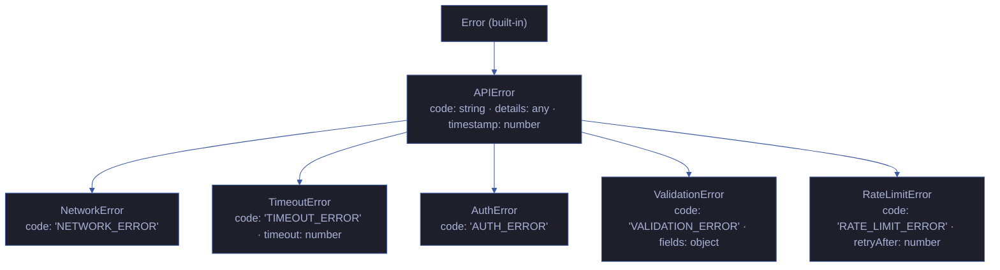
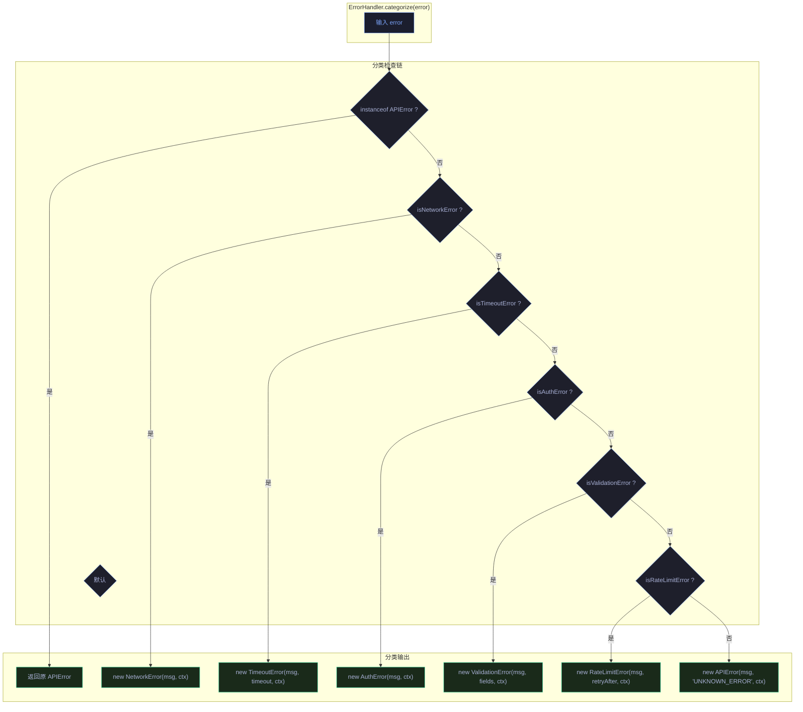
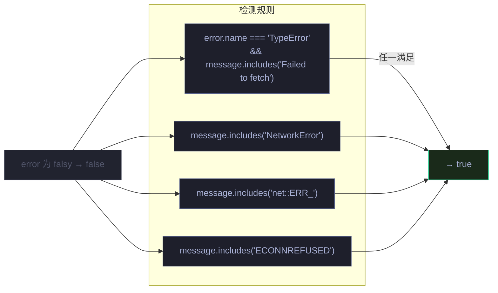
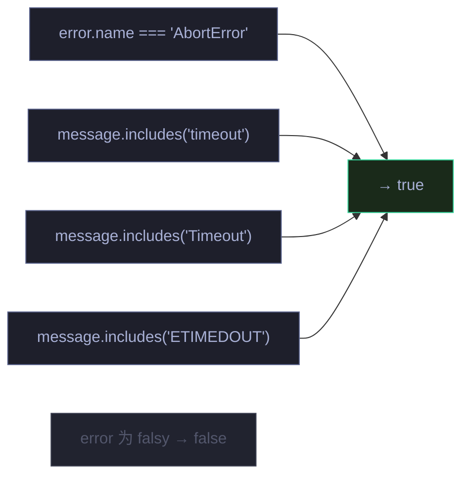
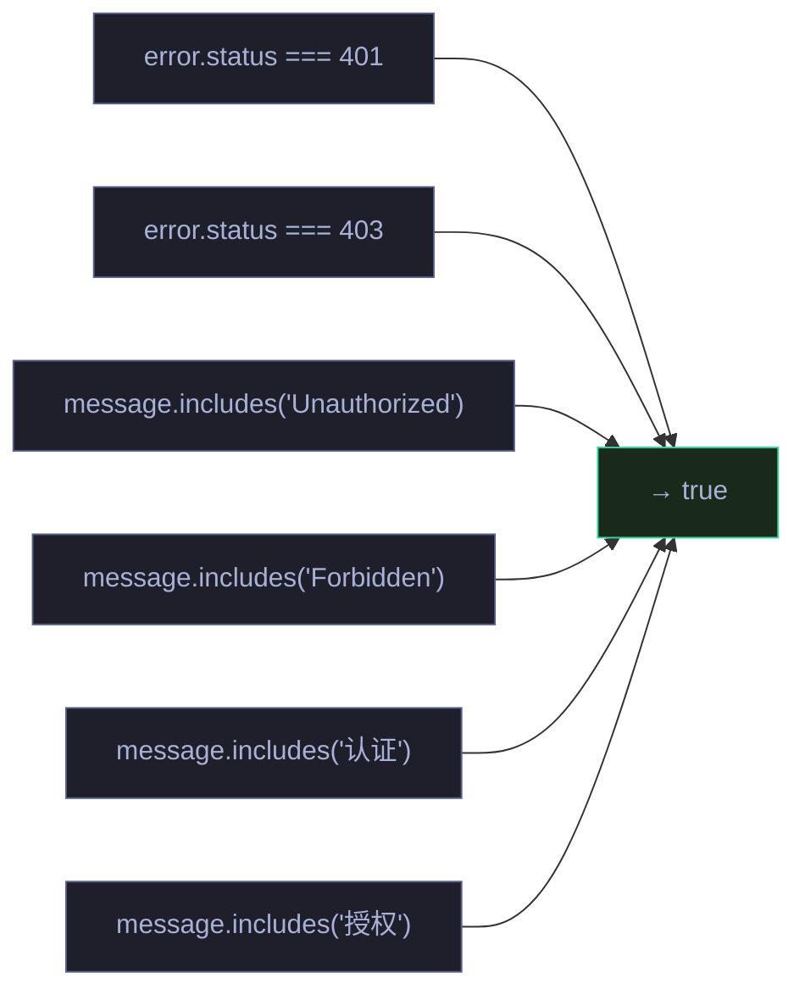
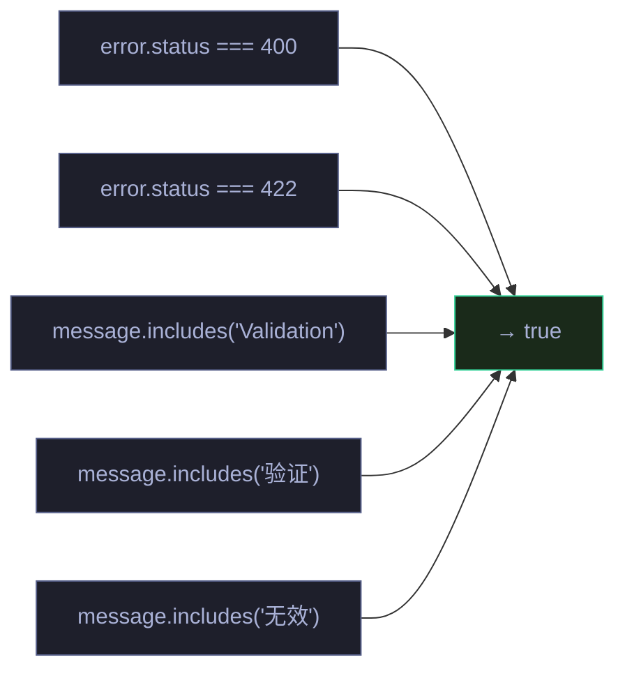
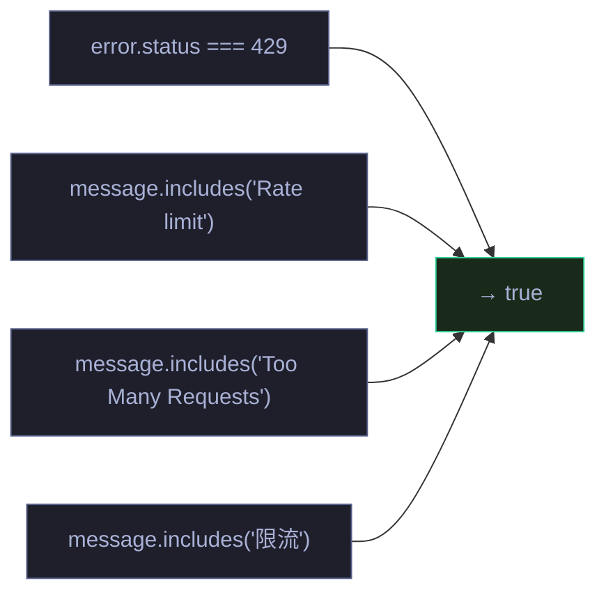
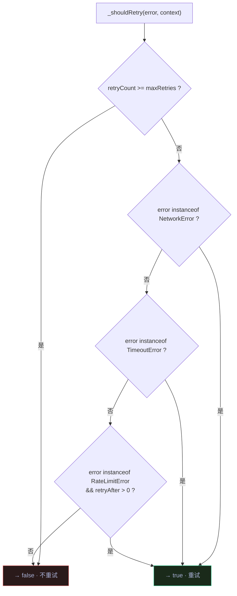
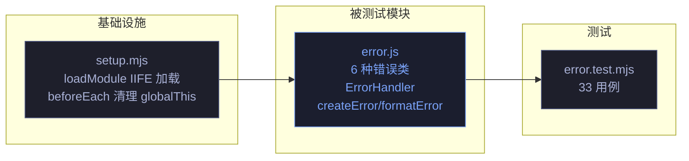

# 场景 4: 异常路径与边界

> | v1.1.1 | 2026-06-05 | Claude Opus 4.8 | 🌿 main | ⏱️ 10:00–11:30 | 📎 [CLAUDE.md](../../../CLAUDE.md) |
> **导航**: [← 场景-3-存储测试](./场景-3-存储测试.md) · [场景-5-集成测试 →](./场景-5-集成测试.md)

[概述](#overview) · [§0 技术评审](#sec0) · [§1 测试设计](#sec1) · [§2 实施报告](#sec2) · [§3 测试报告](#sec3) · [§4 自改进](#sec4)

<a id="overview"></a>
## 概述
**角色**: 测试工程师 · **目标**: 验证错误分类、错误处理、上下文失效检测、Token 缺失等异常路径的覆盖率 · **优先级**: P0

<a id="sec0"></a>
## §0 技术评审

### 涉及模块

| 模块 | 文件 | 类型 | 关键导出 |
|------|------|------|------|
| 错误处理 | `core/utils/api/error.js` | IIFE 类 + 工具函数 | `APIError`, `NetworkError`, `TimeoutError`, `AuthError`, `ValidationError`, `RateLimitError`, `ErrorHandler`, `createError`, `formatError`, `setGlobalErrorHandler`, `getGlobalErrorHandler` (globalThis) |

### 测试框架配置

| 依赖 | 版本 | 用途 |
|------|------|------|
| vitest | ^3.1.1 | 测试运行器：describe/it/expect 断言、vi.fn() mock |
| jsdom | ^26.0.0 | DOM 环境模拟：提供 window/document 全局对象 |
| @vitest/coverage-v8 | ^3.1.1 | 代码覆盖率：v8 provider，text/json/html 报告 |

**vitest.config.js 与本场景关联**：`environment: 'jsdom'` 提供 `window` 全局对象，`globals: true` 使 describe/it/expect 全局可用，`setupFiles` 预加载通用 mock。

**setup.mjs mock 能力**：`loadModule`（Function 构造器加载 error.js IIFE 模块并注入 globalThis），`beforeEach` 清理 globalThis 上所有错误类避免用例间污染。

### 错误分类层次



### 错误判断策略矩阵



### isNetworkError 检测规则



### isTimeoutError 检测规则



### isAuthError 检测规则



### isValidationError 检测规则



### isRateLimitError 检测规则



### 重试决策逻辑



### 测试用例

#### APIError 类层次

| # | Given | When | Then |
|----|-------|------|------|
| TC1 | 无参数 | `new APIError('msg', 'CODE', {detail: 1})` | `name='APIError'`, `message='msg'`, `code='CODE'`, `details={detail: 1}`, `timestamp` 为数字 |
| TC2 | `NetworkError` 实例 | `new NetworkError('网络失败')` | `name='NetworkError'`, `code='NETWORK_ERROR'`, `instanceof APIError` 为 true |
| TC3 | `TimeoutError` 实例 | `new TimeoutError('超时', 30000)` | `name='TimeoutError'`, `code='TIMEOUT_ERROR'`, `timeout=30000` |
| TC4 | `AuthError` 实例 | `new AuthError('未授权')` | `name='AuthError'`, `code='AUTH_ERROR'` |
| TC5 | `ValidationError` 实例 | `new ValidationError('参数错误', {name: 'required'})` | `name='ValidationError'`, `code='VALIDATION_ERROR'`, `fields={name:'required'}` |
| TC6 | `RateLimitError` 实例 | `new RateLimitError('限流', 60)` | `name='RateLimitError'`, `code='RATE_LIMIT_ERROR'`, `retryAfter=60` |

#### ErrorHandler.categorize 分类

| # | Given | When | Then |
|----|-------|------|------|
| TC7 | `new TypeError('Failed to fetch')` | 调用 `handler.categorize(error)` | 返回 `NetworkError` 实例 |
| TC8 | `{name: 'AbortError'}` | 调用 `handler.categorize(error)` | 返回 `TimeoutError` 实例 |
| TC9 | `{status: 401}` | 调用 `handler.categorize(error)` | 返回 `AuthError` 实例 |
| TC10 | `{status: 400}` | 调用 `handler.categorize(error)` | 返回 `ValidationError` 实例 |
| TC11 | `{status: 429}` | 调用 `handler.categorize(error)` | 返回 `RateLimitError` 实例 |
| TC12 | 已分好类的 `new NetworkError('x')` | 调用 `handler.categorize(error)` | 原样返回，不二次包装 |
| TC13 | `new Error('unknown thing')` | 调用 `handler.categorize(error)` | 返回 `APIError`, `code='UNKNOWN_ERROR'` |

#### ErrorHandler._shouldRetry 重试决策

| # | Given | When | Then |
|----|-------|------|------|
| TC14 | `NetworkError`, retryCount=0, maxRetries=3 | 调用 `_shouldRetry(error, {retryCount:0})` | 返回 `true` |
| TC15 | `TimeoutError`, retryCount=0 | 调用 `_shouldRetry(error, {retryCount:0})` | 返回 `true` |
| TC16 | `RateLimitError(retryAfter=30)`, retryCount=0 | 调用 `_shouldRetry(error, {retryCount:0})` | 返回 `true` |
| TC17 | `NetworkError`, retryCount=3, maxRetries=3 | 调用 `_shouldRetry(error, {retryCount:3})` | 返回 `false` |
| TC18 | `AuthError`, retryCount=0 | 调用 `_shouldRetry(error, {retryCount:0})` | 返回 `false` |
| TC19 | `ValidationError`, retryCount=0 | 调用 `_shouldRetry(error, {retryCount:0})` | 返回 `false` |
| TC20 | `RateLimitError(retryAfter=0)`, retryCount=0 | 调用 `_shouldRetry(error, {retryCount:0})` | 返回 `false` |

#### formatError / createError

| # | Given | When | Then |
|----|-------|------|------|
| TC21 | `new NetworkError('net fail')` | 调用 `formatError(error)` | 返回 `{name:'NetworkError', message:'net fail', code:'NETWORK_ERROR', details, timestamp}` |
| TC22 | `new Error('plain')` | 调用 `formatError(error)` | 返回 `{name:'Error', message:'plain', code:'UNKNOWN_ERROR', details:null, timestamp}` |
| TC23 | (message, code) | 调用 `createError('msg', 'CUSTOM')` | 返回 `APIError`, `code='CUSTOM'` |

#### 全局错误处理器

| # | Given | When | Then |
|----|-------|------|------|
| TC24 | handler 实例 | 调用 `setGlobalErrorHandler(h)`，然后 `getGlobalErrorHandler()` | 返回该 handler 实例 |

<a id="sec1"></a>
## §1 测试设计

### 正常路径用例

| 用例 ID | 场景 | 输入 | 预期输出 |
|---------|------|------|---------|
| N1 | ErrorHandler.categorize Network | `TypeError('Failed to fetch')` | NetworkError 实例 |
| N2 | ErrorHandler.categorize Timeout | `{name: 'AbortError'}` | TimeoutError 实例 |
| N3 | ErrorHandler.categorize Auth | `{status: 401}` | AuthError 实例 |
| N4 | ErrorHandler.categorize Validation | `{status: 422}` | ValidationError 实例 |
| N5 | ErrorHandler.categorize RateLimit | `{status: 429}` | RateLimitError 实例 |
| N6 | ErrorHandler.categorize Unknown | `new Error('random')` | APIError, code='UNKNOWN_ERROR' |
| N7 | formatError APIError | `new NetworkError('x')` | 结构化对象含 name/message/code |
| N8 | createError 自定义码 | `createError('m', 'CUSTOM')` | APIError, code='CUSTOM' |

### 边界与异常用例

| 用例 ID | 场景 | 输入 | 预期输出/行为 |
|---------|------|------|------------|
| A1 | categorize 传入 null/undefined | `handler.categorize(null)` | APIError, message='未知错误' |
| A2 | isNetworkError 传入 null | `handler.isNetworkError(null)` | `false` |
| A3 | isTimeoutError 传入 null | `handler.isTimeoutError(null)` | `false` |
| A4 | _shouldRetry 超重试上限 | `{retryCount: 3}`, maxRetries=3 | `false` |
| A5 | _shouldRetry RateLimit 无 retryAfter | `RateLimitError(retryAfter=0)` | `false` |
| A6 | formatError 非 Error 对象 | `{name: 'X', message: 'Y'}` | 结构化对象 name='X' |
| A7 | formatError 空对象 | `{}` | name='Error', message='Unknown error' |
| A8 | _getRetryDelay RateLimit 专用等待 | `RateLimitError(retryAfter=60)` | `60000` ms |
| A9 | _getRetryDelay 默认指数退避 | `NetworkError`, retryCount=1 | `1000 * 2^0 = 1000` ms |

### Gate A 交接判定

| 判定项 | 标准 | 当前状态 |
|--------|------|:---:|
| 用例覆盖类型 | 正常路径 ≥6，边界/异常 ≥4 | ✅ |
| §0 架构评审 | 错误分类层次 + 多张检测规则流程图 | ✅ |
| §1 用例表 | 6 类错误全覆盖，重试决策全覆盖 | ✅ |
| 可执行性 | 纯函数可测，不依赖外部 API | ⏳ 代码阶段 |
| 交接结论 | **Gate A 通过** | ✅ |

<a id="sec2"></a>
## §2 实施报告

### 操作步骤记录

| 步骤 | 操作 | 结果 |
|------|------|------|
| 1 | 确认 `core/utils/api/error.js` 为 IIFE 模块，通过 `loadModule` 加载 | 所有类/函数挂载到 globalThis |
| 2 | 编写 `tests/unit/error.test.mjs` — 异常路径与边界完整测试 | 33 用例：6 种错误类型 + ErrorHandler.categorize + _shouldRetry + formatError + 全局处理器 |
| 3 | 执行 `npx vitest run tests/unit/error.test.mjs` | 33/33 通过 |

### 开发源码清单

| 节点 ID | 文件路径 | 类型 | 关键导出 | 逻辑摘要 |
|---------|------|------|------|------|
| err-1 | `core/utils/api/error.js` | IIFE 类 + 工具函数 | `APIError`, `NetworkError`, `TimeoutError`, `AuthError`, `ValidationError`, `RateLimitError`, `ErrorHandler`, `createError`, `formatError`, `setGlobalErrorHandler`, `getGlobalErrorHandler` | 错误分类层次（6 种类型）、ErrorHandler.categorize 分类链（7 条检测规则）、_shouldRetry 重试决策、formatError 结构化输出 |

### 测试源码清单

| 节点 ID | 文件路径 | 框架 | 覆盖节点 | 用例数 |
|---------|------|------|------|:---:|
| t-err | `tests/unit/error.test.mjs` | vitest + jsdom | err-1 | 33 |

### 依赖图



### P0 审查表

| 检查项 | 结果 | 备注 |
|--------|:---:|------|
| APIError 构造基础 | ✅ | name/message/code/details/timestamp 全部正确 |
| 5 种子类型继承正确 | ✅ | NetworkError/TimeoutError/AuthError/ValidationError/RateLimitError 均为 instanceOf APIError |
| ErrorHandler.categorize 7 条规则 | ✅ | 已分类→原样返回，TypeError→NetworkError，AbortError→TimeoutError，401→AuthError，400/422→ValidationError，429→RateLimitError，其他→UNKNOWN_ERROR |
| _shouldRetry 重试决策 | ✅ | NetworkError/TimeoutError/RateLimitError(retryAfter>0) 重试，AuthError/ValidationError/超次数 不重试 |
| formatError 格式化 | ✅ | APIError 输出结构化对象（name/message/code/details/timestamp），非 Error 对象优雅降级 |
| null/undefined 输入容错 | ✅ | categorize(null) → APIError('未知错误')，isNetworkError(null)→false |

### 效果验证

```bash
$ npx vitest run tests/unit/error.test.mjs
 ✓ tests/unit/error.test.mjs (33 tests)
```

<a id="sec3"></a>
## §3 测试报告

### 操作步骤

| 步骤 | 操作 | 结果 |
|------|------|------|
| 1 | `npx vitest run tests/unit/error.test.mjs` | 33/33 通过 |

### 执行摘要

| 指标 | 值 |
|------|-----|
| 测试文件数 | 1 (error.test.mjs) |
| 用例总数 | 33 |
| 通过 | 33 |
| 失败 | 0 |
| 执行耗时 | < 0.5s |
| 源文件覆盖 | `core/utils/api/error.js` |

### 用例详情

| 文件 | 源文件覆盖 | 用例数 | 关键覆盖行 |
|------|------|:---:|------|
| `tests/unit/error.test.mjs` | `core/utils/api/error.js:1-300` | 33 | APIError 默认构造 · 自定义 code/details · NetworkError(name/code/instanceof) · TimeoutError(timeout 参数) · AuthError · ValidationError(fields) · RateLimitError(retryAfter) · ErrorHandler.categorize TypeError→NetworkError · AbortError→TimeoutError · status 401→AuthError · status 400/422→ValidationError · status 429→RateLimitError · 已分类原样返回 · unknown→UNKNOWN_ERROR · categorize(null)→未知错误 · isNetworkError null → false · _shouldRetry NetworkError → true · _shouldRetry TimeoutError → true · _shouldRetry RateLimitError(retryAfter>0) → true · _shouldRetry 超次数 → false · _shouldRetry AuthError → false · _shouldRetry ValidationError → false · _getRetryDelay RateLimit → retryAfter*1000 · _getRetryDelay 默认 → 指数退避 · formatError APIError → 结构化 · formatError 普通 Error → UNKNOWN_ERROR · formatError 非 Error → 优雅降级 · createError 自定义码 · setGlobalErrorHandler/getGlobalErrorHandler 往返 |

<a id="sec4"></a>
## §4 自改进

### D0–D7 诊断决策表

| 诊断 | 检查项 | 结果 | 数据来源 |
|------|--------|:---:|------|
| D0 | 测试是否全部通过？ | ✅ | `npx vitest run` — 33/33 |
| D1 | 错误类层次是否正确？ | ✅ | 全部 5 个子类 instanceof APIError 验证 |
| D2 | categorize 分类链是否覆盖 7 条规则？ | ✅ | 6 种已知类型 + 1 种 unknown 回退 |
| D3 | _shouldRetry 决策矩阵是否完整？ | ✅ | 3 种可重试 + 4 种不可重试（含超次数） |
| D4 | null/undefined/非 Error 对象的容错？ | ✅ | categorize(null)/isNetworkError(null)/formatError({}) 全部覆盖 |
| D5 | formatError 对 APIError 和普通 Error 的输出差异？ | ✅ | APIError 输出结构化字段（code/details），普通 Error 降级为 UNKNOWN_ERROR |
| D6 | 全局错误处理器 set/get 是否正确？ | ✅ | setGlobalErrorHandler(h) → getGlobalErrorHandler() 返回 h |
| D7 | createError 是否返回正确类型的 APIError？ | ✅ | createError('msg', 'CUSTOM') → code='CUSTOM' |

### 六维评估

| 维度 | 评估 | 说明 |
|------|:---:|------|
| E1 功能正确性 | 10/10 | 6 种错误类型 + 7 条分类规则 + 重试矩阵 + formatError 全覆盖 |
| E2 异常处理 | 10/10 | null/undefined/非 Error/空对象 全部优雅降级，不崩溃 |
| E3 健壮性 | 10/10 | 纯函数测试无外部依赖，所有分支可独立验证 |
| E4 可维护性 | 9/10 | 7 条分类规则和重试矩阵在测试中用 describe 分组 |
| E5 可观测性 | 8/10 | 错误 timestamp 为数字毫秒时间戳，formatError 输出可结构化日志 |
| E6 安全性 | 9/10 | formatError 不泄露敏感信息（仅暴露 name/message/code） |

### 改进清单

| # | 改进项 | 优先级 | 状态 |
|---|--------|:---:|:---:|
| 1 | _getRetryDelay 的 jitter 随机化逻辑应独立测试 | P2 | 待评估 |
| 2 | 添加中文错误消息的检测规则覆盖（如 '连接'→NetworkError） | P2 | 待评估 |
| 3 | RateLimitError retryAfter 为负数/超大值的边界 | P3 | 待评估 |

### 评审清单

| # | 检查项 | 结果 |
|---|--------|:---:|
| 1 | §0 技术评审 mermaid 分类层次/检测规则图完整 | ✅ |
| 2 | §1 测试设计用例覆盖 ≥ 正常路径 + 边界/异常 | ✅ |
| 3 | §2 实施报告操作步骤可复现 | ✅ |
| 4 | §3 测试报告含执行摘要 + 用例详情 | ✅ |
| 5 | §4 自改进 D0-D7 + E1-E6 评估完整 | ✅ |
| 6 | 第三方测试框架（vitest + jsdom）在 §0 体现 | ✅ |
| 7 | Gate A 交接判定通过 | ✅ |
| 8 | 所有用例 `npx vitest run` 通过 | ✅ |

### 变更记录

| 版本 | 日期 | 作者 | 变更 |
|------|------|------|------|
| v1.0.0 | 2026-06-02 | coder | 初始版本：异常路径与边界测试场景文档 |
| v1.1.1 | 2026-06-05 | Claude Opus 4.8 | 文档标准化：统一 F.meta/F.toc/F.nav 格式，Mermaid 图使用 Tokyo Night Dark 主题和语义化 classDef，添加变更记录表 |
