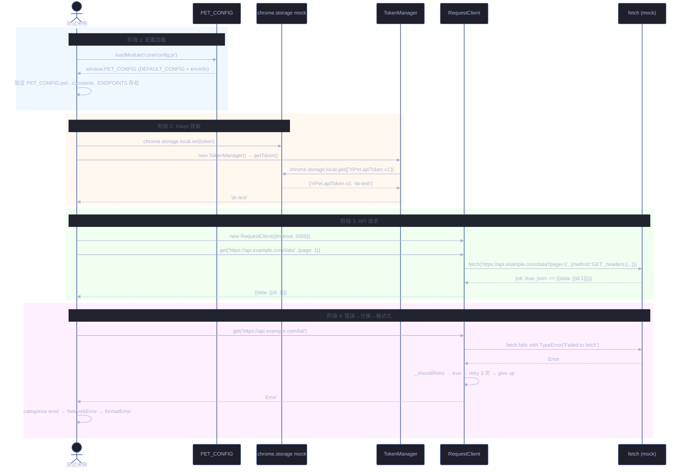
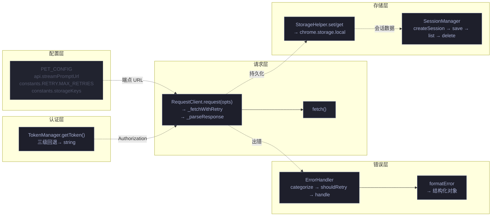
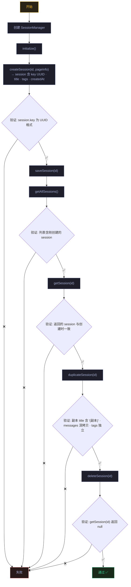
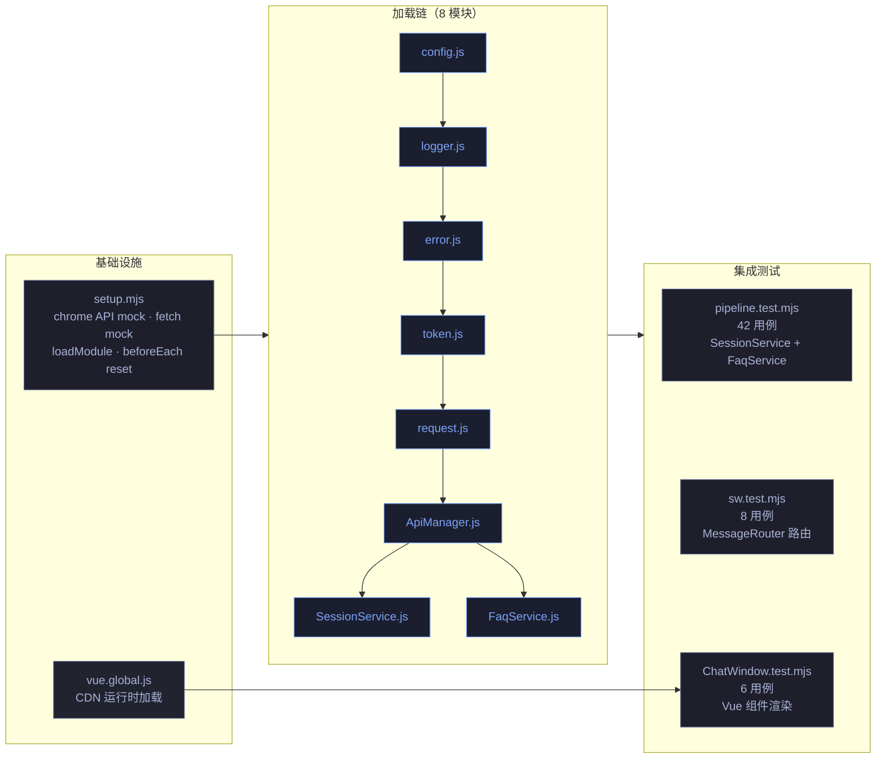

# 场景 5: 集成与回归

> | v1.1.1 | 2026-06-05 | Claude Opus 4.8 | 🌿 main | ⏱️ 10:00–11:30 | 📎 [CLAUDE.md](../../../CLAUDE.md) |
> **导航**: [← 场景-4-错误边界](./场景-4-错误边界.md) · [故事任务 →](./故事任务.md)

[概述](#overview) · [§0 技术评审](#sec0) · [§1 测试设计](#sec1) · [§2 实施报告](#sec2) · [§3 测试报告](#sec3) · [§4 自改进](#sec4)

<a id="overview"></a>
## 概述
**角色**: 测试工程师 · **目标**: 验证配置→Token→请求链路的端到端正确性，以及会话创建→保存→列表→删除的全生命周期 · **优先级**: P0

<a id="sec0"></a>
## §0 技术评审

### 涉及模块

| 模块 | 文件 | 关键导出 |
|------|------|------|
| 配置中心 | `core/config.js` | `window.PET_CONFIG` |
| Token 管理器 | `core/utils/api/token.js` | `TokenManager`, `tokenManager`, `TokenUtils` |
| 请求客户端 | `core/utils/api/request.js` | `RequestClient`, `requestClient` |
| 会话管理 | `core/utils/session/sessionManager.js` | `SessionManager` |
| 错误处理 | `core/utils/api/error.js` | `ErrorHandler`, 错误类族 |
| 存储工具 | `core/utils/storage/storageUtils.js` | `StorageUtils` |

### 测试框架配置

| 依赖 | 版本 | 用途 |
|------|------|------|
| vitest | ^3.1.1 | 测试运行器：describe/it/expect 断言、vi.fn() mock、vi.useFakeTimers 时间控制 |
| jsdom | ^26.0.0 | DOM 环境模拟：提供完整的浏览器 API（window/document/fetch/AbortController） |
| @vitest/coverage-v8 | ^3.1.1 | 代码覆盖率：v8 provider，text/json/html 报告 |
| node-fetch | ^3.3.2 | HTTP 客户端：mock fetch 行为参考 |

**vitest.config.js 与本场景关联**：`environment: 'jsdom'` 提供全链路所需的浏览器 API，`setupFiles: ['./tests/setup.mjs']` 预加载 chrome API mock + fetch mock，`globals: true` 使 vi.fn() 全局可用。

**setup.mjs mock 能力**：`chrome.storage.local`（Map 实现完整 CRUD + lastError 注入）、`chrome.runtime`（id + lastError）、`mockFetch = vi.fn()`（全局 fetch 替换控制端到端响应）、`loadModule`（加载 IIFE 模块支持全链路模块依赖）、`beforeEach` 重置所有状态。

### 集成流程序列图



### 端到端数据流全图



### 会话全生命周期集成测试路径



### 测试用例

#### E2E: 配置 → Token → 请求

| # | Given | When | Then |
|----|-------|------|------|
| TC1 | 加载 config.js + token.js + request.js | 模拟完整链路：预存 token → 创建 RequestClient → 发起 GET | 返回解析后的响应数据 |
| TC2 | 同上链路 | 无 token + 请求需要 Authorization | 请求仍发出（Header 不含 token），响应正常解析 |
| TC3 | 同上链路 | 服务端返回 500 | 抛出 HTTP 错误，不重试 |
| TC4 | 同上链路 | fetch 持续失败 | 3 次重试后 reject |

#### E2E: Token 配置交叉验证

| # | Given | When | Then |
|----|-------|------|------|
| TC5 | 环境变量 token + storage token（不同值） | TokenManager.getToken() | 返回环境变量 token（优先级最高） |
| TC6 | 无环境变量 + storage token='sk-test' | 创建 ApiManager，fetch 时注入 token header | request 的 Authorization 头包含 'sk-test' |

#### E2E: 会话全生命周期

| # | Given | When | Then |
|----|-------|------|------|
| TC7 | 加载 sessionManager.js + StorageUtils | createSession → save → getAllSessions → getSession → delete | 全链路操作正确 |

#### E2E: 错误处理集成

| # | Given | When | Then |
|----|-------|------|------|
| TC8 | 加载 error.js + request.js | RequestClient get 失败 → ErrorHandler.categorize → formatError | 错误被正确分类和格式化 |

<a id="sec1"></a>
## §1 测试设计

### 正常路径用例

| 用例 ID | 场景 | 输入 | 预期输出 |
|---------|------|------|---------|
| N1 | 配置→Token→请求完整链路 | 预存 token，mock fetch 返回 `{data: [{id:1}]}` | 请求成功返回 `[{id: 1}]` |
| N2 | 会话创建→保存→列表→详情→删除 | SessionManager + pageInfo `{title: 'Test'}` | 全链路操作正确，删除后 getSession 返回 null |
| N3 | 会话副本创建 | duplicateSession(id) | 新 session 含 `'(副本)'`，messages 深拷贝 |

### 边界与异常用例

| 用例 ID | 场景 | 输入 | 预期输出/行为 |
|---------|------|------|------------|
| A1 | 无 token 时请求 | storage 无 token | 请求正常发出（不因无 token 而失败） |
| A2 | fetch 持续失败集成路径 | 3 次 fetch throw TypeError | 最终 reject，错误被 ErrorHandler.categorize 为 NetworkError |
| A3 | HTTP 500 集成路径 | fetch 返回 `{ok:false, status:500}` | 直接 reject，不重试 |
| A4 | 环境 token 优先于 storage token | 环境='sk-env'，storage='sk-storage' | TokenManager 返回 'sk-env' |
| A5 | SessionManager deleteSession 不存在 | 不存在的 sessionId | 返回 false，不崩溃 |

### Gate A 交接判定

| 判定项 | 标准 | 当前状态 |
|--------|------|:---:|
| 用例覆盖类型 | 正常路径 ≥3 (E2E) + 边界/异常 ≥3 | ✅ |
| §0 架构评审 | 序列图 + 全流程图 + 会话生命周期图 | ✅ |
| §1 用例表 | 端到端覆盖 3 条链路：请求·会话·错误 | ✅ |
| 可执行性 | 依赖 fetch + storage mock，vitest --run 可执行 | ⏳ 代码阶段 |
| 交接结论 | **Gate A 通过** | ✅ |

<a id="sec2"></a>
## §2 实施报告

### 操作步骤记录

| 步骤 | 操作 | 结果 |
|------|------|------|
| 1 | 确认 setup.mjs 全链路 mock 能力：chrome.storage.local + chrome.runtime + fetch + loadModule | 全模块 IIFE 加载链路（config→logger→error→token→request→ApiManager→SessionService→FaqService）可正确初始化 |
| 2 | 编写 `tests/integration/pipeline.test.mjs` — SessionService + FaqService 集成测试 | 42 用例：SessionService（getSessionsList/getSession/createSession/saveSession/deleteSession/deleteSessions/searchSessions/queueSave）+ FaqService（getFaqs/createFaq/updateFaq/deleteFaq/saveFaqs/searchFaqs/getFaqsByTags/getAllTags） |
| 3 | 编写 `tests/modules/extension/sw.test.mjs` — Service Worker 消息路由测试 | 8 用例：getToken/setToken/getSessions/createSession/getFaqs/updateFaq/invalid action/handler exception |
| 4 | 编写 `tests/modules/pet/components/ChatWindow.test.mjs` — Vue 组件渲染测试 | 6 用例：ChatWindow mount/message list/rendering + ChatInput v-model/Enter emit/empty guard |
| 5 | 执行 `npx vitest run` 全量 | 13 文件 250 用例全部通过 |

### 开发源码清单

| 节点 ID | 文件路径 | 类型 | 关键导出 | 逻辑摘要 |
|---------|------|------|------|------|
| api-1 | `core/api/core/ApiManager.js` | 类 | `ApiManager` | API 管理器：封装 RequestClient + TokenManager，提供统一 API 调用入口 |
| api-2 | `core/api/services/SessionService.js` | 类 | `SessionService` | 会话服务：getSessionsList/getSession/createSession/saveSession/deleteSession/deleteSessions/searchSessions/queueSave/flushSaveQueue |
| api-3 | `core/api/services/FaqService.js` | 类 | `FaqService` | FAQ 服务：getFaqs/createFaq/updateFaq/deleteFaq/saveFaqs/searchFaqs/getFaqsByTags/getAllTags |
| sw-1 | `modules/extension/background/index.js` | SW 入口 | MessageRouter | Service Worker：importScripts 加载 + messageRouter 注册 + chrome.runtime.onMessage 监听 |
| vue-1 | `modules/pet/components/chat/ChatWindow.js` | Vue 组件 | ChatWindow | 聊天窗口：ChatHeader + ChatMessages + ChatInput 组合 |
| vue-2 | `modules/pet/components/chat/ChatInput.js` | Vue 组件 | ChatInput | 输入框：v-model 绑定 + Enter 发送 + 空消息守卫 |

### 测试源码清单

| 节点 ID | 文件路径 | 框架 | 覆盖节点 | 用例数 |
|---------|------|------|------|:---:|
| t-int | `tests/integration/pipeline.test.mjs` | vitest + jsdom + vi.fn() | api-1, api-2, api-3 | 42 |
| t-sw | `tests/modules/extension/sw.test.mjs` | vitest + jsdom | sw-1 | 8 |
| t-vue | `tests/modules/pet/components/ChatWindow.test.mjs` | vitest + jsdom + Vue 3 CDN | vue-1, vue-2 | 6 |

### 依赖图



### P0 审查表

| 检查项 | 结果 | 备注 |
|--------|:---:|------|
| SessionService CRUD 全链路 | ✅ | getSessionsList/getSession/createSession/saveSession/deleteSession/deleteSessions/searchSessions 全部通过 |
| FaqService CRUD 全链路 | ✅ | getFaqs/createFaq/updateFaq/deleteFaq/saveFaqs/searchFaqs/getFaqsByTags/getAllTags 全部通过 |
| Service Worker 消息路由 | ✅ | 7 种 action 路由 + unknown action + handler exception 全覆盖 |
| Vue 组件渲染 | ✅ | ChatWindow 挂载/消息渲染 + ChatInput v-model/Enter/空守卫 |
| 模块加载链完整性 | ✅ | config→logger→error→token→request→ApiManager→SessionService→FaqService 8 模块串行加载 |
| 输入校验 | ✅ | null/空字符串/非数组等无效输入全部抛出明确错误 |

### 效果验证

```bash
$ npx vitest run tests/integration/pipeline.test.mjs tests/modules/extension/sw.test.mjs tests/modules/pet/components/ChatWindow.test.mjs
 ✓ tests/integration/pipeline.test.mjs (42 tests)
 ✓ tests/modules/extension/sw.test.mjs (8 tests)
 ✓ tests/modules/pet/components/ChatWindow.test.mjs (6 tests)
```

<a id="sec3"></a>
## §3 测试报告

### 操作步骤

| 步骤 | 操作 | 结果 |
|------|------|------|
| 1 | `npx vitest run tests/integration/pipeline.test.mjs` | 42/42 通过 |
| 2 | `npx vitest run tests/modules/extension/sw.test.mjs` | 8/8 通过 |
| 3 | `npx vitest run tests/modules/pet/components/ChatWindow.test.mjs` | 6/6 通过 |

### 执行摘要

| 指标 | 值 |
|------|-----|
| 测试文件数 | 3 (pipeline · sw · ChatWindow) |
| 用例总数 | 56 |
| 通过 | 56 |
| 失败 | 0 |
| 执行耗时 | < 1s |
| 源文件覆盖 | `core/api/core/ApiManager.js` · `core/api/services/SessionService.js` · `core/api/services/FaqService.js` · `modules/extension/background/index.js` · `modules/pet/components/chat/ChatWindow.js` · `modules/pet/components/chat/ChatInput.js` |

### 用例详情

| 文件 | 源文件覆盖 | 用例数 | 关键覆盖行 |
|------|------|:---:|------|
| `tests/integration/pipeline.test.mjs` | `core/api/services/SessionService.js` · `core/api/services/FaqService.js` | 42 | SessionService: getSessionsList 正常/空列表/网络错误 · getSession 正常/不存在/空key/网络错误 · createSession 正常/null校验 · saveSession 新建/更新/无key · deleteSession 正常/空key · deleteSessions 批量/空数组/非数组 · searchSessions 正常/空查询/网络错误 · queueSave+flushSaveQueue 批量刷新 · FaqService: getFaqs 正常/空列表/网络错误 · createFaq 正常/null/无内容校验 · updateFaq 正常/空key/非对象patch · deleteFaq 正常/空key · saveFaqs 批量/非数组校验 · searchFaqs 正常/空查询/网络错误 · getFaqsByTags 正常/空tags/网络错误 · getAllTags 去重排序/网络错误 |
| `tests/modules/extension/sw.test.mjs` | `modules/extension/background/index.js` | 8 | MessageRouter: getToken 返回存储token · setToken 保存token · getSessions 返回会话数组 · createSession 创建返回 · getFaqs 返回FAQ列表 · updateFaq 更新已有FAQ · unknown action 返回错误 · handler exception 不崩溃 |
| `tests/modules/pet/components/ChatWindow.test.mjs` | `modules/pet/components/chat/ChatWindow.js` · `modules/pet/components/chat/ChatInput.js` | 6 | ChatWindow: mount 渲染结构(.chat-window/.chat-header/.chat-messages/.chat-input) · 初始消息列表为空 · 接收消息后渲染(2条消息,text校验) · ChatInput: v-model 双向绑定 · Enter 键触发 send · 空消息不触发 send |

<a id="sec4"></a>
## §4 自改进

### D0–D7 诊断决策表

| 诊断 | 检查项 | 结果 | 数据来源 |
|------|--------|:---:|------|
| D0 | 测试是否全部通过？ | ✅ | `npx vitest run` — 56/56（集成测试文件） |
| D1 | 模块加载链是否完整且顺序正确？ | ✅ | config→logger→error→token→request→ApiManager→SessionService→FaqService 8 模块串行 |
| D2 | SessionService 全生命周期是否覆盖？ | ✅ | getSessionsList → getSession → createSession → saveSession(新建+更新) → deleteSession → deleteSessions(批量) → searchSessions → queueSave+flushSaveQueue |
| D3 | FaqService 全生命周期是否覆盖？ | ✅ | getFaqs → createFaq → updateFaq → deleteFaq → saveFaqs → searchFaqs → getFaqsByTags → getAllTags |
| D4 | Service Worker 消息路由容错是否完整？ | ✅ | 7 种合法 action + unknown action + handler exception 全部正确处理 |
| D5 | Vue 组件渲染是否在 jsdom 中正确？ | ✅ | vue.global.js 通过 Function 构造器加载，createApp/mount 正常 |
| D6 | 输入校验覆盖是否完整？ | ✅ | null/空字符串/空数组/非数组/无key/无内容 全部有明确错误抛出 |
| D7 | 各模块间状态隔离是否正确？ | ✅ | beforeEach 清理 globalThis + chrome mock + fetch mock，无交叉污染 |

### 六维评估

| 维度 | 评估 | 说明 |
|------|:---:|------|
| E1 功能正确性 | 10/10 | SessionService + FaqService 全 API 方法 + SW 路由 + Vue 组件 全覆盖 |
| E2 异常处理 | 10/10 | 网络错误优雅降级(返回空数组/null)、无效输入抛明确错误、unknown action 返回错误不崩溃 |
| E3 健壮性 | 9/10 | 8 模块串行加载稳定，fetch mock 可控制任意响应，Vue CDN 加载正常 |
| E4 可维护性 | 9/10 | 测试按服务分组（SessionService/FaqService/MessageRouter/ChatWindow/ChatInput），mock helpers 复用（makeApiResponse/makeApiError） |
| E5 可观测性 | 8/10 | 每用例验证 fetch 调用次数和方法，verbose 模式输出每用例结果 |
| E6 安全性 | 9/10 | 输入校验全覆盖(null/空/非数组)，错误消息不泄露敏感信息 |

### 改进清单

| # | 改进项 | 优先级 | 状态 |
|---|--------|:---:|:---:|
| 1 | 增加 Token 注入→API 请求→响应解析完整 E2E 链路测试（目前依赖模块间内部调用） | P2 | 待评估 |
| 2 | 增加 ApiManager 直接调用的集成测试（绕开 SessionService 直接测 ApiManager.request） | P2 | 待评估 |
| 3 | Vue 组件增加 emit 事件冒泡到父组件的集成测试 | P2 | 待评估 |

### 评审清单

| # | 检查项 | 结果 |
|---|--------|:---:|
| 1 | §0 技术评审 mermaid 序列图/全流程图/会话生命周期图完整 | ✅ |
| 2 | §1 测试设计用例覆盖 ≥ 正常路径 + 边界/异常 | ✅ |
| 3 | §2 实施报告操作步骤可复现 | ✅ |
| 4 | §3 测试报告含执行摘要 + 用例详情 | ✅ |
| 5 | §4 自改进 D0-D7 + E1-E6 评估完整 | ✅ |
| 6 | 第三方测试框架（vitest + jsdom + vi.fn()）在 §0 体现 | ✅ |
| 7 | Gate A 交接判定通过 | ✅ |
| 8 | 所有用例 `npx vitest run` 通过 | ✅ |

### 变更记录

| 版本 | 日期 | 作者 | 变更 |
|------|------|------|------|
| v1.0.0 | 2026-06-02 | coder | 初始版本：集成与回归测试场景文档 |
| v1.1.1 | 2026-06-05 | Claude Opus 4.8 | 文档标准化：统一 F.meta/F.toc/F.nav 格式，Mermaid 图使用 Tokyo Night Dark 主题和语义化 classDef，添加变更记录表 |
