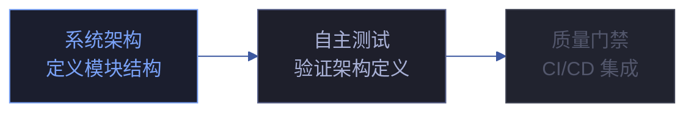

# 自主测试方案

> | v1.1.1 | 2026-06-05 | Claude Opus 4.8 | 🌿 main | ⏱️ 10:30–11:00 | 📎 [CLAUDE.md](../../../CLAUDE.md) |
> **导航**: [场景-1 →](./场景-1-核心逻辑.md)

[§1 概述](#sec1) · [§2 Story](#sec2) · [§3 成功标准](#sec3) · [§4 范围边界](#sec4) · [§5 AC](#sec5) · [§6 风险与假设](#sec6) · [§7 跨文档索引](#sec7) · [§8 六维清单](#sec8) · [§R 关联故事](#secr) · [变更记录](#changelog)

## §1 概述

为 YiPet Chrome Extension 搭建可执行的自动化测试体系。基于 vitest + jsdom 测试框架栈，覆盖核心基础设施、API 请求客户端、数据持久化、异常路径与边界、集成回归五个维度。不依赖真实 Chrome Extension 环境，所有 chrome API 通过 mock 模拟。

面向的用户角色：测试工程师、开发者。

### 效果示意

```mermaid
%%{init: {'theme': 'base', 'themeVariables': {
  'primaryColor': '#1e1f2b',
  'primaryTextColor': '#a9b1d6',
  'primaryBorderColor': '#3d59a1',
  'lineColor': '#3d59a1',
  'secondaryColor': '#2b2d3b',
  'tertiaryColor': '#21232f',
  'noteBkgColor': '#21232f',
  'noteTextColor': '#53576c'
}}}%%
flowchart LR
    subgraph 痛点["当前痛点"]
        direction TB
        P1["无自动化测试<br/>依赖手工验证"]:::risk
        P2["回归成本高<br/>每次变更全量手工"]:::risk
        P3["异常路径未覆盖<br/>错误处理无保障"]:::risk
        P4["模块耦合不可见<br/>集成风险未知"]:::risk
    end
    subgraph 目标["目标状态"]
        direction TB
        G1["自动化测试套件<br/>一键运行验证"]:::goal
        G2["回归门禁<br/>变更后自动通过"]:::goal
        G3["异常全覆盖<br/>边界路径有保障"]:::goal
        G4["集成可见<br/>全链路可验证"]:::goal
    end
    subgraph 里程碑["关键里程碑"]
        direction TB
        M1["① 测试框架搭建<br/>vitest + jsdom + mock"]:::milestone
        M2["② 核心逻辑覆盖<br/>config · token · storage"]:::milestone
        M3["③ API 层覆盖<br/>请求 · 重试 · 超时"]:::milestone
        M4["④ 异常边界覆盖<br/>错误分类 · 降级"]:::milestone
        M5["⑤ 集成回归<br/>全链路 · 端到端"]:::milestone
    end
    痛点 --> 里程碑 --> 目标

    classDef risk fill:#2a1a1a,stroke:#f87171,color:#f87171
    classDef goal fill:#1a2a1a,stroke:#34d399,color:#34d399
    classDef milestone fill:#2a2417,stroke:#fbbf24,color:#fbbf24
```

### 主要价值

- 🧪 **自动化回归** — 全量测试套件支持一键运行，变更后即时验证，消除手工回归成本
- 🎯 **分层覆盖** — 核心逻辑 → API 接口 → 数据持久化 → 异常边界 → 集成回归五层递进覆盖
- 🛡️ **异常路径保障** — 6 类错误类型 + 7 条分类规则 + 重试决策矩阵全量验证
- 🔗 **全链路可验证** — config→token→request→ApiManager→Service 端到端集成测试
- 📊 **覆盖率可度量** — v8 provider 提供 text/json/html 三种覆盖率报告，逐场景覆盖率目标
- 🏗️ **不依赖真实环境** — 所有 chrome API 通过 mock 模拟，测试可在任何 Node.js 环境运行

### 管线架构

---

## §2 Story

### Story 1: 核心逻辑测试

作为测试工程师，我想要验证配置中心、Token 管理器、存储工具的核心逻辑正确性，以便确保基础设施层稳定可靠。优先级 P0。范围边界：config.js、token.js、storageUtils.js 三个核心模块的单元测试。依赖：vitest + jsdom 测试框架。

#### 功能点与约束

| 类别 | 描述 | 输入/约束 | 输出/校验 | 错误/说明 | 优先级 |
|------|------|----------|----------|----------|--------|
| 功能点 | 配置中心测试 | DEFAULT_CONFIG 结构 | buildUrl 参数替换 + buildQueryParams 查询串构造 + 环境检测 | 配置缺失 → 默认值兜底 | P0 |
| 功能点 | Token 管理器测试 | TokenManager 构造参数 | getToken 三级回退 + validateToken 格式校验 + saveToken/clearToken | Token 缺失 → 空字符串降级 | P0 |
| 功能点 | 存储工具测试 | chrome.storage mock CRUD | loadFromChromeStorage + saveToChromeStorage + 配额处理 + 上下文失效 | storage 不可用 → null/false 降级 | P0 |

#### 成功标准

- 🎯 **核心模块覆盖率达标** — 度量：vitest --coverage · 目标：核心模块覆盖率不低于门禁阈值
- ✅ **Token 三级回退完整** — 度量：环境变量 → storage → 空字符串全部覆盖 · 目标：每级回退路径有对应测试用例

### Story 2: API 接口测试

作为测试工程师，我想要验证 HTTP 请求客户端的请求构造、重试、超时、中止、响应解析全路径，以便确保 API 通信层的正确性和健壮性。优先级 P0。范围边界：RequestClient 和 ApiManager 的完整 HTTP 方法矩阵。依赖：vitest + jsdom + vi.fn() fetch mock。

#### 功能点与约束

| 类别 | 描述 | 输入/约束 | 输出/校验 | 错误/说明 | 优先级 |
|------|------|----------|----------|----------|--------|
| 功能点 | HTTP 方法路由测试 | GET/POST/PUT/DELETE 四种方法 | URL 构造 + body 序列化 + header 注入 | 方法路由错误 → 请求失败 | P0 |
| 功能点 | 重试机制测试 | 网络错误 + 超时错误 | 最多重试 3 次，指数退避，HTTP 错误不重试 | 超过重试上限 → reject | P0 |
| 功能点 | 响应解析测试 | JSON/文本/Blob + 业务码 | Content-Type 驱动解析 + code!=0 抛异常 | 无法解析 → 抛出错误 | P0 |

#### 成功标准

- 🎯 **API 层覆盖率达标** — 度量：vitest --coverage · 目标：API 模块覆盖率不低于门禁阈值
- ✅ **4 种 HTTP 方法全覆盖** — 度量：GET/POST/PUT/DELETE 每种 ≥ 3 条用例 · 目标：全部通过

### Story 3: 数据持久化测试

作为测试工程师，我想要验证 chrome.storage.local CRUD 操作、配额管理、会话持久化的正确性与容错性，以便确保数据层的可靠性。优先级 P0。范围边界：StorageUtils、StorageHelper、SessionManager 三个模块。依赖：vitest + jsdom + chrome.storage mock。

#### 功能点与约束

| 类别 | 描述 | 输入/约束 | 输出/校验 | 错误/说明 | 优先级 |
|------|------|----------|----------|----------|--------|
| 功能点 | chrome.storage CRUD 测试 | mock Map 实现 get/set/remove/clear | 数据往返正确 + lastError 注入 | storage 不可用 → 降级处理 | P0 |
| 功能点 | 配额超限处理测试 | set 时注入配额错误 | cleanupOldData → 清理 petOssFiles → 重试 | 重试仍失败 → 返回 false | P0 |
| 功能点 | 会话全生命周期测试 | SessionManager CRUD | create → save → get → getAll → duplicate → delete | 不存在的 session → null/false 降级 | P0 |

#### 成功标准

- 🎯 **存储操作正确性** — 度量：CRUD 全部操作的往返验证 · 目标：存储操作正确率不低于门禁阈值
- 🛡️ **容错性完整** — 度量：配额超限 + 上下文失效 + storage 不可用 3 种异常路径 · 目标：每种异常有明确的降级行为

### Story 4: 异常路径与边界

作为测试工程师，我想要验证错误分类层次、错误处理、上下文失效检测、Token 缺失等异常路径的覆盖率，以便确保异常处理逻辑的正确性和完整性。优先级 P0。范围边界：APIError 6 种子类型 + ErrorHandler 7 条分类规则 + _shouldRetry 重试决策矩阵。依赖：vitest + jsdom。

#### 功能点与约束

| 类别 | 描述 | 输入/约束 | 输出/校验 | 错误/说明 | 优先级 |
|------|------|----------|----------|----------|--------|
| 功能点 | 错误分类层次测试 | APIError 基类 + 5 种子类型 | 每种类型 name/code/instanceof 验证 | 分类错误 → 错误的降级行为 | P0 |
| 功能点 | ErrorHandler.categorize 测试 | 7 条分类规则全覆盖 | TypeError→NetworkError, AbortError→TimeoutError, status 401→AuthError 等 | 未知错误 → UNKNOWN_ERROR 兜底 | P0 |
| 功能点 | _shouldRetry 重试决策测试 | NetworkError/TimeoutError/RateLimitError 重试，AuthError/ValidationError 不重试 | 超次数 → false 阻断 | 误重试 → 浪费资源 | P0 |

#### 成功标准

- 🎯 **异常路径覆盖率达标** — 度量：vitest --coverage · 目标：异常路径覆盖率不低于门禁阈值
- ✅ **6 种错误类型全覆盖** — 度量：每种错误类型 ≥ 2 条用例 · 目标：全部通过

### Story 5: 集成与回归

作为测试工程师，我想要验证配置→Token→请求链路的端到端正确性，以及会话创建→保存→列表→删除的全生命周期，以便确保模块间的集成正确性。优先级 P0。范围边界：8 模块串行加载 + SessionService + FaqService + MessageRouter + Vue 组件渲染。依赖：vitest + jsdom + vue.global.js CDN。

#### 功能点与约束

| 类别 | 描述 | 输入/约束 | 输出/校验 | 错误/说明 | 优先级 |
|------|------|----------|----------|----------|--------|
| 功能点 | SessionService 集成测试 | 全 API 方法（8 种） | 正常/空列表/网络错误/空参数 4 种场景 | 网络错误 → 返回空数组降级 | P0 |
| 功能点 | FaqService 集成测试 | 全 API 方法（8 种） | 正常/空列表/网络错误/空参数 4 种场景 | 非数组参数 → 抛出明确错误 | P0 |
| 功能点 | Service Worker 消息路由测试 | 7 种合法 action + unknown action + handler exception | 路由正确 + 错误不崩溃 | 未知 action → 返回错误消息 | P1 |
| 功能点 | Vue 组件渲染测试 | ChatWindow + ChatInput | 挂载 + 消息渲染 + v-model + Enter 发送 | 空消息 → 不触发发送 | P1 |

#### 成功标准

- 🎯 **关键路径通过率** — 度量：SessionService + FaqService 全部 API 方法通过 · 目标：关键路径通过率不低于门禁阈值
- 🔗 **模块加载链完整** — 度量：config→logger→error→token→request→ApiManager→SessionService→FaqService 8 模块串行加载 · 目标：无加载顺序错误

---

## §3 成功标准

| SC# | 描述 | 度量方式 | 目标值 | 优先级 | 关联 FP# |
|-----|------|---------|--------|--------|----------|
| SC1 | 核心模块（config/token/storage）逻辑正确 | vitest --run 全量通过 | 核心模块相关用例全部通过 | P0 | FP-核心 |
| SC2 | HTTP 请求构造、重试、超时、响应解析正确 | vitest --run 全量通过 | API 层用例全部通过 | P0 | FP-API |
| SC3 | chrome.storage CRUD + 配额 + 会话管理正确 | vitest --run 全量通过 | 存储层用例全部通过 | P0 | FP-存储 |
| SC4 | 异常路径（6 类错误 + 7 条分类规则 + 重试矩阵）覆盖完整 | vitest --run 全量通过 | 异常路径覆盖率不低于门禁阈值 | P0 | FP-异常 |
| SC5 | 集成链路（SessionService + FaqService + SW + Vue）端到端正确 | vitest --run 全量通过 | 集成用例全部通过 | P0 | FP-集成 |

---

## §4 范围边界

| # | 条目 | 关联 FP# | 边界说明 |
|----|------|---------|---------|
| 1 | 单元 + 集成测试 | 全部 | 覆盖核心基础设施、API 层、存储层、错误处理、集成回归五维度 |
| 2 | chrome API 全 mock | 全部 | 不依赖真实 Chrome Extension 环境，所有 chrome API 通过 vitest mock 模拟 |
| 3 | **E2E 浏览器测试** | — | 排除原因：需真实 Chrome 环境 + Puppeteer/Playwright；替代方案：集成测试覆盖模块联动 |
| 4 | **性能/压力测试** | — | 排除原因：属于性能基准补充文档范畴；替代方案：后续专项故事覆盖 |
| 5 | **视觉回归测试** | — | 排除原因：需截图对比工具；替代方案：Vue 组件渲染测试验证 DOM 结构 |
| 6 | **安全渗透测试** | — | 排除原因：属于 security agent 职责；替代方案：场景 3-安全边界测试设计提供安全用例 |

---

## §5 AC

| AC# | Given | When | Then | 门禁 |
|------|-------|------|------|:---:|
| AC1 | vitest + jsdom 环境已配置 | 执行 `npx vitest run` | 全部测试文件通过，无失败用例 | Gate A |
| AC2 | setup.mjs chrome mock 已实现 | beforeEach 重置 mock 状态 | 用例间无状态泄漏，独立运行结果一致 | Gate A |
| AC3 | 核心模块测试已编写 | 执行 config + token + storage 测试 | 三级回退 + 配额清理 + 上下文失效全覆盖 | Gate B |
| AC4 | API 层测试已编写 | 执行 request + ApiManager 测试 | 4 方法 + 重试 + 超时 + 响应解析全覆盖 | Gate B |
| AC5 | 集成测试已编写 | 执行 pipeline 测试 | SessionService + FaqService 全 API 方法通过 | Gate B |

---

## §6 风险与假设

### 风险

| # | 风险 | 类型 | 可能性 | 影响 | 缓解/验证策略 | 关联 FP# |
|----|------|------|:---:|:---:|------|----------|
| 1 | chrome API mock 行为与真实 API 不一致导致假通过 | 风险 | M | H | mock 基于 Map 实现，与 chrome.storage.local 行为对齐；lastError 注入模拟真实错误场景 | FP-存储 |
| 2 | IIFE 模块无法 import 导致测试覆盖盲区 | 风险 | M | M | loadModule helper 通过 Function 构造器加载 IIFE 并注入 globalThis | FP-全部 |
| 3 | Vue 组件在 jsdom 中渲染行为与真实浏览器不一致 | 风险 | M | M | jsdom 提供完整的 window/document，Vue.createApp 可正常 mount | FP-集成 |
| 4 | fetch mock 无法覆盖流式响应（ReadableStream） | 风险 | L | M | 流式响应测试标记为待补充，当前覆盖同步响应路径 | FP-API |

### 假设

| # | 假设 | 类型 | 可能性 | 影响 | 验证策略 | 关联 FP# |
|----|------|------|:---:|:---:|------|----------|
| 1 | vitest + jsdom 环境在 CI 中可用 | 假设 | — | — | `npx vitest run` 在目标环境执行通过 | FP-全部 |
| 2 | vue.global.js CDN 在 jsdom 中可通过 Function 构造器加载 | 假设 | — | — | ChatWindow.test.mjs 验证 Vue.createApp 可用 | FP-集成 |
| 3 | chrome.storage.local 配额错误可通过 lastError 模拟 | 假设 | — | — | storage.test.mjs 验证 setChromeError('quota') 行为 | FP-存储 |

---

## §7 跨文档索引

| 本文档章节 | 基线内容 | 下游文档 | 预期覆盖 | 状态 |
|-----------|---------|---------|---------|:---:|
| §2 Story 1 | config · token · storage 核心逻辑 | 场景-1-核心逻辑.md | DEFAULT_CONFIG 结构 + TokenManager 三级回退 + StorageUtils CRUD | 已对齐 |
| §2 Story 2 | HTTP 请求 · 重试 · 超时 · 响应解析 | 场景-2-接口测试.md | 4 种 HTTP 方法 + 3 次重试 + 指数退避 + JSON/文本/Blob 解析 | 已对齐 |
| §2 Story 3 | chrome.storage CRUD · 配额 · 会话 | 场景-3-存储测试.md | mock CRUD + 配额清理重试 + SessionManager 全生命周期 | 已对齐 |
| §2 Story 4 | 6 类错误 · 7 条规则 · 重试矩阵 | 场景-4-错误边界.md | 错误分类层次 + categorize 分类链 + _shouldRetry 决策 | 已对齐 |
| §2 Story 5 | 端到端 · SW · Vue | 场景-5-集成测试.md | 8 模块加载链 + SessionService + FaqService + MessageRouter + Vue 渲染 | 已对齐 |

---

## §8 六维清单

每个场景均按 yry rui 六维文档标准覆盖以下可追溯资产。场景名称链接指向 HTML 仪表盘页面，各维度链接指向对应资源。

| 场景 | 📋清单 | 📐架构 | 🔗图谱 | 🧪测试 | 💡演示 | 📝审查 |
|------|:---:|:---:|:---:|:---:|:---:|:---:|
| [1. 核心逻辑测试](./场景-1-核心逻辑.html) | [html](./场景-1-核心逻辑.html) | [md](./场景-1-核心逻辑.md) | [图谱](./知识图谱.html) | [config](../../tests/unit/config.test.mjs) · [token](../../tests/unit/token.test.mjs) · [storage](../../tests/unit/storage.test.mjs) | [vitest](../../demos/third-party/vitest.html) | [§0](./场景-1-核心逻辑.md#sec0) |
| [2. API 接口测试](./场景-2-接口测试.html) | [html](./场景-2-接口测试.html) | [md](./场景-2-接口测试.md) | [图谱](./知识图谱.html) | [request](../../tests/unit/request.test.mjs) · [api](../../tests/unit/api.test.mjs) | [node-fetch](../../demos/third-party/node-fetch.html) | [§0](./场景-2-接口测试.md#sec0) |
| [3. 数据持久化测试](./场景-3-存储测试.html) | [html](./场景-3-存储测试.html) | [md](./场景-3-存储测试.md) | [图谱](./知识图谱.html) | [storage](../../tests/unit/storage.test.mjs) | [setup](../../demos/third-party/setup.html) | [§0](./场景-3-存储测试.md#sec0) |
| [4. 异常路径与边界](./场景-4-错误边界.html) | [html](./场景-4-错误边界.html) | [md](./场景-4-错误边界.md) | [图谱](./知识图谱.html) | [error](../../tests/unit/error.test.mjs) · [token](../../tests/unit/token.test.mjs) | [coverage](../../demos/third-party/coverage.html) | [§0](./场景-4-错误边界.md#sec0) |
| [5. 集成与回归](./场景-5-集成测试.html) | [html](./场景-5-集成测试.html) | [md](./场景-5-集成测试.md) | [图谱](./知识图谱.html) | [pipeline](../../tests/integration/pipeline.test.mjs) · [sw](../../tests/modules/extension/sw.test.mjs) | [vitest](../../demos/third-party/vitest.html) · [jsdom](../../demos/third-party/jsdom.html) | [§0](./场景-5-集成测试.md#sec0) |

> **六维标准说明**: 每个场景的六维资产均可独立追溯——📋清单为场景 HTML 仪表盘（聚合全部维度链接），📐架构为场景 Markdown 文档（§0-§4 完整内容），🔗图谱为 Cytoscape.js 交互式知识图谱，🧪测试为具体测试文件，💡演示为交互事例页面，📝审查为 §0 技术评审章节。

---

## §R 关联故事

| 关联故事 | 关系类型 | 说明 |
|---------|---------|------|
| 系统架构 | validates | 自主测试验证系统架构中定义的核心模块——8 个共享源码模块（config/token/request/ApiManager/error/storageUtils/bootstrap/sessionManager）通过 6 个测试文件覆盖 |

---

### 变更记录

| 日期 | 变更 | 触发 | 证据 |
|------|------|------|------|
| 2026-06-05 | yry rui 六维清单标准：新建 5 场景 HTML 仪表盘 (📋📐🔗🧪💡📝) + story index.html 六维重写 + §8 六维清单章节 | /rui doc 六维标准升级 | docs/stories/自主测试/ 10 文件（5 .html 新建 + 2 重写 + 1 更新） |
| 2026-06-05 | yry rui 新文档标准重构：添加 F.meta/F.toc/F.nav、效果示意、主要价值、§1-§7 标准章节、关联故事 | /rui doc 标准升级 | docs/stories/自主测试/ 目录全部文件同步刷新 |
| 2026-06-02 | 初始化故事基线 v1.0.0 | /rui 自主测试 | 5 场景 §0-§4 完成 |
