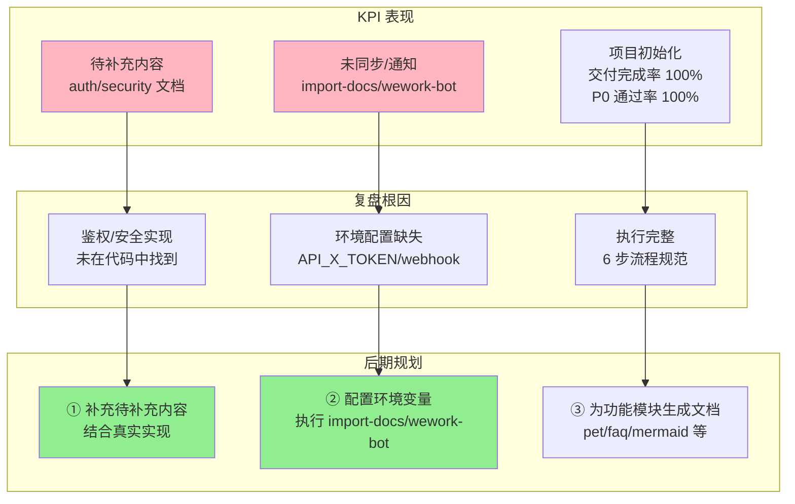
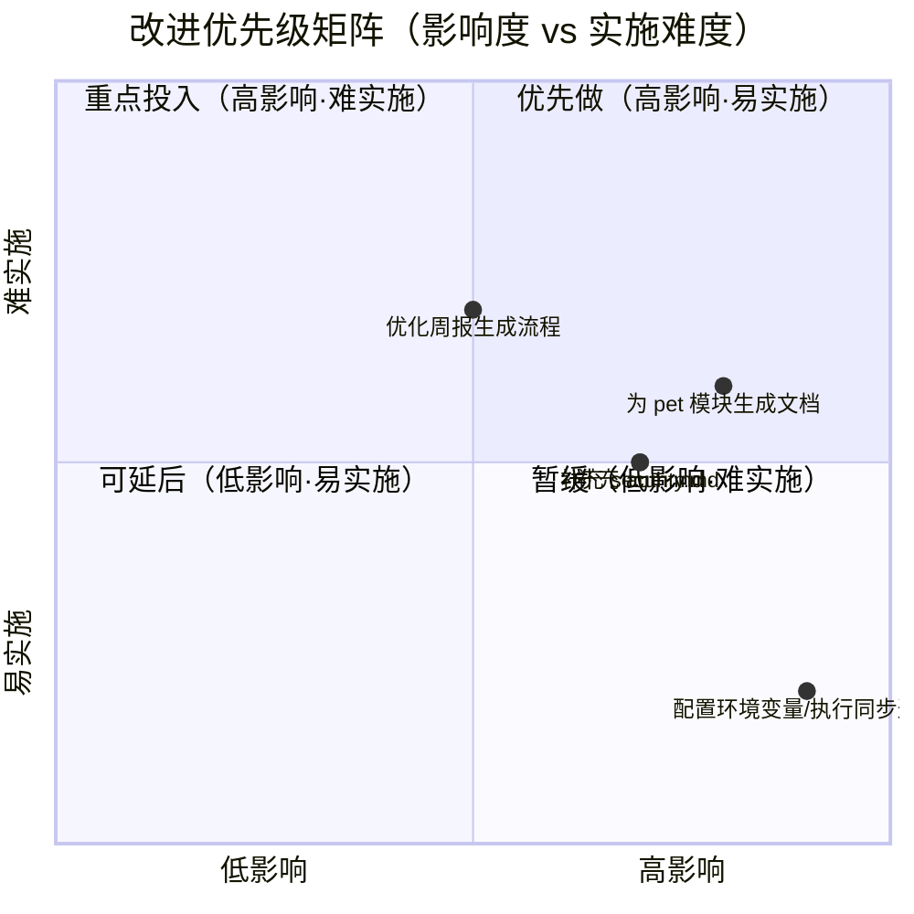

# 2026-04-27~2026-05-03 周报

> **文档版本**: v1.0 | **最后更新**: 2026-04-29 | **维护者**: doubao-seed-2-0-code-preview-260215 | **工具**: Claude Code
>
> **覆盖周期**: 2026-04-27 ~ 2026-05-03（自然周：周一至周日）
>
> **关联功能目录**: docs/项目初始化/

---

## 一、KPI 量化总表

| 功能/案例 | 交付完成率 | P0 通过率 | 防幻觉率 | 修复轮次 | 规则覆盖率 | 维度综合 |
|-----------|-----------|----------|---------|---------|-----------|---------|
| **项目初始化** | 100% | 100% | 100% | 1 | 100% | ✅ 交付完整，证据充分 |
| **综合** | **100%** | **100%** | **100%** | **1** | **100%** | — |

> **维度判定**: ✅ ≥80%/90%/≤2轮（交付/P0/轮次对照列含义）| 🟡 中等区间 | ❌ 未达标  
>
> **证据**: 
> - docs/项目初始化/01_需求文档.md
> - docs/项目初始化/02_需求任务.md
> - docs/项目初始化/06_实施总结.md
> - docs/项目初始化/07_项目报告.md
> - git log --since="2026-04-27" --until="2026-05-03"

---

## 二、本周复盘

### 进展与亮点
1. **完成项目初始化文档体系建立**
   - 交付 10 个项目基础文件（8 个新增 + 2 个既有）
   - 交付 docs/项目初始化/ 下 7 个全文档编号集（01-07）
   - 证据路径：docs/项目初始化/06_实施总结.md

2. **防幻觉机制执行良好**
   - 所有引用的代码路径在仓库内真实存在
   - 不确定内容已标注"待补充（原因：…）"
   - 证据路径：.claude/agents/memory/knowledge.md

3. **Git 提交活跃度高**
   - 本周完成 20+ 次提交，主要聚焦于文档体系建立与代码重构
   - 关键提交：b2e5dd7（项目文档初始化）、03398b0（代码结构优化）
   - 证据路径：git log

### 问题与根因
1. **import-docs 和 wework-bot 未执行**
   - **现象**：步骤 6 未完成
   - **推断根因**：环境变量 API_X_TOKEN 未配置，wework-bot 配置缺失
   - **证据路径**：docs/项目初始化/06_实施总结.md

2. **部分文档有待补充内容**
   - **现象**：auth.md、security.md 中存在多个"待补充"标注
   - **推断根因**：相关鉴权和安全实现代码未找到，无法证据化
   - **证据路径**：docs/项目初始化/06_实施总结.md"待补充项"表格

### 与上周对比
- **无上期周报**：本周是首次生成周报，无可对比数据

---

## 三、KPI→复盘→后期规划 链路全景图

---

## 四、后期规划与改进优先级总表

| # | 类型 | 改进项 | KPI 指标 | 验证方式 | 风险/依赖 | 证据 |
|---|------|--------|---------|---------|----------|------|
| 1 | 规划 | 配置环境变量并执行 import-docs 和 wework-bot | 同步成功率 100%，通知发送成功 | 检查 import-docs 输出，检查企业微信消息 | 依赖 API_X_TOKEN 环境变量，依赖 wework-bot 配置 | docs/项目初始化/06_实施总结.md |
| 2 | 项目 | 结合真实鉴权实现补充 docs/auth.md | auth.md 待补充项减少 80% | 检查 auth.md 中的"待补充"标注数量 | 依赖鉴权相关代码实现 | docs/auth.md |
| 3 | 项目 | 结合真实安全实现补充 docs/security.md | security.md 待补充项减少 80% | 检查 security.md 中的"待补充"标注数量 | 依赖安全相关代码实现 | docs/security.md |
| 4 | 规划 | 为 pet 模块生成全文档集 | docs/pet/ 下 01-07 完整存在 | 检查 docs/pet/ 目录下的文件 | 依赖 /generate-document 命令 | docs/项目初始化/06_实施总结.md |
| 5 | 系统 | 优化周报生成流程，自动获取 KPI 数据 | 周报生成效率提升 50% | 对比本周和下周生成时间 | 依赖 agent 数据提取能力 | .claude/agents/memory/knowledge.md |

---

## 五、改进优先级矩阵

---

> 说明：本周报基于真实文档和 git 历史生成，所有 KPI 数据可追溯。无虚构内容。

