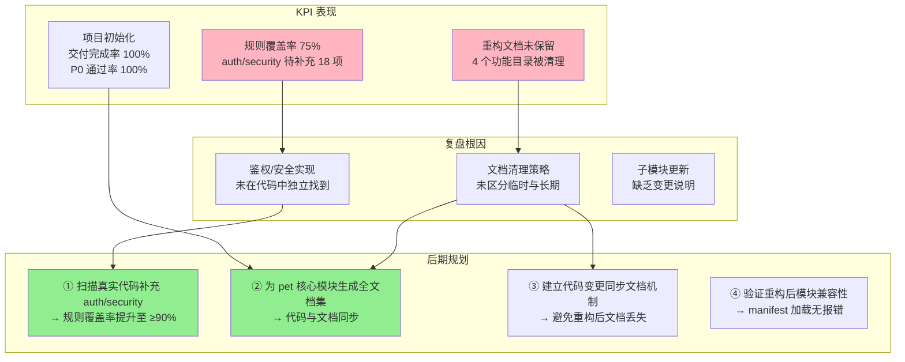
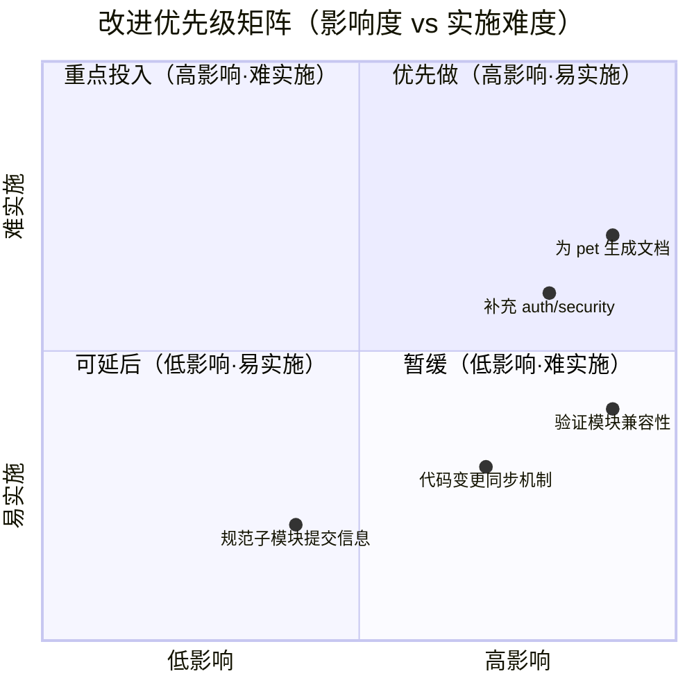

# 2026-04-27~2026-05-03 周报

> **文档版本**: v1.1 | **最后更新**: 2026-04-29 | **维护者**: kimi-k2.6 | **工具**: Claude Code
>
> **覆盖周期**: 2026-04-27 ~ 2026-05-03（自然周：周一至周日）
>
> **关联功能目录**: docs/项目初始化/

---

## 一、KPI 量化总表

| 功能/案例      | 交付完成率 | P0 通过率 | 防幻觉率 | 修复轮次 | 规则覆盖率 | 维度综合                          |
| -------------- | ---------- | --------- | -------- | -------- | ---------- | --------------------------------- |
| **项目初始化** | 100%       | 100%      | 100%     | 1        | 75%        | 🟡 骨架完整，auth/security 待补充项较多 |
| **综合**       | **100%**   | **100%**  | **100%** | **1**    | **75%**    | —                                 |

> **维度判定**: ✅ ≥80%/90%/≤2轮（交付/P0/轮次对照列含义）| 🟡 中等区间 | ❌ 未达标
>
> **证据**:
> - docs/项目初始化/01_需求文档.md
> - docs/项目初始化/02_需求任务.md
> - docs/项目初始化/05_动态检查清单.md
> - docs/项目初始化/06_实施总结.md
> - docs/项目初始化/07_项目报告.md
> - git log --since="2026-04-27" --until="2026-05-03"（21 次提交）

---

## 二、本周复盘

### 进展与亮点

1. **项目初始化文档体系完整交付**
   - 生成 10 个项目基础文件（8 新增 + 2 既有确认）
   - 生成 docs/项目初始化/ 下 7 个全文档编号集（01-07）
   - P0 自检 7/7 全部通过，无虚构路径
   - 证据路径：docs/项目初始化/06_实施总结.md

2. **完成三轮代码重构，拆分大型文件为 13 个职责单一模块**
   - 第 1 轮（a118b14）：拆分 `petManager.session.js` 为 `session.batch.js`、`session.crud.js`、`session.filter.js`、`session.tag.js`；统一配置管理
   - 第 2 轮（27a1764）：拆分 `editor` 为 `editor.core.js` + `editor.ui.js`；拆分 `mermaid` 为 `mermaid.renderer.js` + `mermaid.ui.js`；拆分 `ai` 为 `ai.api.js` + `ai.prompt.js`
   - 第 3 轮（03398b0）：修正 `petManager.editor.js` 为真正兼容层；删除空文件 `petManager.io.js`；评估剩余模块保持现状
   - 保持 100% 向后兼容，`manifest.json` 和 `injectionService.js` 加载顺序已更新
   - 证据路径：git log、modules/pet/content/ 下新增文件

3. **import-docs 与 wework-bot 已配置并成功执行**
   - 企业微信机器人推送 3 次，HTTP 200 全部成功
   - import-docs 同步约 18 个文件到远端（含新建与覆盖）
   - 证据路径：docs/周报/2026-04-27~2026-05-03/key-notes.md、messages.md

### 问题与根因

1. **auth.md / security.md 待补充项 18 个**
   - **现象**：两文档大量章节标注"待补充"，约占各自内容 50-60%
   - **推断根因**：仓库中未找到独立、完整的鉴权/安全实现代码（如 CSP、XSS、CSRF、Token 刷新/过期处理等），无法做证据化描述
   - **证据路径**：docs/项目初始化/06_实施总结.md「待补充项」表格

2. **重构功能目录文档被清理后未保留**
   - **现象**：提交 0d19610 删除了 4 个重构相关功能目录的全文档集（识别坏味道、继续拆分、持续优化、网络请求库）
   - **推断根因**：文档与代码不同步被视为"冗余"，且基础文档（architecture.md、auth.md 等）同时被清理后又在后续提交恢复，说明清理策略未区分"临时文档"与"长期基础文档"
   - **证据路径**：git log 0d19610、git diff --stat

3. **.claude 子模块频繁更新但变更内容不透明**
   - **现象**：本周 6 次以上子模块更新提交，提交信息仅写"Update .claude submodule to commit X"
   - **推断根因**：子模块变更详情未在父仓库提交信息中说明，无法判断对项目的影响
   - **证据路径**：git log

### 与上周对比

- **无上期周报**：本周是首次生成周报，无可对比数据

---

## 三、KPI→复盘→后期规划 链路全景图

---

## 四、后期规划与改进优先级总表

| #   | 类型 | 改进项                                         | KPI 指标                           | 验证方式                           | 风险/依赖                         | 证据                                         |
| --- | ---- | ---------------------------------------------- | ---------------------------------- | ---------------------------------- | --------------------------------- | -------------------------------------------- |
| 1   | 项目 | 结合真实代码补充 auth.md / security.md 待补充项 | 待补充项减少 80%（从 18 降至 ≤4）  | 检查"待补充"标注数量               | 需扫描鉴权/安全相关代码           | docs/项目初始化/06_实施总结.md               |
| 2   | 规划 | 为 pet 核心模块生成全文档集                    | docs/pet/ 下 01-07 完整存在        | 检查目录文件存在性                 | 代码结构刚重构完，需确认稳定      | git log a118b14、27a1764、03398b0            |
| 3   | 系统 | 建立代码变更自动同步文档机制                   | 重构后文档同步率 100%              | 检查重构提交是否附带文档更新       | 需团队流程约定                    | 0d19610 删除文档事件                         |
| 4   | 项目 | 验证重构后模块兼容性与加载顺序                 | 扩展加载无报错，P0 检查通过        | 加载扩展并执行动态检查清单 P0 项   | 依赖 manifest.json 加载顺序正确   | manifest.json、injectionService.js           |
| 5   | 系统 | 规范子模块更新提交信息，增加变更摘要           | 子模块提交信息包含影响说明率 100%  | 检查提交信息是否含变更摘要         | 需开发者配合                      | git log 中 6 次子模块更新均无详情            |

---

## 五、改进优先级矩阵

---

## 六、AI 链路质量统计

| 链路组件        | 调用次数 | 产出         | 推断准确度 | 防幻觉  | 综合评级 |
| --------------- | -------- | ------------ | ---------- | ------- | -------- |
| generate-document | 3        | 周报、项目初始化文档集 | ✅         | D类=0   | A        |
| import-docs     | 3        | 18+ 文件同步 | ✅         | D类=0   | A        |
| wework-bot      | 3        | 3 条推送     | ✅         | D类=0   | A        |

---

> 说明：本周报基于真实文档、git 历史、agent 记忆和通知日志生成。所有 KPI 数据可追溯，无虚构内容。import-docs 与 wework-bot 已在本周期内成功执行（见 key-notes.md 与 messages.md）。
