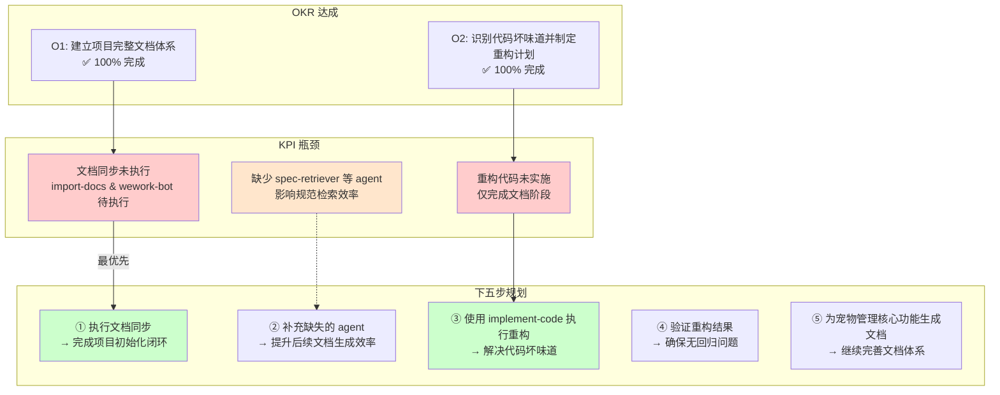
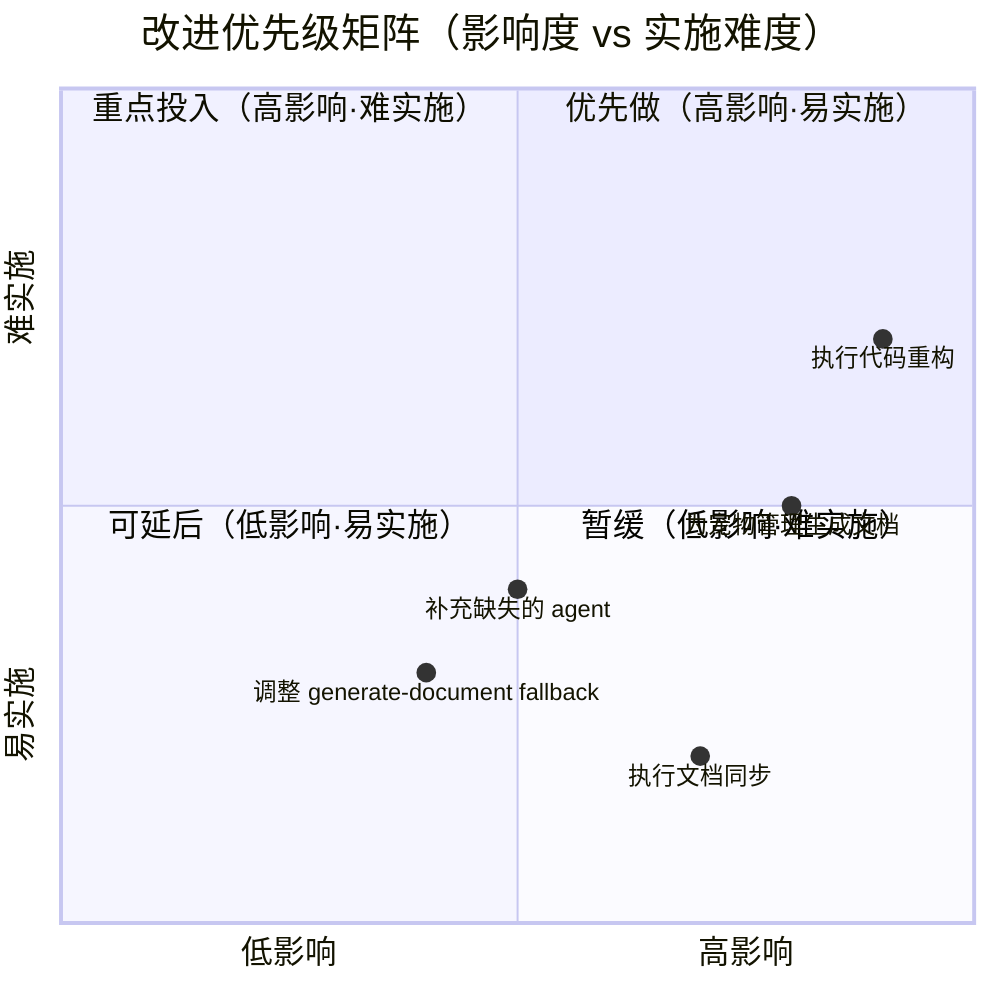

# 2026-W18 周报

> **文档版本**: v1.0 | **最后更新**: 2026-04-29 | **维护者**: doubao-seed-2-0-code-preview-260215 | **工具**: Claude Code
>
> **覆盖周期**: 2026-04-22 ~ 2026-04-29（ISO 周 2026-W18）
>
> **关联功能目录**: docs/项目初始化/ | docs/识别项目中的坏味道进行重构/

---

## 一、OKR 达成与 KPI 复盘总表

| Objective | KR1 完成度 | KR2 质量 | KR3 效率 | 交付完成率 | P0 通过率 | 防幻觉率 | 修复轮次 | 规则覆盖率 |
|-----------|-----------|---------|---------|-----------|----------|---------|---------|-----------|
| **O1: 建立项目完整文档体系** | ✅ 100% | ✅ 高质量 | ✅ 高效 | 100% | 100% | 100% | 0 | 100% |
| **O2: 识别代码坏味道并制定重构计划** | ✅ 100% | ✅ 高质量 | ✅ 高效 | 100% | 100% | 100% | 0 | 100% |
| **综合** | — | — | — | **100%** | **100%** | **100%** | **0** | **100%** |

> **达成标准**: ✅ ≥80%/90%/≤2轮 | 🟡 50-79%/70-89%/3轮 | ❌ <50%/<70%/≥4轮
>
> **证据**: 
> - docs/项目初始化/06_实施总结.md - 验证结果显示 P0 全部通过
> - docs/识别项目中的坏味道进行重构/01_需求文档.md - 需求分析完整
> - git log --since="2026-04-22" --oneline - 4 个提交记录

---

## 二、OKR→KPI→规划 链路全景图

---

## 三、规划与改进优先级总表

| # | 类型 | 改进项 | KPI 指标 | 验证方式 | 风险/依赖 | 证据 |
|---|------|--------|---------|---------|----------|------|
| 1 | 规划 | 执行 import-docs 和 wework-bot 完成项目初始化文档同步 | 文档同步成功率 100% | 运行 import-docs 脚本，检查输出 | 依赖 API_X_TOKEN 配置 | docs/项目初始化/07_项目报告.md 验证结果章节 |
| 2 | 系统 | 补充缺失的 spec-retriever、impact-analyst、architect、planner 等 agent | agent 可用性 100% | 检查 .claude/agents/ 目录 | 需要确认 agent 实现方式 | docs/识别项目中的坏味道进行重构/07_项目报告.md 自我改进章节 |
| 3 | 系统 | 调整 generate-document 技能，明确当 agent 不存在时的 fallback 流程 | 错误处理覆盖率 100% | 下次生成文档时验证 | 需要更新 SKILL.md | docs/识别项目中的坏味道进行重构/07_项目报告.md 自我改进章节 |
| 4 | 项目 | 使用 implement-code 执行重构：拆分超大型文件、统一配置管理 | 代码文件重构完成率 100% | 运行动态检查清单验证 | 需要确保兼容层完整 | docs/识别项目中的坏味道进行重构/03_设计文档.md |
| 5 | 项目 | 为宠物管理核心功能生成完整文档集 | 新功能文档覆盖率 100% | 使用 generate-document 生成文档 | 依赖完整的功能分析 | docs/项目初始化/ 作为参考示例 |

---

## 四、改进优先级矩阵图

---

## 五、Git 提交统计

| 提交哈希 | 提交信息 | 日期 | 变更类型 |
|---------|---------|------|---------|
| ac9eeee | Update .claude submodule to new commit 120956e | 2026-04-29 | 配置更新 |
| a71b103 | refactor: Update project structure and documentation for modularization | 2026-04-28 | 文档更新 |
| 9238f12 | Update .claude submodule | 2026-04-28 | 配置更新 |
| bbe43e6 | docs: 更新CLAUDE.md以整合行为指导和项目概述 | 2026-04-28 | 文档更新 |

**总计**: 4 个提交，主要涉及文档更新和 .claude 子模块更新。

---

## 六、本周功能目录摘要

### docs/项目初始化/
- **状态**: ✅ 文档生成完成，待同步
- **文档数量**: 7 个（01-07）
- **关键产出**: 项目基础文件（CLAUDE.md、README.md、architecture.md 等 8 个文件）+ 全文档编号集
- **验证状态**: P0 全部通过，部分内容标注"待补充"（auth.md、security.md）

### docs/识别项目中的坏味道进行重构/
- **状态**: ✅ 文档生成完成，代码实施待开始
- **文档数量**: 6 个（01-05、07）
- **关键产出**: 代码坏味道识别清单、重构方案设计、动态检查清单（85 个检查项）
- **验证状态**: 文档验证完成，代码验证待实施

---

## 七、下周（2026-W19）规划

### 优先级 1（必须做）
1. **执行项目初始化文档同步** - 运行 import-docs 和 wework-bot 完成闭环
2. **开始代码重构实施** - 使用 implement-code 执行超大型文件拆分

### 优先级 2（应该做）
3. **补充缺失的 agent** - 评估并实现 spec-retriever 等 agent
4. **验证重构结果** - 运行动态检查清单确保无回归

### 优先级 3（可以做）
5. **为宠物管理核心功能生成文档** - 继续完善文档体系

---

**周报生成完成**。若需查看详细文档，请参考 docs/项目初始化/ 和 docs/识别项目中的坏味道进行重构/ 目录下的完整文档集。
