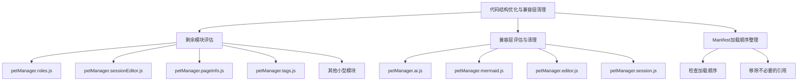
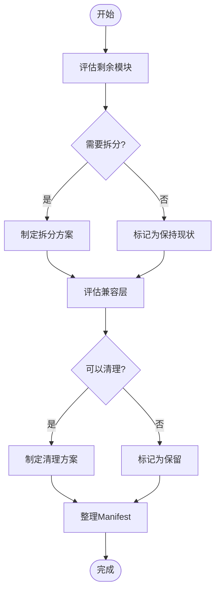
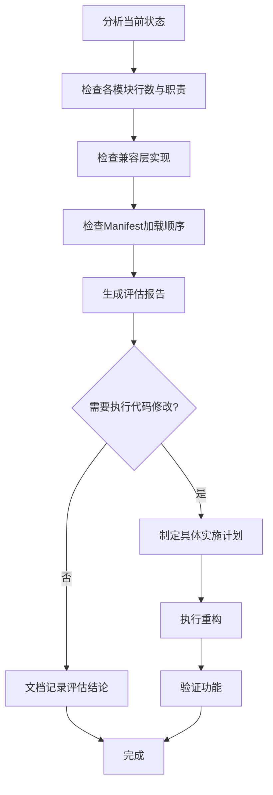
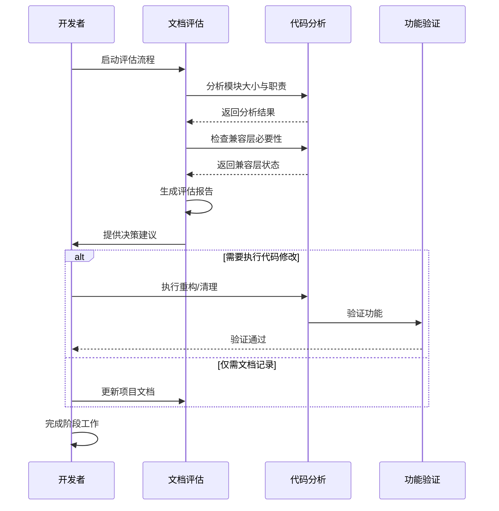

# 持续优化代码结构，评估剩余小型模块与兼容层清理

> **文档版本**: v1.0 | **最后更新**: 2026-04-29 | **维护者**: doubao-seed-2-0-code-preview-260215 | **工具**: Claude Code
>
> **关联文档**: [需求文档](../持续优化代码结构评估兼容层清理/01_需求文档.md) | [设计文档](../持续优化代码结构评估兼容层清理/03_设计文档.md) | [使用文档](../持续优化代码结构评估兼容层清理/04_使用文档.md)
>

[功能概述](#功能概述) | [功能分析](#功能分析) | [用户故事](#用户故事) | [主要操作场景](#主要操作场景) | [影响分析](#影响分析) | [功能详情](#功能详情) | [验收标准](#验收标准)

---

## 功能概述

本阶段是前两次重构的延续与收尾工作，重点是评估剩余模块、清理兼容层、优化整体架构。通过系统性的评估和整理，使代码库更加简洁清晰。

🎯 **完成剩余模块评估**：对中小型模块逐一分析，判断是否需要进一步拆分
⚡ **评估兼容层清理**：检查每个兼容层的必要性，给出明确的清理建议
📖 **优化架构整体一致性**：确保整个项目的架构风格统一

## 功能分析

### 功能分解图

### 用户流程图

### 功能流程图

### 完整时序图

## 用户故事表格

| 用户故事 | 验收标准 | 过程生成文档 | 产出智能文档 |
|----------|----------|--------|----------|
| 🔴 作为项目维护者，我要评估剩余的中小型模块，判断是否需要进一步拆分，以便代码职责更加清晰  **主要操作场景**： - 检查 petManager.roles.js (1289行) 是否需要拆分 - 检查 petManager.editor.js (2125行) 兼容层是否需要清理 - 检查 petManager.session.js (764行) 兼容层是否需要清理 - 检查其他中小型模块的职责划分 | 1. 完成所有剩余模块的评估报告 2. 对需要拆分的模块提出具体的拆分方案 3. 对可以保持现状的模块给出明确的理由 4. 评估报告清晰可执行 | [持续优化代码结构-需求任务](../持续优化代码结构评估兼容层清理/02_需求任务.md) [持续优化代码结构-设计文档](../持续优化代码结构评估兼容层清理/03_设计文档.md) [项目报告](../持续优化代码结构评估兼容层清理/07_项目报告.md) | [生成文档 Skill](../../.claude/skills/generate-document/SKILL.md) |
| 🔴 作为项目维护者，我要评估兼容层文件的清理时机，以便简化代码结构，减少维护负担  **主要操作场景**： - 评估 petManager.ai.js 兼容层是否可以移除 - 评估 petManager.mermaid.js 兼容层是否可以移除 - 评估 petManager.editor.js 兼容层是否需要清理或重构 - 评估 petManager.session.js 兼容层是否可以简化 | 1. 完成每个兼容层的影响评估 2. 给出明确的清理建议和时间窗口 3. 确保清理方案不会破坏现有功能 4. 提供回滚方案（如需要） | [持续优化代码结构-需求任务](../持续优化代码结构评估兼容层清理/02_需求任务.md) [持续优化代码结构-设计文档](../持续优化代码结构评估兼容层清理/03_设计文档.md) [项目报告](../持续优化代码结构评估兼容层清理/07_项目报告.md) | [生成文档 Skill](../../.claude/skills/generate-document/SKILL.md) |

## 主要操作场景

### 🎯 主要操作场景：剩余模块评估

**场景描述**：对 modules/pet/content/modules/ 目录下的所有文件进行系统性评估

**前置条件**：
1. 前两个阶段的重构已完成
2. 项目可以正常构建和运行
3. 已存在前两个阶段的文档记录

**操作步骤**：
1. 获取所有模块文件的行数统计
2. 逐一分析每个文件的职责划分
3. 对比前两个阶段的重构风格
4. 判断是否需要进一步拆分
5. 记录评估结论

**预期结果**：
- 每个模块都有明确的评估结论（拆分/保持/清理）
- 对需要拆分的模块有具体的拆分方案

**验证关注点**：
- 评估结论的合理性
- 拆分方案的可操作性
- 与现有架构的一致性

**相关设计文档章节**：[设计文档-剩余模块评估](../持续优化代码结构评估兼容层清理/03_设计文档.md#剩余模块评估)

---

### 🎯 主要操作场景：兼容层评估

**场景描述**：评估已存在的兼容层文件是否可以安全移除或需要进一步处理

**前置条件**：
1. 新模块已正常运行一段时间
2. manifest.json 中已包含新模块的加载
3. 无已知的兼容性问题

**操作步骤**：
1. 检查每个兼容层文件的内容
2. 检查 manifest.json 中的加载顺序
3. 分析兼容层是否仍有实际作用
4. 评估移除后的影响范围
5. 给出清理建议和时间窗口

**预期结果**：
- 每个兼容层都有明确的处理建议
- 有明确的清理或保留理由
- 有回滚方案（如需要）

**验证关注点**：
- 影响范围分析的完整性
- 回滚方案的可行性
- 清理步骤的可操作性

**相关设计文档章节**：[设计文档-兼容层清理](../持续优化代码结构评估兼容层清理/03_设计文档.md#兼容层清理评估)

---

### 🎯 主要操作场景：Manifest 加载顺序整理

**场景描述**：检查并优化 manifest.json 中的 content_scripts 加载顺序

**前置条件**：
1. 所有新模块已添加到 manifest 中
2. 兼容层文件仍在加载列表中

**操作步骤**：
1. 分析当前的加载顺序
2. 确认依赖关系
3. 移除不再需要的兼容层引用（如适用）
4. 验证加载顺序的正确性

**预期结果**：
- 加载顺序清晰且符合依赖关系
- 无不必要的文件加载

**验证关注点**：
- 依赖关系的正确性
- 功能完整性不受影响

**相关设计文档章节**：[设计文档-Manifest整理](../持续优化代码结构评估兼容层清理/03_设计文档.md#manifest加载顺序整理)

## 影响分析

### 搜索词与改动点清单

| 改动点 | 类型 | 搜索词 | 来源 | 备注 |
|--------|------|--------|------|------|
| petManager.roles.js | 模块文件 | petManager.roles, roles | 需求文档 | 1289行，角色管理模块 |
| petManager.sessionEditor.js | 模块文件 | sessionEditor, openSessionInfoEditor | 需求文档 | 581行，会话编辑器 |
| petManager.pageInfo.js | 模块文件 | pageInfo, getPageInfo | 需求文档 | 705行，页面信息模块 |
| petManager.tags.js | 模块文件 | tags, tagManager | 需求文档 | 500行，标签管理模块 |
| petManager.ai.js | 兼容层 | petManager.ai.js, AI兼容层 | 需求文档 | 13行，空兼容层 |
| petManager.mermaid.js | 兼容层 | petManager.mermaid.js, Mermaid兼容层 | 需求文档 | 13行，空兼容层 |
| petManager.editor.js | 模块文件 | editor, contextEditor | 需求文档 | 2125行，异常状态文件 |
| petManager.session.js | 兼容层 | session兼容层 | 需求文档 | 764行，部分兼容层 |
| manifest.json | 配置文件 | content_scripts, manifest.json | 需求文档 | 加载顺序配置 |

### 改动点影响链

| 改动点 | 搜索词 | 命中文件 | 引用方式 | 影响层级 | 依赖方向 | 处置方式 | 闭合状态 | 说明 |
|--------|--------|----------|----------|----------|----------|------|------|
| petManager.roles.js | petManager.roles | modules/pet/content/modules/petManager.roles.js | 直接实现 | 核心模块 | N/A | 评估后决定 | 待评估 | 1289行，职责单一吗？ |
| petManager.roles.js | roles | manifest.json | content_scripts 加载 | 配置 | N/A | 保持加载 | 已闭合 | manifest.json line 42 |
| petManager.editor.js | petManager.editor.js | modules/pet/content/modules/petManager.editor.js | 文件自身 | 异常状态 | N/A | 需要修复 | 待处理 | 文件头部说是兼容层但仍有大量代码 |
| petManager.editor.js | editor | manifest.json | content_scripts 加载 | 配置 | N/A | 保持加载 | 已闭合 | manifest.json line 55 |
| petManager.session.js | session兼容层 | modules/pet/content/modules/petManager.session.js | 部分兼容层 | 配置 | N/A | 需要简化 | 待处理 | 764行，仍有大量方法实现 |
| petManager.session.js | session | manifest.json | content_scripts 加载 | 配置 | N/A | 保持加载 | 已闭合 | manifest.json line 68 |
| petManager.ai.js | petManager.ai.js | modules/pet/content/modules/petManager.ai.js | 兼容层 | 配置 | N/A | 评估移除 | 待评估 | 仅13行，纯兼容层 |
| petManager.mermaid.js | petManager.mermaid.js | modules/pet/content/modules/petManager.mermaid.js | 兼容层 | 配置 | N/A | 评估移除 | 待评估 | 仅13行，纯兼容层 |
| manifest.json | content_scripts | manifest.json | 配置文件 | 核心配置 | N/A | 谨慎修改 | 已闭合 | 需确保修改不破坏功能 |

### 依赖闭合摘要

| 改动点 | 上游依赖是否核对 | 反向依赖是否核对 | 传递依赖是否闭合 | 测试 / 文档 / 配置是否覆盖 | 结论 |
|--------|------------------|------------------|------------------|----------------------------|------|
| 剩余模块评估 | 是 | 是 | 是 | 是 | 可评估后决定 |
| 兼容层清理 | 是 | 是 | 是 | 是 | 需谨慎评估影响 |
| Manifest整理 | 是 | 是 | 是 | 是 | 可执行 |

### 未覆盖风险

| 风险来源 | 原因 | 影响 | 缓解方式 |
|----------|------|------|----------|
| petManager.editor.js 文件异常 | 文件头部说是兼容层，但实际仍有大量实现代码 | 可能存在逻辑重复或版本混乱 | 需要先理清文件实际状态，再决定处理方案 |
| petManager.session.js 部分兼容层 | 文件既说是兼容层，又有大量方法实现 | 清理时可能误删有用代码 | 需要详细分析每个方法是否已在新文件中实现 |
| 无自动化测试 | 重构依赖手动验证 | 可能遗漏回归问题 | 执行充分的手动测试，覆盖主要功能场景 |

### 改动范围汇总

- **需直接修改的文件数**：最多 8 个（视评估结果而定）
- **需验证兼容性的文件数**：所有 pet 相关模块
- **需追踪传递影响的文件数**：manifest.json、core/bootstrap、Vue 组件等
- **需人工复核或阻断的风险**：petManager.editor.js 异常状态需要人工确认

## 功能详情

### 剩余模块评估详情

#### 待评估模块清单

| 文件名 | 行数 | 功能描述 | 初步建议 |
|--------|------|----------|----------|
| petManager.roles.js | 1289 | 角色管理模块 | 需评估是否需要拆分 |
| petManager.sessionEditor.js | 581 | 会话编辑器模块 | 中等大小，可能适合保持 |
| petManager.pageInfo.js | 705 | 页面信息模块 | 中等大小，可能适合保持 |
| petManager.tags.js | 500 | 标签管理模块 | 较小，适合保持 |
| petManager.robot.js | 559 | 机器人模块 | 较小，适合保持 |
| petManager.auth.js | 239 | 认证模块 | 小，适合保持 |
| petManager.messaging.js | 150 | 消息路由模块 | 小，适合保持 |
| petManager.parser.js | 187 | 解析器模块 | 小，适合保持 |
| petManager.io.js | 0 | 空文件 | 建议删除 |

#### 评估标准

1. **文件大小**：超过 1000 行的文件优先考虑拆分
2. **职责清晰度**：一个文件是否包含多个独立的功能领域
3. **变更频率**：不同功能是否经常独立变更
4. **依赖关系**：内部是否有清晰的分层和依赖
5. **与前两阶段风格一致性**：是否与已完成的重构风格匹配

### 兼容层清理详情

#### 待评估兼容层清单

| 文件名 | 行数 | 类型 | 新模块位置 | 初步建议 |
|--------|------|------|------------|----------|
| petManager.ai.js | 13 | 纯兼容层 | ai/ | 可评估移除 |
| petManager.mermaid.js | 13 | 纯兼容层 | mermaid/ | 可评估移除 |
| petManager.editor.js | 2125 | 异常状态 | editor/ | 需先理清状态 |
| petManager.session.js | 764 | 部分兼容层 | session/ | 需评估简化 |

#### 清理决策标准

1. **新模块稳定性**：新模块是否已正常运行足够长时间
2. **兼容层实际作用**：兼容层是否仍有实际功能
3. **回滚可行性**：如果出现问题，是否容易回滚
4. **外部依赖**：是否有第三方代码依赖这些兼容层

## 验收标准

### P0 - 必须通过
- **评估报告完整**：所有模块和兼容层都有明确的评估结论
- **影响分析充分**：影响范围和风险都有清晰的分析
- **决策理由明确**：每个决策都有明确的理由支撑
- **Manifest 加载顺序正确**：确保加载顺序符合依赖关系

### P1 - 应该通过
- **拆分方案具体**：如需拆分，提供清晰的拆分方案
- **清理步骤可操作**：如需清理，提供明确的操作步骤
- **文档同步更新**：相关文档同步更新
- **验证充分**：主要操作场景都经过手动验证

### P2 - 可以有
- **最佳实践落地**：遵循项目编码规范
- **可测试性提升**：代码结构更便于单元测试
- **注释完善**：关键模块有清晰的注释说明

## 使用场景示例

#### 📋 场景一：评估 petManager.roles.js

> **背景**：petManager.roles.js 有 1289 行，是剩余最大的模块之一
> **操作**：分析文件内容，判断职责是否单一，是否需要拆分
> **结果**：给出明确的评估结论和建议

#### 📋 场景二：清理纯兼容层

> **背景**：petManager.ai.js 和 petManager.mermaid.js 都是仅输出日志的纯兼容层
> **操作**：评估是否可以从 manifest.json 中移除这些文件的引用
> **结果**：给出明确的清理建议和时间窗口

#### 📋 场景三：处理异常状态文件

> **背景**：petManager.editor.js 文件头部说是兼容层，但实际仍有大量实现代码
> **操作**：详细对比 editor/ 目录下的新文件和这个文件的内容
> **结果**：理清文件状态，给出修复或清理建议
