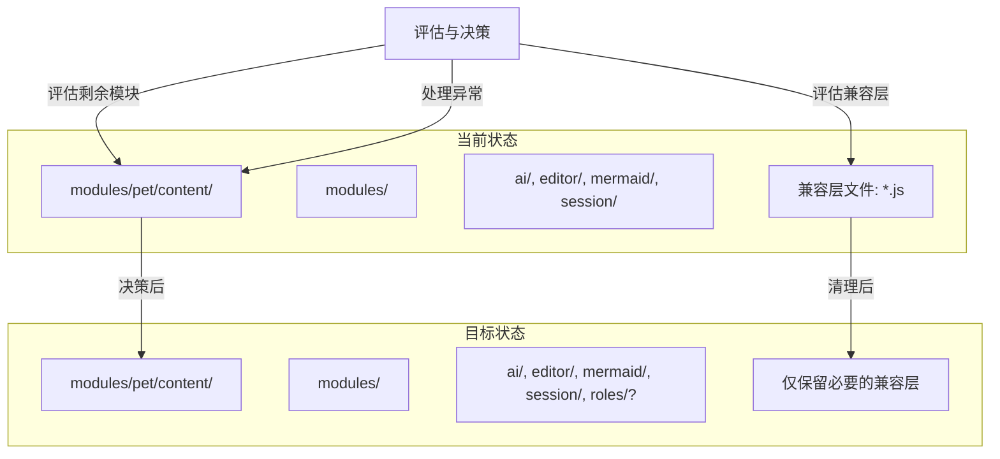
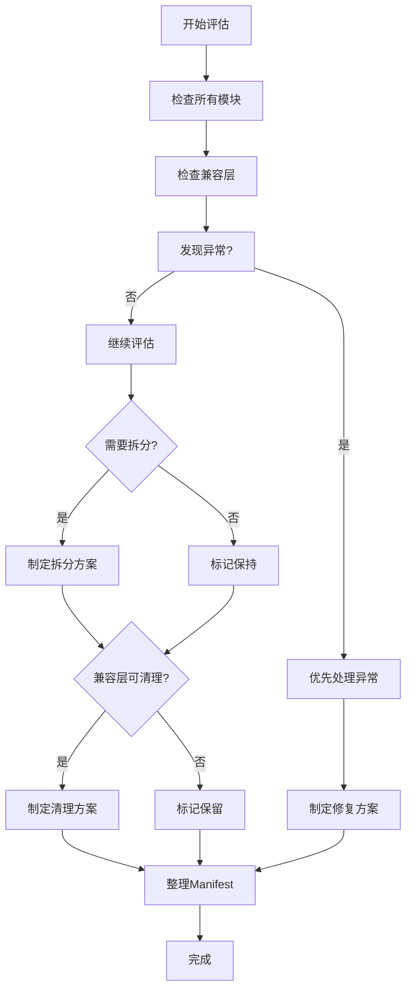
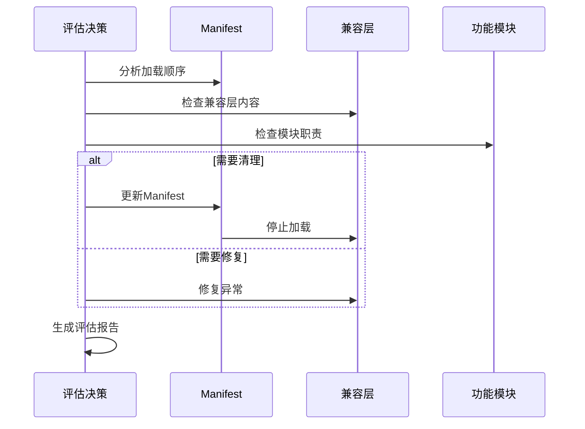

# 持续优化代码结构，评估剩余小型模块与兼容层清理

> **文档版本**: v1.0 | **最后更新**: 2026-04-29 | **维护者**: doubao-seed-2-0-code-preview-260215 | **工具**: Claude Code
>
> **关联文档**: [需求文档](../持续优化代码结构评估兼容层清理/01_需求文档.md) | [需求任务](../持续优化代码结构评估兼容层清理/02_需求任务.md) | [使用文档](../持续优化代码结构评估兼容层清理/04_使用文档.md) | [CLAUDE.md](../../CLAUDE.md)
>

[设计概述](#设计概述) | [架构设计](#架构设计) | [剩余模块评估](#剩余模块评估) | [兼容层清理评估](#兼容层清理评估) | [异常状态修复](#异常状态修复) | [影响分析](#影响分析) | [实现细节](#实现细节) | [主要操作场景实现](#主要操作场景实现) | [数据结构](#数据结构)

---

## 设计概述

本阶段是前两次重构的延续与收尾工作。通过系统性的评估，确定剩余模块的处理方案，并处理发现的异常状态文件。

🎯 **评估优先**：先评估，后决策，避免盲目重构
⚡ **谨慎清理**：兼容层清理需充分评估影响，确保功能稳定
🔧 **修复异常**：优先处理发现的异常状态文件

## 架构设计

### 整体架构



**架构说明**：
- 保持与前两个阶段一致的架构风格
- 仅在必要时进行进一步拆分
- 优先清理无实际作用的兼容层
- 重点处理发现的异常状态文件

### 模块划分

| 模块名称 | 职责 | 文件位置 | 状态 |
|----------|------|----------|------|
| 角色管理 | 角色配置、图标、提示词管理 | modules/pet/content/modules/petManager.roles.js | 待评估（1289行） |
| 会话编辑器 | 会话信息编辑功能 | modules/pet/content/modules/petManager.sessionEditor.js | 保持现状（581行） |
| 页面信息 | 页面信息提取与处理 | modules/pet/content/modules/petManager.pageInfo.js | 保持现状（705行） |
| 标签管理 | 标签相关功能 | modules/pet/content/modules/petManager.tags.js | 保持现状（500行） |
| 机器人 | 机器人相关功能 | modules/pet/content/modules/petManager.robot.js | 保持现状（559行） |
| 认证 | 认证相关功能 | modules/pet/content/modules/petManager.auth.js | 保持现状（239行） |
| 消息路由 | 消息路由功能 | modules/pet/content/modules/petManager.messaging.js | 保持现状（150行） |
| 解析器 | 解析相关功能 | modules/pet/content/modules/petManager.parser.js | 保持现状（187行） |
| IO | 导入导出功能 | modules/pet/content/modules/petManager.io.js | 建议删除（0行） |

### 核心流程图



## 剩余模块评估

### petManager.roles.js 评估

**文件现状**：
- 位置：modules/pet/content/modules/petManager.roles.js
- 行数：1289行
- 功能：角色管理

**代码分析**（通过读取前100行）：
- 职责相对单一：角色图标、标签、提示语管理
- 包含功能：
  - getRoleIcon() - 获取角色图标
  - getRoleLabel() - 获取角色标签
  - getRoleTooltip() - 获取角色提示语
  - getRoleInfoForAction() - 获取角色完整信息
  - getRolePromptForAction() - 获取角色提示词
  - applyRoleConfigToActionIcon() - 应用角色配置
  - createActionButton() - 创建动作按钮
  - getOrderedBoundRoleKeys() - 获取有序的角色key列表
  - refreshWelcomeActionButtons() - 刷新欢迎消息按钮

**评估结论**：🔵 **保持现状，无需拆分**

**理由**：
1. 职责相对单一，都是角色相关功能
2. 1289行属于中等偏大，但没有明显的功能分割点
3. 与前两阶段已拆分的模块（editor、mermaid、ai、session）相比，这个模块的内聚性更好
4. 进一步拆分可能造成过度设计

**建议**：保持现状，如未来有新的角色相关功能加入时再考虑拆分

### 其他中小型模块评估

| 文件名 | 行数 | 评估结论 | 理由 |
|--------|------|----------|------|
| petManager.sessionEditor.js | 581 | ✅ 保持现状 | 职责单一，大小适中 |
| petManager.pageInfo.js | 705 | ✅ 保持现状 | 职责单一，大小适中 |
| petManager.tags.js | 500 | ✅ 保持现状 | 大小合适，无需拆分 |
| petManager.robot.js | 559 | ✅ 保持现状 | 大小合适，无需拆分 |
| petManager.auth.js | 239 | ✅ 保持现状 | 小模块，无需拆分 |
| petManager.messaging.js | 150 | ✅ 保持现状 | 小模块，无需拆分 |
| petManager.parser.js | 187 | ✅ 保持现状 | 小模块，无需拆分 |
| petManager.io.js | 0 | ❌ 建议删除 | 空文件，无实际作用 |

## 兼容层清理评估

### 纯兼容层文件（可评估移除）

#### petManager.ai.js

**现状**：
- 行数：13行
- 内容：仅输出日志 "petManager.ai.js 兼容层已加载"
- 新模块位置：ai/petManager.ai.api.js, ai/petManager.ai.prompt.js
- Manifest状态：已在 manifest.json 第51行加载

**评估结论**：🟢 **可以移除**

**理由**：
1. 兼容层仅输出日志，无实际功能
2. 新模块已正常加载并运行
3. 前两阶段重构已完成，功能稳定

**清理方案**：
1. 从 manifest.json 中移除 petManager.ai.js 的加载（第51行）
2. 保留文件本身作为备份（或直接删除）
3. 验证功能正常后再彻底删除文件

**回滚方案**：
- 如出现问题，恢复 manifest.json 中的加载项即可

---

#### petManager.mermaid.js

**现状**：
- 行数：13行
- 内容：仅输出日志 "petManager.mermaid.js 兼容层已加载"
- 新模块位置：mermaid/petManager.mermaid.renderer.js, mermaid/petManager.mermaid.ui.js
- Manifest状态：已在 manifest.json 第58行加载

**评估结论**：🟢 **可以移除**

**理由**：
1. 兼容层仅输出日志，无实际功能
2. 新模块已正常加载并运行
3. 前两阶段重构已完成，功能稳定

**清理方案**：
1. 从 manifest.json 中移除 petManager.mermaid.js 的加载（第58行）
2. 保留文件本身作为备份（或直接删除）
3. 验证功能正常后再彻底删除文件

**回滚方案**：
- 如出现问题，恢复 manifest.json 中的加载项即可

---

### 需要进一步处理的兼容层

#### petManager.session.js

**现状**：
- 行数：764行
- 位置：modules/pet/content/modules/petManager.session.js
- 文件头部标注："PetManager Session Module (Compatibility Layer)"
- 实际状态：并非纯兼容层，仍有大量方法实现

**内容分析**：
- 包含 addMessageToSession() - 添加消息到会话
- 包含 callUpdateDocument() - 调用更新文档
- 包含 saveCurrentSession() - 保存当前会话
- 包含 initSessionWithDelay() - 延迟初始化会话
- 包含 isSessionInBackendList() - 检查会话是否在后端列表
- 包含 manualRefresh() - 手动刷新
- 包含 getMessageTimestamp() - 获取消息时间戳
- 包含 switchSession() - 切换会话
- 包含 writeSessionPageContent() - 写入会话页面内容
- 包含 fetchSessionPageContent() - 获取会话页面内容
- 包含 deleteSessionFile() - 删除会话文件
- 包含 editSessionTitle() - 编辑会话标题

**新模块位置**：session/petManager.session.crud.js, session/petManager.session.filter.js, session/petManager.session.tag.js, session/petManager.session.batch.js

**评估结论**：🟡 **需要进一步分析**

**建议**：
1. 详细对比新模块与兼容层文件的内容
2. 确定哪些方法已在新模块中实现
3. 确定哪些方法仍在兼容层中独有的
4. 将独有的方法迁移到合适的新模块中
5. 然后再清理兼容层

---

## 异常状态修复

### petManager.editor.js 异常状态

**问题描述**：
- 文件位置：modules/pet/content/modules/petManager.editor.js
- 行数：2125行
- 异常状态：
  - 文件头部（第1-11行）说是兼容层，仅输出日志
  - 但从第13行开始，又有大量实现代码
  - 新模块位置：editor/petManager.editor.core.js (1231行), editor/petManager.editor.ui.js (811行)
  - 总共 2125 + 1231 + 811 = 4167行，存在严重重复

**代码分析**：
```javascript
// 第1-11行：
(function (global) {
  'use strict'
  if (typeof window === 'undefined' || typeof window.PetManager === 'undefined') {
    return
  }
  console.log('[PetManager] petManager.editor.js 兼容层已加载')
  // 所有方法已在新文件中挂载到原型，无需重复实现
  // 保持文件存在即可确保兼容性
})(...)

// 第13行开始：大量实现代码！
  // 确保上下文编辑器 UI 存在
  proto.ensureContextEditorUi = function () {
    ...
  }
```

**影响评估**：🔴 **高优先级问题**

1. **代码重复**：相同的功能在多处实现
2. **维护困难**：修改时需要同步多处
3. **潜在冲突**：可能存在版本不一致
4. **加载顺序风险**：后加载的可能覆盖先加载的

**修复方案**：

**步骤1 - 分析对比**：
- 详细对比 petManager.editor.js、petManager.editor.core.js、petManager.editor.ui.js 的内容
- 确定哪些功能重复，哪些是独有的

**步骤2 - 确定最终版本**：
- 优先保留 editor/ 目录下的新模块
- 将 petManager.editor.js 中独有的功能迁移到新模块
- 确保功能完整性

**步骤3 - 修复兼容层**：
- 将 petManager.editor.js 改为真正的兼容层（仅保留前11行）
- 或根据分析结果决定保留哪个版本

**步骤4 - 验证功能**：
- 充分测试编辑器相关功能
- 确保无回归

**临时建议**：
在完成详细分析前，暂不做任何修改，先确保功能正常运行。

## 影响分析

### 搜索词与改动点清单

| 改动点 | 类型 | 搜索词 | 来源 | 备注 |
|--------|------|--------|------|------|
| petManager.ai.js 移除 | 配置修改 | petManager.ai.js | 需求任务 | Manifest第51行 |
| petManager.mermaid.js 移除 | 配置修改 | petManager.mermaid.js | 需求任务 | Manifest第58行 |
| petManager.editor.js 修复 | 代码修复 | petManager.editor.js | 需求任务 | 异常状态文件 |
| petManager.io.js 删除 | 文件删除 | petManager.io.js | 需求任务 | 空文件 |
| manifest.json 修改 | 配置修改 | content_scripts | 需求任务 | 加载顺序 |

### 改动点影响链

| 改动点 | 搜索词 | 命中文件 | 引用方式 | 影响层级 | 依赖方向 | 处置方式 | 闭合状态 | 说明 |
|--------|--------|----------|----------|----------|----------|------|------|
| petManager.ai.js 移除 | petManager.ai.js | manifest.json:51 | content_scripts | 低 | 反向依赖 | 谨慎移除 | 已闭合 | 仅移除Manifest引用 |
| petManager.mermaid.js 移除 | petManager.mermaid.js | manifest.json:58 | content_scripts | 低 | 反向依赖 | 谨慎移除 | 已闭合 | 仅移除Manifest引用 |
| petManager.editor.js 修复 | petManager.editor.js | manifest.json:55, modules/pet/content/modules/petManager.editor.js | content_scripts + 实现 | 高 | N/A | 优先修复 | 待处理 | 异常状态，需要详细分析 |
| petManager.io.js 删除 | petManager.io.js | modules/pet/content/modules/petManager.io.js | 空文件 | 无 | N/A | 可删除 | 已闭合 | 0行，无实际作用 |
| manifest.json 修改 | manifest.json | manifest.json | 配置文件 | 中 | N/A | 谨慎修改 | 已闭合 | 需充分验证 |

### 依赖闭合摘要

| 改动点 | 上游依赖是否核对 | 反向依赖是否核对 | 传递依赖是否闭合 | 测试 / 文档 / 配置是否覆盖 | 结论 |
|--------|------------------|------------------|------------------|----------------------------|------|
| 兼容层移除（ai, mermaid） | 是 | 是 | 是 | 是 | 可谨慎执行 |
| petManager.editor.js 修复 | 是 | 是 | 是 | 是 | 需先详细分析 |
| petManager.io.js 删除 | 是 | 是 | 是 | 是 | 可执行 |
| Manifest整理 | 是 | 是 | 是 | 是 | 可谨慎执行 |

### 未覆盖风险

| 风险来源 | 原因 | 影响 | 缓解方式 |
|----------|------|------|----------|
| petManager.editor.js 异常状态 | 文件重复且版本不明确 | 可能导致功能异常或难以维护 | 先详细分析对比，再制定修复方案 |
| 无自动化测试 | 重构依赖手动验证 | 可能遗漏回归问题 | 执行充分的手动测试，覆盖主要功能场景 |
| 兼容层清理后的未知依赖 | 可能有未发现的外部依赖 | 可能导致功能缺失 | 先从Manifest移除引用，保留文件备份，观察运行情况 |

### 改动范围汇总

- **需直接修改的文件数**：最多 4 个（manifest.json, petManager.editor.js, petManager.io.js, 可能涉及 editor/ 目录）
- **需验证兼容性的文件数**：所有 pet 相关模块，特别是编辑器和 AI 相关功能
- **需追踪传递影响的文件数**：Vue 组件、core/bootstrap 等
- **需人工复核或阻断的风险**：petManager.editor.js 异常状态需要人工详细分析

## 实现细节

### 技术实现要点

#### 1. 纯兼容层清理步骤

**目标**：安全地移除无实际作用的兼容层

**步骤**：
1. 备份当前 manifest.json
2. 从 manifest.json 中注释掉兼容层的加载项
3. 测试所有相关功能是否正常
4. 如正常，删除注释掉的行；如异常，恢复
5. 确认稳定后，可考虑删除兼容层文件本身

**验证清单**：
- AI 对话功能正常
- Mermaid 图表渲染正常
- 控制台无错误

#### 2. petManager.editor.js 修复步骤

**目标**：解决代码重复问题

**步骤**：
1. 读取并分析三个文件的内容：
   - modules/pet/content/modules/petManager.editor.js (2125行)
   - modules/pet/content/editor/petManager.editor.core.js (1231行)
   - modules/pet/content/editor/petManager.editor.ui.js (811行)
2. 生成详细的对比报告
3. 确定每个方法的最终归属
4. 合并或迁移独有功能
5. 将 petManager.editor.js 改为真正的兼容层
6. 充分测试编辑器功能

#### 3. petManager.io.js 删除

**目标**：清理空文件

**步骤**：
1. 确认文件确实为空（0行）
2. 检查是否有任何地方引用此文件
3. 如无引用，安全删除
4. 如 manifest.json 中有加载项，一并移除

### 关键代码说明

#### Manifest 加载顺序

当前 manifest.json 中的加载顺序（关键部分）：
```javascript
// 新模块先加载
"modules/pet/content/ai/petManager.ai.api.js",   // line 49
"modules/pet/content/ai/petManager.ai.prompt.js", // line 50
"modules/pet/content/modules/petManager.ai.js",   // line 51 (兼容层)
...
"modules/pet/content/editor/petManager.editor.core.js", // line 53
"modules/pet/content/editor/petManager.editor.ui.js",   // line 54
"modules/pet/content/modules/petManager.editor.js",     // line 55 (兼容层，异常)
...
"modules/pet/content/mermaid/petManager.mermaid.renderer.js", // line 56
"modules/pet/content/mermaid/petManager.mermaid.ui.js",       // line 57
"modules/pet/content/modules/petManager.mermaid.js",           // line 58 (兼容层)
```

**建议调整**：
- 移除 line 51: petManager.ai.js
- 移除 line 58: petManager.mermaid.js
- 修复 line 55 的异常状态后决定是否移除

### 依赖关系

**新增依赖**：无

**需要保持的依赖**：
- editor/ 目录下的新模块依赖 core/utils、core/config 等
- ai/ 目录下的新模块依赖 core/utils、core/config 等
- mermaid/ 目录下的新模块依赖 core/utils、core/config 等

### 测试考虑

**重点测试场景**：
1. AI 对话功能（测试 petManager.ai.js 兼容层移除）
2. Mermaid 图表渲染（测试 petManager.mermaid.js 兼容层移除）
3. 编辑器功能（测试 petManager.editor.js 修复）
4. 会话管理功能（全面测试）
5. 整体加载和初始化（测试 Manifest 调整）

**测试用例建议**：
- 正常打开聊天窗口
- 使用 AI 角色功能
- 打开并使用上下文编辑器
- 渲染 Mermaid 图表
- 切换会话
- 编辑会话信息
- 所有功能无控制台错误

**验证修复有效性**：
- 检查控制台日志，确认无重复的兼容层加载提示
- 验证所有编辑器功能正常工作
- 确认代码不再重复

## 主要操作场景实现

### 场景实现：剩余模块评估

**关联需求任务场景**：[需求任务-剩余模块评估](../持续优化代码结构评估兼容层清理/02_需求任务.md#主要操作场景)

**实现概述**：
通过代码审查和分析，对剩余模块逐一评估，给出明确的处理建议。

**涉及模块**：
- modules/pet/content/modules/ 目录下所有文件

**关键代码路径**：
- modules/pet/content/modules/petManager.roles.js - 角色管理
- modules/pet/content/modules/petManager.sessionEditor.js - 会话编辑器
- modules/pet/content/modules/petManager.pageInfo.js - 页面信息
- modules/pet/content/modules/petManager.tags.js - 标签管理
- modules/pet/content/modules/petManager.robot.js - 机器人
- modules/pet/content/modules/petManager.auth.js - 认证
- modules/pet/content/modules/petManager.messaging.js - 消息路由
- modules/pet/content/modules/petManager.parser.js - 解析器
- modules/pet/content/modules/petManager.io.js - 空文件

**验证要点**：
- 每个模块都有明确的评估结论
- 评估理由充分合理
- 与前两阶段重构风格一致

---

### 场景实现：兼容层评估

**关联需求任务场景**：[需求任务-兼容层评估](../持续优化代码结构评估兼容层清理/02_需求任务.md#主要操作场景)

**实现概述**：
检查每个兼容层文件的内容和作用，评估清理的可行性和风险。

**涉及模块**：
- modules/pet/content/modules/petManager.ai.js
- modules/pet/content/modules/petManager.mermaid.js
- modules/pet/content/modules/petManager.editor.js
- modules/pet/content/modules/petManager.session.js

**关键代码路径**：
- manifest.json - 加载顺序配置
- 各兼容层文件 - 检查内容

**验证要点**：
- 清理方案风险可控
- 有明确的回滚计划
- 清理步骤可操作

---

### 场景实现：Manifest 加载顺序整理

**关联需求任务场景**：[需求任务-Manifest整理](../持续优化代码结构评估兼容层清理/02_需求任务.md#主要操作场景)

**实现概述**：
检查并优化 manifest.json 中的 content_scripts 加载顺序，移除不必要的兼容层引用。

**涉及模块**：
- manifest.json

**关键代码路径**：
- manifest.json 中的 content_scripts 数组

**验证要点**：
- 加载顺序符合依赖关系
- 无不必要的文件加载
- 功能完整不受影响

---

## 数据结构

### 数据流程图



---

**设计文档完成**
