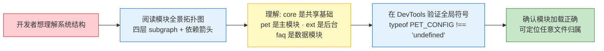
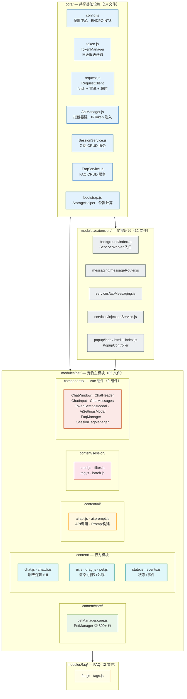
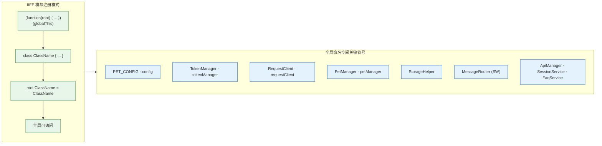
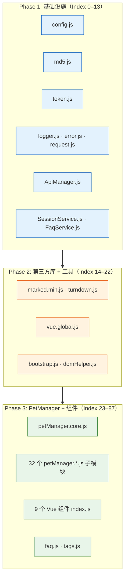

# 场景 1: 模块地图与拓扑

> | v2.0.0 | 2026-06-06 | claude | 🌿 feat/yipet-arch | ⏱️ — | 📎 [CLAUDE.md](../../../CLAUDE.md) |
> **导航**: [← 故事任务](./故事任务.md) · [下一场景 →](./场景-2-数据流追踪.md)

[概述](#sec-overview) · [§0 技术评审](#sec0) · [§1 测试设计](#sec1)

## 概述

**角色**: 架构师 / 新加入的开发者 · **目标**: 掌握 YiPet 全量模块拓扑、IIFE 全局命名空间模式、manifest 加载顺序依赖 · **优先级**: P0

**图谱定位**: 领域层 → `domain:yipet-core` · 结构层 → `flow:module-topology`

### 主要价值

- 🗺️ **一张图看清全局** — 88 个 JS 文件按 core/pet/extension/faq 四层归类，mermaid 拓扑图呈现全貌
- 🔗 **依赖关系一览** — IIFE 命名空间模式 + 模块注册与消费关系表，谁依赖谁一目了然
- 📋 **加载顺序明确** — manifest.json 三阶段加载树，避免因加载顺序错误引入隐蔽 bug
- ✅ **全局符号可验证** — 导出验证矩阵提供每个关键符号的类型、环境和验证命令
- 🔄 **加载顺序约束明确** — 三阶段加载树确保 manifest.json 声明顺序和 IIFE 依赖顺序一致

---

## §0 技术评审

### 效果示意

### 模块全景拓扑图

### IIFE 全局命名空间模式

### 模块注册与消费关系表

| 模块 | 注册方式 | 命名空间 | 导出符号 | 主要消费者 |
|------|---------|---------|---------|-----------|
| core/config.js | 直接赋值 | window / self | PET_CONFIG, config, ENDPOINTS | 全部模块 |
| core/utils/api/token.js | IIFE | root (globalThis) | TokenManager, tokenManager | ApiManager, PopupController |
| core/utils/api/request.js | IIFE | root | RequestClient, requestClient | ApiManager |
| core/api/core/ApiManager.js | IIFE | root | ApiManager | SessionService, FaqService |
| core/api/services/SessionService.js | IIFE | root | SessionService | PetManager |
| core/api/services/FaqService.js | IIFE | root | FaqService | PetManager, FAQ 模块 |
| core/bootstrap/bootstrap.js | 直接赋值 | window | StorageHelper, getPetDefaultPosition | PetManager, UI 模块 |
| modules/pet/content/core/petManager.core.js | IIFE | window | PetManager | 所有 pet/ 子模块 |
| modules/pet/content/petManager.js | IIFE | window | petManager (实例) | PopupController, SW |
| modules/extension/background/messaging/messageRouter.js | 类声明 | self | MessageRouter | register.js |
| modules/extension/background/services/tabMessaging.js | IIFE | root | TabMessaging | injectionService |
| modules/extension/background/services/injectionService.js | 类声明 | self | InjectionService | PetHandler, register.js |
| modules/extension/popup/index.js | 类声明 | window | PopupController | 用户交互 |

### Content Script 加载顺序（三阶段依赖树）

> **关键约束**: manifest.json `content_scripts[0].js` 数组顺序 = 加载顺序。`petManager.core.js` 必须在 `petManager.js` 之前；`vue.global.js` 必须在所有 Vue 组件之前；`config.js` 必须在所有依赖 `PET_CONFIG` 的模块之前。

### 全局导出验证矩阵

| 导出符号 | 类型 | 环境 | 依赖的前置加载 | 验证方法 |
|---------|------|------|-------------|---------|
| window.PET_CONFIG | Object | Content Script | config.js | `typeof PET_CONFIG !== 'undefined'` |
| window.PetManager | Class | Content Script | petManager.core.js + 全部前置 | `typeof window.PetManager !== 'undefined'` |
| window.petManager | Instance | Content Script | petManager.js | `window.petManager instanceof PetManager` |
| window.StorageHelper | Object | Content Script | bootstrap.js | `typeof StorageHelper.isChromeStorageAvailable === 'function'` |
| window.TokenManager | Class | Content Script | token.js | `typeof TokenManager !== 'undefined'` |
| window.tokenManager | Instance | Content Script | token.js | `typeof tokenManager !== 'undefined'` |
| window.requestClient | Instance | Content Script | request.js | `requestClient instanceof RequestClient` |
| self.MessageRouter | Class | Service Worker | messageRouter.js | `typeof self.MessageRouter !== 'undefined'` |
| self.InjectionService | Class | Service Worker | injectionService.js | `typeof self.InjectionService !== 'undefined'` |
| window.PopupController | Class | Popup | popup/index.js | `typeof PopupController !== 'undefined'` |

### 设计评审清单

| # | 检查项 | 状态 |
|---|--------|:---:|
| 1 | 模块拓扑覆盖 manifest.json 全部声明文件 | ✅ |
| 2 | 模块消费关系无循环依赖 | ✅ |
| 3 | 全局符号验证矩阵覆盖三环境（CS/SW/Popup） | ✅ |
| 4 | 加载顺序三阶段划分与 manifest 声明一致 | ✅ |
| 5 | IIFE 模式分析覆盖所有命名空间变体（window/self/globalThis） | ✅ |

---

## §1 测试设计

### TC-1-1: 模块存在性验证

| 用例 ID | Given | When | Then |
|---------|-------|------|------|
| TC-1-1-1 | Chrome 扩展已安装，打开任意网页 | 在 DevTools Console 检查关键导出 | `PET_CONFIG`、`PetManager`、`StorageHelper`、`TokenManager`、`requestClient` 全部 `typeof !== 'undefined'` |
| TC-1-1-2 | 核心模块已加载 | `console.log(window.petManager instanceof PetManager)` | 输出 `true` |
| TC-1-1-3 | vue.global.js 已加载 | `console.log(typeof Vue)` | 输出非 `'undefined'` |
| TC-1-1-4 | Service Worker 已激活 | 在 SW DevTools 中 `typeof self.MessageRouter` | 非 `'undefined'` |

### TC-1-2: 依赖完整性验证

| 用例 ID | Given | When | Then |
|---------|-------|------|------|
| TC-1-2-1 | 项目根目录 | 遍历 manifest.json `content_scripts[0].js` 数组，逐文件检查存在性 | 全部路径对应的文件存在 |
| TC-1-2-2 | 读取 manifest.json | 构建依赖图，拓扑排序检测循环 | 无循环依赖 |
| TC-1-2-3 | 对比 InjectionService.CONTENT_SCRIPT_FILES 与 manifest | 逐元素比较路径 | 完全一致（顺序 + 内容） |

### TC-1-3: 全局命名空间无冲突验证

| 用例 ID | Given | When | Then |
|---------|-------|------|------|
| TC-1-3-1 | 两次注入同页面 | 检查 `window.PetManager` 是否被覆盖 | 第二次注入不创建新类（`typeof window.PetManager !== 'undefined'` 时 return） |
| TC-1-3-2 | 已有 `window.petManager` | 再次执行 bootstrap/index.js | `typeof window.petManager === 'undefined'` 为 false，不创建新实例 |
| TC-1-3-3 | 在 GitHub/知乎等常见网站注入 | 检查页面功能是否正常 | 页面功能不受影响，无 JS 报错 |

### TC-B: 边界与异常用例

| 用例 ID | Given | When | Then |
|---------|-------|------|------|
| TC-B-1-1 | manifest.json 缺失 | 尝试加载扩展 | Chrome 拒绝加载，错误信息明确 |
| TC-B-1-2 | content_scripts 声明了不存在的文件 | Chrome 加载扩展 | Service Worker 注入时报错，但不影响已加载的模块 |
| TC-B-1-3 | 全局变量被页面脚本覆盖 | 页面自身定义了 `window.PET_CONFIG` | PetManager 优先使用扩展注入的版本（先到先得） |

> **Gate A 交接信号**: §1 测试设计完成，TC-1-1 到 TC-1-3 覆盖模块存在性、依赖完整性、命名空间无冲突三项核心验证。TC-B 覆盖异常边界。可进入实现阶段。

---

## 变更记录

| 日期 | 变更 | 触发 | 证据 |
|------|------|------|------|
| 2026-06-06 | 按新文档标准 (formulas.md v4.1.1) 重写 | `/rui doc` — 用户要求使用新标准 | F.story.scene 公式 §0+§1 覆盖 |
