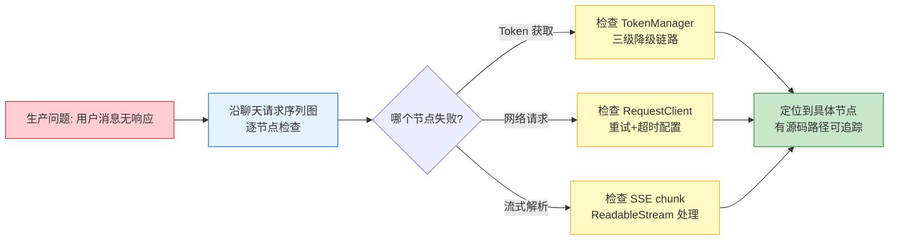
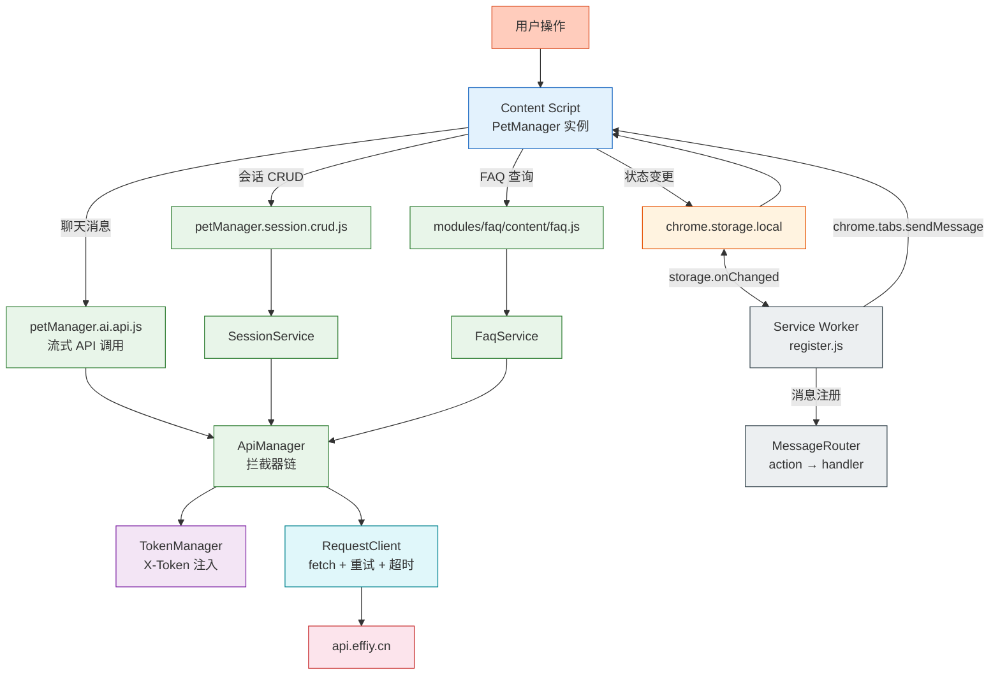
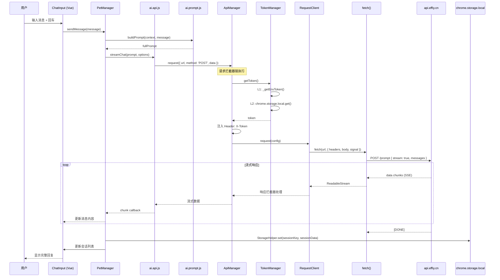
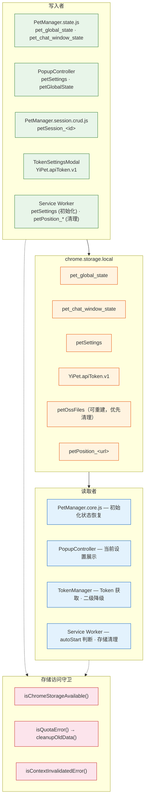

# 场景 2: 数据流与追踪

> | v2.0.0 | 2026-06-06 | claude | 🌿 feat/yipet-arch | ⏱️ — | 📎 [CLAUDE.md](../../../CLAUDE.md) |
> **导航**: [← 场景 1](./场景-1-模块拓扑.md) · [下一场景 →](./场景-3-安全边界.md)

[概述](#sec-overview) · [§0 技术评审](#sec0) · [§1 测试设计](#sec1)

## 概述

**角色**: 后端对接者 / 调试问题的开发者 · **目标**: 追踪用户输入到 API 端点、chrome.storage 读写路径、Service Worker 消息路由等关键数据流 · **优先级**: P0

**图谱定位**: 领域层 → `domain:yipet-dataflow` · 结构层 → `flow:request-lifecycle` · `flow:storage-io` · `flow:sw-messaging`

### 主要价值

- 🔍 **全链路可追踪** — 从用户输入到 API 响应的 14 个参与方序列图，含流式数据 loop
- 📡 **消息通道全景** — 6 条 Chrome Extension 消息通道的方向、action、同步/异步特性一览
- 💾 **存储读写清晰** — 5 类写入者 × 8 个存储 Key × 3 级访问守卫的完整映射
- ⚡ **问题定位快速** — 任一步骤失败可沿序列图回溯到上一个参与方，快速隔离故障域

---

## §0 技术评审

### 效果示意

### 数据流全景

### 聊天请求完整链路（序列图）

### chrome.storage.local 读写路径

### 消息通道全景

| 消息通道 | 发起方 | 接收方 | 典型 Action | 同步/异步 |
|---------|--------|--------|------------|:---:|
| `chrome.runtime.sendMessage` | PopupController | Service Worker | injectPet, forwardToContentScript, sendToWeWorkRobot | 异步 |
| `chrome.tabs.sendMessage` | Service Worker | Content Script | settingsUpdated, globalStateUpdated, toggleVisibility | 异步 |
| `chrome.storage.onChanged` | chrome.storage.local | Service Worker | 设置/状态变更广播 | 事件触发 |
| `chrome.commands.onCommand` | 键盘快捷键 | SW → Content Script | toggle-pet → toggleVisibility | 异步 |
| `chrome.action.onClicked` | 工具栏图标点击 | SW → Content Script | toggleVisibility | 异步 |
| `window.postMessage` | Content Script 内部 | Content Script 内部 | Vue 组件 ↔ PetManager 实例 | 同步/异步 |

### 设计评审清单

| # | 检查项 | 状态 |
|---|--------|:---:|
| 1 | 数据流全景覆盖全部 6 条核心路径 | ✅ |
| 2 | 聊天请求序列图含 14 个参与方 + 流式响应 loop | ✅ |
| 3 | chrome.storage 读写路径标注全部 3 级守卫 | ✅ |
| 4 | 消息通道全景表覆盖全部 6 条 Chrome Extension 通道 | ✅ |
| 5 | 每条数据流可追溯到具体源码文件 | ✅ |

---

## §1 测试设计

### TC-2-1: 聊天请求链路完整性

| 用例 ID | Given | When | Then |
|---------|-------|------|------|
| TC-2-1-1 | Token 已配置，宠物已初始化 | 在聊天窗口输入消息并发送 | Chrome DevTools Network 面板显示 POST 到 `api.effiy.cn/prompt`，请求头含 `X-Token` |
| TC-2-1-2 | API 返回流式数据 | 发送消息后等待回复 | 回复内容逐块显示，无丢字或乱序 |
| TC-2-1-3 | Token 未配置 | 发送消息 | ApiManager Token 拦截器获取空 Token → 请求不带 X-Token 头发送 → API 返回认证错误 |
| TC-2-1-4 | 模拟网络断开 | 发送消息后断开网络 | RequestClient._fetchWithRetry 最多重试 3 次，最终显示错误提示 |

### TC-2-2: chrome.storage.local 读写路径

| 用例 ID | Given | When | Then |
|---------|-------|------|------|
| TC-2-2-1 | 宠物可见 | 拖拽宠物到新位置 | `chrome.storage.local` 中 `pet_global_state` 的 position 字段更新 |
| TC-2-2-2 | 之前保存过位置 | 页面刷新 | 宠物出现在上次保存的位置 |
| TC-2-2-3 | chrome.storage.local 即将满 | 触发存储写入 | StorageHelper 检测配额错误 → cleanupOldData() 清理 petOssFiles → 重试写入 |
| TC-2-2-4 | 扩展被重新加载 | chrome.storage.local 读写操作 | isChromeStorageAvailable() 返回 false → 返回 contextInvalidated: true |

### TC-2-3: Service Worker 消息路由

| 用例 ID | Given | When | Then |
|---------|-------|------|------|
| TC-2-3-1 | Popup 面板打开 | 点击"显示宠物"开关 | injectPet action → MessageRouter → PetHandler → 宠物出现在当前页面 |
| TC-2-3-2 | 扩展后台消息 | 发送 forwardToContentScript | MessageRouter → MessageForwardHandler → TabMessaging → Content Script 收到消息 |
| TC-2-3-3 | SW 运行中 | 发送 `{ action: 'nonexistent' }` | MessageRouter 返回 `{ success: false, error: 'Unknown action' }` |

### TC-B: 边界与异常用例

| 用例 ID | Given | When | Then |
|---------|-------|------|------|
| TC-B-2-1 | API 返回非 2xx 状态码 | 发送消息 | 响应拦截器捕获错误 → 错误信息展示给用户 |
| TC-B-2-2 | chrome.storage.local 完全不可用 | 页面加载 | isChromeStorageAvailable() 预检失败 → PetManager 以降级模式运行（内存状态） |
| TC-B-2-3 | 两个 Tab 同时修改 petSettings | SW storage.onChanged 触发 | 最后写入者胜出，两个 Tab 都收到更新通知 |

> **Gate A 交接信号**: §1 测试设计完成，覆盖聊天请求链路、storage 读写路径、SW 消息路由 3 类核心数据流的正常路径和异常边界。可进入实现阶段。

---

## 变更记录

| 日期 | 变更 | 触发 | 证据 |
|------|------|------|------|
| 2026-06-06 | 按新文档标准重写 | `/rui doc` | F.story.scene 公式 §0+§1 覆盖 |
