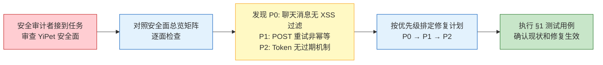
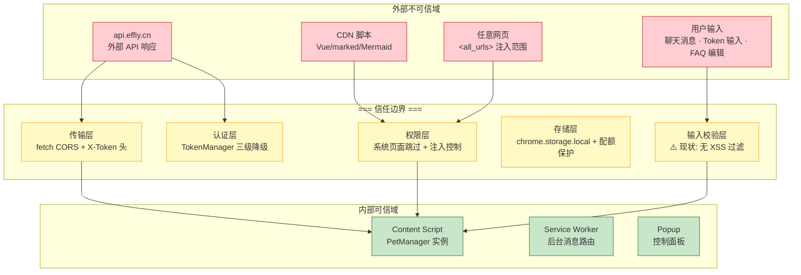
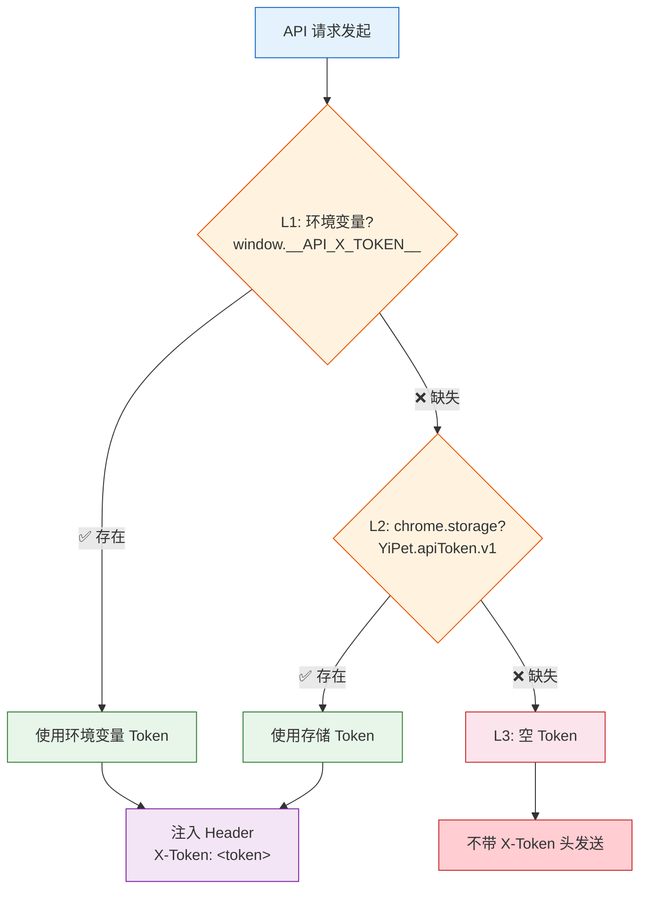
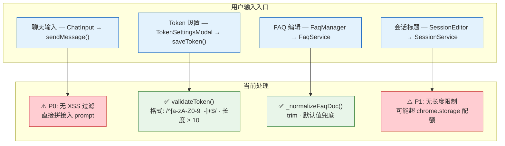
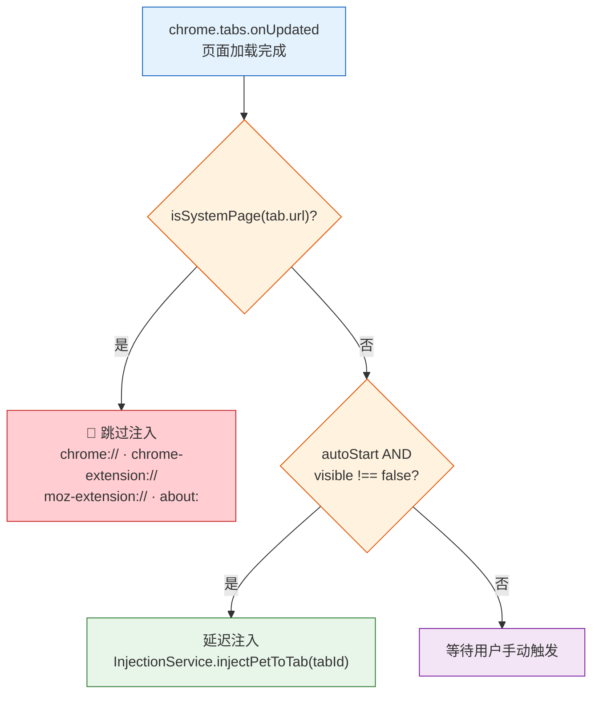

# 场景 3: 信任边界与安全面

> | v2.0.0 | 2026-06-06 | claude | 🌿 feat/yipet-arch | ⏱️ — | 📎 [CLAUDE.md](../../../CLAUDE.md) |
> **导航**: [← 场景 2](./场景-2-数据流追踪.md) · [下一场景 →](./场景-4-依赖影响.md)

[概述](#sec-overview) · [§0 技术评审](#sec0) · [§1 测试设计](#sec1)

## 概述

**角色**: 安全审计者 / code reviewer · **目标**: 识别全量信任边界，覆盖认证、传输、输入、存储、权限五大安全面的威胁建模和缓解措施 · **优先级**: P0

**图谱定位**: 领域层 → `domain:yipet-security` · 结构层 → `flow:auth-chain` · `flow:input-sanitization` · `flow:permission-check`

### 主要价值

- 🔒 **五面全量覆盖** — 认证/传输/输入/存储/权限每个面独立审计，标注现状评级和已知缺口
- 🛡️ **信任边界可视化** — 外部不可信域 → 信任边界 → 内部可信域的三层 mermaid 图，每层标注风险
- ⚠️ **风险优先级明确** — P0 缺口（聊天消息无 XSS 过滤）到 P2 缺口（Token 无过期机制）逐项列出
- ✅ **安全回归可执行** — 每面有具体测试用例，每次变更可对照安全面总览矩阵做回归
- 🔐 **STRIDE 全覆盖** — 六类威胁（欺骗/篡改/抵赖/泄露/拒绝服务/权限提升）映射到具体安全面和缓解措施
- 📋 **权限最小审计** — 5 项 manifest 权限逐条审查，每项有用途说明和风险评估

---

## §0 技术评审

### 效果示意

### 信任边界全景图

### 认证面: TokenManager 三级降级

| 降级级 | 来源 | 获取方式 | 失败后行为 |
|:---:|------|---------|-----------|
| L1 | 环境变量 | `window.__API_X_TOKEN__` (同步) | 降级到 L2 |
| L2 | chrome.storage.local | `chrome.storage.local.get(['YiPet.apiToken.v1'])` (异步) | 降级到 L3 |
| L3 | 空 Token | 返回 `''` (同步) | 请求不带 X-Token 头，API 返回认证错误 |

### 输入面: 用户输入路径（风险标注）

### 权限面: `<all_urls>` 系统页面跳过

### 安全面总览矩阵

| 安全面 | 保护机制 | 现状评级 | 已知缺口 | 优先级 |
|--------|---------|:---:|------|:---:|
| 认证 | TokenManager 三级降级 + validateToken 格式校验 | 良好 | Token 无过期机制 | P2 |
| 传输 | CORS + X-Token 头 + HTTPS + credentials: 'omit' | 良好 | POST 重试非幂等 | P1 |
| 输入 | Token 格式校验 + FAQ 规范化 | **不足** | 聊天消息无 XSS 过滤 | P0 |
| 存储 | isChromeStorageAvailable() + isContextInvalidated() + 配额清理 | 良好 | 无数据加密 | P2 |
| 权限 | isSystemPage() + autoStart 控制 | 可接受 | `<all_urls>` 范围过大 | P1 |

### 设计评审清单

| # | 检查项 | 状态 |
|---|--------|:---:|
| 1 | 信任边界全景覆盖全部 4 个不可信域和 5 条边界 | ✅ |
| 2 | TokenManager 三级降级链路完整且每级有失败后行为 | ✅ |
| 3 | 输入面 4 个入口全部审计，每个有现状评级 | ✅ |
| 4 | 安全面总览矩阵覆盖认证/传输/输入/存储/权限 5 列 | ✅ |
| 5 | STRIDE 六类威胁映射到具体安全面 | ✅ |

### STRIDE 威胁映射

| 威胁 | 对应安全面 | 具体风险 | 缓解 |
|------|----------|------|------|
| Spoofing | 认证 | Token 被盗用后冒充合法用户 | Token 格式校验 + HTTPS 传输 |
| Tampering | 传输 + 存储 | API 响应被篡改 / storage 数据被修改 | HTTPS + 响应校验 |
| Repudiation | 认证 | 无操作日志无法追溯 | 待补充（当前无审计日志） |
| Information Disclosure | 存储 + 传输 | Token 泄露 / 敏感数据明文存储 | Token 仅存 chrome.storage.local |
| Denial of Service | 权限 + 存储 | storage 配额被恶意填满 | cleanupOldData() LRU 淘汰 |
| Elevation of Privilege | 权限 | `<all_urls>` 被滥用 | isSystemPage() 跳过 + 最小权限审查 |

---

## §1 测试设计

### TC-3-1: Token 管理与认证

| 用例 ID | Given | When | Then |
|---------|-------|------|------|
| TC-3-1-1 | `window.__API_X_TOKEN__` = `'test-token'`，storage 也有 Token | `tokenManager.getToken()` | 返回环境变量 Token（L1 优先） |
| TC-3-1-2 | 无环境变量，storage 有 Token | `tokenManager.getToken()` | 返回 storage 中的 Token（L2 降级） |
| TC-3-1-3 | 无环境变量，storage 无 Token | `tokenManager.getToken()` | 返回 `''`（L3 空 Token） |
| TC-3-1-4 | Token = `''` | `tokenManager.validateToken(token)` | 返回 `false`（含非法字符） |
| TC-3-1-5 | Token = `'valid_token_123'` | `tokenManager.validateToken(token)` | 返回 `true` |

### TC-3-2: 系统页面跳过

| 用例 ID | Given | When | Then |
|---------|-------|------|------|
| TC-3-2-1 | 扩展已安装 | 导航到 `chrome://extensions` | isSystemPage() 返回 true，宠物不注入 |
| TC-3-2-2 | 扩展已安装 | 导航到 `chrome-extension://xxx` | isSystemPage() 返回 true，宠物不注入 |
| TC-3-2-3 | 扩展已安装 | 导航到 `about:blank` | isSystemPage() 返回 true，宠物不注入 |
| TC-3-2-4 | 扩展已安装，autoStart=true | 导航到 `https://github.com` | isSystemPage() 返回 false，宠物正常注入 |
| TC-3-2-5 | tab.url = null | `isSystemPage(null)` 被调用 | 返回 `false`（安全兜底） |

### TC-3-3: 存储安全

| 用例 ID | Given | When | Then |
|---------|-------|------|------|
| TC-3-3-1 | chrome.storage.local 使用量接近上限 | `StorageHelper.set()` 触发写入 | isQuotaError() 检测 → cleanupOldData() 清理 petOssFiles → 重试写入 |
| TC-3-3-2 | 扩展被重新加载 | 任意 storage 操作 | isChromeStorageAvailable() 返回 false → 返回 `{ contextInvalidated: true }` |
| TC-3-3-3 | 项目源码 | grep `token` / `password` / `secret` | 无硬编码 Token/密钥 |

### TC-B: 边界与异常

| 用例 ID | Given | When | Then |
|---------|-------|------|------|
| TC-B-3-1 | chrome.storage.local 完全不可达 | 页面加载时初始化 | PetManager 以降级模式运行（纯内存状态），功能正常但不持久化 |
| TC-B-3-2 | 恶意网页尝试覆盖全局变量 | 网页自身定义了 `window.PET_CONFIG` | 扩展注入的 PET_CONFIG 先到先得，页面脚本无法覆盖已加载的扩展变量 |
| TC-B-3-3 | 用户在 TokenSettingsModal 粘贴恶意脚本 | Token = `` | validateToken() 拒绝非法字符 |

> **Gate A 交接信号**: §1 测试设计完成，覆盖认证、输入、系统页面跳过、存储安全 4 类安全面的正常路径和异常边界。每个测试用例可追溯到 §0 安全面总览矩阵的具体行。可进入实现阶段。

---

## 变更记录

| 日期 | 变更 | 触发 | 证据 |
|------|------|------|------|
| 2026-06-06 | 按新文档标准重写 | `/rui doc` | F.story.scene 公式 §0+§1 覆盖 + STRIDE 映射 |
