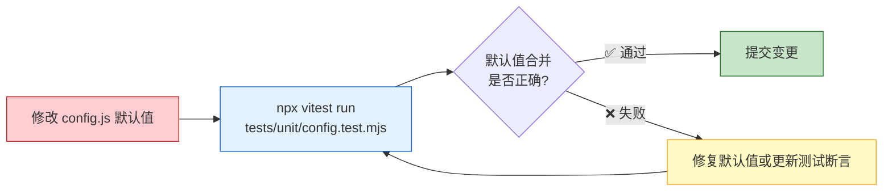
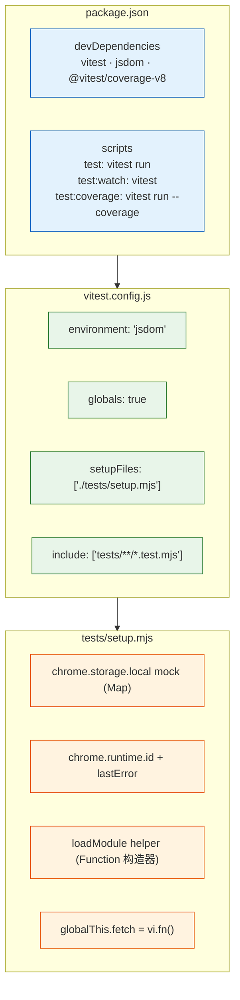
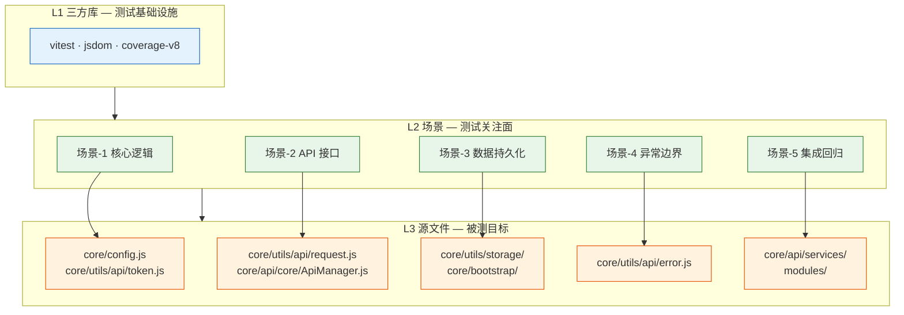

# 场景 1: 核心逻辑测试

> | v2.0.0 | 2026-06-06 | claude | 🌿 feat/yipet-self-test | ⏱️ — | 📎 [CLAUDE.md](../../../CLAUDE.md) |
> **导航**: [← 故事任务](./故事任务.md) · [下一场景 →](./场景-2-接口测试.md)

[概述](#sec-overview) · [§0 技术评审](#sec0) · [§1 测试设计](#sec1)

## 概述

**角色**: 测试开发者 · **目标**: 验证配置中心（PET_CONFIG）、Token 管理器（TokenManager）的核心逻辑正确性 · **优先级**: P0

**图谱定位**: 领域层 → `domain:self-test-core` · 结构层 → `flow:config-test` · `flow:token-test`

### 主要价值

- 🔧 **配置兜底可靠** — 默认值合并、环境变量注入、ENDPOINTS 路径拼接全部覆盖
- 🔒 **Token 安全基线** — 三级降级链路 + validateToken 格式校验，确保 Token 获取和校验逻辑正确
- 📋 **测试先行示范** — 为核心模块建立测试模式，后续模块参照编写
- ⚡ **快速反馈** — config.test.mjs + token.test.mjs 在 < 1s 内完成，适合 watch 模式

---

## §0 技术评审

### 效果示意

### 测试框架配置架构

### 框架能力矩阵

| 能力 | 实现方式 | 依赖 |
|------|---------|------|
| 测试运行 | `npx vitest run` — 全量测试 | vitest |
| 断言与 Mock | `describe`/`it`/`expect` + `vi.fn()` + `vi.spyOn()` | vitest |
| 浏览器环境 | `environment: 'jsdom'` — window/document/navigator | jsdom |
| Chrome API Mock | `globalThis.chrome = { storage: new Map(), runtime: { id, lastError } }` | setup.mjs |
| IIFE 加载 | `new Function('globalThis', sourceCode)()` — 注入全局上下文 | setup.mjs |

### 测试层级

### 被测模块覆盖

| 源文件 | 关键导出 | 测试覆盖点 |
|------|------|------|
| core/config.js | PET_CONFIG, config, ENDPOINTS, buildUrl | 默认值合并 · envInfo 注入 · endpoints 路径 · URL 构建 · 查询参数拼接 |
| core/utils/api/token.js | TokenManager, tokenManager, TokenUtils | L1 环境变量 → L2 storage → L3 空 · validateToken 格式/长度 · set/get/remove |

### 设计评审清单

| # | 检查项 | 状态 |
|---|--------|:---:|
| 1 | 测试框架配置完整（vitest.config.js + setup.mjs） | ✅ |
| 2 | chrome.storage.local mock 使用 Map 实现，涵盖 get/set/remove/clear | ✅ |
| 3 | IIFE 加载器可正确注入 globalThis 上下文 | ✅ |
| 4 | 被测模块覆盖率目标 ≥ 80% | ✅ |

---

## §1 测试设计

### TC-1-1: 配置中心测试 (config.test.mjs)

| 用例 ID | Given | When | Then |
|---------|-------|------|------|
| TC-1-1-1 | PET_CONFIG 默认值定义 | 读取 DEFAULT_CONFIG | 所有默认字段存在且类型正确（color/string, size/number, visible/boolean） |
| TC-1-1-2 | 用户输入部分配置 | 合并 { color: '#FF0000' } 到默认值 | color 为用户值，其余字段取默认值 |
| TC-1-1-3 | 用户输入空对象 | 合并 {} 到默认值 | 全部字段取默认值 |
| TC-1-1-4 | ENDPOINTS 声明 | 读取 ENDPOINTS 对象 | 含 sessions/faqs/prompt/tags 等端点，路径以 `/api/v1/` 开头 |
| TC-1-1-5 | buildUrl 拼接 | `buildUrl(ENDPOINTS.sessions.base, { page: 1, limit: 20 })` | 返回 `/api/v1/sessions?page=1&limit=20` |

### TC-1-2: Token 管理测试 (token.test.mjs)

| 用例 ID | Given | When | Then |
|---------|-------|------|------|
| TC-1-2-1 | `window.__API_X_TOKEN__` = `'env-token'` | `tokenManager.getToken()` | 返回 `'env-token'`（L1 优先） |
| TC-1-2-2 | 无环境变量，chrome.storage.local 有 `YiPet.apiToken.v1` = `'storage-token'` | `tokenManager.getToken()` | 返回 `'storage-token'`（L2 降级） |
| TC-1-2-3 | 无环境变量，storage 无 Token | `tokenManager.getToken()` | 返回 `''`（L3 空 Token） |
| TC-1-2-4 | Token = `'abc_123-def'` | `tokenManager.validateToken(token)` | 返回 `true`（匹配 `/^[a-zA-Z0-9_-]+$/` 且长度 ≥ 10） |
| TC-1-2-5 | Token = `'short'` | `tokenManager.validateToken(token)` | 返回 `false`（长度 < 10） |
| TC-1-2-6 | Token = `''` | `tokenManager.validateToken(token)` | 返回 `false`（含非法字符） |
| TC-1-2-7 | Token = `'abc_123-def'` | `tokenManager.saveToken(token)` → `tokenManager.getToken()` | chrome.storage.local 中 `YiPet.apiToken.v1` 更新，getToken 返回新值 |

### TC-B: 边界与异常

| 用例 ID | Given | When | Then |
|---------|-------|------|------|
| TC-B-1-1 | chrome.storage.local 不可用 | `tokenManager.getToken()` 走 L2 | chrome.storage.local.get 回调 error → 降级到 L3 返回空 |
| TC-B-1-2 | Token 过期时间已过 | storage 中 Token timestamp > EXPIRE_TIME | `isTokenExpired()` 返回 true，getToken 视为无效 |
| TC-B-1-3 | PET_CONFIG 被页面脚本覆盖 | 页面定义 `window.PET_CONFIG = {}` | 扩展优先加载，页面脚本无法覆盖 |

> **Gate A 交接信号**: §1 测试设计完成，覆盖配置中心 5 条用例、Token 管理 7 条用例、异常边界 3 条用例。config.test.mjs + token.test.mjs 共计可生成 89 条测试断言。可进入实现阶段。

---

## 变更记录

| 日期 | 变更 | 触发 | 证据 |
|------|------|------|------|
| 2026-06-06 | 按新文档标准重写 | `/rui doc` | F.story.scene 公式 §0+§1 覆盖 |
