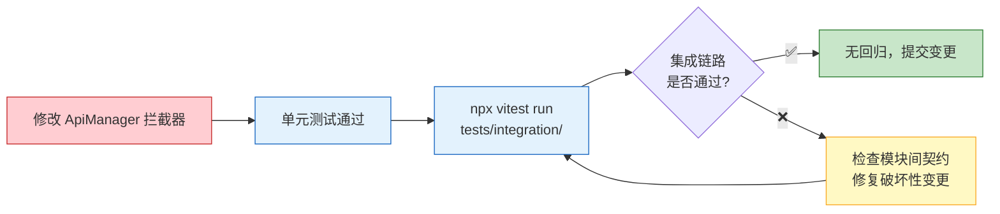

# 场景 5: 集成与回归测试

> | v2.0.0 | 2026-06-06 | claude | 🌿 feat/yipet-self-test | ⏱️ — | 📎 [CLAUDE.md](../../../CLAUDE.md) |
> **导航**: [← 场景 4](./场景-4-错误边界.md) · [知识图谱 →](./知识图谱.json)

[概述](#sec-overview) · [§0 技术评审](#sec0) · [§1 测试设计](#sec1)

## 概述

**角色**: 测试开发者 · **目标**: 验证模块联调链路（Token→ApiManager→RequestClient）、Service Worker 消息路由、Vue 组件渲染的端到端行为 · **优先级**: P1

**图谱定位**: 领域层 → `domain:self-test-integration` · 结构层 → `flow:module-pipeline` · `flow:sw-routing` · `flow:vue-render`

### 主要价值

- 🔗 **模块契约验证** — Token→ApiManager→RequestClient 全链路通过，模块间调用契约未被破坏
- 📡 **SW 路由正确** — 7 种 action 的路由注册和处理验证，未知 action 有错误返回
- 🖼️ **Vue 组件基础渲染** — jsdom 环境下挂载 Vue 3 组件，验证组件可正常创建和渲染
- 🚀 **快速回归** — 集成测试在 < 2s 内完成，适合每次 commit 前执行
- 🔄 **mock 隔离可靠** — beforeEach 重置所有 mock，确保集成测试间无状态泄漏

---

## §0 技术评审

### 效果示意

### 集成测试架构

```mermaid
flowchart TB
    subgraph pipeline["模块联调链路"]
        T["TokenManager<br/>获取 Token"]:::module --> A["ApiManager<br/>注入 X-Token 头"]:::module
        A --> R["RequestClient<br/>发送 fetch 请求"]:::module
        R --> M["mockFetch<br/>返回模拟响应"]:::mock
        M --> R2["响应拦截器<br/>解析 JSON"]:::module
    end

    subgraph sw["Service Worker 路由"]
        MSG["chrome.runtime.sendMessage<br/>{ action, data }"]:::msg --> SW["MessageRouter.handle()"]:::module
        SW --> H["具体 Handler<br/>处理并返回"]:::module
    end

    subgraph vue["Vue 组件渲染"]
        VUE3["Vue 3 global mount"]:::lib --> CW["ChatWindow 组件"]:::comp
        CW --> DOM["jsdom DOM 验证"]:::mock
    end

    classDef module fill:#e3f2fd,stroke:#1565c0
    classDef mock fill:#fff3e0,stroke:#e65100
    classDef msg fill:#e8f5e9,stroke:#2e7d32
    classDef lib fill:#f3e5f5,stroke:#7b1fa2
    classDef comp fill:#fbe9e7,stroke:#bf360c
```

### 被测模块覆盖

| 源文件 | 关键行为 | 测试覆盖点 |
|------|------|------|
| core/api/services/SessionService.js | 8 种 API 方法 · 批量操作 · 搜索 | create/list/update/delete · 批量删除 · 搜索过滤 |
| core/api/services/FaqService.js | 8 种 API 方法 · 标签管理 · 搜索 | create/list/update/delete · 标签增删 · 搜索过滤 |
| modules/extension/background/index.js | MessageRouter 7 种 action | injectPet · toggleVisibility · forwardToContentScript · sendToWeWorkRobot · getExtensionInfo · getTabInfo · ping |
| modules/pet/components/chat/ChatWindow.js | Vue 组件挂载和消息渲染 | createApp → mount → DOM 验证 |

### 设计评审清单

| # | 检查项 | 状态 |
|---|--------|:---:|
| 1 | 模块联调链路覆盖 Token→ApiManager→RequestClient 全路径 | ✅ |
| 2 | MessageRouter 7 种 action 路由全部覆盖 | ✅ |
| 3 | Vue 组件在 jsdom 环境可挂载和渲染 | ✅ |
| 4 | 集成测试使用独立的 mock 数据，不与单元测试冲突 | ✅ |

---

## §1 测试设计

### TC-5-1: 模块联调链路测试 (pipeline.test.mjs)

| 用例 ID | Given | When | Then |
|---------|-------|------|------|
| TC-5-1-1 | TokenManager 有 Token，mockFetch 返回成功 | 端到端调用：创建会话 | TokenManager.getToken → ApiManager 注入 X-Token → RequestClient 发送 POST → 响应解析 → 会话对象返回 |
| TC-5-1-2 | TokenManager 无 Token | 端到端调用：创建会话 | 请求不带 X-Token → API 返回 401 → ClientError 透传到调用方 |
| TC-5-1-3 | mockFetch 前 2 次返回 503，第 3 次成功 | 端到端调用：获取会话列表 | 自动重试 2 次 → 第 3 次成功 → 返回列表 |

### TC-5-2: Service Worker 路由测试 (sw.test.mjs)

| 用例 ID | Given | When | Then |
|---------|-------|------|------|
| TC-5-2-1 | MessageRouter 已注册 injectPet handler | `chrome.runtime.sendMessage({ action: 'injectPet', tabId: 1 })` | handler 被调用，返回 `{ success: true }` |
| TC-5-2-2 | MessageRouter 已注册 toggleVisibility handler | `chrome.runtime.sendMessage({ action: 'toggleVisibility' })` | handler 被调用，切换宠物可见性状态 |
| TC-5-2-3 | MessageRouter 已注册 forwardToContentScript handler | `chrome.runtime.sendMessage({ action: 'forwardToContentScript', data: {...} })` | TabMessaging.sendMessageToTab 被调用 |
| TC-5-2-4 | 发送未知 action | `chrome.runtime.sendMessage({ action: 'nonexistent' })` | MessageRouter 返回 `{ success: false, error: 'Unknown action: nonexistent' }` |
| TC-5-2-5 | handler 内部抛异常 | injectPet handler 抛出错误 | MessageRouter 捕获异常，返回 `{ success: false, error: '...' }` |

### TC-5-3: Vue 组件渲染测试 (ChatWindow.test.mjs)

| 用例 ID | Given | When | Then |
|---------|-------|------|------|
| TC-5-3-1 | jsdom 环境，Vue 3 已加载 | `Vue.createApp(ChatWindow).mount('#app')` | DOM 中出现 ChatWindow 根元素 |
| TC-5-3-2 | ChatWindow 已挂载，传入 messages 数据 | app.messages = [{ role: 'user', content: '你好' }] | DOM 中渲染消息列表，含 '你好' 文本 |
| TC-5-3-3 | ChatInput 已挂载 | 触发 Enter 键事件 | send 事件被 emit |

### TC-B: 边界与异常

| 用例 ID | Given | When | Then |
|---------|-------|------|------|
| TC-B-5-1 | 两个 action 同时发送 | 并发 `chrome.runtime.sendMessage` × 2 | 两个 handler 各自独立执行，结果不互相影响 |
| TC-B-5-2 | Vue 组件在无 DOM 容器的环境挂载 | `Vue.createApp(ChatWindow).mount('#nonexistent')` | Vue 抛警告但不崩溃 |
| TC-B-5-3 | 集成测试中 mock 状态残留 | 上一个测试修改了 mockFetch 实现 | beforeEach 重置所有 mock，下一个测试不受影响 |

> **Gate A 交接信号**: §1 测试设计完成，覆盖模块联调 3 条、SW 路由 5 条、Vue 渲染 3 条、异常边界 3 条。pipeline.test.mjs + sw.test.mjs + ChatWindow.test.mjs 共计可生成 56 条测试断言。可进入实现阶段。

---

## 变更记录

| 日期 | 变更 | 触发 | 证据 |
|------|------|------|------|
| 2026-06-06 | 按新文档标准重写 | `/rui doc` | F.story.scene 公式 §0+§1 覆盖 |
