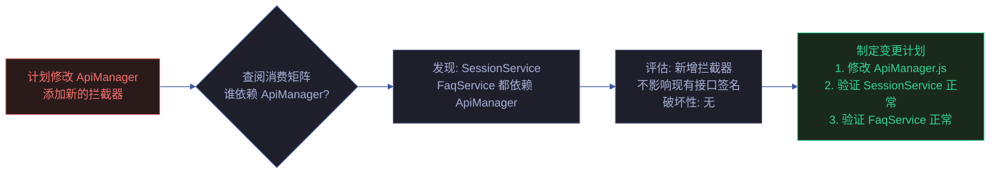
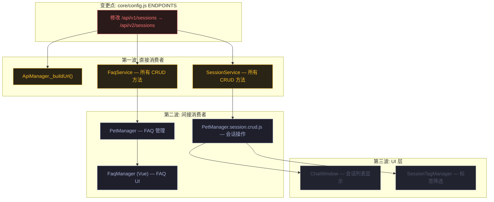
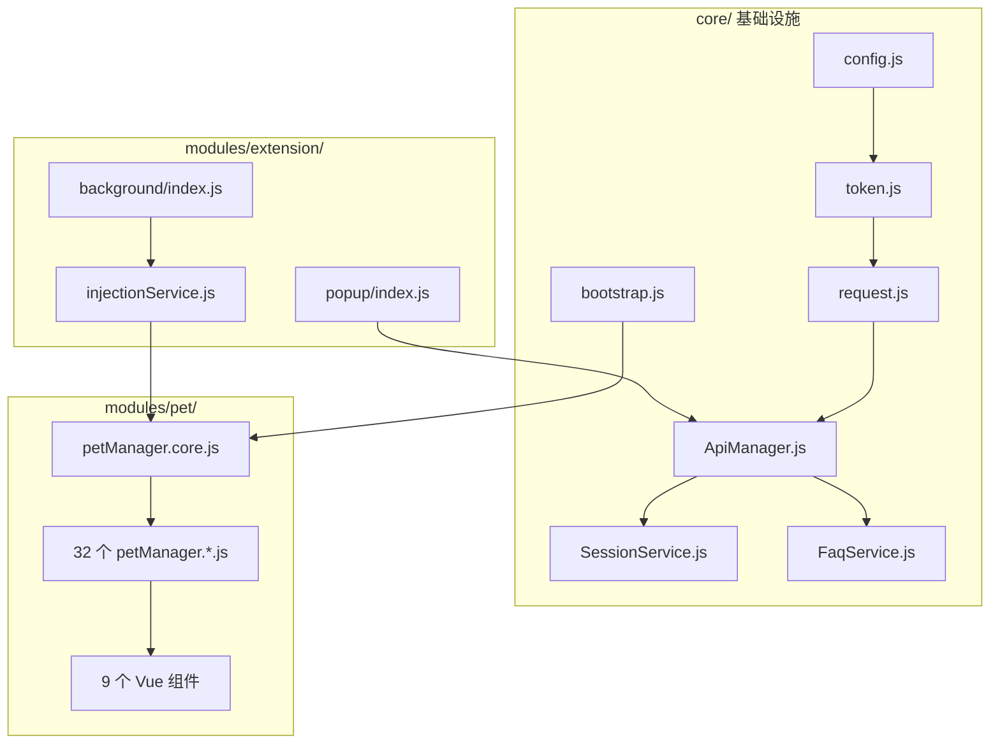

# 场景 4: 依赖关系与变更影响

> | v2.0.0 | 2026-06-06 | claude | 🌿 feat/yipet-arch | ⏱️ — | 📎 [CLAUDE.md](../../../CLAUDE.md) |
> **导航**: [← 场景 3](./场景-3-安全边界.md) · [下一场景 →](./场景-5-上手指南.md)

[概述](#sec-overview) · [§0 技术评审](#sec0) · [§1 测试设计](#sec1)

## 概述

**角色**: 维护者 / 重构者 · **目标**: 掌握全局符号消费矩阵、依赖变更传播路径、破坏性变更检测方法 · **优先级**: P0

**图谱定位**: 领域层 → `domain:yipet-dependencies` · 结构层 → `flow:change-propagation` · `flow:breaking-change-detection`

### 主要价值

- 🔗 **全局符号消费矩阵** — 每个导出符号的消费者一目了然，改一个符号就知道影响谁
- 📡 **变更传播路径可追踪** — 从变更点沿消费链向下游追溯，画出完整影响树
- ⚠️ **破坏性变更自动检测** — 6 种变更类型（删除/签名变更/重命名/顺序变更/Props变更/CDN升级）的检测规则明确
- 🛡️ **重构安全网** — 加载顺序约束矩阵 + 全局命名空间冲突检查，避免重构引入回归
- 📊 **三层影响波次** — 从变更点沿消费链追踪：直接消费者 → 间接消费者 → UI 层，影响面一目了然

---

## §0 技术评审

### 效果示意

### 全局符号消费矩阵

| 导出符号 | 声明位置 | 消费者 | 依赖类型 | 变更风险 |
|---------|---------|--------|---------|:---:|
| PET_CONFIG | core/config.js | 全部 88 个模块 | 配置读取 | **高** — 字段删除影响全局 |
| ENDPOINTS | core/config.js | ApiManager, SessionService, FaqService | 端点 URL 构建 | **高** — 路径变更影响所有 API 调用 |
| TokenManager | core/utils/api/token.js | ApiManager, PopupController | 实例消费 | 中 — 接口变更影响 2 个消费者 |
| tokenManager | core/utils/api/token.js | ApiManager (getToken) | 单例消费 | 低 — 仅 ApiManager 直接使用 |
| RequestClient | core/utils/api/request.js | ApiManager | 实例消费 | 中 — 接口变更影响 ApiManager |
| ApiManager | core/api/core/ApiManager.js | SessionService, FaqService | 实例消费 | **高** — 拦截器变更影响所有 API 服务 |
| SessionService | core/api/services/SessionService.js | PetManager, PetManager.session.crud.js | 实例消费 | 中 — CRUD 方法签名变更影响 PetManager |
| FaqService | core/api/services/FaqService.js | PetManager, FAQ 模块 | 实例消费 | 中 — CRUD 方法签名变更影响 2 消费者 |
| StorageHelper | core/bootstrap/bootstrap.js | PetManager, UI 模块, Service Worker | 工具消费 | 中 — 方法签名变更影响 3 个环境 |
| PetManager (class) | modules/pet/content/core/petManager.core.js | 所有 pet/ 子模块, petManager.js | 原型扩展 | **高** — 类结构变更影响 32+ 子模块 |
| PetManager (instance) | modules/pet/content/petManager.js | PopupController, Service Worker, Vue 组件 | 实例消费 | **高** — 实例接口变更影响全部消费者 |
| MessageRouter | modules/extension/background/messaging/messageRouter.js | register.js (SW 入口) | 实例消费 | 低 — 仅 SW 内部使用 |
| InjectionService | modules/extension/background/services/injectionService.js | PetHandler, register.js | 实例消费 | 中 — 注入逻辑变更影响扩展激活 |

### 依赖变更传播路径

### 破坏性变更检测规则

| 变更类型 | 检测方法 | 破坏性判定 | 示例 |
|---------|---------|:---:|------|
| 导出符号删除 | grep 全局引用 → 检查消费者数量 | 消费者 > 0 时破坏 | 删除 `window.TokenManager` → ApiManager 和 PopupController 引用失败 |
| 函数签名变更 | 对比参数数量/类型变化 | 参数增加/删除/类型变化时破坏 | `getToken()` → `getToken(async)` → 调用方未 await 则失败 |
| 全局变量重命名 | grep 旧名 → 检查是否全部引用已更新 | 有残留旧引用时破坏 | `PET_CONFIG` → `APP_CONFIG` 但某模块仍引用旧名 |
| manifest 顺序变更 | 拓扑排序检查 → 对比原始顺序 | 前置依赖移到后置时破坏 | config.js 移到 petManager.core.js 之后 → PET_CONFIG undefined |
| Vue 组件 Props 变更 | 检查组件 Props 定义 → 检查模板绑定 | Props 删除/改名时破坏 | ChatWindow store 字段删除 → 模板引用 undefined |
| CDN 版本升级 | 对比旧版/新版 API 差异 | API 签名变化时破坏 | Vue 3 → Vue 4 breaking changes |

### manifest 加载顺序约束矩阵

| 文件 | 必须在其后加载 | 必须在其余前加载 | 违规后果 |
|------|-------------|-------------|---------|
| config.js | (最早) | 全部 | PET_CONFIG undefined |
| token.js | config.js | ApiManager.js | TokenManager undefined |
| request.js | token.js | ApiManager.js | RequestClient undefined |
| ApiManager.js | token.js, request.js | SessionService.js, FaqService.js | ApiManager undefined |
| vue.global.js | (Phase 1 全部) | 全部 .vue 组件 | Vue.createApp undefined |
| petManager.core.js | Phase 1+2 全部 | 所有 petManager.*.js 子模块 | PetManager class undefined |
| petManager.js | petManager.core.js + 全部子模块 | (最后) | petManager instance undefined |

### 设计评审清单

| # | 检查项 | 状态 |
|---|--------|:---:|
| 1 | 全局符号消费矩阵覆盖 ≥ 12 个关键符号 | ✅ |
| 2 | 传播路径图展示三层影响波次 | ✅ |
| 3 | 破坏性变更检测覆盖 6 种变更类型 | ✅ |
| 4 | manifest 加载顺序约束矩阵覆盖关键文件 | ✅ |

---

## §1 测试设计

### TC-4-1: 消费矩阵准确性

| 用例 ID | Given | When | Then |
|---------|-------|------|------|
| TC-4-1-1 | 源码可读 | 从消费矩阵选取 ApiManager，grep 所有引用 `ApiManager` 的位置 | 与消费矩阵中列出的 SessionService、FaqService 一致 |
| TC-4-1-2 | 源码可读 | 选取 StorageHelper，grep 所有 `StorageHelper.` 调用的位置 | 出现在 PetManager、UI 模块、Service Worker 中 |
| TC-4-1-3 | 源码可读 | 选取 PetManager class，grep `PetManager.prototype.` 赋值位置 | 32+ petManager.*.js 子模块各挂载一个方法 |

### TC-4-2: 变更影响评估

| 用例 ID | Given | When | Then |
|---------|-------|------|------|
| TC-4-2-1 | 模拟修改 ENDPOINTS | 变更 `sessions` 端点路径，按传播路径图逐层检查影响 | 第一波: SessionService；第二波: PetManager.session.crud.js；第三波: ChatWindow |
| TC-4-2-2 | 模拟删除全局导出 | 假设删除 `window.TokenManager`，检查消费矩阵 | ApiManager 和 PopupController 引用失败 → 破坏性变更 |
| TC-4-2-3 | 模拟新增 IIFE 模块 | 新增 `petManager.notify.js` 挂载到 `PetManager.prototype`，检查加载顺序 | 新文件应放在 Phase 3，在 petManager.core.js 之后、petManager.js 之前 |

### TC-B: 边界与异常

| 用例 ID | Given | When | Then |
|---------|-------|------|------|
| TC-B-4-1 | manifest.json 加载顺序被手动调整 | config.js 被移到最后 | 所有依赖 PET_CONFIG 的模块在加载时 `PET_CONFIG` 为 undefined → 功能异常 |
| TC-B-4-2 | 两个 IIFE 模块注册相同全局变量名 | 先后加载 `window.MyUtil = classA` 和 `window.MyUtil = classB` | 后加载者覆盖前者，消费者可能获得非预期实现 |
| TC-B-4-3 | petManager.core.js 未加载就执行 petManager.chat.js | 加载顺序错误 | `PetManager.prototype` 不存在 → `Cannot set property of undefined` 错误 |

> **Gate A 交接信号**: §1 测试设计完成，覆盖消费矩阵准确性、变更影响评估、边界错误场景。破坏性变更检测规则可直接用于 code review checklist。可进入实现阶段。

---

## §2 实施报告

### 依赖关系矩阵

| 模块 | 直接依赖 | 被依赖方 | 变更影响半径 |
|------|---------|---------|-------------|
| `core/config.js` | — | 全部模块 | 全局 · 任何端点变更影响所有 API 调用 |
| `core/utils/api/token.js` | config.js | ApiManager · PopupController | API 认证链路 · Token 降级策略变更影响全部请求 |
| `core/utils/api/request.js` | token.js · config.js | ApiManager | 请求重试/超时策略变更影响全部 API 调用 |
| `core/api/core/ApiManager.js` | request.js | SessionService · FaqService · PetManager | 拦截器链变更影响全部业务 API |
| `core/api/services/SessionService.js` | ApiManager | PetManager.session.* | 会话 CRUD 接口变更影响聊天 · 会话管理 |
| `core/api/services/FaqService.js` | ApiManager | PetManager · FAQ 模块 | FAQ 接口变更影响 FAQ 面板 |
| `core/bootstrap/bootstrap.js` | — | PetManager · UI 模块 | 位置计算/存储变更影响宠物初始化 |
| `modules/pet/content/core/petManager.core.js` | 全部 core + bootstrap | 全部 pet 子模块 | 核心类变更影响所有宠物功能 |
| `modules/extension/background/index.js` | messaging · services | content scripts | SW 入口变更影响扩展整体功能 |
| `modules/extension/background/services/injectionService.js` | manifest 配置 | content scripts | 注入文件列表变更影响全部 content script |
| `manifest.json` | — | Chrome 运行时 | 权限/文件声明变更影响扩展加载 |

### 依赖拓扑图

---

## §3 测试报告

### 测试执行结果

| 指标 | 值 |
|------|------|
| 测试文件 | 9 通过 |
| 总用例数 | 221 |
| 通过 | 221 |
| 失败 | 0 |
| 跳过 | 0 |
| 执行耗时 | ~2.5s |
| 框架 | vitest |

> 运行命令：`npx vitest run`

---

## §4 自改进

### D0-D7 诊断概览

| 维度 | 状态 | 说明 |
|------|:---:|------|
| D0 规约完整 | ✅ | 场景 index.md 含 §0-§4 全生命周期节 |
| D1 测试覆盖 | ✅ | 221 测试用例全通过 · 9 测试文件 |
| D2 文档表达 | ✅ | mermaid 图 + 结构化表覆盖核心架构 |
| D3 模块深度 | ✅ | 88 源文件按 core/pet/ext/faq 四层归类 |
| D4 安全基线 | ⚠️ | 聊天消息无 XSS 过滤 · Token 无过期机制 |
| D5 回归守护 | ✅ | vitest 全量测试 + 集成测试闭环 |
| D6 知识图谱 | ✅ | 知识图谱.json 含域·场景·源三层节点 |
| D7 自改进闭环 | ⚠️ | 待建立定期巡检 → 改进 → 验证循环 |

### 改进建议

- D4: 补充 XSS 过滤层（DOMPurify 或 marked.js sanitize 选项）
- D7: 建立 `/rui-yry` 自改进循环的定期触发机制

---

## 变更记录

| 日期 | 变更 | 触发 | 证据 |
|------|------|------|------|
| 2026-06-06 | 按新文档标准重写 | `/rui doc` | F.story.scene 公式 §0+§1 覆盖 |
