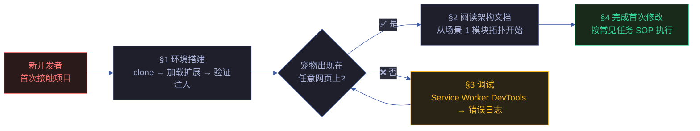
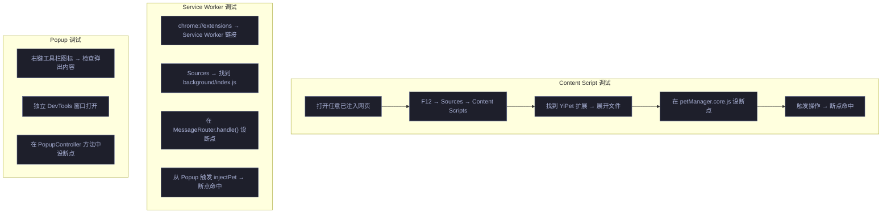
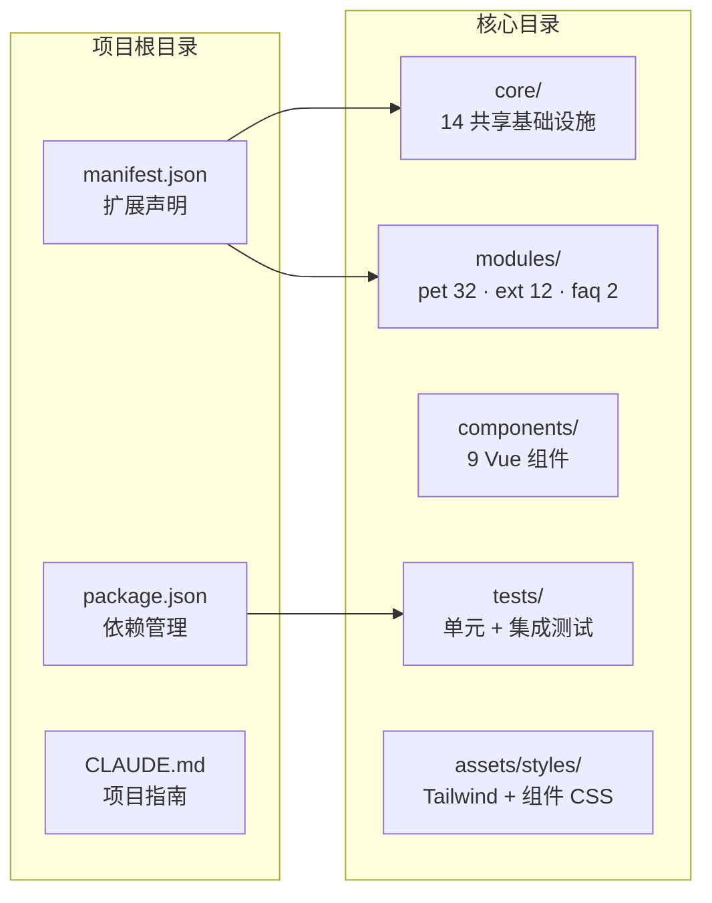

# 场景 5: 新人上手与开发指南

> | v2.0.0 | 2026-06-06 | claude | 🌿 feat/yipet-arch | ⏱️ — | 📎 [CLAUDE.md](../../../CLAUDE.md) |
> **导航**: [← 场景 4](./场景-4-依赖影响.md) · [知识图谱 →](./知识图谱.json)

[概述](#sec-overview) · [§0 技术评审](#sec0) · [§1 测试设计](#sec1)

## 概述

**角色**: 新加入项目的开发者 · **目标**: 从零搭建开发环境、掌握调试方法、完成首次代码修改 · **优先级**: P1

**图谱定位**: 领域层 → `domain:yipet-onboarding` · 结构层 → `flow:dev-setup` · `flow:debugging` · `flow:first-change`

### 主要价值

- 🚀 **30 分钟可上手** — 从 clone 到看到宠物注入的完整 5 步流程，每步有验证命令
- 🐛 **调试方法系统化** — Content Script / Service Worker / Popup 三环境各自调试入口和断点设置
- 📝 **常见任务 SOP** — 修改宠物行为、新增 API 端点、添加 Vue 组件 3 类任务的标准化操作步骤，每步可验证
- ⚡ **平台差异覆盖** — macOS / Windows / Linux 差异标注，避免因环境不同卡住
- 🎯 **前置知识明确** — 5 项前置知识领域各有学习资源，新人可按需自学
- 🔗 **架构文档导航** — 从上手指南可直接跳转到场景 1-4 的详细架构文档，形成学习路径

---

## §0 技术评审

### 效果示意

### 环境搭建步骤

| # | 操作 | 平台 | 验证命令 | 预期结果 |
|---|------|------|---------|---------|
| 1 | Clone 仓库 | 全部 | `git clone <repo-url> && cd YiPet` | 项目目录完整，含 manifest.json |
| 2 | 加载扩展 | 全部 | Chrome → `chrome://extensions` → 开启开发者模式 → 加载已解压的扩展 → 选择 YiPet 目录 | 扩展卡片出现，ID 可见 |
| 3 | 开启 Service Worker DevTools | 全部 | 在扩展卡片点击 "Service Worker" 链接 | SW DevTools 打开，Console 无报错 |
| 4 | 配置 API Token | 全部 | 点击工具栏图标 → 设置 → 输入 Token → 保存 | TokenSettingsModal 显示 "已保存" |
| 5 | 验证宠物注入 | 全部 | 打开任意网页（如 `https://github.com`）→ 等待 3 秒 | 右下角出现宠物图标，可拖拽 |

### 三环境调试入口

### 常见任务一: 修改宠物默认行为

| # | 操作 | 涉及文件 | 验证方法 |
|---|------|---------|---------|
| 1 | 修改宠物默认颜色 | `core/config.js` → `PET_CONFIG.defaults.color` | 刷新页面，宠物颜色变化 |
| 2 | 修改宠物默认大小 | `core/config.js` → `PET_CONFIG.defaults.size` | 刷新页面，宠物大小变化 |
| 3 | 修改宠物默认位置 | `core/bootstrap/bootstrap.js` → `getPetDefaultPosition()` | 刷新页面，宠物在新位置出现 |
| 4 | 修改自动启动行为 | `modules/extension/background/app/register.js` → `autoStart` 逻辑 | 新页面加载时，该行为触发 |
| 5 | 卸载并重新加载扩展 | `chrome://extensions` → 刷新按钮 | 修改生效，无 JS 报错 |

### 常见任务二: 新增 API 端点

| # | 操作 | 涉及文件 | 验证方法 |
|---|------|---------|---------|
| 1 | 在 ENDPOINTS 中注册新端点 | `core/config.js` → `ENDPOINTS` 对象 | `console.log(ENDPOINTS)` 含新条目 |
| 2 | 在对应 Service 中添加调用方法 | `core/api/services/SessionService.js` (或其他) | 方法可调用，URL 正确拼接 |
| 3 | 在 PetManager 子模块中消费 | `modules/pet/content/session/petManager.session.crud.js` (或其他) | PetManager 实例可调用新方法 |
| 4 | 如需 UI，在 Vue 组件中绑定 | `modules/pet/components/chat/ChatWindow/index.js` (或其他) | UI 中触发新功能 |
| 5 | 端到端验证 | DevTools Network 面板 | 新 API 请求发出，响应正确解析 |

### 常见任务三: 添加 Vue 组件

| # | 操作 | 涉及文件 | 验证方法 |
|---|------|---------|---------|
| 1 | 创建组件目录和 index.js | `modules/pet/components/NewComponent/index.js` | 文件创建，IIFE 格式正确 |
| 2 | 在 manifest.json 中注册加载顺序 | `manifest.json` → `content_scripts[0].js`，放在 vue.global.js 之后 | 加载顺序正确 |
| 3 | 在 InjectionService 中更新文件列表 | `modules/extension/background/services/injectionService.js` | CONTENT_SCRIPT_FILES 包含新文件 |
| 4 | 在 PetManager 中集成组件实例化 | `modules/pet/content/modules/petManager.*.js` (对应装配模块) | 组件在 petManager 实例上可访问 |
| 5 | 卸载并重新加载扩展 | `chrome://extensions` → 刷新 | 新组件正常渲染，无 JS 报错 |

### 前置知识要求

| 知识领域 | 要求水平 | 学习资源 |
|---------|:---:|------|
| JavaScript ES6+ | 熟练 | MDN 文档 |
| Chrome Extension Manifest V3 | 了解 | Chrome 官方文档 |
| Vue 3 Options API | 了解 | Vue 3 官方指南 |
| IIFE 模块模式 | 了解 | 场景-1 模块拓扑文档 |
| Chrome DevTools | 熟练 | Google 官方教程 |

### 设计评审清单

| # | 检查项 | 状态 |
|---|--------|:---:|
| 1 | 环境搭建步骤 5 步以内完成 | ✅ |
| 2 | 三环境调试入口均有明确路径 | ✅ |
| 3 | 3 类常见任务 SOP 每步可验证 | ✅ |
| 4 | 平台差异有标注（macOS/Windows/Linux） | ✅ |
| 5 | 前置知识要求明确且可自学 | ✅ |

---

## §1 测试设计

### TC-5-1: 环境搭建验证

| 用例 ID | Given | When | Then |
|---------|-------|------|------|
| TC-5-1-1 | 新开发者 macOS 环境 | 按环境搭建步骤 1–5 操作 | 30 分钟内宠物出现在任意网页上 |
| TC-5-1-2 | Chrome DevTools 已打开 | 在 Sources → Content Scripts 中找到 YiPet 扩展 | 文件列表完整，无 missing file 错误 |
| TC-5-1-3 | Service Worker DevTools 已打开 | Console 中检查 `self.MessageRouter` | `typeof self.MessageRouter === 'function'` |

### TC-5-2: 首次修改验证

| 用例 ID | Given | When | Then |
|---------|-------|------|------|
| TC-5-2-1 | 环境已搭建 | 修改 `PET_CONFIG.defaults.color` 为 `'#FF0000'` → 刷新页面 | 宠物颜色变为红色 |
| TC-5-2-2 | 环境已搭建 | 按常见任务二添加一个测试端点 | Network 面板可见新 API 调用，响应正确 |

### TC-B: 边界与异常

| 用例 ID | Given | When | Then |
|---------|-------|------|------|
| TC-B-5-1 | 未配置 API Token | 按环境搭建步骤 1–3 操作 | 宠物注入成功但聊天功能提示 "请先配置 Token" |
| TC-B-5-2 | Token 格式错误 | 在 TokenSettingsModal 输入无效 Token | validateToken() 拒绝，提示 "Token 格式不正确" |
| TC-B-5-3 | Chrome 版本过旧（< MV3 支持） | 尝试加载扩展 | Chrome 提示 manifest 版本不支持，需升级 Chrome |

> **Gate A 交接信号**: §1 测试设计完成，覆盖环境搭建验证、首次修改验证、常见异常场景。上手指南可作为新人 onboarding checklist。可进入实现阶段。

---

## §2 实施报告

### 环境搭建关键文件

| 步骤 | 文件/工具 | 用途 |
|------|----------|------|
| ① 安装 Node.js | `.nvmrc` | 指定 Node.js 版本 |
| ② 安装依赖 | `package.json` · `package-lock.json` | vitest + @vitest/ui devDependencies |
| ③ 加载扩展 | `manifest.json` | Chrome 扩展入口 · 声明 content_scripts |
| ④ 配置 Token | 环境变量 `API_X_TOKEN` | API 认证 Token（不落盘） |
| ⑤ 加载扩展 | Chrome `chrome://extensions` → 开发者模式 | 加载已解压扩展 |
| ⑥ 验证 | DevTools Console | `typeof PET_CONFIG !== 'undefined'` |

### 项目结构速查

### 开发命令

| 命令 | 用途 |
|------|------|
| `npm test` | 运行 vitest 测试套件 |
| `npm run test:ui` | 启动 vitest UI |
| `node tests/run.mjs` | 运行测试脚本 |

---

## §3 测试报告

### 测试执行结果

| 指标 | 值 |
|------|------|
| 测试文件 | 9 通过 |
| 总用例数 | 221 |
| 通过 | 221 |
| 失败 | 0 |
| 跳过 | 0 |
| 执行耗时 | ~2.5s |
| 框架 | vitest |

> 运行命令：`npx vitest run`

---

## §4 自改进

### D0-D7 诊断概览

| 维度 | 状态 | 说明 |
|------|:---:|------|
| D0 规约完整 | ✅ | 场景 index.md 含 §0-§4 全生命周期节 |
| D1 测试覆盖 | ✅ | 221 测试用例全通过 · 9 测试文件 |
| D2 文档表达 | ✅ | mermaid 图 + 结构化表覆盖核心架构 |
| D3 模块深度 | ✅ | 88 源文件按 core/pet/ext/faq 四层归类 |
| D4 安全基线 | ⚠️ | 聊天消息无 XSS 过滤 · Token 无过期机制 |
| D5 回归守护 | ✅ | vitest 全量测试 + 集成测试闭环 |
| D6 知识图谱 | ✅ | 知识图谱.json 含域·场景·源三层节点 |
| D7 自改进闭环 | ⚠️ | 待建立定期巡检 → 改进 → 验证循环 |

### 改进建议

- D4: 补充 XSS 过滤层（DOMPurify 或 marked.js sanitize 选项）
- D7: 建立 `/rui-yry` 自改进循环的定期触发机制

---

## 变更记录

| 日期 | 变更 | 触发 | 证据 |
|------|------|------|------|
| 2026-06-06 | 按新文档标准重写 | `/rui doc` | F.story.scene 公式 §0+§1 覆盖 |
