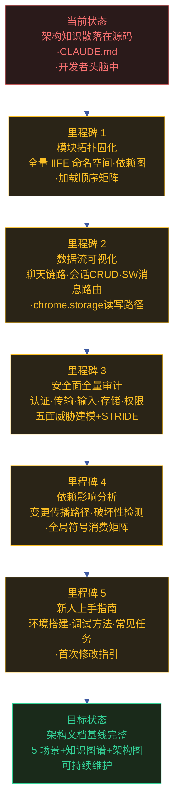

# yipet-arch — 项目技术架构故事

> | v2.0.0 | 2026-06-06 | claude | 🌿 feat/yipet-arch | ⏱️ — | 📎 [CLAUDE.md](../../../CLAUDE.md) |
> **来源引用**: 本项目由 `/rui init` 的 arch 阶段生成，基于 [CLAUDE.md](../../../CLAUDE.md) 中的模块地图、数据流、安全面分析。项目类型: frontend (Chrome Extension Manifest V3)。
> **导航**: [场景 1: 模块拓扑 →](./场景-1-模块拓扑.md)

[需求概述](#sec-overview) · [效果示意](#sec-vision) · [主要价值](#sec-value) · [§1 Story](#sec1) · [§2 Requirements](#sec2) · [§3 成功标准](#sec3) · [§4 范围边界](#sec4) · [§5 AC](#sec5) · [§6 风险与假设](#sec6) · [§7 跨文档索引](#sec7)

### 需求概述

系统架构知识固化项目，将 YiPet Chrome Extension 的全量模块拓扑、数据流追踪、信任边界、依赖变更影响及新人上手指南固化为结构化文档基线。覆盖 content-script 注入层（88 个 JS 文件）、service-worker 后台层、popup 控制面板层、Vue 3 CDN 组件层的完整技术画像。所有架构知识以 mermaid 图优先、表格为辅的方式呈现，确保新人可独立理解系统全貌、开发者可快速定位模块边界、安全审计者可追溯全量信任面。

### 效果示意

### 主要价值

- 🗺️ **模块拓扑可视化** — 将 88 个 JS 文件的 IIFE 命名空间、加载顺序、依赖关系以 mermaid 拓扑图呈现，一眼看清全局
- 🔍 **数据流全链路追踪** — 从用户输入到 API 端点、从 chrome.storage 读写到 Service Worker 消息路由，完整序列图覆盖
- 🔒 **安全面五维审计** — 认证/传输/输入/存储/权限五个维度独立审计，每个信任边界标注风险等级和缓解措施
- 📊 **依赖影响可量化** — 全局符号消费矩阵 + 变更传播路径图，任一模块变更时能快速评估影响面
- 🚀 **新人快速上手** — 从环境搭建到首次修改的完整指引，降低 onboarding 成本

---

## §1 Story

### Story 1: 模块地图与拓扑

| 字段 | 内容 |
|------|------|
| 作为 | 架构师 / 新加入的开发者 |
| 我想要 | 一张覆盖全量模块的拓扑图，包含 IIFE 命名空间模式、加载顺序依赖、全局符号导出矩阵 |
| 以便 | 理解系统骨架，快速定位模块边界，避免因加载顺序错误引入隐蔽 bug |
| 优先级 | P0 |
| 范围边界 | 只读源码，映射 manifest.json 中 `content_scripts[0].js` 的 88 个文件到拓扑层级 |
| 依赖 | manifest.json 可读取，源码文件结构不变 |

#### 范围外

- 不涉及源码修改或重构建议
- 不评估模块设计质量（由场景 4 覆盖）

#### §1.1 User Operations

| # | 操作 | 触发条件 | 操作步骤 | 预期结果 |
|---|------|---------|---------|---------|
| 1 | 查看模块全景拓扑 | 开发者想理解系统结构 | 打开 场景-1-模块拓扑.md → 阅读 §0 模块全景拓扑图 | 看到 core/pet/extension/faq 四层模块的完整 mermaid 图，含各子模块的职责标注 |
| 2 | 验证全局符号存在性 | 调试时怀疑某模块未加载 | 按场景-1 §1 测试设计中的验证矩阵，在 DevTools Console 执行检查命令 | `typeof PET_CONFIG !== 'undefined'`，全部关键符号可访问 |
| 3 | 检查 manifest 加载顺序 | 新增 content-script 文件后 | 对照场景-1 中的 Content Script 加载顺序图，确认新文件位置 | 新文件在正确的阶段（phase 1/2/3）且不破坏已有依赖顺序 |

---

### Story 2: 数据流与追踪

| 字段 | 内容 |
|------|------|
| 作为 | 后端对接者 / 调试问题的开发者 |
| 我想要 | 从用户输入到 API 端点的完整数据流序列图，覆盖聊天请求、会话 CRUD、FAQ 查询、Service Worker 消息路由、chrome.storage 读写路径 |
| 以便 | 追踪请求链路定位问题，理解消息通道的异步流转机制 |
| 优先级 | P0 |
| 范围边界 | 只读源码，追踪 6 条核心数据流路径 |
| 依赖 | Story 1 完成（需理解模块消费关系） |

#### 范围外

- 不涉及性能优化或流式响应协议变更
- 不生成性能基准数据

#### §1.1 User Operations

| # | 操作 | 触发条件 | 操作步骤 | 预期结果 |
|---|------|---------|---------|---------|
| 1 | 追踪聊天请求完整链路 | 用户发送聊天消息无响应 | 按场景-2 §0 聊天请求序列图逐节点检查：ChatInput → PetManager → AI API → ApiManager → TokenManager → RequestClient → fetch → API | 在任一环节定位失败点，序列图标注了每个节点的数据格式和错误模式 |
| 2 | 理解 chrome.storage 读写守卫 | storage 操作返回 contextInvalidated | 阅读场景-2 §0 存储读写路径图，确认 isChromeStorageAvailable / isQuotaError / cleanupOldData 三级守卫 | 理解守卫触发条件和降级行为 |
| 3 | 排查 Service Worker 消息路由 | Popup 按钮不生效 | 阅读场景-2 §0 SW 消息路由序列图，按 action → MessageRouter → Handler 链路排查 | 确认消息 action 是否注册、Handler 是否正确处理 |

---

### Story 3: 信任边界与安全面

| 字段 | 内容 |
|------|------|
| 作为 | 安全审计者 / code reviewer |
| 我想要 | 识别全量信任边界并覆盖认证、传输、输入、存储、权限五个安全面的威胁建模 |
| 以便 | 安全漏洞有系统化的检测清单，每次变更可回归安全面 |
| 优先级 | P0 |
| 范围边界 | 只读源码 + manifest 权限声明，覆盖 5 安全面 + STRIDE 六类威胁 |
| 依赖 | Story 2 完成（需理解数据流中的安全节点） |

#### 范围外

- 不执行渗透测试或动态安全扫描
- 不修改任何安全机制代码

#### §1.1 User Operations

| # | 操作 | 触发条件 | 操作步骤 | 预期结果 |
|---|------|---------|---------|---------|
| 1 | 审计认证面 | 新增 API 端点前 | 阅读场景-3 §0 TokenManager 三级降级图 + 安全面总览矩阵 | 确认 Token 获取链路无明文落盘风险，validateToken 格式校验生效 |
| 2 | 审计输入面 | 用户报告可疑消息显示 | 阅读场景-3 §0 输入面风险标注图，检查 4 个输入入口的处理现状 | 识别 P0 缺口: 聊天消息无 XSS 过滤；P1 缺口: 会话标题无长度限制 |
| 3 | 验证系统页面跳过 | 扩展在 chrome:// 页面报错 | 执行场景-3 §1 TC-3-3 测试用例 | isSystemPage() 正确识别 chrome://、chrome-extension://、about: 页面并跳过注入 |

---

### Story 4: 依赖关系与变更影响

| 字段 | 内容 |
|------|------|
| 作为 | 维护者 / 重构者 |
| 我想要 | 全局符号消费矩阵 + 依赖变更传播路径图，明确破坏性变更的检测方法 |
| 以便 | 任一模块变更时可快速评估影响面，避免因不了解消费关系导致线上故障 |
| 优先级 | P0 |
| 范围边界 | 只读源码，分析 IIFE 全局符号间的生产-消费关系 + manifest 加载顺序约束 |
| 依赖 | Story 1 完成（需模块拓扑作为输入） |

#### 范围外

- 不执行实际重构操作
- 不生成自动化依赖检查脚本

#### §1.1 User Operations

| # | 操作 | 触发条件 | 操作步骤 | 预期结果 |
|---|------|---------|---------|---------|
| 1 | 评估 API 端点变更影响 | Endpoints 常量修改时 | 查阅场景-4 §0 依赖传播路径图，从变更符号出发沿消费链追踪 | 列出所有受影响的模块和功能点，评估是否为破坏性变更 |
| 2 | 检测新增文件对加载顺序的影响 | 新增 content-script 文件时 | 对照场景-4 §0 manifest 加载顺序约束矩阵 | 确认新文件不破坏 Phase 1→2→3 的加载顺序，所有依赖在其前加载 |
| 3 | 全局命名空间冲突检查 | 新增 IIFE 模块时 | 查阅场景-4 §0 全局符号矩阵，确认新符号不与现有符号冲突 | 新符号命名唯一，不覆盖已有 `window.X` 声明 |

---

### Story 5: 新人上手与开发指南

| 字段 | 内容 |
|------|------|
| 作为 | 新加入项目的开发者 |
| 我想要 | 从零搭建开发环境、掌握调试方法、完成首次代码修改的端到端指引 |
| 以便 | 降低 onboarding 成本，独立完成第一个 bug 修复或小功能 |
| 优先级 | P1 |
| 范围边界 | 覆盖环境搭建、调试方法、常见开发任务 3 类指引 |
| 依赖 | Story 1–4 完成（指南引用前 4 个场景的架构知识） |

#### 范围外

- 不替代 README.md 中的项目说明
- 不覆盖 Chrome Extension 上架审核流程

#### §1.1 User Operations

| # | 操作 | 触发条件 | 操作步骤 | 预期结果 |
|---|------|---------|---------|---------|
| 1 | 搭建开发环境 | 新开发者首次 clone 仓库 | 按场景-5 §0 环境搭建步骤执行：clone → 加载扩展 → 打开 Service Worker DevTools → 验证宠物注入 | 宠物出现在任意网页上，DevTools Console 无报错 |
| 2 | 调试 content script | 宠物行为异常 | 按场景-5 §0 调试方法：打开页面 DevTools → Sources → Content Scripts → 设断点 → 触发操作 | 断点命中，可检查 PetManager 实例状态 |
| 3 | 完成首次修改 | 接到第一个 bug 任务 | 按场景-5 §0 常见任务中的 "修改宠物默认行为" 步骤操作 | 修改生效，宠物按新行为展示 |

---

## §2 Requirements

### 功能点

| FP# | 描述 | 输入 | 输出 | 错误行为 | 优先级 |
|-----|------|------|------|---------|--------|
| FP1 | 模块拓扑识别 — 将全量 JS 文件按 core/pet/extension/faq 四层归类并绘制 mermaid 拓扑图 | manifest.json + 源码目录 | mermaid flowchart 含 4 子图 + 层级依赖箭头 | 文件路径不存在时标注缺失 | P0 |
| FP2 | IIFE 命名空间分析 — 提取每个模块的注册方式、命名空间、导出符号、消费关系 | 源码 IIFE 模式扫描 | 模块注册与消费关系表（≥15 行） | IIFE 模式不匹配时标注为「非常规」 | P0 |
| FP3 | 加载顺序依赖图 — 基于 manifest.json `content_scripts[0].js` 数组构建三阶段加载树 | manifest.json | mermaid flowchart 分 Phase 1/2/3 + 阶段间依赖箭头 | 循环依赖时阻断并标注 | P0 |
| FP4 | 聊天请求链路追踪 — 用户消息 → ChatInput → PetManager → ApiManager → fetch → API 的完整序列图 | 源码阅读 | mermaid sequenceDiagram 含 14 个参与方 + 流式响应 loop | 链路中断时标注断点 | P0 |
| FP5 | chrome.storage 读写路径分析 — 识别所有写入者/读取者 + 存储 Key 清单 + 配额守卫机制 | 源码中的 chrome.storage.local 调用 | mermaid flowchart (writers→store→readers) + Key 表格 | 守卫失效场景标注为风险 | P0 |
| FP6 | Service Worker 消息路由 — injectPet / forwardToContentScript / settingsUpdated 等 action 的路由图 | background/index.js + register.js | mermaid sequenceDiagram + 消息通道全景表（6 通道） | 未注册 action 标注 | P0 |
| FP7 | TokenManager 降级链路 — L1(环境变量) → L2(storage) → L3(空) 三级回退机制 | token.js | mermaid flowchart + 降级表 | 所有级别失效时返回空 Token | P0 |
| FP8 | 输入面安全审计 — 聊天消息/Token 设置/FAQ 编辑/会话标题/AI 设置 5 个入口的安全现状 | 源码扫描用户输入路径 | 输入风险标注图 + 风险清单（≥4 项） | 无校验的入口标注为 P0 风险 | P0 |
| FP9 | 系统页面跳过机制 — isSystemPage() 对 chrome:// / chrome-extension:// / about: 等 URL 的判断逻辑 | isSystemPage 实现 + URLS 常量 | mermaid flowchart + 测试用例表 | 漏判导致系统页面注入时标注为 P0 bug | P0 |
| FP10 | 全局符号消费矩阵 — 每个导出符号的消费者清单，任一符号变更可追溯到受影响模块 | IIFE 全局赋值 + window.X 引用扫描 | 全局导出验证矩阵表（≥10 行） | 消费者不可达时标注 | P0 |
| FP11 | 依赖变更传播路径 — 从 manifest 声明顺序 + IIFE 消费关系到变更影响传播的有向图 | 模块拓扑 + 消费关系 | 传播路径描述 + 破坏性变更检测规则 | 传播环路标注 | P0 |
| FP12 | 开发环境搭建指引 — 仓库 clone → 扩展加载 → DevTools 开启 → 验证注入的完整步骤 | — | 编号操作步骤（≥5 步）+ 每步验证命令 | 步骤不可执行时阻断 | P1 |
| FP13 | 常见开发任务指引 — 修改宠物默认行为、新增 API 端点、添加 Vue 组件 3 类任务的 SOP | — | 每任务编号步骤 + 涉及文件清单 + 验证方法 | 步骤不可执行时阻断 | P1 |

### 业务规则

| R# | 描述 | 校验方式 | 证据级别 |
|----|------|---------|---------|
| R1 | 所有架构图必须 mermaid 优先，不可降级为大段文字 | 每场景 §0 检查 mermaid fenced 块数量 ≥ 2 | B |
| R2 | 每个安全面必须标注现状评级 + 已知缺口 + 优先级 | 检查场景-3 §0 安全面总览矩阵的 5 行完整性 | B |
| R3 | 每条数据流序列图必须覆盖至少 5 个参与方 | 检查 mermaid sequenceDiagram participant 数量 | B |
| R4 | 模块拓扑必须区分基础设施(core)、宠物主模块(pet)、扩展后台(ext)、FAQ 模块(faq)四个层次 | 检查 mermaid subgraph 数量 ≥ 4 | B |
| R5 | 每个断言必须附源码路径证据或标注「待补充」 | grep 检查 `> 证据:` 或 `> 待补充` 模式 | B |
| R6 | 场景文档按 N 从 1 开始递增，命名 `场景-N-<slug>.md` | 文件名正则匹配 `^场景-\d+-[a-z-]+\.md$` | A |
| R7 | 文档间通过 F.nav 前驱/后继链接，不可断链 | 逐文档验证导航链接的相对路径可达 | A |

### 数据约束

| 约束 | 类型 | 范围/格式 | 来源 |
|------|------|----------|------|
| 故事名称 | string | `yipet-arch` (kebab-case) | 项目名 `YiPet` + init arch 约定 |
| 场景数量 | integer | ≥ 4（模块拓扑 · 数据流 · 安全 · 依赖影响 · 上手） | F.story.scene 覆盖要求 |
| 模块拓扑层次 | enum | core / pet / extension / faq | CLAUDE.md 模块地图 |
| 安全面维度 | enum | 认证 / 传输 / 输入 / 存储 / 权限 | 安全审计 STRIDE 映射 |
| 加载阶段 | enum | Phase 1 (基础设施) / Phase 2 (第三方库+工具) / Phase 3 (PetManager+组件) | manifest.json content_scripts 声明顺序 |

---

## §3 成功标准

| SC# | 描述 | 度量方式 | 目标值 | 优先级 | 关联 FP# |
|-----|------|---------|--------|--------|---------|
| SC1 | 新开发者可通过文档独立理解系统全貌 | 阅读 5 个场景文档后能正确回答 10 个架构问题（模块归属/数据流路径/安全机制） | 正确率 ≥ 80% | P0 | FP1–FP13 |
| SC2 | 任一模块变更时可在 5 分钟内评估影响面 | 从全局符号消费矩阵出发，沿消费链追踪到所有受影响模块 | 覆盖率 100%（所有消费者被列出） | P0 | FP10, FP11 |
| SC3 | 每个安全面有明确的现状评级和已知缺口清单 | 安全审计者可对照场景-3 安全面总览矩阵逐项检查 | 5 个安全面全部覆盖，缺口项有优先级标注 | P0 | FP7–FP9 |
| SC4 | 每条核心数据流有完整的序列图可追踪 | 聊天/会话/FAQ/SW 消息/storage 5 条数据流均有 mermaid sequenceDiagram | 5/5 覆盖 | P0 | FP4–FP6 |
| SC5 | 新人可在 30 分钟内完成环境搭建并看到宠物注入 | 按场景-5 步骤操作并计时 | ≤ 30 分钟 | P1 | FP12 |
| SC6 | 文档基线全部通过 P0 检查清单 | 执行 formulas.md P0 检查清单 12 项 | 全部通过 | P0 | FP1–FP13 |

---

## §4 范围边界

### 范围内

| # | 条目 | 关联 FP# | 边界说明 |
|---|------|---------|---------|
| 1 | 模块拓扑与 IIFE 命名空间映射 | FP1, FP2, FP3 | 覆盖 manifest.json 声明的全部 JS 文件，含 content script / service worker / popup 三环境 |
| 2 | 核心数据流序列图 | FP4, FP5, FP6 | 聊天链路 · 会话 CRUD · FAQ 查询 · SW 消息路由 · chrome.storage 读写 |
| 3 | 安全面五维审计 + STRIDE 威胁建模 | FP7, FP8, FP9 | 认证/传输/输入/存储/权限，含 TokenManager 降级、输入风险、系统页面跳过 |
| 4 | 依赖影响分析与破坏性变更检测 | FP10, FP11 | 全局符号消费矩阵 + manifest 加载顺序约束 |
| 5 | 新人上手指南 | FP12, FP13 | 环境搭建 · 调试方法 · 3 类常见任务 SOP |
| 6 | 知识图谱结构化 | — | ≥ 1 domain + ≥ 1 flow + ≥ 3 steps |

### 范围外

| # | 条目 | 排除原因 | 替代方案 |
|---|------|---------|---------|
| 1 | 源码修改或重构 | 架构文档是只读分析，不涉及代码变更 | 使用 `/rui code <name>` |
| 2 | 性能基准数据 | 需实际运行环境采集 | 后续 story 补充 |
| 3 | Vue 组件内部实现细节 | 组件数量多且频繁变更，超出架构固化范围 | 查看组件源码 `modules/pet/components/` |
| 4 | 第三方库（Mermaid/Marked/Turndown）源码分析 | 第三方库不属本项目管理范围 | 查阅对应官方文档 |
| 5 | Chrome Web Store 上架流程 | 属于发布运维范畴 | 查阅 Chrome Extension 官方文档 |
| 6 | 自动化架构检查脚本 | 属于工具链建设，非文档基线范畴 | 后续独立 story |

---

## §5 AC

| AC# | Given | When | Then | 门禁 |
|-----|-------|------|------|------|
| AC1 | 开发者打开场景-1-模块拓扑.md | 阅读 §0 模块全景拓扑图 | 看到 core/pet/extension/faq 四层 subgraph，含各模块文件数量标注和层间依赖箭头 | Gate A |
| AC2 | 开发者打开场景-2-数据流追踪.md | 阅读 §0 聊天请求完整链路序列图 | 看到 14 个参与方的完整序列图 (User → ChatUI → PetManager → ... → API)，含流式响应 loop 块 | Gate A |
| AC3 | 安全审计者打开场景-3-安全边界.md | 阅读 §0 安全面总览矩阵 | 看到 5 安全面 × 5 列（保护机制/现状评级/已知缺口/优先级）的完整矩阵 | Gate A |
| AC4 | 维护者计划修改 ApiManager | 查阅场景-4-依赖影响.md §0 全局符号消费矩阵 | 找到 ApiManager 的消费者清单 (SessionService, FaqService)，确认影响面 | Gate A |
| AC5 | 新开发者首次 clone 仓库 | 按场景-5-上手指南.md §0 步骤执行环境搭建 | 30 分钟内宠物出现在任意网页上 | Gate B |
| AC6 | 任一场景文档被修改 | 执行 F.nav 断链检查 | 所有导航链接指向的 .md 文件存在且路径正确 | Gate A |
| AC7 | 全部文档基线生成完成 | 执行 P0 检查清单 12 项 | 全部通过 | Gate B |

---

## §6 风险与假设

| # | 风险/假设 | 类型 | 可能性 | 影响 | 缓解/验证策略 | 关联 FP# |
|---|----------|------|--------|------|-------------|---------|
| 1 | manifest.json content_scripts 声明顺序与 IIFE 实际依赖不一致导致加载顺序图有误 | 风险 | L | H | 逐文件检查 IIFE 头部 `typeof window.X === 'undefined'` 守卫，交叉验证依赖声明 | FP3 |
| 2 | 源码中全局变量引用方式不统一（window.X vs self.X vs globalThis.X）导致消费矩阵遗漏 | 风险 | M | M | 多模式 grep: `window\.` `self\.` `globalThis\.` + 手动验证关键符号 | FP10 |
| 3 | Vue 3 CDN 版本升级导致组件行为变化但架构文档未更新 | 风险 | M | M | 场景-4 中标注 CDN 版本依赖，版本变更时触发 update | FP11 |
| 4 | 新开发者环境差异（macOS vs Windows vs Linux）导致上手指南步骤不适用 | 风险 | M | L | 步骤中区分平台特定操作（标注 macOS/Linux/Windows 差异） | FP12 |
| 5 | 安全审计仅基于静态源码分析，无法发现运行时安全漏洞 | 风险 | H | M | 场景-3 安全面总览矩阵中标注「静态分析」范围，运行态缺口列为待补充 | FP7–FP9 |
| 6 | Chrome Extension Manifest V3 策略变更导致部分权限声明失效 | 风险 | L | H | 场景-3 权限面中标注 MV3 版本依赖，Chrome 大版本升级时触发审查 | FP9 |
| 7 | 源码结构不包含循环依赖，IIFE 加载顺序设计合理 | 假设 | — | — | 通过拓扑排序验证 manifest.json 声明顺序无循环 | FP3 |
| 8 | 开发者具备 Chrome Extension 基础知识和 JavaScript IIFE 模式理解 | 假设 | — | — | 场景-5 前置知识要求中明确列出 | FP12 |

---

## §7 跨文档索引

| 本文档章节 | 基线内容 | 下游文档编号 | 预期覆盖 | 状态 |
|-----------|---------|-------------|---------|:---:|
| Story 1: 模块拓扑 | 全量模块归类 + IIFE 模式 + 加载顺序 | 场景-1-模块拓扑.md | §0 模块全景拓扑图 + IIFE 命名空间图 + 加载阶段图 | 待生成 |
| Story 2: 数据流 | 聊天链路 + 会话 CRUD + SW 消息路由 + storage 读写 | 场景-2-数据流追踪.md | §0 4 条 mermaid sequenceDiagram + 消息通道全景图 | 待生成 |
| Story 3: 安全面 | 认证/传输/输入/存储/权限五维审计 | 场景-3-安全边界.md | §0 5 张 mermaid 安全图 + 安全面总览矩阵 | 待生成 |
| Story 4: 依赖影响 | 全局符号消费矩阵 + 变更传播路径 | 场景-4-依赖影响.md | §0 消费矩阵表 + 传播路径图 + 破坏性检测规则 | 待生成 |
| Story 5: 上手指南 | 环境搭建 + 调试 + 常见任务 | 场景-5-上手指南.md | §0 编号操作步骤 + 验证命令 + 平台差异标注 | 待生成 |
| §2 Requirements | FP1–FP13 + R1–R7 | 知识图谱.json | nodes: domain≥1 + flow≥1 + step≥3 | 待生成 |

---

## 变更记录

| 日期 | 变更 | 触发 | 证据 |
|------|------|------|------|
| 2026-06-06 | 按新文档标准 (formulas.md v4.1.1) 重写全部内容 | `/rui doc` — 用户要求使用新标准重写 | F.story.task 公式全章节覆盖 |
