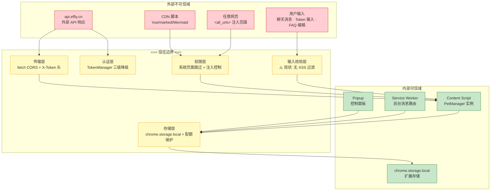
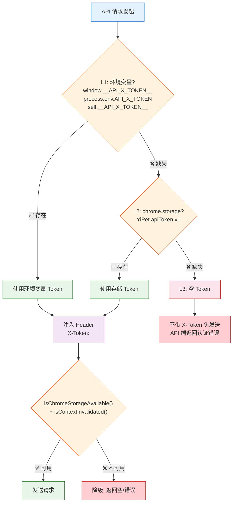
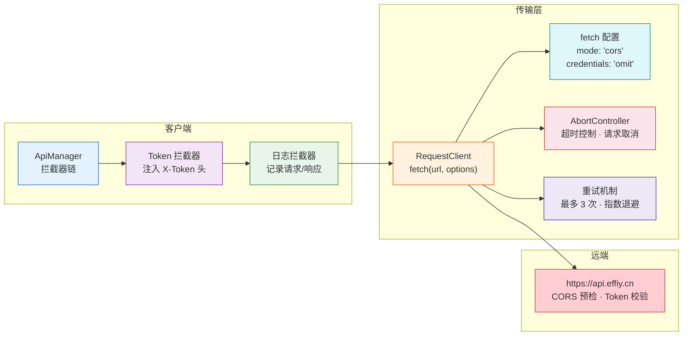
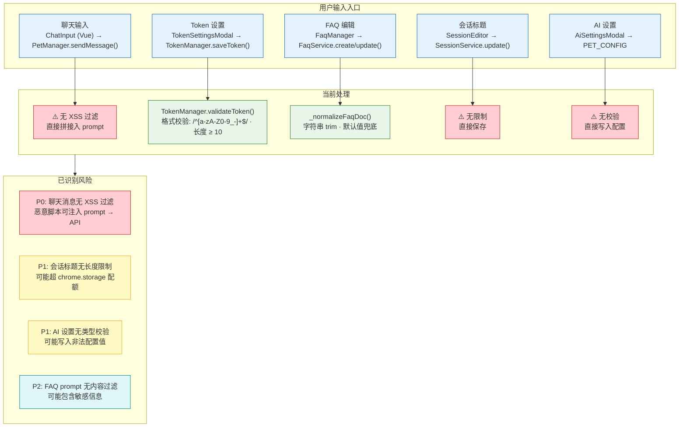
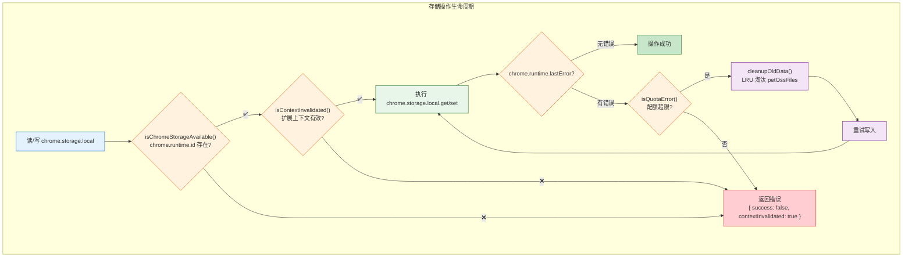
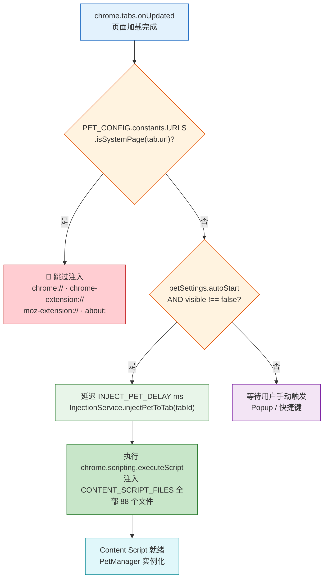

# 场景 3: 信任边界与安全面

> | v1.0.0 | 2026-06-02 | coder | 🌿 feat/yipet-arch | 📎 [CLAUDE.md](../../../CLAUDE.md) |
> **导航**: [← 场景 2](./场景-2-数据流追踪.md) · [下一场景 →](./场景-4-依赖影响.md)

[概述](#概述) · [§0 技术评审](#sec0) · [§1 测试设计](#sec1)

## 概述

**角色**: 安全审计者/开发者 · **目标**: 识别全量信任边界，覆盖认证、传输、输入验证、存储、权限五大安全面 · **优先级**: P0

---

## §0 技术评审

### 信任边界全景图

### 认证面: TokenManager 三级降级

| 降级级 | 来源 | 获取方式 | 时序 | 失败后行为 |
|:---:|------|---------|:---:|-----------|
| L1 | 环境变量 | `window.__API_X_TOKEN__`, `process.env.API_X_TOKEN`, `self.__API_X_TOKEN__` | 同步 | 降级到 L2 |
| L2 | chrome.storage.local | `chrome.storage.local.get(['YiPet.apiToken.v1'])` | 异步 | 降级到 L3 |
| L3 | 空 Token | 返回 `''` | 同步 | 请求不带 `X-Token` 头，API 返回认证错误 |

### 传输面: 请求链路安全

| 安全机制 | 实现位置 | 详情 | 风险 |
|---------|---------|------|------|
| CORS | RequestClient 默认 `mode: 'cors'` | 浏览器强制执行同源策略 | 依赖服务端正确配置 CORS 头 |
| Token 注入 | ApiManager._setupDefaultInterceptors | 请求拦截器自动注入 `X-Token` 头 | Token 被 XSS 窃取后可被利用 |
| Credentials 隔离 | RequestClient 默认 `credentials: 'omit'` | 不发送同源 cookie | — |
| 超时控制 | RequestClient.request → AbortController + setTimeout | 默认 30s 超时 | 超时后需正确处理流式响应残留 |
| 重试保护 | RequestClient._fetchWithRetry | 网络错误/超时最多重试 3 次，指数退避 | 幂等性不保证（POST 重试可能重复） |
| 请求去重 | PET_CONFIG.TIMING.REQUEST_DEDUP_WINDOW | 5s 窗口内去重 | — |

### 输入面: 用户输入路径（风险标注）

> **关键风险**: 用户聊天消息目前未经过任何 XSS 过滤，直接通过 `petManager.ai.prompt.js` 的 `buildPrompt()` 方法拼接入请求 body，然后通过 `fetch` 发送到 `api.effiy.cn`。虽然攻击面主要在 API 端（需服务端做输入校验），但 content script 缺乏前端输入过滤层是一道防御缺失。

### 存储面: chrome.storage.local 安全

| 存储 Key | 内容 | 敏感性 | 持久化 | 清理策略 |
|---------|------|:---:|:---:|---------|
| `YiPet.apiToken.v1` | API Token | **高** | 持久 | 手动清除 |
| `pet_global_state` | 宠物可见/颜色/大小/位置 | 低 | 持久 | 过期位置按 `STORAGE_CLEANUP_AGE` (7d) 清理 |
| `pet_chat_window_state` | 聊天窗口位置/大小 | 低 | 持久 | 同上 |
| `petSettings` | 用户设置 | 低 | 持久 | — |
| `petDevMode` | 开发模式开关 | 低 | 持久 | — |
| `petOssFiles` | OSS 文件列表 | 低 | 可重建 | **配额超限时优先清理** |
| `petPosition_<url>` | 按页面 URL 的宠物位置 | 低 | 持久 | SW 定时清理过期数据 |

### 权限面: `<all_urls>` 系统页面跳过

| 权限 | 声明 | 用途 | 风险 | 缓解 |
|------|------|------|------|------|
| `storage` | manifest | chrome.storage.local 读写 | 仅扩展自身数据，无跨扩展风险 | — |
| `tabs` | manifest | 标签页查询/操作 | 可读取任意标签页 URL | 最小必要原则 |
| `scripting` | manifest | 动态注入 content script | 可在任意页面执行脚本 | 系统页面跳过检查 |
| `webRequest` | manifest | 网络请求监控 | 可监听所有网络请求 | 仅用于 API 请求记录 |
| `<all_urls>` | host_permissions | content script 全站注入 | **最大风险**: 所有网页均可注入 | `isSystemPage()` 跳过 + manifest `matches` 限制 |

### 安全面总览矩阵

| 安全面 | 保护机制 | 现状评级 | 已知缺口 | 优先级 |
|--------|---------|:---:|------|:---:|
| 认证 | TokenManager 三级降级 + validateToken 格式校验 | 良好 | Token 无过期机制 | P2 |
| 传输 | CORS + X-Token 头 + HTTPS | 良好 | POST 重试非幂等 | P1 |
| 输入 | Token 格式校验 + FAQ 规范化 | **不足** | 聊天消息无 XSS 过滤 | P0 |
| 存储 | isChromeStorageAvailable() + isContextInvalidated() + 配额清理 | 良好 | 无数据加密 | P2 |
| 权限 | isSystemPage() + autoStart 控制 | 可接受 | `<all_urls>` 范围过大 | P1 |

---

## §1 测试设计

### TC-3-1: Token 管理与认证

| 用例 ID | 场景 | Given | When | Then |
|---------|------|-------|------|------|
| TC-3-1-1 | L1 环境变量优先 | `window.__API_X_TOKEN__` = `'test-token'`，storage 中也有 Token | `tokenManager.getToken()` | 返回 `'test-token'`（环境变量优先），不读 storage |
| TC-3-1-2 | L2 storage 降级 | 无环境变量，storage 有 Token | `tokenManager.getToken()` | chrome.storage.local 读取返回 storage 中的 Token |
| TC-3-1-3 | L3 空 Token 降级 | 无环境变量，storage 无 Token | `tokenManager.getToken()` | 返回 `''`，API 请求不带 `X-Token` 头 |
| TC-3-1-4 | Token 格式校验通过 | Token = `'abc123def456_ghi789'` | `tokenManager.validateToken(token)` | 返回 `true`（长度 ≥ 10，匹配 `/^[a-zA-Z0-9_-]+$/`） |
| TC-3-1-5 | Token 格式校验拒绝 | Token = `'short'` | `tokenManager.validateToken(token)` | 返回 `false`（长度 < 10） |
| TC-3-1-6 | Token 格式校验拒绝 | Token = `''` | `tokenManager.validateToken(token)` | 返回 `false`（含非法字符） |

### TC-3-2: 输入安全

| 用例 ID | 场景 | Given | When | Then |
|---------|------|-------|------|------|
| TC-3-2-1 | 聊天消息 XSS 注入（风险验证） | Token 已配置 | 在聊天窗口输入 `` 并发送 | 确认消息内容如何到达 API（DevTools Network 面板检查请求 body）——当前预期: 脚本字符原样发送到 API，无前端过滤 |
| TC-3-2-2 | Token 设置 XSS 防护 | TokenSettingsModal 显示 | 输入 `` 作为 Token | `validateToken()` 拒绝非 `[a-zA-Z0-9_-]` 字符 |
| TC-3-2-3 | FAQ 超长文本处理 | FaqManager 编辑模式 | 输入 10KB 的 FAQ 文本 | `_normalizeFaqDoc()` 不截断——确认后端/存储能否处理 |
| TC-3-2-4 | 会话标题特殊字符 | 会话标题输入 | 输入 `<b>test</b>` 作为标题 | 确认标题在 UI 中正确转义，不被渲染为 HTML |

### TC-3-3: 系统页面跳过

| 用例 ID | 场景 | Given | When | Then |
|---------|------|-------|------|------|
| TC-3-3-1 | chrome:// 页面跳过 | 扩展已安装 | 导航到 `chrome://extensions` | `isSystemPage()` 返回 true，宠物不注入 |
| TC-3-3-2 | chrome-extension:// 页面跳过 | 扩展已安装 | 导航到扩展自身页面 | `isSystemPage()` 返回 true，宠物不注入 |
| TC-3-3-3 | about: 页面跳过 | 扩展已安装 | 导航到 `about:blank` | `isSystemPage()` 返回 true，宠物不注入 |
| TC-3-3-4 | 普通网页正常注入 | 扩展已安装，autoStart=true | 导航到 `https://github.com` | `isSystemPage()` 返回 false，宠物正常注入 |
| TC-3-3-5 | null/undefined URL 保护 | tab.url = null | `isSystemPage(null)` 被调用 | 返回 `false`（安全兜底） |

### TC-3-4: 存储安全

| 用例 ID | 场景 | Given | When | Then |
|---------|------|-------|------|------|
| TC-3-4-1 | 配额超限自动清理 | chrome.storage.local 使用量接近上限 | 触发 `StorageHelper.set()` | `isQuotaError()` 检测 → `cleanupOldData()` 清理 `petOssFiles` → 重试写入成功 |
| TC-3-4-2 | 上下文失效安全返回 | 扩展被重新加载 | 任何 storage 操作 | `isChromeStorageAvailable()` 检测 `chrome.runtime.id` 失败 → 返回 `{ contextInvalidated: true }` |
| TC-3-4-3 | Token 不落盘到源码 | 检查项目源码 | grep `token` / `password` / `secret` 排除 config.js 和 token.js | 无硬编码 Token/密钥 |
| TC-3-4-4 | Service Worker 定时清理 | SW 运行 24h+ | 检查 storage 中过期位置数据 | `petPosition_*` 中 `timestamp < cutoff（7天前）` 的 key 被移除 |

### TC-3-5: 权限与 CSP

| 用例 ID | 场景 | Given | When | Then |
|---------|------|-------|------|------|
| TC-3-5-1 | manifest 权限最小审查 | 审查 manifest.json permissions | 逐条确认必要性 | `storage`(必需) · `tabs`(必需) · `scripting`(必需) · `webRequest`(审查用途) |
| TC-3-5-2 | web_accessible_resources 最小暴露 | 审查 manifest.json | 确认列表无敏感文件 | 仅包含 UI 模板(html) 和 CDN 脚本(js)，无配置文件 |
| TC-3-5-3 | content_security_policy 审查 | 检查 manifest.json | grep CSP 配置 | 确认 CSP 无过于宽松的 `unsafe-eval` 或 `unsafe-inline` 豁免（注: MV3 默认 CSP 已较严格） |
| TC-3-5-4 | 跨扩展通信隔离 | 扩展运行中 | 尝试从其他扩展发送 `chrome.runtime.sendMessage` | 仅 `externally_connectable` 声明的来源可通信（如未声明则阻断） |