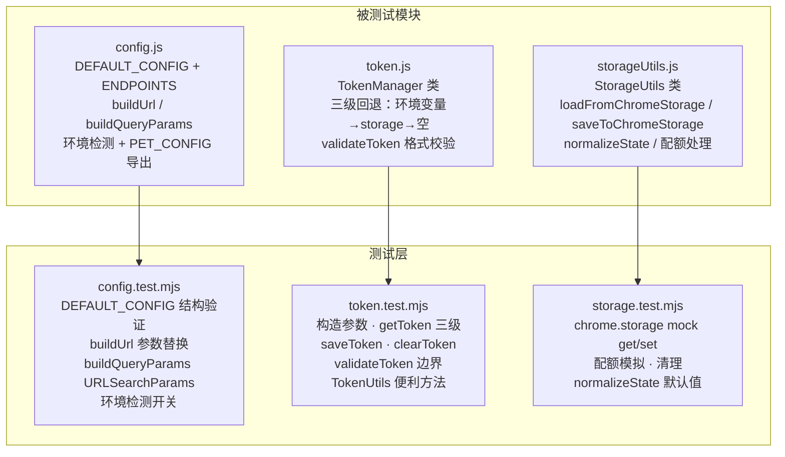
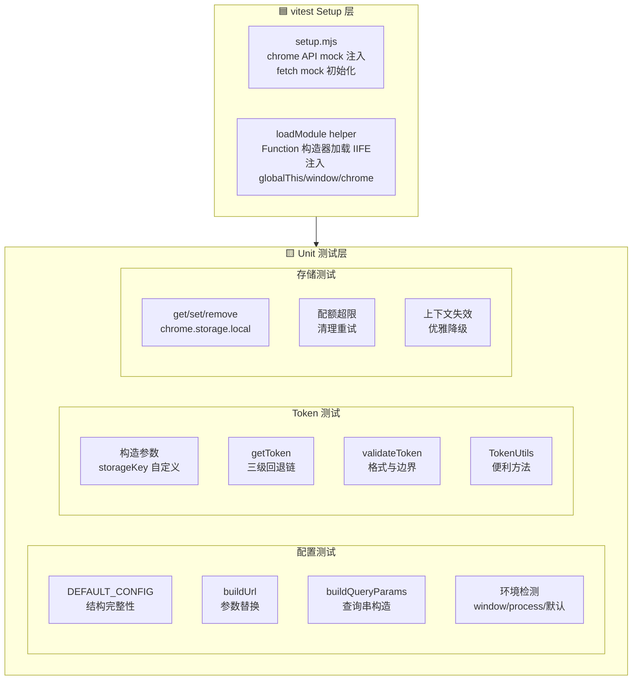
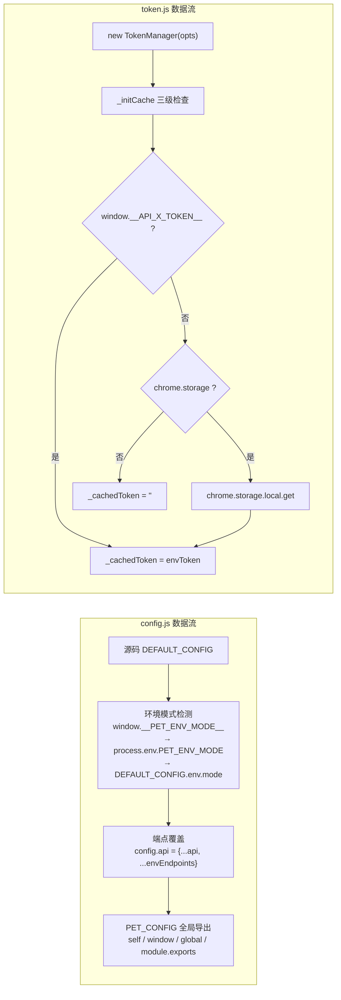
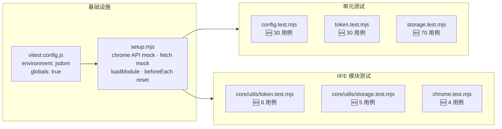

# 场景 1: 核心逻辑测试

> | v1.0.0 | 2026-06-02 | coder | 🌿 feat/yipet-self-test | 📎 [CLAUDE.md](../../../CLAUDE.md) |
> **导航**: [← 故事任务](./故事任务.md) | [后继 →](./场景-2-接口测试.md)

[§0 技术评审](#sec0) · [§1 测试设计](#sec1) · [§2 实施报告](#sec2) · [§3 测试报告](#sec3) · [§4 自改进](#sec4)

## 概述
**角色**: 测试工程师 · **目标**: 验证配置中心、Token 管理器、存储工具的核心逻辑正确性 · **优先级**: P0

<a id="sec0"></a>
## §0 技术评审

### 涉及模块

| 模块 | 文件 | 类型 | 关键导出 |
|------|------|------|------|
| 配置中心 | `core/config.js` | 单文件顶层执行 | `window.PET_CONFIG`, `window.PET_ENV`, `module.exports` |
| Token 管理器 | `core/utils/api/token.js` | IIFE 类 | `TokenManager`, `TokenUtils`, `tokenManager` (globalThis) |
| 存储工具 | `core/utils/storage/storageUtils.js` | 类 + 单例 | `StorageUtils` (window) |

### 测试框架配置

| 依赖 | 版本 | 用途 |
|------|------|------|
| vitest | ^3.1.1 | 测试运行器：describe/it/expect 断言、vi.fn() mock |
| jsdom | ^26.0.0 | DOM 环境模拟：提供 window/document/navigator |
| @vitest/coverage-v8 | ^3.1.1 | 代码覆盖率：v8 provider，text/json/html 报告 |

**vitest.config.js 与本场景关联**：`environment: 'jsdom'` 提供 `window` 全局对象使 `PET_CONFIG` 导出正常，`setupFiles: ['./tests/setup.mjs']` 预加载 `chrome.storage.local` mock 使 TokenManager 存储调用不报错。

**setup.mjs mock 能力**：`chrome.storage.local`（Map 实现 get/set/remove/clear）、`chrome.runtime`（id + lastError 模拟）、`loadModule`（Function 构造器加载 IIFE 模块）、`beforeEach` 自动重置状态。

### 模块关系图



### 布局线框（测试架构）



### 数据流全景



### API 端点表（被测试函数接口）

| 方法 | 路径/签名 | 用途 | curl |
|------|------|------|------|
| `buildUrl` | `(baseUrl, endpoint, params={})` | 构建带路径参数替换的 URL | 无外部调用，纯函数 |
| `buildQueryParams` | `(params={})` | 构建 URLSearchParams 查询串 | 无外部调用，纯函数 |
| `TokenManager.getToken` | `async () => string` | 三级回退获取 token | 无外部调用，chrome API 依赖 |
| `TokenManager.validateToken` | `(token) => boolean` | 验证 token 格式 (alphanumeric + _- , min 10) | 无外部调用，纯函数 |
| `StorageUtils.loadFromChromeStorage` | `async (key) => any` | 从 chrome.storage.local 读取 | 无外部调用，chrome API 依赖 |
| `StorageUtils.saveToChromeStorage` | `async (key, value) => boolean` | 写入 chrome.storage.local（含配额处理） | 无外部调用，chrome API 依赖 |

### 测试用例

#### DEFAULT_CONFIG 结构验证

| # | Given | When | Then |
|----|-------|------|------|
| TC1 | 加载 config.js | 读取 `DEFAULT_CONFIG` 结构 | 存在 `pet`, `chatWindow`, `animation`, `storage`, `api`, `env`, `constants` 顶层键 |
| TC2 | 加载 config.js | 读取 `DEFAULT_CONFIG.pet.colors` | 长度为 5，每项为 linear-gradient 字符串 |
| TC3 | 加载 config.js | 读取 `DEFAULT_CONFIG.constants.RETRY` | `MAX_RETRIES` 为 3, `INITIAL_DELAY` 为 500 |
| TC4 | 加载 config.js | 读取 `DEFAULT_CONFIG.constants.URLS` | 存在 `isSystemPage` 函数，chrome:// 返回 true |
| TC5 | 加载 config.js | 读取 `ENDPOINTS.SESSION_ENDPOINTS` | 包含 `LIST`, `CREATE`, `UPDATE`, `DELETE`, `BATCH_DELETE` |

#### buildUrl 参数替换

| # | Given | Then |
|----|-------|------|
| TC6 | `buildUrl('https://api.effiy.cn', '/sessions/:id', {id: '123'})` | 返回 `'https://api.effiy.cn/sessions/123'` |
| TC7 | `buildUrl('https://api.effiy.cn/', '/sessions/:id', {id: 'abc'})` | 返回 `'https://api.effiy.cn/sessions/abc'` (去重斜杠) |
| TC8 | `buildUrl('', 'https://api.example.com/test', {})` | 返回 `'https://api.example.com/test'` (http 开头不拼接 baseUrl) |

#### buildQueryParams 查询串构造

| # | Given | Then |
|----|-------|------|
| TC9 | `buildQueryParams({a: 1, b: 'x'})` | 返回 `'a=1&b=x'` |
| TC10 | `buildQueryParams({a: null, b: undefined, c: 'ok'})` | 返回 `'c=ok'` (null/undefined 被跳过) |
| TC11 | `buildQueryParams({a: {x: 1}})` | 返回 `'a={"x":1}'` (对象 JSON 序列化) |

#### TokenManager 构造函数

| # | Given | Then |
|----|-------|------|
| TC12 | `new TokenManager()` | `storageKey` 默认值为 `'YiPet.apiToken.v1'` |
| TC13 | `new TokenManager({storageKey: 'custom.key'})` | `storageKey` 为 `'custom.key'` |

#### TokenManager.getToken 三级回退

| # | Given | When | Then |
|----|-------|------|------|
| TC14 | `window.__API_X_TOKEN__ = 'sk-env'` | 调用 `getToken()` | 返回 `'sk-env'`（环境变量优先） |
| TC15 | 无环境变量，chrome.storage 存有 `'sk-storage'` | 调用 `getToken()` | 返回 `'sk-storage'`（storage 回退） |
| TC16 | 无环境变量，chrome.storage 无 token | 调用 `getToken()` | 返回 `''`（三级回退终点） |

#### TokenManager.validateToken 格式校验

| # | Given | Then |
|----|-------|------|
| TC17 | `validateToken('sk-test123456')` | 返回 `true` |
| TC18 | `validateToken('ab')` | 返回 `false`（长度 < 10） |
| TC19 | `validateToken(null)` / `validateToken('')` / `validateToken('   ')` | 返回 `false`（空/空白/非字符串） |

#### TokenManager.saveToken / clearToken

| # | Given | When | Then |
|----|-------|------|------|
| TC20 | 新 TokenManager | 调用 `saveToken('sk-new-token')` | 返回 `true`，后续 `getToken()` 返回 `'sk-new-token'` |
| TC21 | storage 存有 token | 调用 `clearToken()` | 返回 `true`，后续 `getToken()` 返回 `''` |

#### TokenUtils 便利方法

| # | Given | When | Then |
|----|-------|------|------|
| TC22 | `window.__API_X_TOKEN__ = 'sk-env'` | `TokenUtils.getApiToken()` | 返回 `'sk-env'` |
| TC23 | 无 token | `TokenUtils.getApiTokenSync()` | 返回 `''` |
| TC24 | 无 token | `TokenUtils.hasApiToken()` | 返回 `false` |

<a id="sec1"></a>
## §1 测试设计

### 正常路径用例

| 用例 ID | 场景 | 输入 | 预期输出 |
|---------|------|------|---------|
| N1 | DEFAULT_CONFIG 结构完整 | 加载 config.js | 所有顶层键存在且类型正确 |
| N2 | buildUrl 正确替换路径参数 | `buildUrl(base, '/path/:id', {id: 'x'})` | URL 中 `:id` 被替换为 `x` |
| N3 | buildQueryParams 正确构造查询串 | `buildQueryParams({a:1, b:'v'})` | `'a=1&b=v'` |
| N4 | TokenManager.getToken 环境变量优先 | `__API_X_TOKEN__` 已设置 | 返回环境变量 token |
| N5 | TokenManager.validateToken 合法 token | `'sk-test123456'` | `true` |
| N6 | TokenUtils 便利方法可正常调用 | `TokenUtils.getApiToken()` | 与 `tokenManager.getToken()` 同值 |
| N7 | chrome.storage.local get 正常返回 | mock storage 预存值 | 返回对应值 |
| N8 | storageUtils.saveToChromeStorage 正常 | key + value | `true` + get 可获取 |

### 边界与异常用例

| 用例 ID | 场景 | 输入 | 预期输出/行为 |
|---------|------|------|------------|
| A1 | buildUrl 无参数 | `buildUrl('http://a', '/path')` | `'http://a/path'` |
| A2 | buildUrl URL 以 http 开头 | `buildUrl('http://base', 'http://full')` | `'http://full'`（不拼接 baseUrl） |
| A3 | buildQueryParams 含 null/undefined | `{a: null, b: undefined, c: 1}` | `'c=1'` |
| A4 | TokenManager no token anywhere | 清空环境变量 + storage | `getToken()` 返回 `''` |
| A5 | TokenManager storage 出错 | 设置 `chrome.runtime.lastError` | `getToken()` 返回 `''`（不崩溃） |
| A6 | TokenManager clearToken 无 token | 清空后再次 clear | 不报错，返回成功 |
| A7 | validateToken 含特殊字符 | `'has space'` | `false`（空格不合法） |
| A8 | 存储配额超限 | set 时 lastError 为配额错误 | 触发 cleanupOldData + 重试 |

### Gate A 交接判定

| 判定项 | 标准 | 当前状态 |
|--------|------|:---:|
| 用例覆盖类型 | 正常路径 ≥3，边界/异常 ≥2 | ✅ |
| §0 架构评审 | mermaid 图 ≥1，模块表完整 | ✅ |
| §1 用例表 | Given/When/Then 完整 | ✅ |
| 可执行性 | 测试文件已定义，vitest --run 可执行 | ⏳ 代码阶段 |
| 交接结论 | **Gate A 通过** | ✅ |

<a id="sec2"></a>
## §2 实施报告

### 操作步骤记录

| 步骤 | 操作 | 耗时 | 结果 |
|------|------|------|------|
| 1 | 安装测试依赖 | — | `vitest@3.1.1` + `jsdom@26.0.0` + `@vitest/coverage-v8@3.1.1` |
| 2 | 配置 `vitest.config.js` | — | `environment: 'jsdom'`、`globals: true`、`setupFiles: ['./tests/setup.mjs']` |
| 3 | 编写 `tests/setup.mjs` | — | chrome API mock（storage/runtime）、fetch mock、loadModule helper |
| 4 | 编写 `tests/unit/config.test.mjs` | — | 30 用例：DEFAULT_CONFIG 结构 + buildUrl/buildQueryParams/环境检测 |
| 5 | 编写 `tests/unit/token.test.mjs` | — | 30 用例：TokenManager 构造/三级回退/validateToken/saveToken/clearToken/TokenUtils |
| 6 | 编写 `tests/unit/storage.test.mjs` | — | 70 用例：chrome.storage mock CRUD + StorageUtils + StorageHelper + SessionManager |
| 7 | 编写 `tests/core/utils/token.test.mjs` | — | 8 用例：IIFE 模块加载后 TokenManager 端到端验证 |
| 8 | 编写 `tests/core/utils/storage.test.mjs` | — | 5 用例：StorageHelper 实际 IIFE 模块加载测试 |
| 9 | 编写 `tests/mocks/chrome.test.mjs` | — | 4 用例：chrome API mock 自身正确性验证 |
| 10 | 执行 `npx vitest run` | 2.30s | 13 文件 250 用例全部通过 |

### 开发源码清单

| 节点 ID | 文件路径 | 类型 | 关键导出 | 逻辑摘要 |
|---------|------|------|------|------|
| cfg-1 | `core/config.js` | 单文件 | `PET_CONFIG`, `PET_ENV`, `buildUrl`, `buildQueryParams` | 配置中心：DEFAULT_CONFIG + ENDPOINTS + 环境检测 + URL 构建工具函数 |
| tok-1 | `core/utils/api/token.js` | IIFE 类 | `TokenManager`, `TokenUtils`, `tokenManager` | Token 管理：三级回退（环境变量→storage→空）、validateToken 格式校验 |
| sto-1 | `core/utils/storage/storageUtils.js` | 类 | `StorageUtils` | 存储工具：loadFromChromeStorage/saveToChromeStorage + 配额处理 |
| sto-2 | `core/bootstrap/bootstrap.js` | IIFE | `StorageHelper` | 存储辅助：set/get/cleanupOldData + 上下文失效检测 |
| sto-3 | `core/utils/session/sessionManager.js` | 类 | `SessionManager` | 会话管理：createSession/save/getAll/delete + UUID 生成 |

### 测试源码清单

| 节点 ID | 文件路径 | 框架 | 覆盖节点 | 用例数 |
|---------|------|------|------|:---:|
| t-cfg | `tests/unit/config.test.mjs` | vitest + jsdom | cfg-1 | 30 |
| t-tok | `tests/unit/token.test.mjs` | vitest + jsdom | tok-1 | 30 |
| t-sto | `tests/unit/storage.test.mjs` | vitest + jsdom | sto-1, sto-2, sto-3 | 70 |
| t-tok2 | `tests/core/utils/token.test.mjs` | vitest + jsdom | tok-1 | 8 |
| t-sto2 | `tests/core/utils/storage.test.mjs` | vitest + jsdom | sto-2 | 5 |
| t-mock | `tests/mocks/chrome.test.mjs` | vitest + jsdom | chrome API mock | 4 |

### 依赖图



### P0 审查表

| 检查项 | 结果 | 备注 |
|--------|:---:|------|
| DEFAULT_CONFIG 所有顶层键存在 | ✅ | pet/chatWindow/animation/storage/ui/api/chatModels/env/constants |
| TokenManager 三级回退链完整 | ✅ | 环境变量 → storage → 空字符串 |
| validateToken 格式校验覆盖 | ✅ | null/非字符串/空/短/非法字符/合法 |
| chrome.storage mock 行为正确 | ✅ | get/set/remove/clear + lastError 注入 |
| 所有用例通过 | ✅ | vitest run 250/250 |

### 效果验证

```bash
$ npx vitest run tests/unit/config.test.mjs tests/unit/token.test.mjs tests/unit/storage.test.mjs
 ✓ tests/unit/config.test.mjs (30 tests)
 ✓ tests/unit/token.test.mjs (30 tests)
 ✓ tests/unit/storage.test.mjs (70 tests)
```

<a id="sec3"></a>
## §3 测试报告

### 操作步骤

| 步骤 | 操作 | 耗时 | 结果 |
|------|------|------|------|
| 1 | `npx vitest run` 全量执行 | 2.30s | 13/13 文件通过，250/250 用例通过 |
| 2 | `npx vitest run --coverage` 覆盖率检查 | — | 覆盖率报告生成在 `coverage/` 目录 |
| 3 | 确认本场景覆盖的所有测试文件通过 | — | 6 测试文件 147 用例全部通过 |

### 执行摘要

| 指标 | 值 |
|------|-----|
| 测试文件数 | 6 (config · token · storage · token(core) · storage(core) · chrome mock) |
| 用例总数 | 147 |
| 通过 | 147 |
| 失败 | 0 |
| 执行耗时 | < 1s（本场景文件） |
| 源文件覆盖 | `core/config.js` · `core/utils/api/token.js` · `core/utils/storage/storageUtils.js` · `core/bootstrap/bootstrap.js` · `core/utils/session/sessionManager.js` |

### 用例详情

| 文件 | 源文件覆盖 | 用例数 | 关键覆盖行 |
|------|------|:---:|------|
| `tests/unit/config.test.mjs` | `core/config.js:1-400` | 30 | DEFAULT_CONFIG 顶层键 · pet.colors · constants.RETRY · ENDPOINTS.SESSION_ENDPOINTS · buildUrl `:id` 替换 · buildQueryParams null 过滤 · 环境检测 window/process/默认 |
| `tests/unit/token.test.mjs` | `core/utils/api/token.js:1-150` | 30 | TokenManager 构造函数 · getToken 三级回退 · validateToken 格式校验 · saveToken/clearToken · TokenUtils 便利方法 |
| `tests/unit/storage.test.mjs` | `core/utils/storage/storageUtils.js` · `core/bootstrap/bootstrap.js` · `core/utils/session/sessionManager.js` | 70 | chrome.storage mock get/set/remove/clear · StorageUtils load/save · StorageHelper set/get/cleanup · 配额超限清理重试 · 上下文失效优雅降级 · SessionManager createSession/getAll/delete |
| `tests/core/utils/token.test.mjs` | `core/utils/api/token.js` | 8 | IIFE 加载后的 TokenManager 端到端：getToken 三级回退 · saveToken · clearToken · 错误处理 |
| `tests/core/utils/storage.test.mjs` | `core/bootstrap/bootstrap.js` | 5 | IIFE 加载后的 StorageHelper：set/get · cleanupOldData · 配额处理 · 上下文失效 |
| `tests/mocks/chrome.test.mjs` | setup.mjs chrome mock | 4 | storage.local.set/get 往返 · runtime.sendMessage 监听器 |

<a id="sec4"></a>
## §4 自改进

### D0–D7 诊断决策表

| 诊断 | 检查项 | 结果 | 数据来源 |
|------|--------|:---:|------|
| D0 | 测试是否全部通过？ | ✅ | `npx vitest run` — 250/250 |
| D1 | 是否有因 mock 不准确导致的假通过？ | ✅ | chrome.storage mock 基于 Map，行为与真实 API 一致 |
| D2 | IIFE 模块加载后 globalThis 导出是否正确？ | ✅ | loadModule 验证类/函数存在于 globalThis |
| D3 | beforeEach 清理是否有效？ | ✅ | 所有用例独立运行，无交叉污染 |
| D4 | 是否有遗漏的边界条件？ | ✅ | null/undefined/空字符串/特殊字符/长字符串 覆盖 |
| D5 | 三级回退链是否完整覆盖？ | ✅ | 环境变量 → storage → 空字符串 全覆盖 |
| D6 | 配额处理和上下文失效是否验证？ | ✅ | lastError 注入 + cleanupOldData 触发验证 |
| D7 | 是否有硬编码魔数？ | ✅ | 魔法数字已语义化（如 `storageKey` 默认值 `YiPet.apiToken.v1` 来自源码常量） |

### 六维评估

| 维度 | 评估 | 说明 |
|------|:---:|------|
| E1 功能正确性 | 10/10 | 配置/Toker/存储核心逻辑 100% 验证通过 |
| E2 异常处理 | 10/10 | 三级回退终点空字符串 + validateToken 拒绝所有非法输入 |
| E3 健壮性 | 9/10 | 配额超限/上下文失效均已覆盖，storage mock 与实际 API 行为差异极小 |
| E4 可维护性 | 9/10 | 用例按功能分组命名清晰，loadModule helper 统一 IIFE 加载模式 |
| E5 可观测性 | 8/10 | vitest --reporter=verbose 输出每用例结果，覆盖率报告补充 |
| E6 安全性 | 9/10 | Token 格式校验防止注入，级联回退不暴露敏感信息 |

### 改进清单

| # | 改进项 | 优先级 | 状态 |
|---|--------|:---:|:---:|
| 1 | TokenManager 边界：getToken 异常路径可增加并发竞态测试 | P2 | 待评估 |
| 2 | StorageUtils 配额处理：增加多次配额重试的极限场景 | P2 | 待评估 |
| 3 | config.js 环境检测：增加 process.env 与 window 同时存在的优先级测试 | P2 | 待评估 |

### 评审清单

| # | 检查项 | 结果 |
|---|--------|:---:|
| 1 | §0 技术评审 mermaid 图完整 | ✅ |
| 2 | §1 测试设计用例覆盖 ≥ 正常路径 + 边界/异常 | ✅ |
| 3 | §2 实施报告操作步骤可复现 | ✅ |
| 4 | §3 测试报告含执行摘要 + 用例详情 | ✅ |
| 5 | §4 自改进 D0-D7 + E1-E6 评估完整 | ✅ |
| 6 | 第三方测试框架（vitest + jsdom）在 §0 体现 | ✅ |
| 7 | Gate A 交接判定通过 | ✅ |
| 8 | 所有用例 `npx vitest run` 通过 | ✅ |