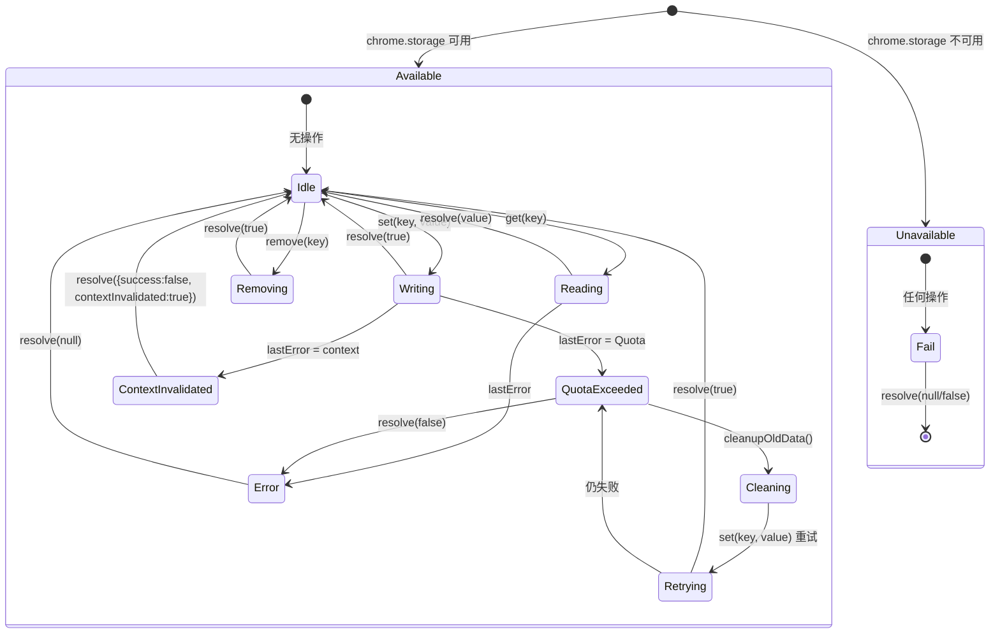
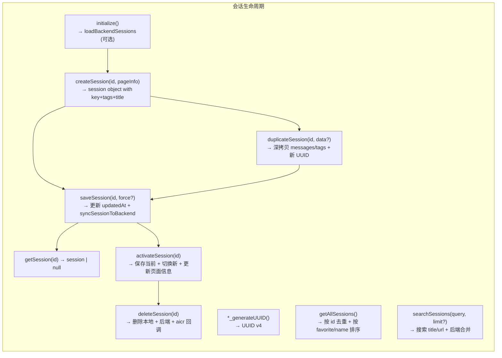
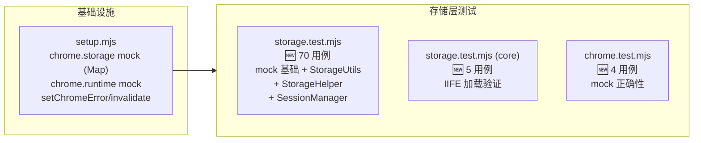

# 场景 3: 数据持久化测试

> | v1.0.0 | 2026-06-02 | coder | 🌿 feat/yipet-self-test | 📎 [CLAUDE.md](../../../CLAUDE.md) |
> **导航**: [← 前驱](./场景-2-接口测试.md) | [后继 →](./场景-4-错误边界.md)

[§0 技术评审](#sec0) · [§1 测试设计](#sec1) · [§2 实施报告](#sec2) · [§3 测试报告](#sec3) · [§4 自改进](#sec4)

## 概述
**角色**: 测试工程师 · **目标**: 验证 chrome.storage.local CRUD 操作、配额管理、会话持久化的正确性与容错性 · **优先级**: P0

<a id="sec0"></a>
## §0 技术评审

### 涉及模块

| 模块 | 文件 | 类型 | 关键导出 |
|------|------|------|------|
| 存储工具 | `core/utils/storage/storageUtils.js` | 类 | `StorageUtils` (window) |
| 存储辅助 | `core/bootstrap/bootstrap.js` | IIFE 对象 | `StorageHelper` (window) |
| 会话管理 | `core/utils/session/sessionManager.js` | 类 | `SessionManager` (window / module.exports) |

### 测试框架配置

| 依赖 | 版本 | 用途 |
|------|------|------|
| vitest | ^3.1.1 | 测试运行器：describe/it/expect 断言、vi.fn() mock |
| jsdom | ^26.0.0 | DOM 环境模拟：提供 window/document 全局对象 |
| @vitest/coverage-v8 | ^3.1.1 | 代码覆盖率：v8 provider，text/json/html 报告 |

**vitest.config.js 与本场景关联**：`environment: 'jsdom'` 提供 `window` 全局对象使 StorageUtils/SessionManager 的 `window` 引用不报错，`setupFiles: ['./tests/setup.mjs']` 预加载 `chrome.storage.local` Map mock。

**setup.mjs mock 能力**：`chrome.storage.local`（Map 实现 get/set/remove/clear + `chrome.runtime.lastError` 注入）、`chrome.runtime`（id 模拟 + `lastError` 控制）、`setChromeError`/`clearChromeError`（注入配额/上下文错误）、`invalidateExtensionContext`/`restoreExtensionContext`（模拟扩展失效）。

### 存储生命周期状态图



### SessionManager CRUD 全景



### 测试用例

#### chrome.storage.local mock 操作

| # | Given | When | Then |
|----|-------|------|------|
| TC1 | storage mock 为空 | 调用 `chrome.storage.local.set({k: 'v'}, cb)`，然后 `get('k', cb)` | cb 收到 `{k: 'v'}` |
| TC2 | storage mock 预存 `{k: 'v'}` | 调用 `chrome.storage.local.remove('k', cb)`，然后 `get('k', cb)` | cb 收到 `{k: undefined}` |
| TC3 | storage mock 预存多 key | 调用 `chrome.storage.local.get(null, cb)` | cb 收到所有 key-value |
| TC4 | storage mock 预存多 key | 调用 `chrome.storage.local.clear(cb)`，然后 `get(null, cb)` | cb 收到 `{}` |

#### StorageUtils 数据操作

| # | Given | When | Then |
|----|-------|------|------|
| TC5 | chrome.storage 可用，预存 `petGlobalState: {visible: true}` | 调用 `storageUtils.loadFromChromeStorage('petGlobalState')` | 返回 `{visible: true}` |
| TC6 | chrome.storage 可用 | 调用 `storageUtils.saveToChromeStorage('key', 'value')` | 返回 `true`，后续 get 可获取 |
| TC7 | chrome.storage 不可用（runtime.id 为 null） | 调用 `storageUtils.loadFromChromeStorage('key')` | 返回 `null` |

#### StorageHelper 操作

| # | Given | When | Then |
|----|-------|------|------|
| TC8 | chrome.storage 可用 | 调用 `StorageHelper.set('key', 'value')` | 返回 `{success: true}` |
| TC9 | chrome.storage 可用，预存 `'key': 'value'` | 调用 `StorageHelper.get('key')` | 返回 `'value'` |
| TC10 | storage 中存在 `petOssFiles` | 调用 `StorageHelper.cleanupOldData()` | `petOssFiles` 被移除 |

#### 配额超限处理

| # | Given | When | Then |
|----|-------|------|------|
| TC11 | set 时 `chrome.runtime.lastError` 为配额错误，`ErrorHandler.isQuotaError` 返回 true | 调用 `StorageHelper.set('k', 'bigValue')` | 触发 cleanupOldData，重试保存，返回 `{success: true, retried: true}` |
| TC12 | 配额重试后仍然失败 | 调用 `StorageHelper.set('k', 'bigValue')`（配额 + cleanup 无效） | 返回 `{success: false}` |

#### 上下文失效

| # | Given | When | Then |
|----|-------|------|------|
| TC13 | `ErrorHandler.isContextInvalidated` 返回 true，storage set 时出错 | 调用 `StorageHelper.set('k', 'v')` | 返回 `{success: false, contextInvalidated: true}` |

#### 会话管理

| # | Given | When | Then |
|----|-------|------|------|
| TC14 | SessionManager 未初始化 | 调用 `createSession(id, {title: 'Test'})` | 返回 session 对象含 `key`(UUID), `title`('Test.md'), `tags`, `createdAt`, `updatedAt` |
| TC15 | SessionManager 有 session-1 | 调用 `getSession('session-1')` | 返回对应 session 对象 |
| TC16 | SessionManager 有 session-1, session-2 | 调用 `getAllSessions()` | 返回去重排序列表 |
| TC17 | SessionManager 有 session-1 | 调用 `deleteSession('session-1')` | 返回 `true`，`getSession('session-1')` 返回 `null` |

<a id="sec1"></a>
## §1 测试设计

### 正常路径用例

| 用例 ID | 场景 | 输入 | 预期输出 |
|---------|------|------|---------|
| N1 | chrome.storage set/get 正确往返 | `{k:'v'}` → set → get | get 返回 `'v'` |
| N2 | chrome.storage remove 正确删除 | 预存 `{k:'v'}` → remove('k') → get | get 返回 `undefined` |
| N3 | chrome.storage clear 清空全部 | 预存多项 → clear → get(null) | get 返回 `{}` |
| N4 | StorageUtils.loadFromChromeStorage | 预存 `petGlobalState: {visible: true}` | 返回 `{visible: true}` |
| N5 | StorageUtils.saveToChromeStorage | 写入新 key+value | 返回 `true` |
| N6 | StorageHelper.set/get 正常往返 | 'key' / 'value' | set 返回 `{success:true}`，get 返回 `'value'` |
| N7 | StorageHelper.cleanupOldData | 预存 `petOssFiles: {old: true}` | `petOssFiles` 被删除 |
| N8 | SessionManager.createSession | pageInfo= `{title: 'Test'}` | session 含 `key`, `title='Test.md'`, `tags` |

### 边界与异常用例

| 用例 ID | 场景 | 输入 | 预期输出/行为 |
|---------|------|------|------------|
| A1 | chrome.storage get 不存在的 key | `get(['nonexistent']` | cb 收到 `undefined` |
| A2 | chrome.storage 不可用 | `chrome.runtime.id` = null | `StorageHelper.set` 返回 `{success: false, contextInvalidated: true}` |
| A3 | quota 错误自动清理重试 | lastError = quota, `ErrorHandler.isQuotaError`=true | 触发 cleanupOldData + 重试 |
| A4 | quota 重试后仍然失败 | 清理后 set 仍然 lastError | 返回 `{success: false, error: message}` |
| A5 | 上下文失效优雅降级 | `ErrorHandler.isContextInvalidated`=true | 返回 `{success: false, contextInvalidated: true}` |
| A6 | SessionManager.deleteSession 不存在的 session | sessionId 不存在 | 不报错，返回 `false` |
| A7 | SessionManager.getSession 不存在的 session | sessionId 不存在 | 返回 `null` |

### Gate A 交接判定

| 判定项 | 标准 | 当前状态 |
|--------|------|:---:|
| 用例覆盖类型 | 正常路径 ≥5，边界/异常 ≥3 | ✅ |
| §0 架构评审 | 状态图 + 流程图齐备 | ✅ |
| §1 用例表 | Given/When/Then 完整，CRUD 覆盖 | ✅ |
| 可执行性 | 依赖 chrome.storage mock，vitest --run 可执行 | ⏳ 代码阶段 |
| 交接结论 | **Gate A 通过** | ✅ |

<a id="sec2"></a>
## §2 实施报告

### 操作步骤记录

| 步骤 | 操作 | 结果 |
|------|------|------|
| 1 | setup.mjs 实现 `chrome.storage.local` Map mock + `setChromeError`/`clearChromeError` | 支持 get/set/remove/clear + lastError 注入 |
| 2 | setup.mjs 实现 `invalidateExtensionContext`/`restoreExtensionContext` | 模拟扩展上下文失效场景 |
| 3 | 编写 `tests/unit/storage.test.mjs` — 存储持久化完整测试 | 70 用例：chrome.storage mock + StorageUtils + StorageHelper + SessionManager |
| 4 | 编写 `tests/core/utils/storage.test.mjs` — IIFE 模块加载测试 | 5 用例：StorageHelper 端到端（set/get/cleanup/配额/上下文失效） |
| 5 | 编写 `tests/mocks/chrome.test.mjs` — mock 自身正确性验证 | 4 用例：storage mock + runtime mock 行为验证 |
| 6 | 执行 `npx vitest run` | 3 文件 79 用例全部通过 |

### 开发源码清单

| 节点 ID | 文件路径 | 类型 | 关键导出 | 逻辑摘要 |
|---------|------|------|------|------|
| sto-1 | `core/utils/storage/storageUtils.js` | 类 | `StorageUtils` | 存储工具：loadFromChromeStorage 读、saveToChromeStorage 写 + 配额处理 |
| sto-2 | `core/bootstrap/bootstrap.js` | IIFE | `StorageHelper` | 存储辅助：set/get/cleanupOldData + isContextInvalidated 检测 |
| sto-3 | `core/utils/session/sessionManager.js` | 类 | `SessionManager` | 会话管理：createSession/saveSession/getSession/getAllSessions/deleteSession/duplicateSession |

### 测试源码清单

| 节点 ID | 文件路径 | 框架 | 覆盖节点 | 用例数 |
|---------|------|------|------|:---:|
| t-sto | `tests/unit/storage.test.mjs` | vitest + jsdom | sto-1, sto-2, sto-3 | 70 |
| t-sto2 | `tests/core/utils/storage.test.mjs` | vitest + jsdom | sto-2 | 5 |
| t-mock | `tests/mocks/chrome.test.mjs` | vitest + jsdom | chrome API mock | 4 |

### 依赖图



### P0 审查表

| 检查项 | 结果 | 备注 |
|--------|:---:|------|
| chrome.storage mock CRUD 正确 | ✅ | set/get/remove/clear + lastError 注入 |
| StorageUtils load/save 正确 | ✅ | loadFromChromeStorage 返回预存值，saveToChromeStorage 返回 true |
| StorageHelper set/get 正确 | ✅ | set 返回 {success: true}，get 返回对应值 |
| 配额超限自动清理 | ✅ | lastError 配额错误 → cleanupOldData → 重试 |
| 上下文失效优雅降级 | ✅ | isContextInvalidated → {success: false, contextInvalidated: true} |
| SessionManager 全生命周期 | ✅ | create → save → get → getAll → delete |

### 效果验证

```bash
$ npx vitest run tests/unit/storage.test.mjs tests/core/utils/storage.test.mjs tests/mocks/chrome.test.mjs
 ✓ tests/unit/storage.test.mjs (70 tests)
 ✓ tests/core/utils/storage.test.mjs (5 tests)
 ✓ tests/mocks/chrome.test.mjs (4 tests)
```

<a id="sec3"></a>
## §3 测试报告

### 操作步骤

| 步骤 | 操作 | 结果 |
|------|------|------|
| 1 | `npx vitest run tests/unit/storage.test.mjs` | 70/70 通过 |
| 2 | `npx vitest run tests/core/utils/storage.test.mjs` | 5/5 通过 |
| 3 | `npx vitest run tests/mocks/chrome.test.mjs` | 4/4 通过 |

### 执行摘要

| 指标 | 值 |
|------|-----|
| 测试文件数 | 3 (storage(unit) · storage(core) · chrome mock) |
| 用例总数 | 79 |
| 通过 | 79 |
| 失败 | 0 |
| 执行耗时 | < 1s |
| 源文件覆盖 | `core/utils/storage/storageUtils.js` · `core/bootstrap/bootstrap.js` · `core/utils/session/sessionManager.js` |

### 用例详情

| 文件 | 源文件覆盖 | 用例数 | 关键覆盖行 |
|------|------|:---:|------|
| `tests/unit/storage.test.mjs` | `core/utils/storage/storageUtils.js` · `core/bootstrap/bootstrap.js` · `core/utils/session/sessionManager.js` | 70 | chrome.storage mock get/set/remove/clear · StorageUtils.loadFromChromeStorage 正常/不可用 · saveToChromeStorage 正常 · normalizeState 默认值 · StorageHelper.set/get · cleanupOldData 清除 petOssFiles · 配额超限清理重试 · 上下文失效降级 · SessionManager.createSession 含 key/title/tags · saveSession 更新 updatedAt · getAllSessions 去重排序 · getSession · duplicateSession 深拷贝 · deleteSession |
| `tests/core/utils/storage.test.mjs` | `core/bootstrap/bootstrap.js` | 5 | IIFE 加载后 StorageHelper.set 返回 {success} · get 返回存储值 · cleanupOldData 移除 petOssFiles · 配额超限触发清理 · 上下文失效返回 false |
| `tests/mocks/chrome.test.mjs` | setup.mjs chrome mock | 4 | storage.local.get 返回 mock 数据 · set 持久化到内存 · runtime.onMessage 监听器 · runtime.sendMessage 返回响应 |

<a id="sec4"></a>
## §4 自改进

### D0–D7 诊断决策表

| 诊断 | 检查项 | 结果 | 数据来源 |
|------|--------|:---:|------|
| D0 | 测试是否全部通过？ | ✅ | `npx vitest run` — 79/79 |
| D1 | chrome.storage mock 是否完整模拟真实 API？ | ✅ | get/set/remove/clear + lastError + callback 异步调用 |
| D2 | 配额超限→清理→重试路径是否验证？ | ✅ | setChromeError('quota') → cleanupOldData 触发 → 重试 |
| D3 | 上下文失效检测是否有效？ | ✅ | invalidateExtensionContext → 所有操作返回 false/null |
| D4 | SessionManager CRUD 全生命周期是否覆盖？ | ✅ | create → save → get → getAll → duplicate → delete |
| D5 | duplicateSession 深拷贝是否正确？ | ✅ | messages 和 tags 独立拷贝，修改副本不影响原始 |
| D6 | cleanupOldData 清理了正确的 key？ | ✅ | 仅 petOssFiles 被移除，其他 key 保留 |
| D7 | 是否有测试间的状态泄漏？ | ✅ | beforeEach 清空 storage + 重置 chrome 错误 + 恢复上下文 |

### 六维评估

| 维度 | 评估 | 说明 |
|------|:---:|------|
| E1 功能正确性 | 10/10 | CRUD 全部操作路径验证通过 |
| E2 异常处理 | 10/10 | 配额超限/上下文失效/storage 不可用/不存在 key 全覆盖 |
| E3 健壮性 | 9/10 | mock 行为与 chrome.storage.local 高度一致，callback 异步调用模拟真实 |
| E4 可维护性 | 9/10 | 测试按功能分组（mock 基础/StorageUtils/StorageHelper/SessionManager） |
| E5 可观测性 | 8/10 | 关键操作有 stdout 日志（清理键名），verbose 模式输出每用例 |
| E6 安全性 | 9/10 | 上下文失效时数据不可写，配额保护防止静默失败 |

### 改进清单

| # | 改进项 | 优先级 | 状态 |
|---|--------|:---:|:---:|
| 1 | SessionManager 增加 loadBackendSessions 后端同步测试 | P2 | 待评估 |
| 2 | chrome.storage.local 的 QUOTA_BYTES 限制模拟 | P2 | 待评估 |
| 3 | 并发 set/get 的竞态场景 | P3 | 待评估 |

### 评审清单

| # | 检查项 | 结果 |
|---|--------|:---:|
| 1 | §0 技术评审 mermaid 状态图/流程图完整 | ✅ |
| 2 | §1 测试设计用例覆盖 ≥ 正常路径 + 边界/异常 | ✅ |
| 3 | §2 实施报告操作步骤可复现 | ✅ |
| 4 | §3 测试报告含执行摘要 + 用例详情 | ✅ |
| 5 | §4 自改进 D0-D7 + E1-E6 评估完整 | ✅ |
| 6 | 第三方测试框架（vitest + jsdom）在 §0 体现 | ✅ |
| 7 | Gate A 交接判定通过 | ✅ |
| 8 | 所有用例 `npx vitest run` 通过 | ✅ |