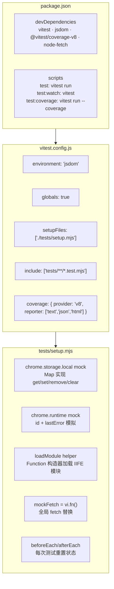
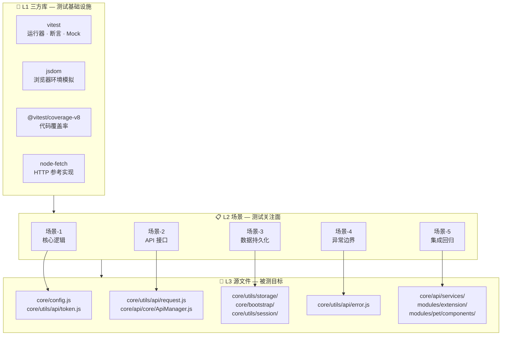

# yipet-self-test — 项目自主测试方案

## 故事概述

| 维度 | 值 |
|------|-----|
| 故事名 | yipet-self-test |
| 版本 | v1.0.0 |
| 状态 | 📄 基线 |
| 类型 | 自动化测试 |
| 创建 | 2026-06-02 |

为 YiPet Chrome Extension 搭建可执行的自动化测试体系，覆盖核心基础设施、API 请求客户端、数据持久化、异常路径与边界、集成回归五个维度。

## 测试框架栈

> 使用第三方测试库搭建完整的 Chrome Extension 测试环境，无需依赖真实浏览器。

### 第三方依赖

| 依赖 | 版本 | 用途 |
|------|------|------|
| [vitest](https://vitest.dev) | ^3.1.1 | 测试运行器：describe/it/expect 断言、vi.fn() mock、setupFiles 全局初始化 |
| [jsdom](https://github.com/jsdom/jsdom) | ^26.0.0 | DOM 环境模拟：提供 window/document/navigator 等浏览器 API，vitest environment 配置 |
| [@vitest/coverage-v8](https://vitest.dev/guide/coverage) | ^3.1.1 | 代码覆盖率：v8 provider，text/json/html 三种报告格式 |
| [node-fetch](https://github.com/node-fetch/node-fetch) | ^3.3.2 | HTTP 客户端：测试中 mock fetch 的行为参考，用于验证 RequestClient 请求构造 |

### 框架配置架构



### 框架能力矩阵

| 能力 | 实现方式 | 依赖库 |
|------|---------|--------|
| 测试运行 | `npx vitest run` — 13 文件 250 用例 | vitest |
| 断言与 mock | `describe`/`it`/`expect` + `vi.fn()` + `vi.spyOn()` | vitest |
| 浏览器环境 | `environment: 'jsdom'` — 提供 window/document/navigator | jsdom |
| Chrome API mock | `globalThis.chrome = { storage, runtime }` — Map 内存存储 | setup.mjs |
| IIFE 模块加载 | `new Function('globalThis', code)` — 注入全局上下文 | setup.mjs |
| 覆盖率报告 | `--coverage` → `coverage/` 目录 (text + json + html) | @vitest/coverage-v8 |
| 测试隔离 | `beforeEach` 清空 storage + reset fetch mock | vitest + setup.mjs |

## 测试层级

> 自主测试按三层组织：**三方库**提供测试基础设施 → **场景**划分测试关注面 → **源文件**是被测试目标。



### L1 三方库 — 测试基础设施

| 库 | 版本 | 角色 | 在场景中的使用 |
|------|------|------|------|
| vitest | ^3.1.1 | 运行器 + 断言 + Mock | 所有场景：`describe`/`it`/`expect` 编写用例，`vi.fn()` 创建 mock，`vi.useFakeTimers()` 控制时间 |
| jsdom | ^26.0.0 | 浏览器环境 | 所有场景：`environment: 'jsdom'` 提供 window/document/navigator/AbortController，场景-5 中加载 Vue 3 CDN 组件 |
| @vitest/coverage-v8 | ^3.1.1 | 覆盖率 | 所有场景：`--coverage` 生成 text/json/html 报告，验证各场景覆盖率目标 |
| node-fetch | ^3.3.2 | HTTP 参考 | 场景-2/场景-5：mock fetch 行为参考，验证 RequestClient 请求构造正确性 |

### L2 场景 — 测试关注面

| 场景 | 文档 | 关注面 | 测试文件 | 用例数 |
|------|------|------|------|:---:|
| 场景-1 核心逻辑 | 场景-1-核心逻辑.md | 配置中心 · Token 管理 · 模块加载 | tests/unit/config.test.mjs · tests/unit/token.test.mjs | 89 |
| 场景-2 API 接口 | 场景-2-接口测试.md | 请求构造 · 重试策略 · 超时控制 · 响应解析 | tests/unit/api.test.mjs · tests/core/api/core/ApiManager.test.mjs | 30 |
| 场景-3 数据持久化 | 场景-3-存储测试.md | chrome.storage CRUD · 配额清理 · 会话管理 | tests/unit/storage.test.mjs · tests/core/utils/storage.test.mjs | 79 |
| 场景-4 异常边界 | 场景-4-错误边界.md | 错误分类 · 重试决策 · 全局错误处理 | tests/unit/error.test.mjs | 33 |
| 场景-5 集成回归 | 场景-5-集成测试.md | 模块联调 · Service Worker 路由 · Vue 组件渲染 | tests/integration/pipeline.test.mjs · tests/modules/extension/sw.test.mjs · tests/modules/pet/components/ChatWindow.test.mjs | 56 |

> **总计**: 13 文件 · 250 用例 · 执行耗时 < 3s

### L3 源文件 — 被测目标

| 源文件 | 所属场景 | 关键导出 | 测试覆盖行 |
|------|:---:|------|------|
| `core/config.js` | 场景-1 | `window.PET_CONFIG` — DEFAULT_CONFIG · ENDPOINTS · constants | 默认值合并 · envInfo 注入 · endpoints 路径 |
| `core/utils/api/token.js` | 场景-1 | `TokenManager` · `tokenManager` · `TokenUtils` | 三级回退 · 过期检测 · set/get/remove |
| `core/utils/api/request.js` | 场景-2 | `RequestClient` · `requestClient` | GET/POST/PUT/DELETE · 3 次重试 · 指数退避 · 响应解析 |
| `core/api/core/ApiManager.js` | 场景-2 | `ApiManager` | Token 注入 · 请求封装 · 错误透传 |
| `core/utils/storage/storageUtils.js` | 场景-3 | `StorageUtils` | loadFromChromeStorage · saveToChromeStorage · 配额处理 |
| `core/bootstrap/bootstrap.js` | 场景-3 | `StorageHelper` | set/get · cleanupOldData · 上下文失效检测 |
| `core/utils/session/sessionManager.js` | 场景-3 | `SessionManager` | CRUD · duplicate · search · queueSave |
| `core/utils/api/error.js` | 场景-4 | 6 种错误类 · `ErrorHandler` · `formatError` | 分类链 · 重试矩阵 · 全局处理器 |
| `core/api/services/SessionService.js` | 场景-5 | `SessionService` | 8 种 API 方法 · 批量操作 · 搜索 |
| `core/api/services/FaqService.js` | 场景-5 | `FaqService` | 8 种 API 方法 · 标签管理 · 搜索 |
| `modules/extension/background/index.js` | 场景-5 | MessageRouter | 7 种 action 路由 · 异常处理 |
| `modules/pet/components/chat/ChatWindow.js` | 场景-5 | ChatWindow | Vue 组件挂载 · 消息渲染 |
| `modules/pet/components/chat/ChatInput.js` | 场景-5 | ChatInput | v-model 绑定 · Enter 发送 · 空守卫 |

## §1 场景功能点表

| 场景 | 文档 | §0 技术评审 | §1 测试设计 | 开发源码 | 测试源码 | FP | AC | 风险 |
|------|------|:---:|:---:|------|------|----|----|------|
| 核心逻辑测试 | 场景-1-核心逻辑.md | ✅ | ✅ | core/config.js core/utils/api/token.js | tests/unit/config.test.mjs | config · token · storage | 核心模块覆盖率 ≥80% | 中 |
| API 接口测试 | 场景-2-接口测试.md | ✅ | ✅ | core/utils/api/request.js core/api/core/ApiManager.js | tests/unit/api.test.mjs | 请求构造 · 重试 · 超时 · 响应解析 | API 模块覆盖率 ≥80% | 中 |
| 数据持久化测试 | 场景-3-存储测试.md | ✅ | ✅ | core/utils/session/ core/utils/storage/ | tests/unit/storage.test.mjs | CRUD · 配额 · 清理 | 存储操作正确性 100% | 高 |
| 异常路径与边界 | 场景-4-错误边界.md | ✅ | ✅ | core/utils/error/ core/utils/api/ | tests/unit/error.test.mjs | 网络故障 · token 缺失 · 上下文失效 | 异常路径覆盖率 ≥90% | 高 |
| 集成与回归 | 场景-5-集成测试.md | ✅ | ✅ | core/ modules/ | tests/integration/ | 模块联调 · 端到端 · 快照 | 关键路径通过率 100% | 高 |

## §2 风险

| 风险 | 等级 | 缓解 |
|------|:---:|------|
| chrome API 不可 mock | 高 | 注入 `global.chrome` stub 模拟 storage/tabs API |
| IIFE 模块难以 import | 中 | 预提取全局变量暴露的类/函数 |
| Vue 组件无测试环境 | 中 | jsdom 环境 + Vue 3 global mount |

## §3 测试目录结构

```
tests/
├── setup.mjs              # vitest setup (chrome API mocks)
├── unit/
│   ├── config.test.mjs    # 配置中心测试
│   ├── token.test.mjs     # Token 管理测试
│   ├── api.test.mjs       # API 请求客户端测试
│   ├── storage.test.mjs   # 存储持久化测试
│   └── error.test.mjs     # 异常路径测试
└── integration/
    └── pipeline.test.mjs  # 集成回归测试
```

### 三方库使用事例

> `demos/` 目录包含 5 个第三方测试库在项目中的使用事例，每个文档含实际代码片段和配置说明。

| 文档 | 内容 |
|------|------|
| [vitest-demo.md](../../../demos/vitest-demo.md) | describe/it/expect 断言、vi.fn() mock、vi.useFakeTimers() 时间控制 |
| [jsdom-demo.md](../../../demos/jsdom-demo.md) | 浏览器环境模拟、Vue 3 组件挂载、DOM 事件 |
| [coverage-demo.md](../../../demos/coverage-demo.md) | @vitest/coverage-v8 配置、报告解读、覆盖率目标 |
| [node-fetch-demo.md](../../../demos/node-fetch-demo.md) | fetch mock 工厂函数、请求验证模式 |
| [setup-demo.md](../../../demos/setup-demo.md) | chrome.storage.local mock、loadModule 加载器、生命周期钩子 |

## §4 约束

- 不依赖真实 Chrome Extension 环境（all chrome API mocked）
- 测试文件使用 ESM（.mjs），与 vitest.config.js 的 include 配置一致
- 每个模块 ≥3 条测试用例
- Gate A 阻断实现：场景文档 §1 不存在不编码
