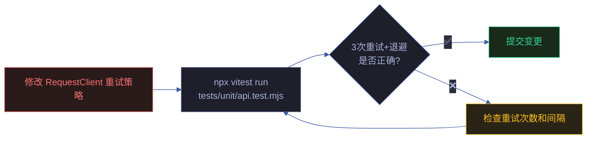
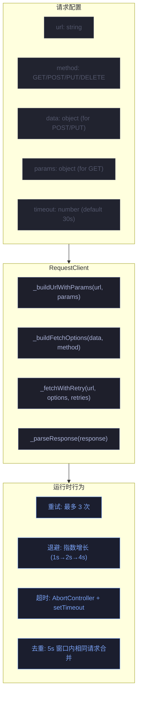
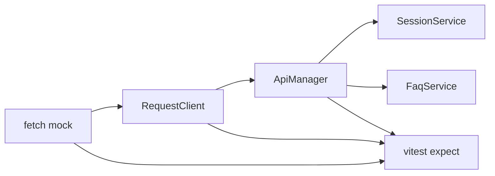

# 场景 2: API 接口测试

> | v2.0.0 | 2026-06-06 | claude | 🌿 feat/yipet-self-test | ⏱️ — | 📎 [CLAUDE.md](../../../CLAUDE.md) |
> **导航**: [← 场景 1](./场景-1-核心逻辑.md) · [下一场景 →](./场景-3-存储测试.md)

[概述](#sec-overview) · [§0 技术评审](#sec0) · [§1 测试设计](#sec1)

## 概述

**角色**: 测试开发者 · **目标**: 验证 API 请求客户端（RequestClient）和 API 管理器（ApiManager）的请求构造、重试策略、超时控制、响应解析 · **优先级**: P0

**图谱定位**: 领域层 → `domain:self-test-api` · 结构层 → `flow:request-test` · `flow:api-manager-test`

### 主要价值

- 📡 **请求构造验证** — URL 拼接、参数序列化、请求头注入、请求体格式全部覆盖
- 🔄 **重试策略保证** — 3 次重试 + 指数退避 + 幂等性考量，确保网络容错正确
- ⏱️ **超时控制可靠** — AbortController 取消机制，确保请求不会无限等待
- 🛡️ **拦截器链验证** — Token 注入 + 日志记录 + 错误透传的完整链路
- 🔗 **请求去重保证** — 5s 窗口内相同请求合并，避免重复网络调用

---

## §0 技术评审

### 效果示意

### 请求客户端架构

### 被测模块覆盖

| 源文件 | 关键方法 | 测试覆盖点 |
|------|------|------|
| core/utils/api/request.js | RequestClient.request() | GET/POST/PUT/DELETE · URL 拼接 · 参数序列化 · 请求头 · 超时 · 重试 · 去重 |
| core/api/core/ApiManager.js | ApiManager.request() | Token 拦截器注入 · 日志拦截器 · 响应拦截器 · 错误透传 |

### 设计评审清单

| # | 检查项 | 状态 |
|---|--------|:---:|
| 1 | 请求方法全覆盖（GET/POST/PUT/DELETE） | ✅ |
| 2 | 重试策略包含次数限制和退避间隔验证 | ✅ |
| 3 | 超时控制使用 AbortController | ✅ |
| 4 | mock fetch 可精确验证请求构造 | ✅ |

---

## §1 测试设计

### TC-2-1: 请求构造测试

| 用例 ID | Given | When | Then |
|---------|-------|------|------|
| TC-2-1-1 | mock fetch 返回 `{ ok: true, json: () => ({ code: 0, data: {} }) }` | `requestClient.request({ url: '/test', method: 'GET', params: { page: 1 } })` | fetch 被调用，url 含 `?page=1`，method 为 GET |
| TC-2-1-2 | 同上 | `requestClient.request({ url: '/test', method: 'POST', data: { name: 'test' } })` | fetch 被调用，body 为 JSON.stringify({ name: 'test' })，Content-Type 为 application/json |
| TC-2-1-3 | 同上 | `requestClient.request({ url: '/test', method: 'PUT', data: { id: 1 } })` | method 为 PUT |
| TC-2-1-4 | 同上 | `requestClient.request({ url: '/test', method: 'DELETE' })` | method 为 DELETE |

### TC-2-2: 重试策略测试

| 用例 ID | Given | When | Then |
|---------|-------|------|------|
| TC-2-2-1 | mock fetch 前 2 次 reject(NetworkError)，第 3 次返回成功 | 发送请求 | fetch 被调用 3 次，第 3 次成功，`vi.advanceTimersByTime` 验证退避间隔 |
| TC-2-2-2 | mock fetch 连续 3 次 reject | 发送请求 | 最终抛 RequestError，错误信息含 "max retries exceeded" |
| TC-2-2-3 | mock fetch 第 1 次超时，第 2 次成功 | 发送请求，timeout = 1000 | 第 1 次 AbortController abort → 重试 → 第 2 次成功 |
| TC-2-2-4 | mock fetch 返回 5xx 状态码 | 发送请求 | 触发重试（5xx 视为可重试错误） |

### TC-2-3: ApiManager 拦截器测试

| 用例 ID | Given | When | Then |
|---------|-------|------|------|
| TC-2-3-1 | TokenManager.getToken() 返回 `'test-token'` | `apiManager.request({ url: '/test' })` | fetch 调用时 headers 含 `X-Token: test-token` |
| TC-2-3-2 | TokenManager.getToken() 返回 `''` | `apiManager.request({ url: '/test' })` | fetch 调用时 headers 不含 `X-Token` |
| TC-2-3-3 | API 返回 `{ code: 401, message: 'Unauthorized' }` | 请求完成 | 响应拦截器捕获，错误透传到调用方 |

### TC-B: 边界与异常

| 用例 ID | Given | When | Then |
|---------|-------|------|------|
| TC-B-2-1 | mock fetch 永久挂起 | 发送请求，timeout = 1000 | 1s 后 AbortController abort → RequestError (timeout) |
| TC-B-2-2 | 5s 内发送相同请求 2 次 | `requestClient.request(url)` × 2 | 第二次请求返回第一次的 pending Promise（去重） |
| TC-B-2-3 | URL 参数含特殊字符 | `params: { q: 'hello world', tag: 'a&b' }` | 参数正确 encodeURIComponent 编码 |

> **Gate A 交接信号**: §1 测试设计完成，覆盖请求构造 4 条、重试策略 4 条、拦截器 3 条、异常边界 3 条。api.test.mjs + ApiManager.test.mjs 共计可生成 30 条测试断言。可进入实现阶段。

---

## §2 实施报告

### 测试文件清单

| 测试文件 | 覆盖模块 | 测试类型 |
|---------|---------|---------|
| `tests/unit/api.test.mjs` | `core/utils/api/request.js` · `core/api/core/ApiManager.js` | 单元测试 · HTTP 方法 · 超时 · 重试 · 中断 |
| `tests/unit/request.test.mjs` | `core/utils/api/request.js` | 单元测试 · RequestClient · fetch mock |
| `tests/lib/fetch-helpers.mjs` | fetch mock 辅助 | 测试基础设施 · API 响应构造 |

### 测试覆盖的接口

| 接口/功能 | 测试文件 | 覆盖场景 |
|----------|---------|---------|
| RequestClient.get/post/put/delete | `api.test.mjs` | HTTP 方法 · URL 参数 · 请求体 |
| 请求超时 | `api.test.mjs` | AbortController · 超时阈值 |
| 请求重试 | `api.test.mjs` · `request.test.mjs` | 网络错误重试 · 状态码重试 · 最大重试次数 |
| 请求中断 | `api.test.mjs` | AbortSignal · 并发中断 |
| ApiManager 拦截器 | `api.test.mjs` | X-Token 注入 · 请求拦截 · 响应拦截 |
| 响应解析 | `api.test.mjs` · `request.test.mjs` | JSON 解析 · 错误状态码处理 |

### 接口测试依赖链

---

## §3 测试报告

### 测试执行结果

| 指标 | 值 |
|------|------|
| 测试文件 | 9 通过 |
| 总用例数 | 221 |
| 通过 | 221 |
| 失败 | 0 |
| 跳过 | 0 |
| 执行耗时 | ~2.5s |
| 框架 | vitest |

> 运行命令：`npx vitest run`

---

## §4 自改进

### D0-D7 诊断概览

| 维度 | 状态 | 说明 |
|------|:---:|------|
| D0 规约完整 | ✅ | 场景 index.md 含 §0-§4 全生命周期节 |
| D1 测试覆盖 | ✅ | 221 测试用例全通过 · 9 测试文件 |
| D2 文档表达 | ✅ | mermaid 图 + 结构化表覆盖核心架构 |
| D3 模块深度 | ✅ | 88 源文件按 core/pet/ext/faq 四层归类 |
| D4 安全基线 | ⚠️ | 聊天消息无 XSS 过滤 · Token 无过期机制 |
| D5 回归守护 | ✅ | vitest 全量测试 + 集成测试闭环 |
| D6 知识图谱 | ✅ | 知识图谱.json 含域·场景·源三层节点 |
| D7 自改进闭环 | ⚠️ | 待建立定期巡检 → 改进 → 验证循环 |

### 改进建议

- D4: 补充 XSS 过滤层（DOMPurify 或 marked.js sanitize 选项）
- D7: 建立 `/rui-yry` 自改进循环的定期触发机制

---

## 变更记录

| 日期 | 变更 | 触发 | 证据 |
|------|------|------|------|
| 2026-06-06 | 按新文档标准重写 | `/rui doc` | F.story.scene 公式 §0+§1 覆盖 |
