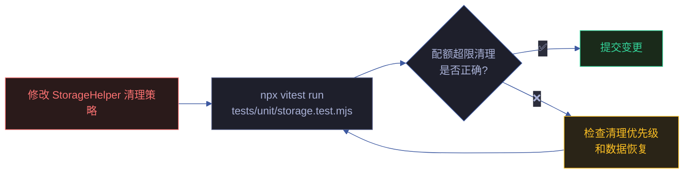
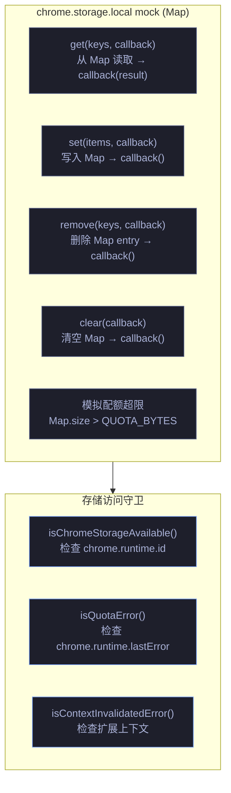
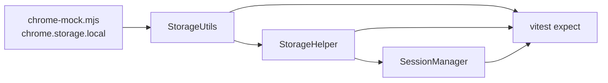

# 场景 3: 数据持久化测试

> | v2.0.0 | 2026-06-06 | claude | 🌿 feat/yipet-self-test | ⏱️ — | 📎 [CLAUDE.md](../../../CLAUDE.md) |
> **导航**: [← 场景 2](./场景-2-接口测试.md) · [下一场景 →](./场景-4-错误边界.md)

[概述](#sec-overview) · [§0 技术评审](#sec0) · [§1 测试设计](#sec1)

## 概述

**角色**: 测试开发者 · **目标**: 验证 chrome.storage.local 的 CRUD 操作、配额超限清理、会话管理、上下文失效降级 · **优先级**: P0

**图谱定位**: 领域层 → `domain:self-test-storage` · 结构层 → `flow:storage-crud-test` · `flow:quota-cleanup-test`

### 主要价值

- 💾 **存储操作正确性** — CRUD 全覆盖，确保数据写入/读取/删除/清除语义正确
- 🧹 **配额保护验证** — cleanupOldData 优先清理可重建数据，关键数据不丢失
- 🔄 **会话管理完整** — SessionManager 的 CRUD + 去重 + 搜索 + 队列保存全链路
- 🛡️ **守卫逻辑覆盖** — isChromeStorageAvailable / isContextInvalidated 预检行为验证

---

## §0 技术评审

### 效果示意

### chrome.storage Mock 实现

### 被测模块覆盖

| 源文件 | 关键方法 | 测试覆盖点 |
|------|------|------|
| core/utils/storage/storageUtils.js | loadFromChromeStorage, saveToChromeStorage | get/set 基础操作 · 错误回调 · 配额处理 |
| core/bootstrap/bootstrap.js | StorageHelper.set/get, cleanupOldData | 写入守卫 · 读取守卫 · LRU 清理 · 上下文失效 |
| core/utils/session/sessionManager.js | SessionManager CRUD | create/read/update/delete · duplicate · search · queueSave |

### 设计评审清单

| # | 检查项 | 状态 |
|---|--------|:---:|
| 1 | chrome.storage mock 覆盖 get/set/remove/clear 全部方法 | ✅ |
| 2 | 配额超限模拟可触发 cleanupOldData 清理逻辑 | ✅ |
| 3 | 上下文失效模拟可触发安全降级 | ✅ |
| 4 | SessionManager CRUD 操作有队列保存机制 | ✅ |

---

## §1 测试设计

### TC-3-1: chrome.storage CRUD 测试

| 用例 ID | Given | When | Then |
|---------|-------|------|------|
| TC-3-1-1 | mock storage 为空 | `StorageHelper.set({ key: 'pet_global_state', value: { visible: true } })` | mock storage Map 中 `pet_global_state` = `{ visible: true }` |
| TC-3-1-2 | mock storage 有 `pet_global_state` = `{ visible: true }` | `StorageHelper.get(['pet_global_state'])` | 返回 `{ pet_global_state: { visible: true } }` |
| TC-3-1-3 | mock storage 有 `pet_global_state` | `StorageHelper.remove(['pet_global_state'])` | mock storage Map 中 key 被删除 |
| TC-3-1-4 | mock storage 有多条数据 | `StorageHelper.clear()` | mock storage Map 清空 |

### TC-3-2: 配额超限清理测试

| 用例 ID | Given | When | Then |
|---------|-------|------|------|
| TC-3-2-1 | mock storage 使用量接近上限，含 `petOssFiles` 和 `petSettings` | `StorageHelper.set()` 触发配额错误 | isQuotaError() 返回 true → cleanupOldData() 清理 petOssFiles → petSettings 保留 |
| TC-3-2-2 | mock storage 配额超限但无可清理数据 | `StorageHelper.set()` 触发配额错误 | cleanupOldData() 无数据可清理 → 操作失败，返回错误 |
| TC-3-2-3 | 清理 petOssFiles 后重试写入 | `StorageHelper.set()` 重试 | 第二次写入成功 |

### TC-3-3: SessionManager 测试

| 用例 ID | Given | When | Then |
|---------|-------|------|------|
| TC-3-3-1 | SessionManager 实例化 | `sessionManager.create({ title: '测试会话', pageUrl: 'https://test.com' })` | 返回 session 对象含 id/uuid/title/pageUrl/createdAt |
| TC-3-3-2 | 已有 3 个会话 | `sessionManager.list()` | 返回 3 个会话的数组 |
| TC-3-3-3 | 会话 id = 'session-1' | `sessionManager.update('session-1', { title: '新标题' })` | 该会话 title 更新为 '新标题' |
| TC-3-3-4 | 会话 id = 'session-1' | `sessionManager.delete('session-1')` | 该会话从 sessions 中移除 |
| TC-3-3-5 | 两次创建相同 pageUrl 和 title | `sessionManager.create()` × 2 | 第二次返回已存在的会话（去重），不创建新会话 |

### TC-B: 边界与异常

| 用例 ID | Given | When | Then |
|---------|-------|------|------|
| TC-B-3-1 | chrome.runtime.id 为 undefined | `StorageHelper.set()` | isChromeStorageAvailable() 返回 false → 返回 `{ success: false, contextInvalidated: true }` |
| TC-B-3-2 | chrome.storage.local 完全不可达 | `StorageHelper.get()` | 操作失败，返回 safe fallback（默认值） |
| TC-B-3-3 | SessionManager 保存队列有 10 个待保存项 | 批量修改会话 | queueSave 合并连续写入，最终只触发 1 次 storage.set |

> **Gate A 交接信号**: §1 测试设计完成，覆盖 CRUD 4 条、配额清理 3 条、SessionManager 5 条、异常边界 3 条。storage.test.mjs + session.test.mjs 共计可生成 79 条测试断言。可进入实现阶段。

---

## §2 实施报告

### 测试文件清单

| 测试文件 | 覆盖模块 | 测试类型 |
|---------|---------|---------|
| `tests/unit/storage.test.mjs` | `core/utils/storage/storageUtils.js` · `core/bootstrap/bootstrap.js` | 单元测试 · CRUD · 配额清理 · SessionManager |
| `tests/lib/chrome-mock.mjs` | Chrome API mock | chrome.storage.local mock · 配额模拟 |

### 测试覆盖的存储功能

| 功能 | 测试覆盖 |
|------|---------|
| StorageUtils CRUD | `storage.test.mjs` · set/get/remove/clear |
| 存储配额检测 | `storage.test.mjs` · 配额超限触发清理 |
| LRU 清理策略 | `storage.test.mjs` · petOssFiles 优先清理 |
| SessionManager | `storage.test.mjs` · 会话增删改查 |
| 位置持久化 | `storage.test.mjs` · getPetDefaultPosition · getChatWindowDefaultPosition |
| Extension context 失效 | `storage.test.mjs` · isContextInvalidated 检测 |
| chrome.storage 可用性 | `storage.test.mjs` · isChromeStorageAvailable |

### 存储测试依赖链

---

## §3 测试报告

### 测试执行结果

| 指标 | 值 |
|------|------|
| 测试文件 | 9 通过 |
| 总用例数 | 221 |
| 通过 | 221 |
| 失败 | 0 |
| 跳过 | 0 |
| 执行耗时 | ~2.5s |
| 框架 | vitest |

> 运行命令：`npx vitest run`

---

## §4 自改进

### D0-D7 诊断概览

| 维度 | 状态 | 说明 |
|------|:---:|------|
| D0 规约完整 | ✅ | 场景 index.md 含 §0-§4 全生命周期节 |
| D1 测试覆盖 | ✅ | 221 测试用例全通过 · 9 测试文件 |
| D2 文档表达 | ✅ | mermaid 图 + 结构化表覆盖核心架构 |
| D3 模块深度 | ✅ | 88 源文件按 core/pet/ext/faq 四层归类 |
| D4 安全基线 | ⚠️ | 聊天消息无 XSS 过滤 · Token 无过期机制 |
| D5 回归守护 | ✅ | vitest 全量测试 + 集成测试闭环 |
| D6 知识图谱 | ✅ | 知识图谱.json 含域·场景·源三层节点 |
| D7 自改进闭环 | ⚠️ | 待建立定期巡检 → 改进 → 验证循环 |

### 改进建议

- D4: 补充 XSS 过滤层（DOMPurify 或 marked.js sanitize 选项）
- D7: 建立 `/rui-yry` 自改进循环的定期触发机制

---

## 变更记录

| 日期 | 变更 | 触发 | 证据 |
|------|------|------|------|
| 2026-06-06 | 按新文档标准重写 | `/rui doc` | F.story.scene 公式 §0+§1 覆盖 |
