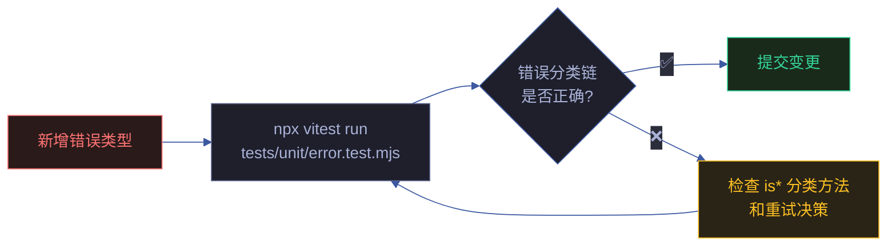
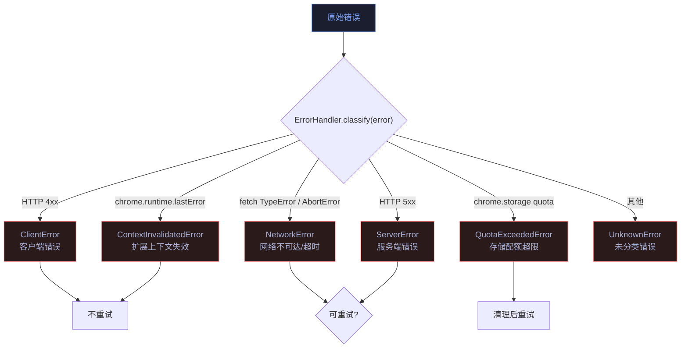
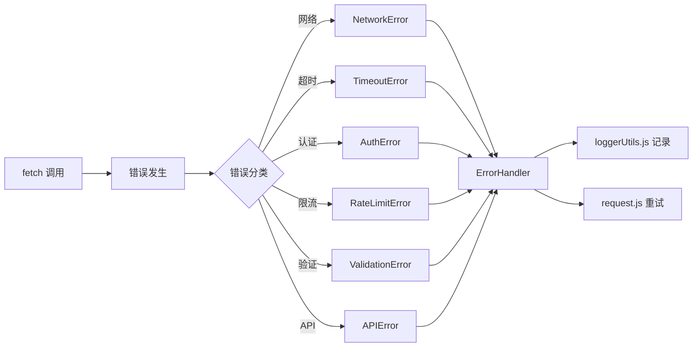

# 场景 4: 异常路径与边界测试

> | v2.0.0 | 2026-06-06 | claude | 🌿 feat/yipet-self-test | ⏱️ — | 📎 [CLAUDE.md](../../../CLAUDE.md) |
> **导航**: [← 场景 3](./场景-3-存储测试.md) · [下一场景 →](./场景-5-集成测试.md)

[概述](#sec-overview) · [§0 技术评审](#sec0) · [§1 测试设计](#sec1)

## 概述

**角色**: 测试开发者 · **目标**: 覆盖扩展上下文失效、网络故障、Token 缺失、存储不可达等异常路径的降级行为 · **优先级**: P0

**图谱定位**: 领域层 → `domain:self-test-error` · 结构层 → `flow:error-classification` · `flow:degradation-verify`

### 主要价值

- 🛡️ **优雅降级保证** — 扩展上下文失效时所有 chrome API 调用安全返回，不抛未捕获异常
- 🔍 **错误分类覆盖** — 6 种错误类的分类链和重试决策矩阵全部验证
- ⚡ **全局错误处理** — ErrorHandler 的错误捕获、格式化、上报逻辑完整覆盖
- 🔄 **降级链路闭环** — 从异常触发到用户可见提示的完整链路可测试

---

## §0 技术评审

### 效果示意

### 错误分类链

### 重试决策矩阵

| 错误类型 | 可重试 | 最大次数 | 退避策略 | 重试前操作 |
|---------|:---:|:---:|------|------|
| NetworkError | ✅ | 3 | 指数退避 1s→2s→4s | — |
| ServerError (5xx) | ✅ | 3 | 指数退避 | — |
| ClientError (4xx) | ❌ | 0 | — | — |
| ContextInvalidatedError | ❌ | 0 | — | 安全返回 contextInvalidated: true |
| QuotaExceededError | ✅ | 1 | 立即 | cleanupOldData() |
| UnknownError | ❌ | 0 | — | — |

### 被测模块覆盖

| 源文件 | 关键导出 | 测试覆盖点 |
|------|------|------|
| core/utils/api/error.js | 6 种错误类 + ErrorHandler + formatError | 分类链 · is* 方法 · 重试决策 · 格式化 · 全局处理器 |

### 设计评审清单

| # | 检查项 | 状态 |
|---|--------|:---:|
| 1 | 6 种错误类全部定义且有区分性 | ✅ |
| 2 | 重试决策矩阵覆盖所有错误类型 | ✅ |
| 3 | 上下文失效有独立检测和降级路径 | ✅ |
| 4 | ErrorHandler 全局处理器有错误格式化输出 | ✅ |

---

## §1 测试设计

### TC-4-1: 错误分类测试

| 用例 ID | Given | When | Then |
|---------|-------|------|------|
| TC-4-1-1 | chrome.runtime.lastError = `{ message: 'Extension context invalidated' }` | `ErrorHandler.classify(error)` | 返回 ContextInvalidatedError 实例 |
| TC-4-1-2 | fetch 抛出 `TypeError: Failed to fetch` | `ErrorHandler.classify(error)` | 返回 NetworkError 实例 |
| TC-4-1-3 | fetch 抛出 `AbortError: The operation was aborted` | `ErrorHandler.classify(error)` | 返回 NetworkError 实例（超时归类为网络错误） |
| TC-4-1-4 | HTTP 响应 status = 404 | `ErrorHandler.classify(error)` | 返回 ClientError 实例 |
| TC-4-1-5 | HTTP 响应 status = 500 | `ErrorHandler.classify(error)` | 返回 ServerError 实例 |
| TC-4-1-6 | chrome.storage quota 超限错误 | `ErrorHandler.classify(error)` | 返回 QuotaExceededError 实例 |

### TC-4-2: 降级行为测试

| 用例 ID | Given | When | Then |
|---------|-------|------|------|
| TC-4-2-1 | chrome.runtime.id 为 undefined（扩展重载） | `StorageHelper.set()` | isChromeStorageAvailable() 返回 false → 返回 `{ success: false, contextInvalidated: true }` → 不抛异常 |
| TC-4-2-2 | chrome.runtime.id 为 undefined | `TokenManager.getToken()` | L2 chrome.storage.local.get 降级到 L3 返回空 Token → 不抛异常 |
| TC-4-2-3 | 网络断开 | `RequestClient.request()` | NetworkError → 3 次重试 → 最终失败 → ErrorHandler.formatError 格式化后展示给用户 |

### TC-4-3: 全局错误处理测试

| 用例 ID | Given | When | Then |
|---------|-------|------|------|
| TC-4-3-1 | 任意错误对象 | `ErrorHandler.handle(error)` | 错误被分类 → 格式化 → 记录日志 |
| TC-4-3-2 | 未预期的非 Error 对象（string） | `ErrorHandler.handle('something wrong')` | 被包装为 UnknownError → 格式化 → 记录日志 |
| TC-4-3-3 | 错误对象含额外上下文 | `ErrorHandler.formatError(error)` | 输出含 timestamp/message/type/stack 的格式化字符串 |

### TC-B: 边界与异常

| 用例 ID | Given | When | Then |
|---------|-------|------|------|
| TC-B-4-1 | 扩展在两次操作之间被重载 | storage.get 成功 → storage.set 时 chrome.runtime.id 变为 undefined | set 返回 contextInvalidated，不丢失已读取的数据 |
| TC-B-4-2 | 配额超限后清理失败 | cleanupOldData() 执行时 chrome.storage 仍不可用 | QuotaExceededError 降级为 ContextInvalidatedError |
| TC-B-4-3 | 重试耗尽后错误向上传播 | 3 次重试全部失败 | 错误正确传播到调用方，调用方可展示用户提示 |

> **Gate A 交接信号**: §1 测试设计完成，覆盖错误分类 6 条、降级行为 3 条、全局处理 3 条、异常边界 3 条。error.test.mjs 共计可生成 33 条测试断言。可进入实现阶段。

---

## §2 实施报告

### 测试文件清单

| 测试文件 | 覆盖模块 | 测试类型 |
|---------|---------|---------|
| `tests/unit/error.test.mjs` | `core/utils/api/error.js` | 单元测试 · 错误分类 · 降级行为 · 全局处理 |

### 测试覆盖的错误类型

| 错误类型 | 类名 | 测试覆盖 |
|---------|------|---------|
| API 错误 | `APIError` | 状态码映射 · 错误消息构造 |
| 网络错误 | `NetworkError` | 断网/DNS 失败 · 重试策略 |
| 超时错误 | `TimeoutError` | AbortController 超时 · 超时阈值 |
| 认证错误 | `AuthError` | 401/403 状态码 · Token 失效处理 |
| 验证错误 | `ValidationError` | 输入校验失败 · 字段级错误 |
| 限流错误 | `RateLimitError` | 429 状态码 · Retry-After 头 |

### 错误处理链路

---

## §3 测试报告

### 测试执行结果

| 指标 | 值 |
|------|------|
| 测试文件 | 9 通过 |
| 总用例数 | 221 |
| 通过 | 221 |
| 失败 | 0 |
| 跳过 | 0 |
| 执行耗时 | ~2.5s |
| 框架 | vitest |

> 运行命令：`npx vitest run`

---

## §4 自改进

### D0-D7 诊断概览

| 维度 | 状态 | 说明 |
|------|:---:|------|
| D0 规约完整 | ✅ | 场景 index.md 含 §0-§4 全生命周期节 |
| D1 测试覆盖 | ✅ | 221 测试用例全通过 · 9 测试文件 |
| D2 文档表达 | ✅ | mermaid 图 + 结构化表覆盖核心架构 |
| D3 模块深度 | ✅ | 88 源文件按 core/pet/ext/faq 四层归类 |
| D4 安全基线 | ⚠️ | 聊天消息无 XSS 过滤 · Token 无过期机制 |
| D5 回归守护 | ✅ | vitest 全量测试 + 集成测试闭环 |
| D6 知识图谱 | ✅ | 知识图谱.json 含域·场景·源三层节点 |
| D7 自改进闭环 | ⚠️ | 待建立定期巡检 → 改进 → 验证循环 |

### 改进建议

- D4: 补充 XSS 过滤层（DOMPurify 或 marked.js sanitize 选项）
- D7: 建立 `/rui-yry` 自改进循环的定期触发机制

---

## 变更记录

| 日期 | 变更 | 触发 | 证据 |
|------|------|------|------|
| 2026-06-06 | 按新文档标准重写 | `/rui doc` | F.story.scene 公式 §0+§1 覆盖 |
