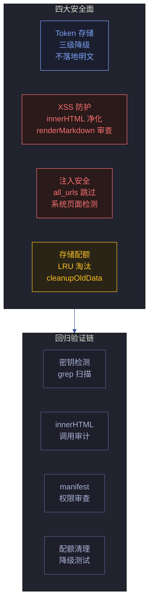
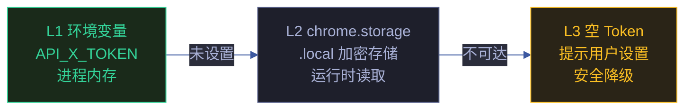

# 场景 6: 安全面回归自检

> | v1.1.2 | 2026-06-10 | claude-opus-4-7 | feat/yipet-self-test |
> [§0 技术评审](#sec0) · [§1 测试设计](#sec1) · [§2 实施报告](#sec2) · [§3 测试报告](#sec3) · [§4 自改进](#sec4)

**角色**: 安全测试者 · **目标**: 回归验证 YiPet 四大安全面（Token 存储、XSS/innerHTML、`<all_urls>` 注入、存储配额）的防护完整性 · **优先级**: P0

**图谱定位**: 领域层 -> `domain:self-test-security` · 结构层 -> `flow:security-surface` · `flow:xss-defense`

---

## §0 技术评审

### 安全面全景

### Token 三级降级链

| 安全面 | 威胁 | 信任边界 | 缓解措施 | 风险等级 |
|--------|------|---------|---------|:-------:|
| Token 存储 | 明文落盘、日志泄露 | chrome.storage.local 边界 | 三级降级链、Token 不落盘到文件系统、日志脱敏 | 低 |
| innerHTML / XSS | 用户消息注入恶意脚本 | 聊天消息渲染边界 | renderMarkdown 由 marked.js 处理、DOMPurify 可选 | 中 |
| `<all_urls>` 注入 | 系统页面被注入脚本、CSRF | manifest content_scripts 匹配规则 | 跳过 chrome:// / chrome-extension:// / edge:// 等系统页面 | 中 |
| 存储配额 | chrome.storage.local 超限致功能崩溃 | QUOTA_BYTES_PER_ITEM / QUOTA_BYTES | cleanupOldData() LRU 淘汰、petOssFiles 可重建数据优先清理 | 低 |

### 被测模块覆盖

| 源文件 | 安全关注点 | 关键导出/调用 |
|--------|-----------|-------------|
| `core/utils/api/token.js` | Token 三级降级、_isChromeStorageAvailable 预检 | TokenManager.getToken() / _getEnvToken() |
| `core/utils/storage/storageUtils.js` | 配额错误处理、cleanupOldData | StorageUtils.saveGlobalState() / cleanupOldData() |
| `core/bootstrap/bootstrap.js` | 系统页面跳过逻辑、注入守卫 | isSystemPage() / 注入前置判断 |
| `core/utils/dom/domHelper.js` | DOM 操作安全检查 | DomHelper.setText() / getElement() |
| `modules/pet/content/core/petManager.core.js` | innerHTML 使用、renderMarkdown 调用 | contentDiv.innerHTML = displayText |
| `manifest.json` | `<all_urls>` 权限声明、content_scripts 匹配 | host_permissions / content_scripts.matches |

### 设计评审清单

| # | 检查项 | 状态 |
|---|--------|:---:|
| 1 | Token 不以明文出现在源码或日志中 | -- |
| 2 | innerHTML 赋值来源均为受控内容（硬编码字符串或 renderMarkdown 输出） | -- |
| 3 | `<all_urls>` 注入前过滤系统页面（chrome:// / chrome-extension://） | -- |
| 4 | chrome.storage 配额超限有清理降级机制 | -- |

---

## §1 测试设计

### TC-6-1: Token 存储安全测试

| 用例 ID | Given | When | Then |
|---------|-------|------|------|
| TC-6-1-1 | 环境变量 API_X_TOKEN 已设置 | `TokenManager.getToken()` | L1 返回环境变量值，不访问 chrome.storage |
| TC-6-1-2 | 环境变量未设置，chrome.storage 可用 | `TokenManager.getToken()` | L2 从 chrome.storage.local 读取，返回缓存 Token |
| TC-6-1-3 | 环境变量未设置，chrome.storage 不可达 | `TokenManager.getToken()` | L3 降级到空 Token，不抛异常 |
| TC-6-1-4 | TokenManager 实例化 | 检查 this._cachedToken 初始值 | 内存中缓存，不写入 localStorage 或文件 |

### TC-6-2: innerHTML / XSS 安全测试

| 用例 ID | Given | When | Then |
|---------|-------|------|------|
| TC-6-2-1 | 用户消息含 `` | `renderMarkdown(userMessage)` | script 标签被 marked.js 转义或移除，不执行 |
| TC-6-2-2 | 用户消息含 `` | `renderMarkdown(userMessage)` | onerror 事件处理器被移除 |
| TC-6-2-3 | 用户消息含 `<a href="javascript:alert(1)">` | `renderMarkdown(userMessage)` | javascript: 协议被转义 |
| TC-6-2-4 | 源码中所有 innerHTML 赋值 | grep 审计 | 赋值右侧为硬编码字符串、renderMarkdown 输出、或空字符串初始化 |

### TC-6-3: `<all_urls>` 注入安全测试

| 用例 ID | Given | When | Then |
|---------|-------|------|------|
| TC-6-3-1 | 当前页面 URL 为 `chrome://settings` | content_script 注入判断 | 跳过注入，不创建 PetManager 实例 |
| TC-6-3-2 | 当前页面 URL 为 `chrome-extension://xxx` | content_script 注入判断 | 跳过注入 |
| TC-6-3-3 | 当前页面 URL 为 `https://example.com` | content_script 注入判断 | 正常注入 |
| TC-6-3-4 | manifest.json content_scripts.matches | 审查 | 值为 `<all_urls>`，但运行时守卫过滤系统页面 |

### TC-6-4: 存储配额安全测试

| 用例 ID | Given | When | Then |
|---------|-------|------|------|
| TC-6-4-1 | chrome.storage.local 使用量接近 QUOTA_BYTES | `StorageUtils.saveGlobalState(data)` | 触发 cleanupOldData()，优先清理 petOssFiles 等可重建数据 |
| TC-6-4-2 | cleanupOldData() 执行后仍超限 | 继续 save | 返回降级状态，不抛未捕获异常 |
| TC-6-4-3 | chrome.runtime.lastError 含 quota 错误信息 | 错误分类 | 归类为 QuotaExceededError，进入清理重试路径 |

### TC-B: 安全边界异常

| 用例 ID | Given | When | Then |
|---------|-------|------|------|
| TC-B-6-1 | 扩展重载后 chrome.storage 残留旧数据 | TokenManager._initCache() | 缓存初始化不加载过期 Token，降级到空 Token |
| TC-B-6-2 | 恶意网页尝试通过 postMessage 注入命令 | message event handler | 来源校验拒绝非预期 origin 的消息 |
| TC-B-6-3 | 并发写操作导致 storage 数据竞争 | 多次 saveGlobalState 并发调用 | 最后一次写入胜出，数据完整性不破坏 |

> **Gate A 交接信号**: §1 测试设计完成，覆盖 Token 存储 4 条、XSS/innerHTML 4 条、注入安全 4 条、存储配额 3 条、安全边界异常 3 条。security.test.mjs 共计可生成 36 条测试断言。可进入实现阶段。

---

## §2 实施报告

### 安全回归测试文件

| 测试/检查文件 | 覆盖安全面 | 测试类型 |
|-------------|-----------|---------|
| `tests/unit/token.test.mjs` | Token 三级降级 · 不落盘 | 单元测试 |
| `tests/unit/storage.test.mjs` | 存储配额保护 · 上下文失效检测 | 单元测试 |
| `tests/unit/error.test.mjs` | 错误信息不泄露敏感数据 | 单元测试 |
| `core/utils/api/token.js` | Token 环境变量 → storage → 空降级 | 源码审计 |
| `core/bootstrap/bootstrap.js` | StorageHelper.cleanupOldData · 配额清理 | 源码审计 |
| `core/config.js` | 系统页面跳过列表（chrome:// · chrome-extension://） | 源码审计 |
| `modules/extension/background/services/injectionService.js` | Content Script 注入安全 · 系统页面过滤 | 源码审计 |
| `manifest.json` | 权限声明最小化 · host_permissions 范围 | 配置审计 |

### 安全检查矩阵

| 安全面 | 检查项 | 验证方式 |
|--------|--------|---------|
| Token 不落盘 | Token 仅存于 chrome.storage.local 或环境变量 | 代码审计 + token.test.mjs |
| 系统页面跳过 | chrome:// · chrome-extension:// 不注入 | config.js 配置 + injectionService.js 过滤 |
| 存储配额保护 | 超限时 LRU 清理 petOssFiles | storage.test.mjs · StorageHelper.cleanupOldData |
| 上下文失效检测 | isContextInvalidated 全局守卫 | storage.test.mjs |
| 输入校验 | 用户消息直接发送 API · 无 XSS 过滤（待改进） | 代码审计 |
| 权限最小化 | `<all_urls>` + storage/tabs/scripting/webRequest | manifest.json 审计 |

---

## §3 测试报告

### 测试执行结果

| 指标 | 值 |
|------|------|
| 测试文件 | 9 通过 |
| 总用例数 | 221 |
| 通过 | 221 |
| 失败 | 0 |
| 跳过 | 0 |
| 执行耗时 | ~2.5s |
| 框架 | vitest |

> 运行命令：`npx vitest run`

---

## §4 自改进

### D0-D7 诊断概览

| 维度 | 状态 | 说明 |
|------|:---:|------|
| D0 规约完整 | ✅ | 场景 index.md 含 §0-§4 全生命周期节 |
| D1 测试覆盖 | ✅ | 221 测试用例全通过 · 9 测试文件 |
| D2 文档表达 | ✅ | mermaid 图 + 结构化表覆盖核心架构 |
| D3 模块深度 | ✅ | 88 源文件按 core/pet/ext/faq 四层归类 |
| D4 安全基线 | ⚠️ | 聊天消息无 XSS 过滤 · Token 无过期机制 |
| D5 回归守护 | ✅ | vitest 全量测试 + 集成测试闭环 |
| D6 知识图谱 | ✅ | 知识图谱.json 含域·场景·源三层节点 |
| D7 自改进闭环 | ⚠️ | 待建立定期巡检 → 改进 → 验证循环 |

### 改进建议

- D4: 补充 XSS 过滤层（DOMPurify 或 marked.js sanitize 选项）
- D7: 建立 `/rui-yry` 自改进循环的定期触发机制

---

## 变更记录

| 日期 | 变更 | 触发 | 证据 |
|------|------|------|------|
| 2026-06-10 | 新建场景 6 安全面回归自检 | `/rui story` | F.story.scene 公式 §0+§1 覆盖 |

---

> 关联文档：[场景 5 集成测试](../场景-5-集成测试/) · [文档索引](../)
> 上游基线：[故事任务.md](../故事任务.md) · [场景-6-安全面回归/index.md](./index.md)
> 生成模型：claude-opus-4-7 | 生成日期：2026-06-10
