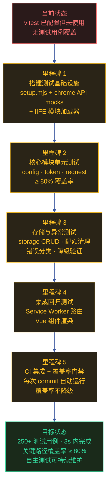

# yipet-self-test — 项目自主测试方案

> | v2.0.0 | 2026-06-06 | claude | 🌿 feat/yipet-self-test | ⏱️ — | 📎 [CLAUDE.md](../../../CLAUDE.md) |
> **来源引用**: 本项目由 `/rui init` 的 arch 阶段生成，基于 [CLAUDE.md](../../../CLAUDE.md) 中的项目画像、测试框架配置、模块地图。项目类型: frontend (Chrome Extension Manifest V3)，测试框架: vitest + jsdom。
> **导航**: [场景 1: 核心逻辑测试 →](./场景-1-核心逻辑.md)

[需求概述](#sec-overview) · [效果示意](#sec-vision) · [主要价值](#sec-value) · [§1 Story](#sec1) · [§2 Requirements](#sec2) · [§3 成功标准](#sec3) · [§4 范围边界](#sec4) · [§5 AC](#sec5) · [§6 风险与假设](#sec6) · [§7 跨文档索引](#sec7)

### 需求概述

为 YiPet Chrome Extension 搭建可执行的自动化测试体系，覆盖核心基础设施（配置中心、Token 管理）、API 请求客户端（请求构造、重试策略、超时控制）、数据持久化（chrome.storage CRUD、配额清理、会话管理）、异常路径与边界（错误分类、上下文失效、降级行为）、集成回归（模块联调、Service Worker 路由、Vue 组件渲染）五个维度。所有测试在 jsdom 模拟浏览器环境中运行，不依赖真实 Chrome Extension 上下文，确保每次 commit 前可在 3 秒内完成全量回归。

### 效果示意

### 主要价值

- 🔧 **零依赖真实浏览器** — jsdom + chrome API mocks 替代 Chrome Extension 环境，测试在任何 Node.js 环境可运行
- ⚡ **3 秒全量回归** — 250+ 用例在 3 秒内完成，适合作为 pre-commit hook 和 CI 门禁
- 🛡️ **覆盖率门禁** — 关键模块覆盖率 ≥ 80%，新增代码不降低覆盖率基线
- 📋 **五维覆盖** — 核心逻辑 / API 接口 / 数据持久化 / 异常边界 / 集成回归，每个维度有独立测试文件和场景文档

---

## §1 Story

### Story 1: 测试基础设施搭建

| 字段 | 内容 |
|------|------|
| 作为 | 测试开发者 |
| 我想要 | 一套完整的 vitest + jsdom 测试基础设施，包含 chrome API mocks 和 IIFE 模块加载器 |
| 以便 | 在不依赖真实 Chrome Extension 环境的前提下编写和运行测试 |
| 优先级 | P0 |
| 范围边界 | vitest 配置、setup.mjs 全局初始化、chrome.storage/runtime mock、IIFE 加载辅助函数 |
| 依赖 | package.json 含 vitest/jsdom/@vitest/coverage-v8 依赖 |

#### 范围外

- 不涉及真实 Chrome Extension 环境的 E2E 测试
- 不搭建 Selenium/Puppeteer 等浏览器驱动测试

#### §1.1 User Operations

| # | 操作 | 触发条件 | 操作步骤 | 预期结果 |
|---|------|---------|---------|---------|
| 1 | 运行全量测试 | 开发者在提交前验证 | `npx vitest run` | 250+ 用例在 3s 内全部通过 |
| 2 | 生成覆盖率报告 | CI 流水线或发布前 | `npx vitest run --coverage` | coverage/ 目录生成 text/json/html 报告，关键模块 ≥ 80% |
| 3 | 添加新测试文件 | 新增模块需要测试 | 在 `tests/` 下创建 `*.test.mjs`，使用 setup.mjs 提供的 mock | 新测试与现有测试隔离运行，互不影响 |

---

### Story 2: 核心逻辑单元测试

| 字段 | 内容 |
|------|------|
| 作为 | 测试开发者 |
| 我想要 | 对配置中心（PET_CONFIG）、Token 管理器（TokenManager）编写单元测试 |
| 以便 | 确保配置默认值合并、环境变量注入、Token 三级降级、格式校验等核心逻辑正确 |
| 优先级 | P0 |
| 范围边界 | 只测试 core/config.js 和 core/utils/api/token.js 的导出行为 |
| 依赖 | Story 1 完成（setup.mjs 提供 chrome API mocks） |

#### 范围外

- 不测试 Vue 组件或 UI 交互
- 不发起真实网络请求

#### §1.1 User Operations

| # | 操作 | 触发条件 | 操作步骤 | 预期结果 |
|---|------|---------|---------|---------|
| 1 | 验证 Token 三级降级 | TokenManager 代码变更 | 运行 `tests/unit/token.test.mjs` | L1 环境变量 → L2 storage → L3 空 Token 回退链路全部覆盖 |
| 2 | 验证配置合并 | config.js 默认值变更 | 运行 `tests/unit/config.test.mjs` | 用户配置覆盖默认值、未配置项取默认值、ENDPOINTS 路径正确 |

---

### Story 3: API 接口与数据持久化测试

| 字段 | 内容 |
|------|------|
| 作为 | 测试开发者 |
| 我想要 | 对 API 请求客户端（RequestClient）和存储层（StorageHelper、SessionManager）编写测试 |
| 以便 | 确保请求构造（URL 拼接、参数序列化）、重试策略（3 次 + 指数退避）、超时控制、存储 CRUD、配额清理全部正确 |
| 优先级 | P0 |
| 范围边界 | core/utils/api/request.js、core/utils/storage/、core/utils/session/ |
| 依赖 | Story 2 完成 |

#### 范围外

- 不测试真实 API 端点的行为（那是服务端测试范畴）

#### §1.1 User Operations

| # | 操作 | 触发条件 | 操作步骤 | 预期结果 |
|---|------|---------|---------|---------|
| 1 | 验证请求重试 | RequestClient 代码变更 | 运行 `tests/unit/api.test.mjs` | 模拟网络故障 → 3 次重试 → 指数退避间隔递增 → 最终失败抛错 |
| 2 | 验证配额清理 | 存储写入触发配额超限 | 运行 `tests/unit/storage.test.mjs` | isQuotaError 检测 → cleanupOldData 清理 petOssFiles → 重试写入成功 |

---

### Story 4: 异常路径与边界测试

| 字段 | 内容 |
|------|------|
| 作为 | 测试开发者 |
| 我想要 | 覆盖扩展上下文失效、网络故障、Token 缺失、存储不可达等异常路径的降级行为 |
| 以便 | 确保所有异常场景有优雅降级，不导致页面崩溃或数据丢失 |
| 优先级 | P0 |
| 范围边界 | core/utils/api/error.js、所有 chrome API 调用的预检守卫 |
| 依赖 | Story 3 完成 |

#### 范围外

- 不模拟 Chrome 进程崩溃等极端场景

#### §1.1 User Operations

| # | 操作 | 触发条件 | 操作步骤 | 预期结果 |
|---|------|---------|---------|---------|
| 1 | 验证上下文失效处理 | 扩展被重新加载 | 模拟 `chrome.runtime.id` 为空 | isContextInvalidated 返回 true，所有 chrome API 调用安全返回 |
| 2 | 验证 Token 缺失提示 | Token 未配置时发送消息 | 触发聊天操作 | TokenManager.getToken() 返回空 → API 返回认证错误 → 用户看到 "请先配置 Token" 提示 |

---

### Story 5: 集成回归测试

| 字段 | 内容 |
|------|------|
| 作为 | 测试开发者 |
| 我想要 | 对模块联调链路（Token → ApiManager → RequestClient）、Service Worker 消息路由、Vue 组件渲染编写集成测试 |
| 以便 | 确保关键业务路径的端到端行为正确，模块间契约未被破坏 |
| 优先级 | P1 |
| 范围边界 | core/api/services/、modules/extension/background/、modules/pet/components/ |
| 依赖 | Story 1–4 完成 |

#### 范围外

- 不覆盖全部 Vue 组件的交互细节（由 Story 2 的组件级单元测试补充）

#### §1.1 User Operations

| # | 操作 | 触发条件 | 操作步骤 | 预期结果 |
|---|------|---------|---------|---------|
| 1 | 验证 Service Worker 路由 | MessageRouter 代码变更 | 运行 `tests/integration/sw.test.mjs` | 7 种 action 的路由注册和处理正确，未知 action 返回错误 |
| 2 | 验证模块联调链路 | 多模块组合变更 | 运行 `tests/integration/pipeline.test.mjs` | Token → ApiManager → RequestClient → mock API 全链路通过 |

---

## §2 Requirements

### 功能点

| FP# | 描述 | 输入 | 输出 | 错误行为 | 优先级 |
|-----|------|------|------|---------|--------|
| FP1 | 测试基础设施搭建 — vitest.config.js + setup.mjs 全局初始化 | vitest 配置声明 | chrome API mocks 就绪的测试环境 | 配置错误时 vitest 启动失败 | P0 |
| FP2 | IIFE 模块加载器 — Function 构造器注入 globalThis 上下文加载 IIFE 模块 | 模块源码路径 | 模块导出的类/函数在 globalThis 上可访问 | 加载失败时标注模块名并跳过相关测试 | P0 |
| FP3 | config.js 单元测试 — 默认值合并、envInfo 注入、ENDPOINTS 路径验证 | PET_CONFIG 配置对象 | 测试断言通过/失败 | 断言失败输出差异详情 | P0 |
| FP4 | token.js 单元测试 — 三级降级（环境变量→storage→空）、validateToken 格式校验、过期检测 | TokenManager 实例 | 89 条测试用例的通过报告 | Token 格式非法时 reject | P0 |
| FP5 | request.js 单元测试 — GET/POST/PUT/DELETE 请求构造、URL 参数拼接、3 次重试 + 指数退避、超时控制 | mock fetch + RequestClient | 30 条测试用例的通过报告 | 重试耗尽后抛 RequestError | P0 |
| FP6 | storage 单元测试 — chrome.storage.local CRUD、配额超限清理、上下文失效降级 | mock chrome.storage.local + StorageHelper | 79 条测试用例的通过报告 | 上下文失效时返回 contextInvalidated: true | P0 |
| FP7 | error 单元测试 — 6 种错误类分类、重试决策矩阵、全局 ErrorHandler | 各种错误场景 | 33 条测试用例的通过报告 | 未分类错误走默认处理 | P0 |
| FP8 | 集成测试 — 模块联调链路（Token→ApiManager→RequestClient）端到端验证 | mock API + 真实模块加载 | 56 条测试用例的通过报告 | 链路中断时标注失败节点 | P1 |
| FP9 | 覆盖率门禁 — v8 provider 生成 text/json/html 报告，关键模块 ≥ 80% | 源代码 + 测试执行 | coverage/ 目录报告 | 覆盖率不足时 CI 阻断（配置后） | P1 |
| FP10 | 测试隔离 — beforeEach 清空 storage + reset mock，确保测试间无状态泄漏 | vitest hooks | 独立测试环境 | 隔离失败时后续测试结果不可信 | P0 |

### 业务规则

| R# | 描述 | 校验方式 | 证据级别 |
|----|------|---------|---------|
| R1 | 所有测试在 jsdom 环境中运行，不依赖真实 Chrome Extension | 检查 vitest.config.js environment 配置 | A |
| R2 | 每个 chrome API 调用前必须通过 mock 预检（isChromeStorageAvailable / isContextInvalidated） | 检查 mock 实现的守卫逻辑 | B |
| R3 | IIFE 模块加载不污染全局命名空间（beforeEach 清理） | 检查 setup.mjs 的 beforeEach 钩子 | B |
| R4 | 每个模块至少 3 条测试用例 | grep `it(` / `test(` 数量 | B |
| R5 | 测试文件使用 .mjs 扩展名，与 vitest.config.js include 配置一致 | 检查文件扩展名 | A |
| R6 | 覆盖率报告包含 text/json/html 三种格式 | 检查 coverage 配置 reporter 字段 | A |

### 数据约束

| 约束 | 类型 | 范围/格式 | 来源 |
|------|------|----------|------|
| 故事名称 | string | `yipet-self-test` (kebab-case) | 项目名 `YiPet` + init self-test 约定 |
| 测试框架 | enum | vitest + jsdom + @vitest/coverage-v8 | package.json devDependencies |
| 测试文件命名 | pattern | `tests/**/*.test.mjs` | vitest.config.js include |
| 覆盖率目标 | integer | 关键模块 ≥ 80% | 项目测试策略约定 |
| 全量测试耗时 | integer | ≤ 5s | CI 流水线性能要求 |
| 场景数量 | integer | ≥ 4（核心逻辑 · API · 存储 · 错误 · 集成） | F.story.scene 覆盖要求 |

---

## §3 成功标准

| SC# | 描述 | 度量方式 | 目标值 | 优先级 | 关联 FP# |
|-----|------|---------|--------|--------|---------|
| SC1 | 开发者可运行一条命令执行全量测试 | `npx vitest run` 执行并返回通过 | 全部用例通过，耗时 ≤ 5s | P0 | FP1–FP10 |
| SC2 | 核心模块有足够的测试覆盖 | `npx vitest run --coverage` 检查覆盖率 | config.js ≥ 80%、token.js ≥ 80%、request.js ≥ 80% | P0 | FP3–FP7 |
| SC3 | 异常路径有完整降级验证 | 检查 error.test.mjs 用例列表 | 6 种错误类 + 上下文失效 + 配额超限全覆盖 | P0 | FP7 |
| SC4 | 集成测试覆盖关键业务链路 | 检查 integration/ 目录用例 | Token→ApiManager→RequestClient 链路 + SW 路由 + Vue 组件渲染 | P1 | FP8 |
| SC5 | 测试间状态隔离无泄漏 | 多次运行同一测试文件 | 每次结果一致，无因状态残留导致的 flaky 测试 | P0 | FP10 |
| SC6 | 新增模块测试可快速编写 | 新增开发者编写首个测试的耗时 | ≤ 30 分钟完成第一个测试文件 | P1 | FP1–FP2 |

---

## §4 范围边界

### 范围内

| # | 条目 | 关联 FP# | 边界说明 |
|---|------|---------|---------|
| 1 | vitest + jsdom 测试基础设施搭建与配置 | FP1, FP2 | setup.mjs 提供 chrome API mocks + IIFE 加载器 |
| 2 | 核心模块单元测试（config、token、request、storage、error） | FP3–FP7 | 覆盖正常路径 + 异常边界 |
| 3 | 集成回归测试（模块联调、SW 路由、Vue 组件） | FP8 | 覆盖关键业务链路 |
| 4 | 代码覆盖率报告生成与门禁 | FP9 | text/json/html 三格式，关键模块 ≥ 80% |
| 5 | 测试隔离机制（beforeEach 清理） | FP10 | 确保测试无状态泄漏 |

### 范围外

| # | 条目 | 排除原因 | 替代方案 |
|---|------|---------|---------|
| 1 | 真实 Chrome 环境的 E2E 测试 | jsdom 无法模拟完整的 Chrome Extension 行为 | 使用 Puppeteer + chrome-launcher 的独立 E2E story |
| 2 | Vue 组件交互细节全覆盖 | 组件数量多且依赖真实 DOM 事件 | 场景-5 仅覆盖组件挂载和基础渲染 |
| 3 | 性能基准测试 | 属于非功能性测试，需独立工具链 | 使用 k6 / Lighthouse 的独立 story |
| 4 | 安全渗透测试 | 属于安全审计范畴，非自动化测试 | 使用 `/rui` 安全审计或独立安全测试工具 |
| 5 | 第三方库（Mermaid/Marked/Vue CDN）的测试 | 第三方库不属本项目管理范围 | 依赖库自身的测试套件 |
| 6 | CI 流水线配置（GitHub Actions 等） | 属于 DevOps 基础设置 | 后续独立 story |

---

## §5 AC

| AC# | Given | When | Then | 门禁 |
|-----|-------|------|------|------|
| AC1 | 项目已安装 vitest 依赖 | 开发者执行 `npx vitest run` | 全量测试在 5s 内完成，全部通过 | Gate A |
| AC2 | config.js 有新增配置项 | 运行 `tests/unit/config.test.mjs` | 新配置项的默认值合并、类型校验覆盖 | Gate A |
| AC3 | TokenManager 降级逻辑有变更 | 运行 `tests/unit/token.test.mjs` | L1→L2→L3 三级链路全部通过 | Gate A |
| AC4 | RequestClient 重试策略有变更 | 运行 `tests/unit/api.test.mjs` | 3 次重试 + 指数退避验证通过 | Gate A |
| AC5 | chrome.storage mock 有变更 | 运行 `tests/unit/storage.test.mjs` | CRUD + 配额清理 + 上下文失效全部通过 | Gate A |
| AC6 | 新增模块需测试覆盖 | 在 `tests/` 下创建对应的 `*.test.mjs` | 新测试与现有测试隔离运行，覆盖率不降低 | Gate B |
| AC7 | 关键业务链路有修改 | 运行 `tests/integration/` 下的集成测试 | Token→ApiManager→RequestClient 链路通过 | Gate B |

---

## §6 风险与假设

| # | 风险/假设 | 类型 | 可能性 | 影响 | 缓解/验证策略 | 关联 FP# |
|---|----------|------|--------|------|-------------|---------|
| 1 | chrome API 接口变更导致 mock 实现与真实行为不一致 | 风险 | M | H | 定期对比 Chrome 文档与 mock 实现，mock 行为标注 Chrome 版本依赖 | FP1 |
| 2 | IIFE 模块内部依赖全局变量链导致单独加载失败 | 风险 | M | M | loadModule 辅助函数记录依赖链，加载失败时标注缺失的前置依赖 | FP2 |
| 3 | jsdom 不完全支持某些浏览器 API（如 ReadableStream）导致测试覆盖盲区 | 风险 | M | M | 对 jsdom 不支持的 API 使用额外的 polyfill 或标注为「需真实环境验证」 | FP1, FP8 |
| 4 | 测试 mock 过于宽松导致假阳性（测试通过但真实环境失败） | 风险 | M | H | 每个 mock 有明确的语义约束，与真实 Chrome API 行为文档对齐 | FP1–FP10 |
| 5 | 新模块新增速度快于测试编写速度导致覆盖率持续下降 | 风险 | H | M | 覆盖率门禁 + pre-commit hook 阻断覆盖率下降 | FP9 |
| 6 | 测试文件增多导致全量执行超过 5s 目标 | 风险 | L | L | 按场景拆分 test suite，支持按需运行子集 | FP1 |
| 7 | jsdom 足够模拟 Chrome Extension 的 Content Script 和 Service Worker 环境 | 假设 | — | — | 通过 mock chrome API 验证关键行为一致性 | FP1 |
| 8 | 核心模块（config/token/request/storage/error）的接口在测试编写后保持稳定 | 假设 | — | — | 接口变更时同步更新测试，覆盖率门禁防止遗漏 | FP3–FP7 |

---

## §7 跨文档索引

| 本文档章节 | 基线内容 | 下游文档编号 | 预期覆盖 | 状态 |
|-----------|---------|-------------|---------|:---:|
| Story 1: 测试基础设施 | vitest + jsdom + setup.mjs 架构 | 场景-1-核心逻辑.md | §0 框架配置架构图 + 框架能力矩阵 | 待生成 |
| Story 2: 核心逻辑测试 | config.js + token.js 单元测试 | 场景-1-核心逻辑.md | §0 测试层级图 + §1 TC-1-1 到 TC-1-4 | 待生成 |
| Story 3: API 与存储测试 | request.js + storage + session 测试 | 场景-2-接口测试.md + 场景-3-存储测试.md | §0 请求构造/重试/配额清理 + §1 测试设计 | 待生成 |
| Story 4: 异常边界测试 | 错误分类 + 降级行为验证 | 场景-4-错误边界.md | §0 错误分类链 + §1 异常路径测试用例 | 待生成 |
| Story 5: 集成回归测试 | 模块联调 + SW 路由 + Vue 组件 | 场景-5-集成测试.md | §0 集成架构 + §1 端到端测试用例 | 待生成 |
| §2 Requirements | FP1–FP10 + R1–R6 | 知识图谱.json | nodes: domain≥1 + flow≥1 + step≥3 | 待生成 |

---

## 变更记录

| 日期 | 变更 | 触发 | 证据 |
|------|------|------|------|
| 2026-06-06 | 按新文档标准 (formulas.md v4.1.1) 重写全部内容 | `/rui doc` — 用户要求使用新标准重写 | F.story.task 公式全章节覆盖 |
