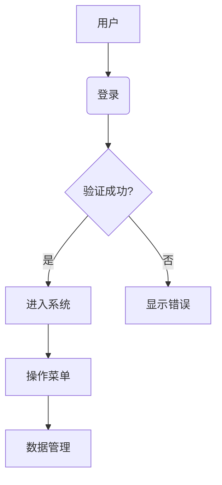
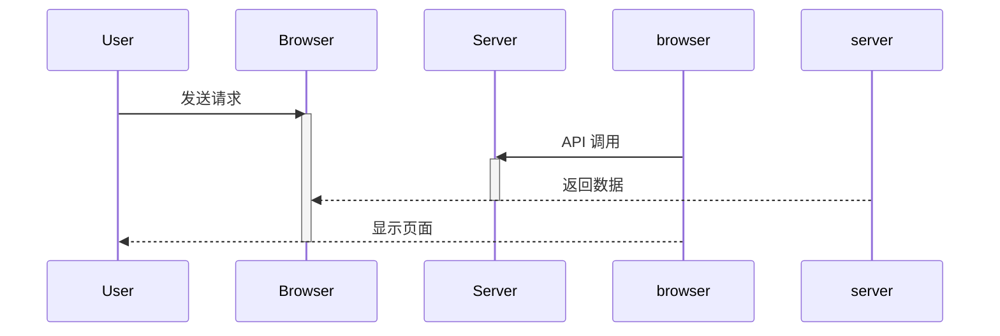

# Mermaid 图表渲染

> 支持 Mermaid 语法的图表渲染

---

## 功能概述

Mermaid 图表渲染功能允许用户在聊天中使用 Mermaid 语法创建和渲染各种类型的图表。

---

## 支持的图表类型

### 1. 流程图 (graph)
- 节点和连线
- 多种连线样式
- 子图支持

### 2. 时序图 (sequenceDiagram)
- 参与者定义
- 消息传递
- 激活条和生命线

### 3. 甘特图 (gantt)
- 项目计划图
- 任务和时间线
- 里程碑标记

### 4. 饼图 (pie)
- 数据可视化
- 百分比显示
- 颜色配置

### 5. 类图 (classDiagram)
- 类和关系
- 属性和方法
- 继承关系

### 6. 其他图表
- 用户旅程图 (journey)
- ER 图 (erDiagram)
- Git 图 (gitGraph)

---

## 使用说明

### 在聊天中插入图表
1. 打开聊天窗口
2. 在输入框中输入 Mermaid 语法代码，使用三个反引号包裹：
   ```mermaid
   graph TD
       A[开始] --> B{条件}
       B -->|是| C[处理1]
       B -->|否| D[处理2]
       C --> E[结束]
       D --> E
   ```
3. 发送消息

### 图表预览
- 输入时自动预览图表
- 支持实时更新
- 点击预览可全屏查看

---

## 技术实现

### 相关文件
- `modules/pet/content/petManager.mermaid.js` - Mermaid 图表处理模块
- `modules/mermaid/page/load-mermaid.js` - Mermaid 库加载器
- `modules/mermaid/page/render-mermaid.js` - Mermaid 图表渲染
- `modules/mermaid/page/preview-mermaid.js` - 图表预览功能

### 使用的库
- **Mermaid** (version 10.6.0) - 图表渲染库
- **marked** - Markdown 解析库

### 渲染流程
1. 识别消息中的 Mermaid 代码块
2. 加载 Mermaid 库（按需加载）
3. 渲染图表
4. 插入到聊天消息中

---

## Mermaid 语法示例

### 基础流程图


### 时序图


---

## 配置选项

### 图表配置
```javascript
const mermaidConfig = {
  theme: 'default',
  themeVariables: {
    primaryColor: '#ffb6c1',
    secondaryColor: '#e0e0e0',
    fontFamily: 'sans-serif'
  },
  securityLevel: 'loose'
};
```

### 加载选项
- 按需加载：只有在需要时才加载 Mermaid 库
- 版本控制：可配置 Mermaid 库版本
- 错误处理：渲染失败时显示错误信息

---

*最后更新：2026-03-18*
